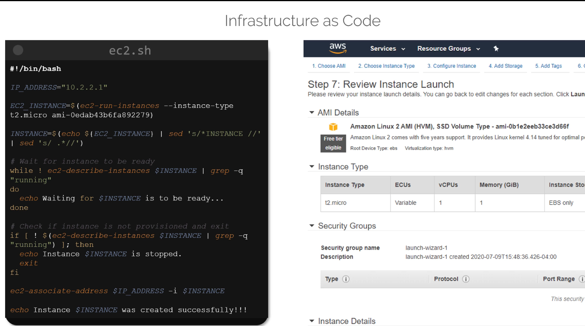
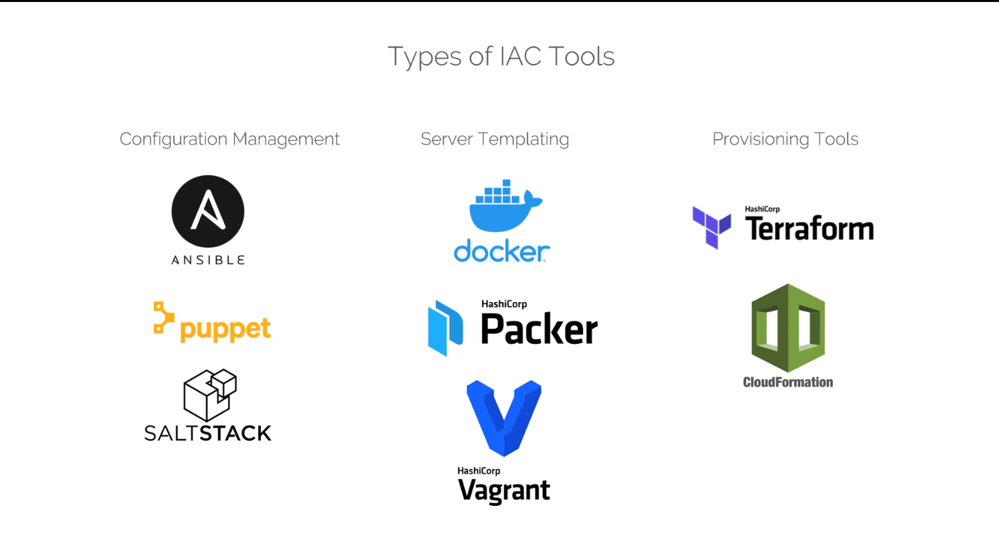
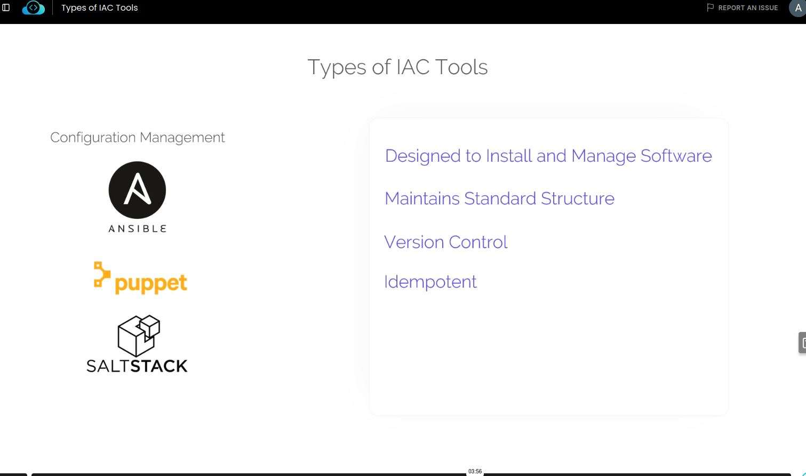

# Class 2 — Types of IaC Tools

**Course:** KodeKloud — Terraform
**Class:** 2

---

## The Problem Before IaC Tools

Before tools like Terraform existed, people provisioned infrastructure by writing raw scripts — usually Bash — that call cloud provider commands directly.

Example: a script that creates an EC2 instance, waits for it to be running, checks its status, and assigns it an IP address:



```bash
#!/bin/bash

IP_ADDRESS="10.2.2.1"

EC2_INSTANCE=$(ec2-run-instances --instance-type t2.micro ami-0edab43b6fa892279)

INSTANCE=$(echo ${EC2_INSTANCE} | sed 's/.*INSTANCE //; s/ .*//')

# Wait for the instance to be ready
while ! ec2-describe-instances $INSTANCE | grep -q "running"; do
  echo "Waiting for $INSTANCE to be ready..."
done

if ! ec2-describe-instances $INSTANCE | grep -q "running"; then
  echo "Instance $INSTANCE is stopped."
  exit
fi

ec2-associate-address $IP_ADDRESS -i $INSTANCE
echo "Instance $INSTANCE was created successfully!!!"
```

**The problem:** this works, but it's a lot of manual logic — waiting loops, status checks, error handling — that I'd have to write myself, for every single resource, every time. It gets messy fast as things get more complex.

**The same thing in Terraform:**

```hcl
resource "aws_instance" "webserver" {
  ami           = "ami-0edab43b6fa892279"
  instance_type = "t2.micro"
}
```

Just describe what I want. Terraform handles all the waiting, checking, and error handling behind the scenes — no custom script logic needed.

---

## Three Types of IaC Tools

IaC tools aren't all the same — they fall into three categories, each solving a different problem.




### 1. Configuration Management

**Tools:** Ansible, Puppet, SaltStack

**What they're for:** installing and managing *software* on servers that already exist. So if I already have a server running, these tools install packages, update configs, manage users, etc. on it.



**Key features:**
- Designed to install and manage software
- Maintains a standard, repeatable structure for changes
- Version control — playbooks/configs can be stored in Git
- **Idempotent** — running the same playbook twice gives the same result, it won't "double-install" something that's already there

**Example (Ansible) — creating 3 EC2 instances:**
```yaml
- amazon.aws.ec2:
    key_name: mykey
    instance_type: t2.micro
    image: ami-123456
    wait: yes
    group: webserver
    count: 3
    vpc_subnet_id: subnet-29e63245
    assign_public_ip: yes
```

---

### 2. Server Templating

**Tools:** Docker, Packer, Vagrant (Packer and Vagrant are both HashiCorp tools)

**What they're for:** building a custom "image" that already has all the software and dependencies pre-installed — instead of installing things *after* a server is created, the image already comes ready-to-go.

**Why this matters:** it supports **immutable infrastructure** — instead of logging into a server and changing it over time, I just replace it with a new image whenever something needs updating. Less drift, more consistency.

**Common examples:**
- Custom AMIs in AWS
- Docker images on Docker Hub
- VM images (like the ones on osboxes.org)

---

### 3. Provisioning Tools

**Tools:** Terraform, AWS CloudFormation

**What they're for:** actually creating the infrastructure itself — virtual machines, VPCs, databases, subnets, security groups, storage — using a declarative, high-level language.

**Key difference between the two:**
- **CloudFormation** — only works with AWS
- **Terraform** — vendor-agnostic, works across AWS, Azure, GCP, and many other providers through its plugin architecture (this is the "provider" concept from earlier notes)

---

## Quick Comparison Table

| Category | Tools | What it does |
|---|---|---|
| Configuration Management | Ansible, Puppet, SaltStack | Installs/manages software on existing servers |
| Server Templating | Docker, Packer, Vagrant | Builds pre-configured images so servers come ready-made |
| Provisioning | Terraform, CloudFormation | Creates the actual infrastructure (VMs, networks, storage) |

---

## Key Takeaway

These three categories aren't competing with each other — they're often used *together*. A real setup might use Terraform to provision the servers, Packer to build the images those servers run, and Ansible to configure software on top once they're running.

---

**Next up:** Class 3
