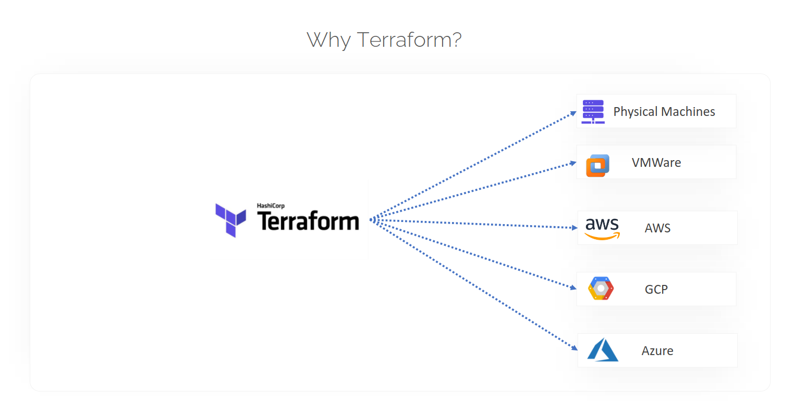
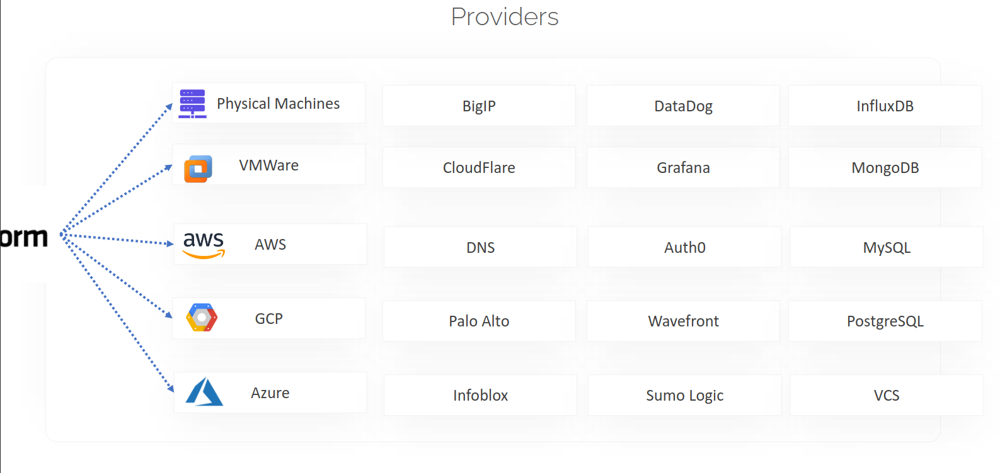
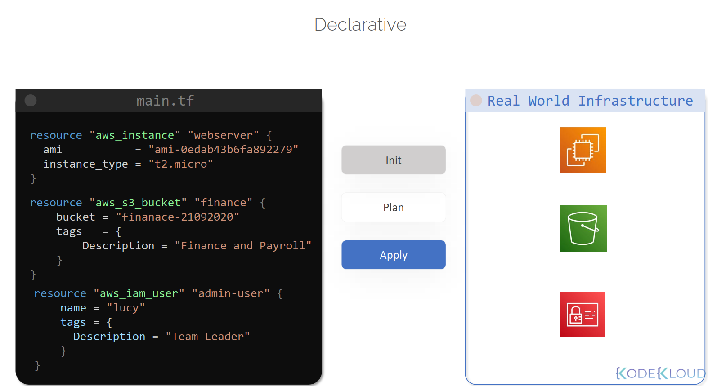
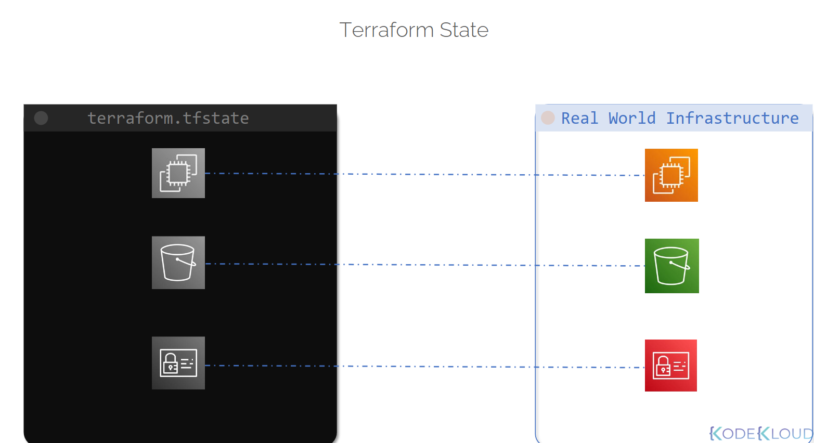
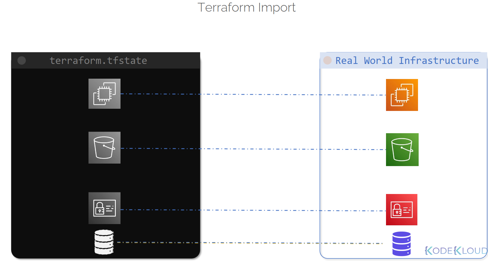
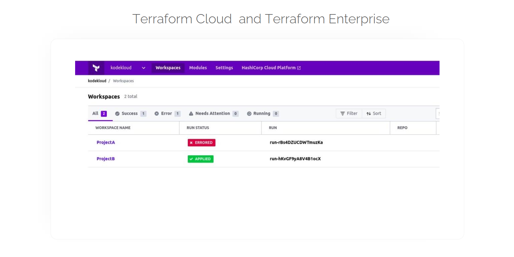

# Class 3 — Why Terraform

**Course:** KodeKloud — Terraform
**Class:** 3

---

## What Terraform Actually Is

Terraform is an Infrastructure as Code tool built by HashiCorp. It lets me build, manage, and destroy infrastructure quickly — and it all comes as a single binary install (no complicated setup, no agents to run on servers).

What makes it stand out: it's not tied to one platform. Whether I'm managing an on-premises VMware/vSphere cluster or deploying to AWS, GCP, or Azure, Terraform manages all of it the same way — through **providers**.



---

## Providers: How Terraform Reaches So Many Platforms

I already knew providers connect Terraform to a cloud platform like AWS. Turns out that's a small slice of what providers actually cover. Providers are just plugins that let Terraform talk to *any* platform with an API — not just clouds.

**Categories providers cover:**

| Category | Examples |
|---|---|
| Cloud platforms | AWS, GCP, Azure |
| Network infrastructure | F5 BIG-IP, Cloudflare, DNS, Palo Alto Networks, Infoblox |
| Monitoring/data tools | Datadog, Grafana, Auth0, Wavefront, Sumo Logic |
| Databases | InfluxDB, MongoDB, MySQL, PostgreSQL |
| Version control | GitHub, Bitbucket, GitLab |



So Terraform isn't just an "AWS tool" — it's a general-purpose way to manage almost anything that exposes an API, all through the same consistent workflow.

**Some real-world resource examples:**

| Resource Type | Use Case | Example |
|---|---|---|
| Compute Instance | Launching virtual servers | AWS EC2 instance |
| Storage Bucket | Object storage | AWS S3 bucket |
| IAM User | Managing user identities/permissions | AWS IAM user |

---

## HCL — The Language Behind It All

Terraform configs are written in **HCL** (HashiCorp Configuration Language) — declarative, and designed to be readable even for beginners. Files use the `.tf` extension.

**Example — provisioning three different AWS resources at once:**

```hcl
resource "aws_instance" "webserver" {
  ami           = "ami-0edab43b6fa892279"
  instance_type = "t2.micro"
}

resource "aws_s3_bucket" "finance" {
  bucket = "finance-21092020"
  tags = {
    Description = "Finance and Payroll"
  }
}

resource "aws_iam_user" "admin-user" {
  name = "lucy"
  tags = {
    Description = "Team Leader"
  }
}
```

One file, three completely different resource types — an EC2 instance, an S3 bucket, and an IAM user — all provisioned together.



**Why "declarative" matters here:** I'm not writing step-by-step instructions for *how* to create these. I'm just describing the end state I want. Terraform figures out on its own what actually needs to happen to get there.

---

## The Three Phases of Terraform

Every Terraform operation goes through three phases:

1. **Init** — sets up the project and downloads the providers needed for whatever platform I'm targeting (this is `terraform init`)
2. **Plan** — builds a detailed preview of exactly what changes are required to reach the desired state (`terraform plan`)
3. **Apply** — actually makes those changes happen, so the real environment matches the config (`terraform apply`)

**Important detail:** if something drifts from the defined state later (someone manually changes a setting in the console, for example), running `terraform apply` again will detect that and correct it back to match the config.

---

## Every Managed Thing Is a "Resource"

Anything Terraform manages — compute instances, database servers, physical on-prem machines — is called a **resource**. Terraform doesn't just create these once and forget them; it continuously tracks their state, so any future changes get applied consistently.



This is what `terraform.tfstate` actually is — a file that keeps a 1-to-1 map between what's written in my `.tf` config and what actually exists out in AWS/Azure/GCP. It's how Terraform knows the difference between "this doesn't exist yet" and "this already exists, don't recreate it."

**Data sources:** Terraform can also *import* infrastructure that already exists (created manually or by something else) into its own management framework using data sources — so I'm not limited to only managing things Terraform itself created from scratch.



Notice the database icon in this diagram — it exists in the real infrastructure but wasn't originally in the state file. `terraform import` is how something like that gets brought under Terraform's management after the fact.

---

## Terraform Cloud & Terraform Enterprise

Beyond the CLI I've been using, HashiCorp also offers:

- **Terraform Cloud** — adds team collaboration, remote state storage, and a centralized UI
- **Terraform Enterprise** — the enterprise-grade version with additional security and governance features



> 📖 **Read More** → [Terraform CLI vs Terraform Cloud](https://github.com/Abhignadumpala/terraform-notes-kodekloud/blob/main/terraform-cli-vs-cloud.md)

---

## Key Takeaway

Terraform's real strength isn't just "it manages AWS" — it's that the exact same declarative workflow (`init → plan → apply`) works across almost any platform with an API, cloud or not, through its provider plugin system.

---

**Next up:** Class 4
