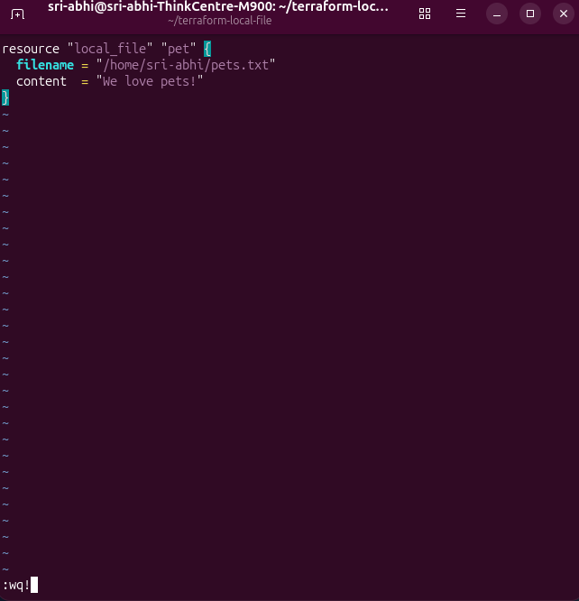
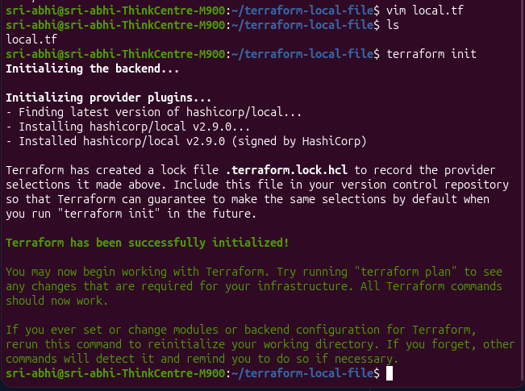
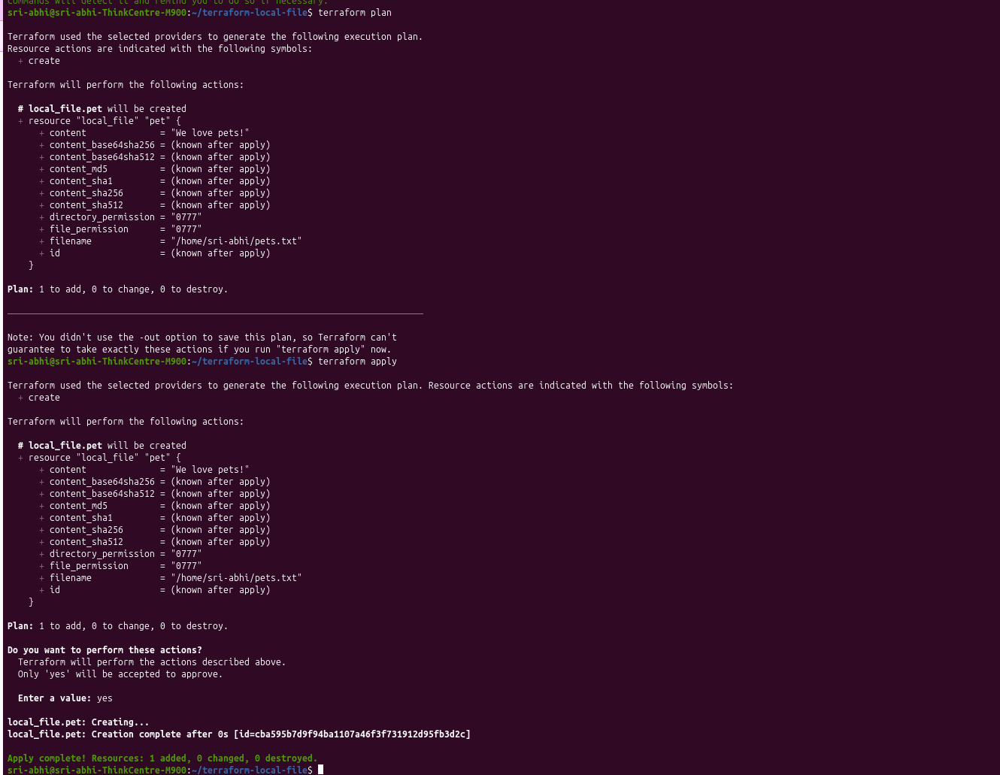
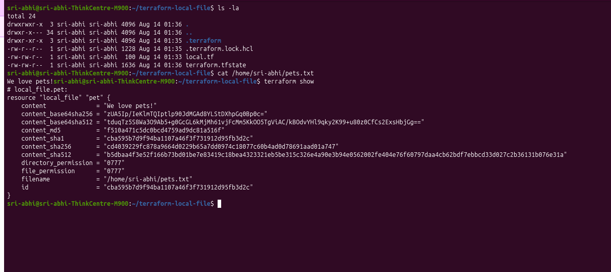
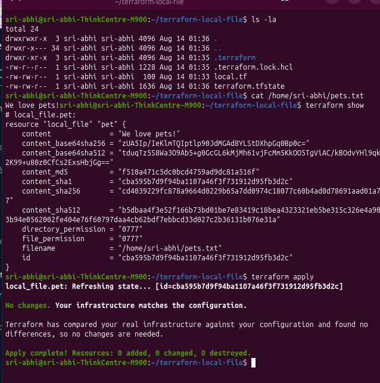

# Class 4b: HCL Basics — Creating a Local File Resource

HCL (HashiCorp Configuration Language) files are made of **blocks** and **arguments**. Each block describes a piece of infrastructure you want Terraform to manage. Here's a hands-on walkthrough creating the simplest possible resource — a local file — to understand the core workflow.

## 1. Set up the working directory

```bash
mkdir ~/terraform-local-file
cd ~/terraform-local-file
```

## 2. Write the configuration

```bash
vim local.tf
```

```hcl
resource "local_file" "pet" {
  filename = "/home/sri-abhi/pets.txt"
  content  = "We love pets!"
}
```



**Breaking it down:**
- `resource` — the block type, declaring we want to create something.
- `"local_file"` — the resource type (from the local provider).
- `"pet"` — the resource's local name, used to reference it elsewhere in config.
- `filename` and `content` — required arguments for this resource type. `filename` is the full path where the file gets created, `content` is the text written into it.

## 3. Initialize

```bash
terraform init
```

```
Initializing the backend...

Initializing provider plugins...
- Finding latest version of hashicorp/local...
- Installing hashicorp/local v2.9.0...
- Installed hashicorp/local v2.9.0 (signed by HashiCorp)

Terraform has created a lock file .terraform.lock.hcl to record the provider
selections it made above.

Terraform has been successfully initialized!
```



`terraform init` reads the config, detects the `local` provider is needed, downloads it, and creates a `.terraform.lock.hcl` file to pin that provider version for consistency.

## 4. Plan

```bash
terraform plan
```

```
Terraform used the selected providers to generate the following execution plan.
Resource actions are indicated with the following symbols:
  + create

Terraform will perform the following actions:

  # local_file.pet will be created
  + resource "local_file" "pet" {
      + content               = "We love pets!"
      + directory_permission  = "0777"
      + file_permission       = "0777"
      + filename              = "/home/sri-abhi/pets.txt"
      + id                    = (known after apply)
    }

Plan: 1 to add, 0 to change, 0 to destroy.
```

The `+` marks a resource that will be created. `plan` never touches real infrastructure — it's a dry run showing exactly what `apply` would do.

## 5. Apply

```bash
terraform apply
```
Confirm with `yes` when prompted.

```
Do you want to perform these actions?
  Enter a value: yes

local_file.pet: Creating...
local_file.pet: Creation complete after 0s [id=cba595b7d9f94ba1107a46f3f731912d95fb3d2c]

Apply complete! Resources: 1 added, 0 changed, 0 destroyed.
```



## 6. Verify

The file gets created at the path set in `filename` — in this case my home folder, not the project folder. The project folder (`terraform-local-file`) only holds the config and Terraform's own tracking files:

```bash
ls -la
```
```
.terraform.lock.hcl
local.tf
terraform.tfstate
```

Checking the actual file:
```bash
cat /home/sri-abhi/pets.txt
```
```
We love pets!
```

Inspecting the resource Terraform is now tracking:
```bash
terraform show
```
```
# local_file.pet:
resource "local_file" "pet" {
    content               = "We love pets!"
    content_base64sha256  = "zUA5Ip/IeKlmTQIptlp9OJdMGAd8YLStDXhpGq0Bp0c="
    content_md5           = "f510a471c5dc0bcd4759ad9dc81a516f"
    directory_permission  = "0777"
    file_permission        = "0777"
    filename              = "/home/sri-abhi/pets.txt"
    id                    = "cba595b7d9f94ba1107a46f3f731912d95fb3d2c"
}
```



## Key takeaway

`terraform.tfstate` is what makes this all click — it's Terraform's record of what it created and where. Run `terraform apply` again with no changes and Terraform tells you there's nothing to do, because state already matches config:

```bash
terraform apply
```
```
local_file.pet: Refreshing state... [id=cba595b7d9f94ba1107a46f3f731912d95fb3d2c]

No changes. Your infrastructure matches the configuration.

Terraform has compared your real infrastructure against your configuration and found no
differences, so no changes are needed.

Apply complete! Resources: 0 added, 0 changed, 0 destroyed.
```



This local-file example is deliberately simple, but the exact same `init → plan → apply` loop is what drives real AWS/Azure/GCP resources later on.

---
**Reference:** [Terraform Resources — developer.hashicorp.com](https://developer.hashicorp.com/terraform)
