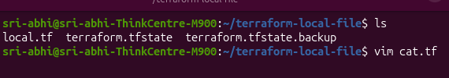
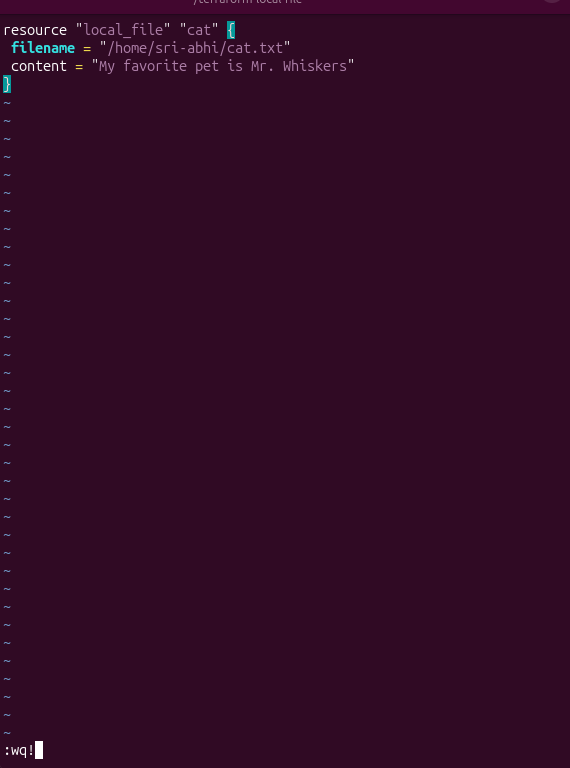
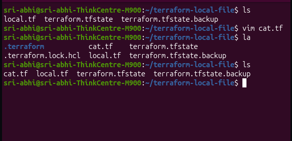
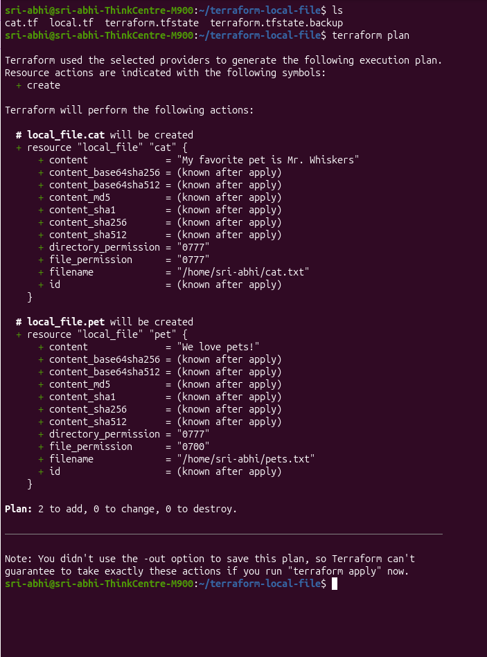
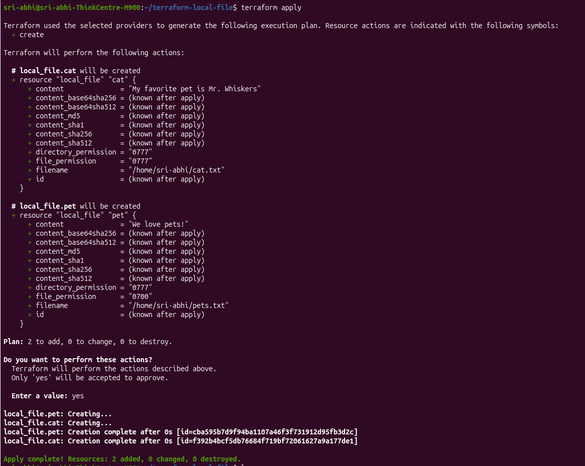

# Class 5a: The Terraform Configuration Directory

This lesson covers the structure and naming conventions of a Terraform configuration directory, for better project organization and configuration management.

So far, I've worked with a single configuration file, `local.tf`, located in the `terraform-local-file` directory. Here's a listing of that directory along with the contents of `local.tf`:

```bash
ls ~/terraform-local-file
```
```
local.tf
```
```hcl
resource "local_file" "pet" {
  filename = "/home/sri-abhi/pets.txt"
  content  = "We love pets!"
}
```

But Terraform doesn't actually care what a file is named, or whether there's just one. It reads every file ending in `.tf` in the working directory and treats them all as one combined configuration.

## Splitting Config Across Multiple Files

For example, adding a second file `cat.tf` in the same directory, defining another `local_file` resource:

```bash
ls
vim cat.tf
```



```hcl
resource "local_file" "cat" {
  filename = "/home/sri-abhi/cat.txt"
  content  = "My favorite pet is Mr. Whiskers"
}
```



Checking the directory again — `cat.tf` now sits right alongside `local.tf`, same folder, no new directory needed:

```bash
ls
```



## Plan — With a Twist From State

```bash
terraform plan
```



```
Terraform will perform the following actions:

  # local_file.cat will be created
  + resource "local_file" "cat" {
      + content          = "My favorite pet is Mr. Whiskers"
      + file_permission  = "0777"
      + filename         = "/home/sri-abhi/cat.txt"
      ...
    }

  # local_file.pet will be created
  + resource "local_file" "pet" {
      + content          = "We love pets!"
      + file_permission  = "0700"
      + filename         = "/home/sri-abhi/pets.txt"
      ...
    }

Plan: 2 to add, 0 to change, 0 to destroy.
```

At first glance this looks odd — I only added `cat.tf`, so shouldn't `local_file.pet` already exist and be left alone? Here's what actually happened: back in Class 4c, I ran `terraform destroy`, which removed `local_file.pet` completely — both the real file **and** its entry in `terraform.tfstate`.

So by the time I ran this `plan`, state had **zero record** of `pet` existing. Terraform compared my config (two resources: `cat` + `pet`) against state (nothing tracked) and correctly concluded both needed to be created fresh.

This is a good real example of a core Terraform idea: **state is the source of truth, not the filesystem.** Terraform doesn't scan your disk to check what exists — it only trusts what's recorded in `terraform.tfstate`. If something's missing from state, Terraform treats it as new, even if you know it used to exist.

## Apply

```bash
terraform apply
```
Confirm with `yes`:



```
local_file.pet: Creating...
local_file.cat: Creating...
local_file.pet: Creation complete after 0s [id=cba595b7d9f94ba1107a46f3f731912d95fb3d2c]
local_file.cat: Creation complete after 0s [id=f392b4bcf5db76684f719bf72061627a9a177de1]

Apply complete! Resources: 2 added, 0 changed, 0 destroyed.
```

Both resources created in the same `apply`, even though they're defined in two separate `.tf` files — confirming Terraform really does treat every `.tf` file in the directory as one combined config.

## Verify

```bash
cat /home/sri-abhi/pets.txt
cat /home/sri-abhi/cat.txt
```


```
We love pets!
My favorite pet is Mr. Whiskers
```

## Common Naming Convention

Even though file names don't technically matter to Terraform, there's a widely-used convention for organizing a project:

| File | Purpose |
|---|---|
| `main.tf` | Where most resource definitions live |
| `variables.tf` | Input variables |
| `outputs.tf` | Outputs for the configuration |
| `providers.tf` | Provider configuration |

None of this is enforced by Terraform itself — it's purely for humans to keep a project readable as it grows. Put everything into one big `main.tf`, and once a project grows to 20+ resources, that file becomes a nightmare to scroll through and find anything in. Splitting it into `main.tf` / `variables.tf` / `outputs.tf` / `providers.tf` keeps each file focused on one job — anyone (including future-me) can open `variables.tf` and immediately know that's where all the inputs live, without hunting through hundreds of lines of resource blocks.

`variables.tf`, `outputs.tf`, and `providers.tf` will each get covered in more depth later on.

---
**Reference:** [Terraform Configuration — developer.hashicorp.com](https://developer.hashicorp.com/terraform/language)
