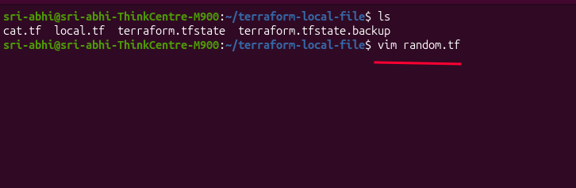
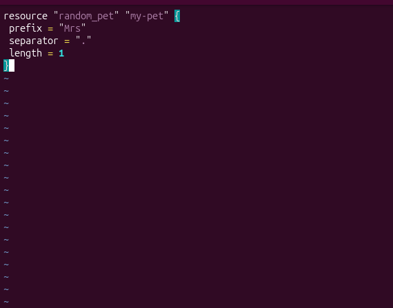
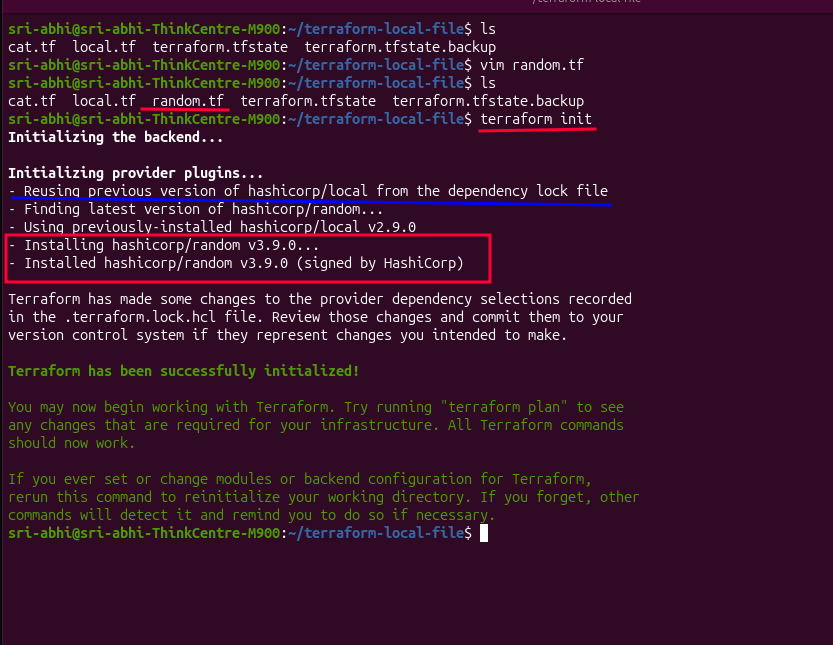
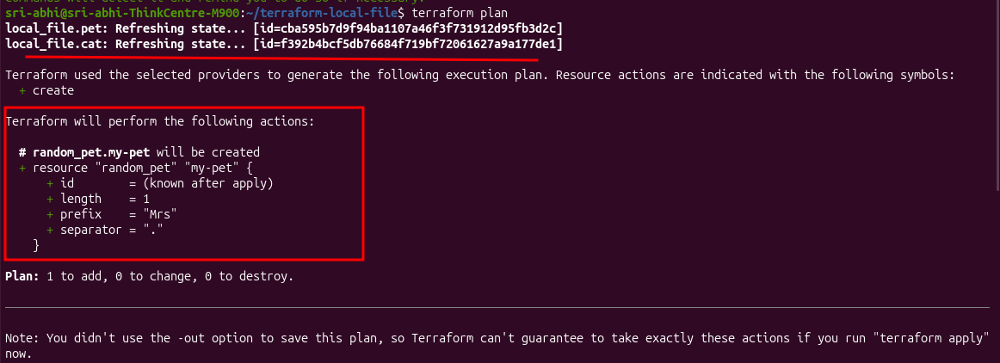
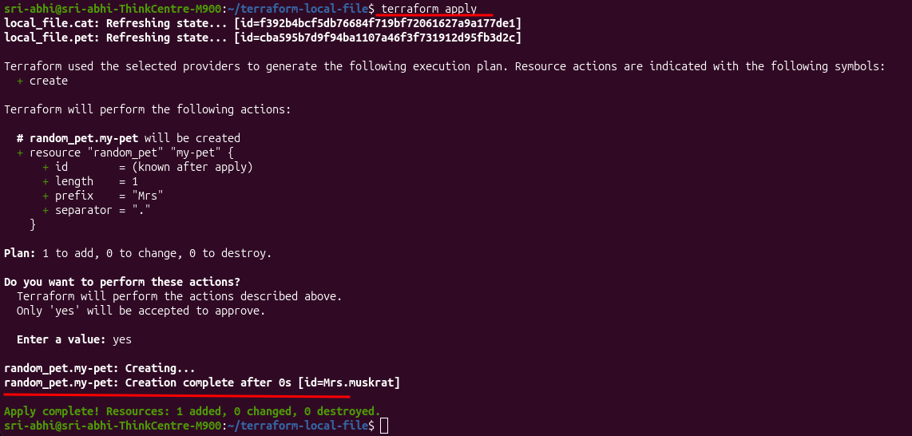

# Class 5b: Multiple Providers in One Config

Until now, every resource in my lab has used a single provider — `local`. This lesson introduces a second provider, `random`, alongside it, in the same `terraform-local-file` directory.

The `random` provider can generate random values — IDs, integers, or in this case, a random pet name.

## Adding a New Resource in a New File

Following the same pattern from Class 5a — separate `.tf` files, same directory — I added the `random_pet` resource in its own new file, `random.tf`, rather than editing an existing one:

```bash
ls
vim random.tf
```



```hcl
resource "random_pet" "my-pet" {
  prefix    = "Mrs"
  separator = "."
  length    = 1
}
```



**Breaking it down:**
- `random_pet` — resource type, from the `random` provider
- `"my-pet"` — my chosen name for this resource
- `prefix` — text added before the generated name (`"Mrs"`)
- `separator` — character between the prefix and the generated name (`"."`)
- `length` — how many words the generated name itself should have

## Initializing — Reuse vs. Fresh Install

```bash
ls
terraform init
```



```
Initializing provider plugins...
- Reusing previous version of hashicorp/local from the dependency lock file
- Finding latest version of hashicorp/random...
- Using previously-installed hashicorp/local v2.9.0
- Installing hashicorp/random v3.9.0...
- Installed hashicorp/random v3.9.0 (signed by HashiCorp)

Terraform has made some changes to the provider dependency selections recorded
in the .terraform.lock.hcl file. Review those changes and commit them to your
version control system if they represent changes you intended to make.

Terraform has been successfully initialized!
```

This is a nice, concrete look at exactly what "Terraform reuses what's already installed" means in practice: `local` gets pulled straight from the lock file with **no download**, since it was already set up from earlier labs. `random`, on the other hand, has never been used in this directory before, so Terraform reaches out to the registry and installs it fresh — `v3.9.0` in my case.

## Plan

```bash
terraform plan
```



```
local_file.pet: Refreshing state... [id=cba595b7d9f94ba1107a46f3f731912d95fb3d2c]
local_file.cat: Refreshing state... [id=f392b4bcf5db76684f719bf72061627a9a177de1]

Terraform will perform the following actions:

  # random_pet.my-pet will be created
  + resource "random_pet" "my-pet" {
      + id        = (known after apply)
      + length    = 1
      + prefix    = "Mrs"
      + separator = "."
    }

Plan: 1 to add, 0 to change, 0 to destroy.
```

Both existing resources (`local_file.pet`, `local_file.cat`) get refreshed against state as usual, but only `random_pet.my-pet` shows up as something to create. Adding a new provider and a new resource didn't touch anything already being managed — Terraform diffs precisely, not broadly.

## Apply

```bash
terraform apply
```
Confirm with `yes`:



```
random_pet.my-pet: Creating...
random_pet.my-pet: Creation complete after 0s [id=Mrs.muskrat]

Apply complete! Resources: 1 added, 0 changed, 0 destroyed.
```

My randomly generated pet name: **`Mrs.muskrat`** 🦫 — combining my `prefix` ("Mrs"), `separator` ("."), and a randomly picked one-word animal name, exactly matching the `length = 1` I set.

## Key takeaway

A Terraform config isn't limited to one provider — `local` and `random` sit in the same directory, get initialized together, and are tracked in the same `terraform.tfstate`, even though they're completely different plugins doing completely different things. This is the same plugin-based architecture from Class 5: Terraform core doesn't care how many providers are in play, it just launches whichever ones the config calls for and manages them all through the same `init → plan → apply` workflow.

---
**Reference:** [Terraform Providers — developer.hashicorp.com](https://developer.hashicorp.com/terraform/language/providers)
