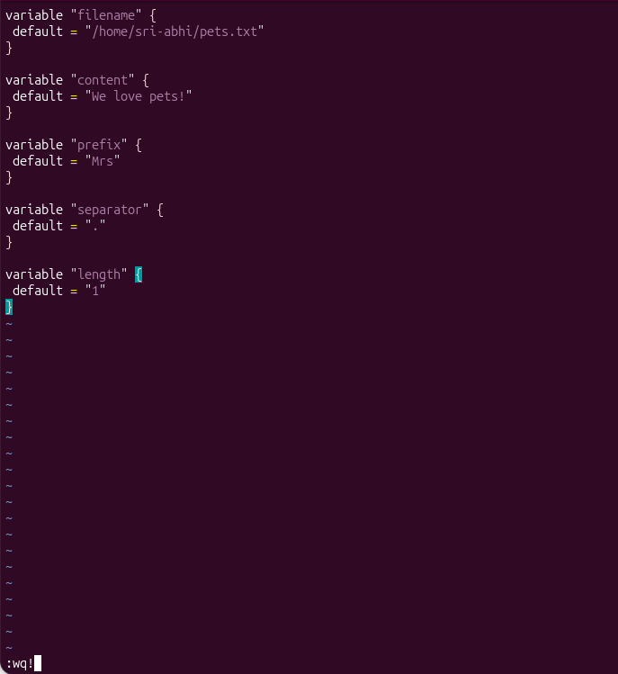
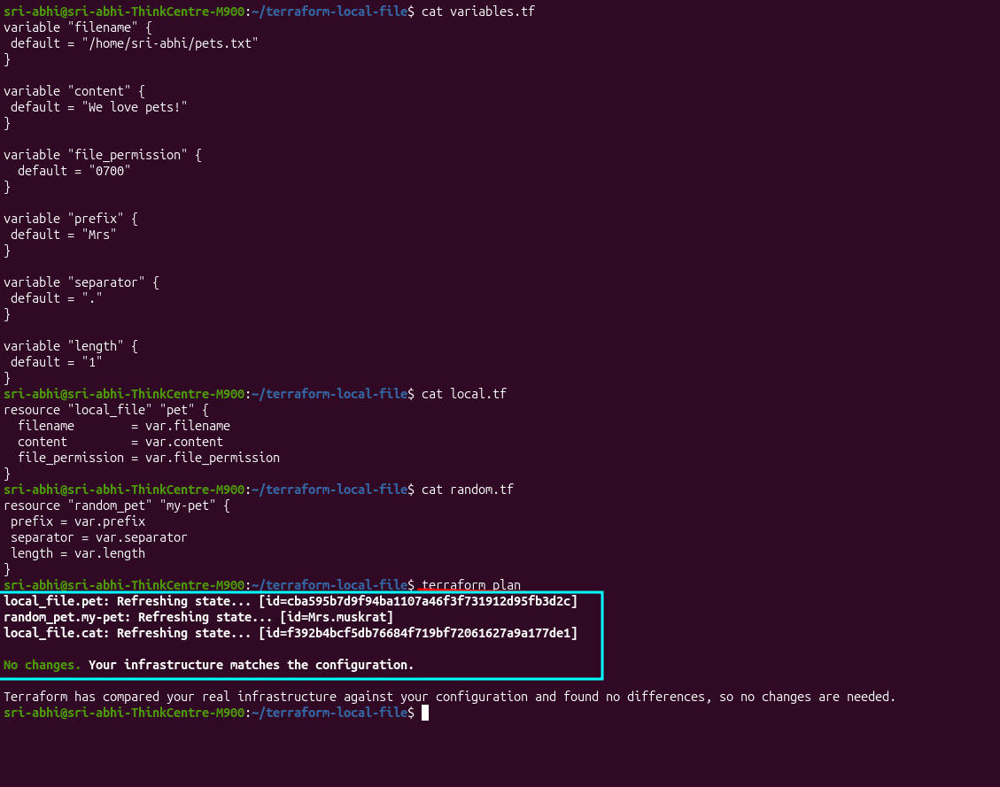
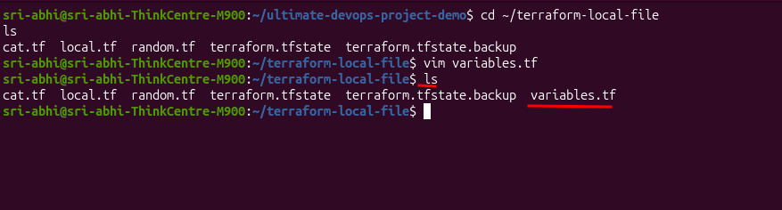
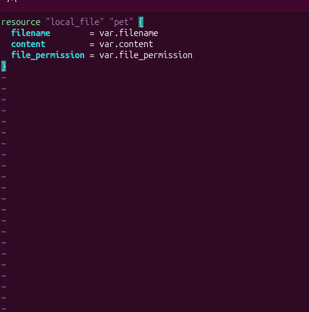
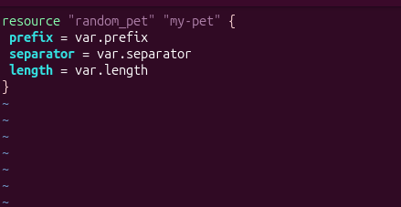
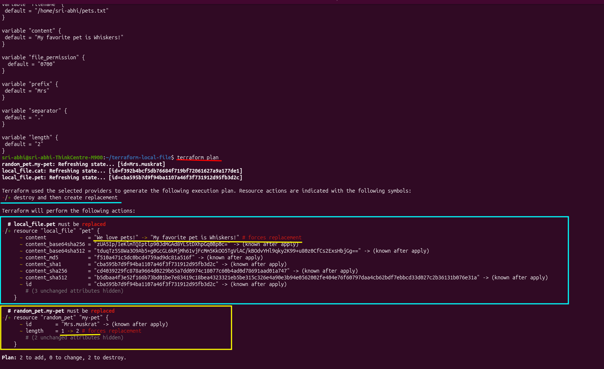
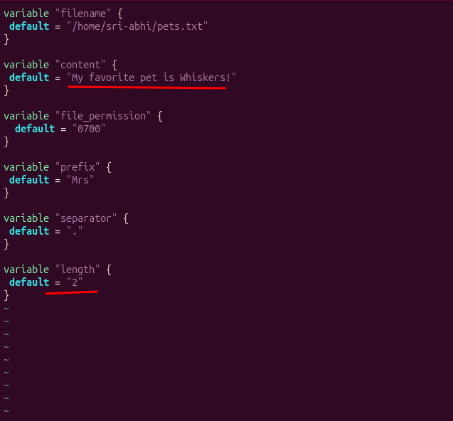
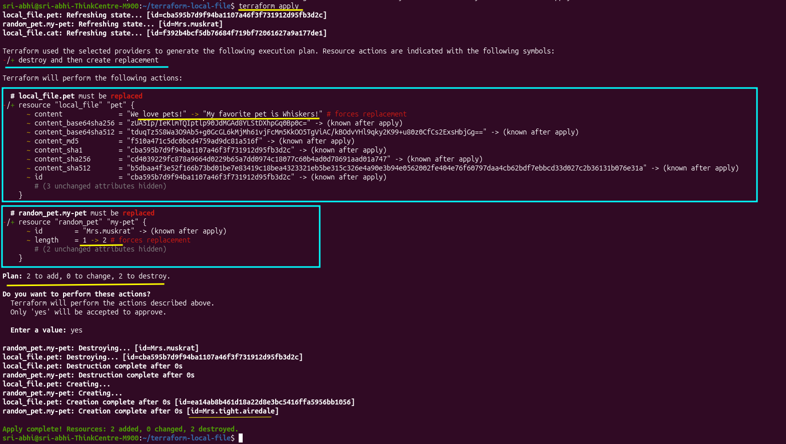
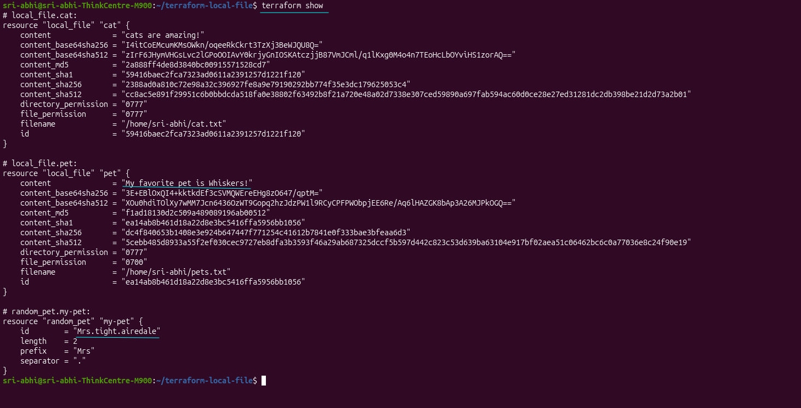

# Class 6: Input Variables

Input variables make Terraform configurations more reusable and flexible by allowing you to parameterize values — instead of hard-coding the same strings in resource blocks, you define variables once and reference them everywhere they're needed.

## Why Input Variables?

Without variables, every time you want to change a filename, content string, or resource setting, you'd have to edit each resource block individually. With variables, you change the default in one place — `variables.tf` — and the change cascades through every resource that references it.

## Creating Variables

Start by creating a `variables.tf` file in your config directory:

```bash
vim variables.tf
```



Define each variable with the `variable` keyword and a `default` value:

```hcl
variable "filename" {
  default = "/home/sri-abhi/pets.txt"
}

variable "content" {
  default = "We love pets!"
}

variable "file_permission" {
  default = "0700"
}

variable "prefix" {
  default = "Mrs"
}

variable "separator" {
  default = "."
}

variable "length" {
  default = 1
}
```



Now your config directory has all three `.tf` files:

```bash
ls
```



## Referencing Variables in Resources

Update `local.tf` to reference the variables instead of hard-coding values:

```bash
vim local.tf
```

```hcl
resource "local_file" "pet" {
  filename        = var.filename
  content         = var.content
  file_permission = var.file_permission
}
```



Update `random.tf` the same way:

```bash
vim random.tf
```

```hcl
resource "random_pet" "my-pet" {
  prefix    = var.prefix
  separator = var.separator
  length    = var.length
}
```



Note: `cat.tf` remains hard-coded for this lab — it demonstrates the difference between parameterized and hard-coded resources.

## Plan — No Changes Yet

```bash
terraform plan
```



Result: `No changes. Your infrastructure matches the configuration.`

The variable defaults exactly match your current resource values, so Terraform has nothing to do.

## Changing Variables and Seeing Updates

Now update the variables to different values:

```bash
vim variables.tf
```

Change `content` and `length`:

```hcl
variable "content" {
  default = "My favorite pet is Whiskers!"
}

variable "length" {
  default = 2
}
```



Run plan again:

```bash
terraform plan
```


Now Terraform shows:
- `local_file.pet` must be replaced (content changed, forced replacement)
- `random_pet.my-pet` must be replaced (length changed from 1 to 2)

Plan: 2 to add, 0 to change, 2 to destroy.

## Apply the Changes

```bash
terraform apply
```

Confirm with `yes`:



```
random_pet.my-pet: Destroying... [id=Mrs.muskrat]
local_file.pet: Destroying... [id=cba595b7d9f94ba1107a46f3f731912d95fb3d2c]
local_file.pet: Destruction complete after 0s
random_pet.my-pet: Destruction complete after 0s

local_file.pet: Creating...
random_pet.my-pet: Creating...
local_file.pet: Creating...
random_pet.my-pet: Creating...
local_file.pet: Creation complete after 0s [id=ea14a8b8461d18a22d8e3bc5416ffa5956bb1056]
random_pet.my-pet: Creation complete after 0s [id=Mrs.tight.airedale]

Apply complete! Resources: 2 added, 0 changed, 2 destroyed.
```

Notice the new pet name: **`Mrs.tight.airedale`** — two words this time, since you changed `length` from 1 to 2.

## Verify the Final State

```bash
terraform show
```



**`local_file.pet`:**
- content: `"My favorite pet is Whiskers!"` ✅ (updated from variable)
- file_permission: `"0700"` (from variable)

**`local_file.cat`:**
- content: `"cats are amazing!"` (hard-coded, unchanged)

**`random_pet.my-pet`:**
- id: `"Mrs.tight.airedale"` ✅ (newly generated with length = 2)
- length: `2` (from updated variable)

## Key Takeaway

Think of input variables as a **single source of truth** for your resource settings. Instead of editing every resource block whenever a value changes, you define it once in `variables.tf` and reference it everywhere using `var.variable_name`.

**Without variables:** You have the same filename, content, or prefix scattered across dozens of resource blocks. Change one, and you have to hunt through and update all of them — easy to miss one and end up with inconsistencies.

**With variables:** All those values live in one place. Change the default in `variables.tf`, and every resource using `var.filename` or `var.content` automatically picks up the new value on the next `terraform plan` and `terraform apply`.

This is critical in real projects with multi-infrastructure deployments. When you have 50 resources across multiple environments (dev, staging, prod) all referencing the same values, centralizing those values in variables prevents inconsistencies and makes updates safe and predictable. Change once, apply everywhere — that's the power of variables.

---
**Reference:** [Terraform Input Variables — developer.hashicorp.com](https://developer.hashicorp.com/terraform/language/values/variables)
