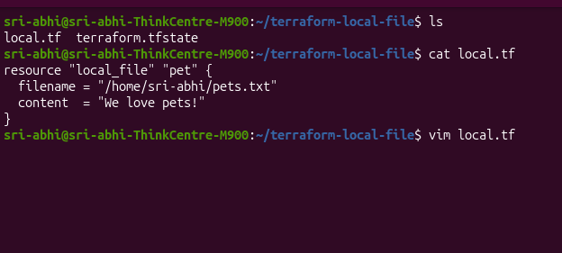
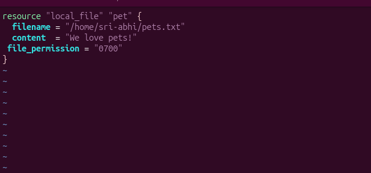
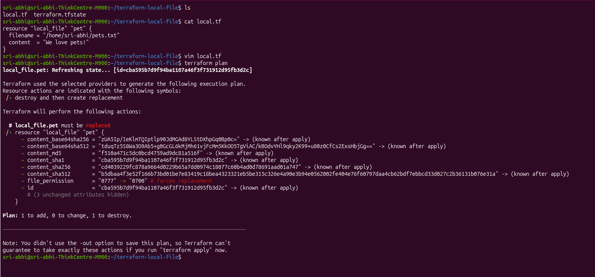
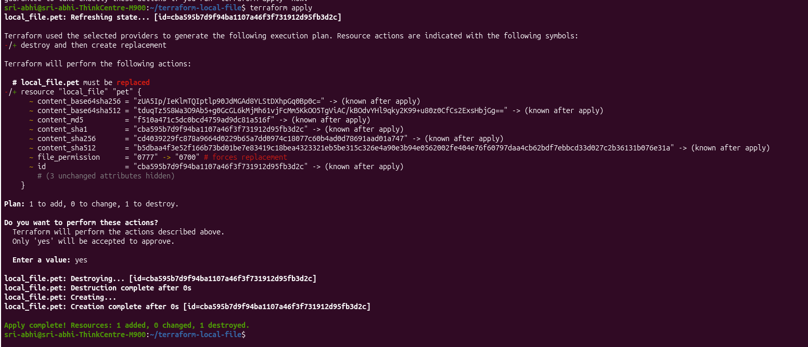
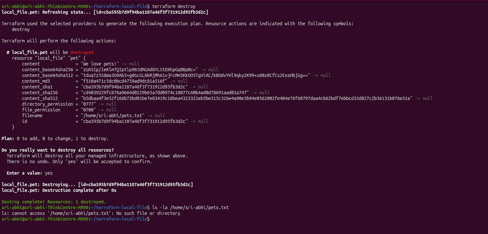

# module 2.3: Update and Destroy Infrastructure

Continuing from the local file resource created in Class 4b — now updating its configuration, then fully destroying it.

📄 Full code: [hands-on-lab/local.tf](hands-on-lab/local.tf)

## Updating the Resource

Changing the file permission from the default `0777` to a more restrictive `0700`, so only the owner can access the file:

```hcl
resource "local_file" "pet" {
  filename        = "/home/sri-abhi/pets.txt"
  content         = "We love pets!"
  file_permission = "0700"
}
```





Even though it's a small change, Terraform treats `local_file` as immutable for this attribute — it can't modify permissions on an existing file in place, so it plans to destroy the old one and create a new one with the updated setting.

```bash
terraform plan
```

```
local_file.pet: Refreshing state... [id=cba595b7d9f94ba1107a46f3f731912d95fb3d2c]

Terraform used the selected providers to generate the following execution plan.
Resource actions are indicated with the following symbols:
-/+ destroy and then create replacement

Terraform will perform the following actions:

  # local_file.pet must be replaced
-/+ resource "local_file" "pet" {
      ~ content_base64sha256 = "zUA5Ip/IeKlmTQIptlp90JdMGAd8YLStDXhpGq0Bp0c=" -> (known after apply)
      ~ content_base64sha512 = "tduqTz5S8Wa3O9Ab5+g0GcGL6kMjMh61vjFcMm5KkOO5TgViAC/kBOdvYHl9qky2K99+u80z0CfCs2ExsHbjGg==" -> (known after apply)
      ~ content_md5          = "f510a471c5dc0bcd4759ad9dc81a516f" -> (known after apply)
      ~ content_sha1         = "cba595b7d9f94ba1107a46f3f731912d95fb3d2c" -> (known after apply)
      ~ content_sha256       = "cd4039229fc878a9664d0229b65a7dd0974c18077c60b4ad0d78691aad01a747" -> (known after apply)
      ~ content_sha512       = "b5dbaa4f3e52f166b73bd01be7e83419c18bea4323321eb5be315c326e4a90e3b94e0562002fe404e76f60797daa4cb62bdf7ebbcd33d027c2b36131b076e31a" -> (known after apply)
      ~ file_permission      = "0777" -> "0700" # forces replacement
      ~ id                   = "cba595b7d9f94ba1107a46f3f731912d95fb3d2c" -> (known after apply)
        # (3 unchanged attributes hidden)
    }

Plan: 1 to add, 0 to change, 1 to destroy.
```



Notice how much more detail newer Terraform (v1.15.8) shows compared to older versions — every content hash (`content_md5`, `content_sha256`, etc.) is listed becoming `(known after apply)`, since replacing the file means a brand new resource with a fresh ID. The `-/+` symbol still means the same thing though: **destroy and recreate**, not update-in-place.

Apply it:
```bash
terraform apply
```
Confirm with `yes`:
```
Enter a value: yes

local_file.pet: Destroying... [id=cba595b7d9f94ba1107a46f3f731912d95fb3d2c]
local_file.pet: Destruction complete after 0s
local_file.pet: Creating...
local_file.pet: Creation complete after 0s [id=cba595b7d9f94ba1107a46f3f731912d95fb3d2c]

Apply complete! Resources: 1 added, 0 changed, 1 destroyed.
```



Verify the new permission:
```bash
ls -la /home/sri-abhi/pets.txt
```
Should now show `-rwx------` (0700) instead of the old `-rwxrwxrwx` (0777).

## Destroying the Resource

To remove the resource entirely:

```bash
terraform destroy
```

```
local_file.pet: Refreshing state... [id=cba595b7d9f94ba1107a46f3f731912d95fb3d2c]

Terraform will perform the following actions:

  # local_file.pet will be destroyed
  - resource "local_file" "pet" {
      - content              = "We love pets!" -> null
      - content_base64sha256 = "zUA5Ip/IeKlmTQIptlp90JdMGAd8YLStDXhpGq0Bp0c=" -> null
      - content_base64sha512 = "tduqTz5S8Wa3O9Ab5+g0GcGL6kMjMh61vjFcMm5KkOO5TgViAC/kBOdvYHl9qky2K99+u80z0CfCs2ExsHbjGg==" -> null
      - content_md5          = "f510a471c5dc0bcd4759ad9dc81a516f" -> null
      - content_sha1         = "cba595b7d9f94ba1107a46f3f731912d95fb3d2c" -> null
      - content_sha256       = "cd4039229fc878a9664d0229b65a7dd0974c18077c60b4ad0d78691aad01a747" -> null
      - content_sha512       = "b5dbaa4f3e52f166b73bd01be7e83419c18bea4323321eb5be315c326e4a90e3b94e0562002fe404e76f60797daa4cb62bdf7ebbcd33d027c2b36131b076e31a" -> null
      - directory_permission = "0777" -> null
      - file_permission      = "0700" -> null
      - filename             = "/home/sri-abhi/pets.txt" -> null
      - id                   = "cba595b7d9f94ba1107a46f3f731912d95fb3d2c" -> null
    }

Plan: 0 to add, 0 to change, 1 to destroy.

Do you really want to destroy all resources?
  Enter a value: yes

local_file.pet: Destroying... [id=cba595b7d9f94ba1107a46f3f731912d95fb3d2c]
local_file.pet: Destruction complete after 0s

Destroy complete! Resources: 1 destroyed.
```



Confirming the file is really gone:
```bash
ls -la /home/sri-abhi/pets.txt
```
```
ls: cannot access '/home/sri-abhi/pets.txt': No such file or directory
```

Every attribute shows a minus (`-`) — Terraform is telling you exactly what it's about to remove before it removes it.

> ⚠️ There's no undo once you confirm `destroy`. Always read through the plan carefully first, especially outside of a lab environment.

## Key takeaway

- Changing certain arguments (like `file_permission` here) can force a **replace**, not just an update — shown as `-/+` in the plan.
- No `terraform init` was needed for any of this — the provider and lock file were already set up from Class 4b. `init` only needs to be re-run if you delete `.terraform/`, add a new provider, or start a brand new directory.
- `terraform destroy` tears down everything Terraform is currently tracking in state for that config — it's the reverse of `apply`.
- Always run `terraform plan` before `apply` or `destroy` so there are no surprises about what's being created, changed, or removed.

---
**Reference:** [Terraform Resource Lifecycle — developer.hashicorp.com](https://developer.hashicorp.com/terraform)
