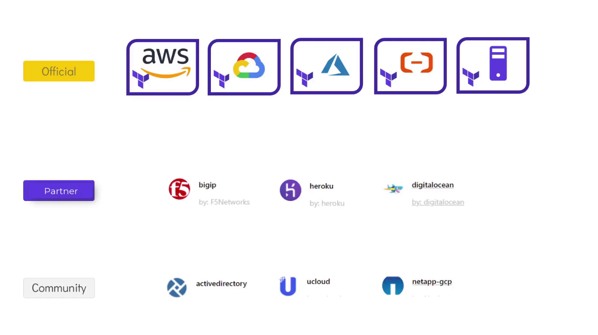

# mmodule 3.1: Using Terraform Providers

Providers are what let Terraform manage resources across different platforms — AWS, GCP, Azure, or something simple like the local filesystem. This is Terraform's plugin-based architecture: the core CLI doesn't know how to talk to any specific platform on its own, it relies entirely on a provider plugin to do that.

## Initializing the Working Directory

After writing a `.tf` configuration file, initialize the working directory so Terraform can download the provider(s) it needs:

```bash
terraform init
```

Terraform reads the config, identifies which providers are needed, and downloads the matching plugins — for AWS, GCP, Azure, or simpler ones like the `local` provider used in my earlier labs. All of these come from HashiCorp's public [Terraform Registry](https://registry.terraform.io), and this plugin-based setup is what lets Terraform manage hundreds of different platforms through one common CLI.

> `terraform init` is safe to re-run anytime — it only touches your local plugin setup, never your actual deployed infrastructure.

## Provider Tiers

Providers fall into three tiers based on who builds and maintains them:

| Tier | Who maintains it | Examples |
|---|---|---|
| **Official** | HashiCorp itself | AWS, GCP, Azure, Local |
| **Partner** | Third-party companies that completed HashiCorp's partner process | F5 (BigIP), Heroku, DigitalOcean |
| **Community** | Individual contributors | Various community-built plugins |



Official providers (AWS, GCP, Azure, Local) are the ones you'll use constantly — maintained directly by HashiCorp. Partner providers cover well-known third-party platforms like BigIP, Heroku, and DigitalOcean. Community providers are the long tail — things like Active Directory, uCloud, or NetApp-GCP, built and maintained by individual contributors rather than a company.

## What `terraform init` Actually Shows

My own output, from initializing the `local` provider:

```
Initializing the backend...

Initializing provider plugins...
- Finding latest version of hashicorp/local...
- Installing hashicorp/local v2.9.0...
- Installed hashicorp/local v2.9.0 (signed by HashiCorp)

Terraform has created a lock file .terraform.lock.hcl to record the provider
selections it made above.

Terraform has been successfully initialized!
```

Note the version — mine pulled `v2.9.0` since I didn't pin a specific version, so Terraform grabbed the latest available at the time.

## Understanding Provider Source Addresses

The provider name, such as `hashicorp/local`, is the source address Terraform uses to locate and download the plugin from the registry. This identifier consists of:

* An organizational namespace (`hashicorp`)
* A provider name (`local`)

Optionally, you can include a hostname to indicate the location of the registry. If no hostname is given, Terraform defaults to `registry.terraform.io`.

So these two are equivalent:

* Full: `registry.terraform.io/hashicorp/local`
* Shorthand: `hashicorp/local`

## Locking Provider Versions

> ⚠️ Without version constraints, Terraform installs the latest available version by default. Automatic updates may introduce breaking changes. Lock your configuration to a specific provider version to ensure stable and predictable deployments.

Here's why that matters: if you don't pin the version in your config, and you or a teammate later runs `terraform init` on a different machine, using the exact same code, Terraform will grab whatever the "latest" version is *at that time* — which could be newer than what you originally used. That newer version might behave differently, and could end up breaking your infrastructure without any obvious reason why.

To avoid that, always pin a version in a `required_providers` block like this:

```hcl
terraform {
  required_providers {
    local = {
      source  = "hashicorp/local"
      version = "~> 2.9.0"
    }
  }
}
```

This locks installs to `2.9.x`, so `terraform init` won't silently jump to `3.x` later. Combined with `.terraform.lock.hcl` (which records the exact version + checksum actually installed), this is what keeps a Terraform setup reproducible across machines and over time.

---
**Reference:** [Terraform Providers — developer.hashicorp.com](https://developer.hashicorp.com/terraform/language/providers)
