# MODULE-03.7: Hands-On Lab - Linking EC2 Instance to Security Group

> **Lab Objective:** Learn to link AWS resources together using resource attributes by creating and connecting a Security Group to an EC2 instance in Terraform.

---

## Lab Overview

In this hands-on lab, you will:
1. ✅ Configure AWS credentials for Terraform
2. ✅ Create a Security Group with ingress rules (SSH, HTTP, HTTPS)
3. ✅ Create an EC2 instance **linked** to the Security Group using resource attributes
4. ✅ Verify the connection in AWS Console
5. ✅ Clean up resources with `terraform destroy`

**Key Learning:** Instead of hardcoding security group ID (e.g., "sg-12345678"), you'll reference it dynamically using `aws_security_group.allow_ssh.id`, demonstrating true resource linking!

---

## Step 1: Set Up AWS Credentials

### What You'll Do:
Create AWS credentials directory and add your IAM user access keys.

### Commands:

```bash
# Create AWS credentials directory
mkdir -p ~/.aws

# Create credentials file
nano ~/.aws/credentials
```

### Add This Content:

```
[default]
aws_access_key_id = YOUR_AWS_ACCESS_KEY
aws_secret_access_key = YOUR_AWS_SECRET_KEY
```

**Important:** 
- ⚠️ **NEVER use root credentials!** Use IAM user access keys
- Replace `YOUR_AWS_ACCESS_KEY` and `YOUR_AWS_SECRET_KEY` with your actual keys
- Save: `Ctrl+X → Y → Enter`

### Verify Credentials:

```bash
aws sts get-caller-identity
```

**Expected Output:**
```json
{
    "UserId": "AIDAI...",
    "Account": "123456789012",
    "Arn": "arn:aws:iam::123456789012:user/terraform-user"
}
```

✅ If you see your IAM username, you're good to go!

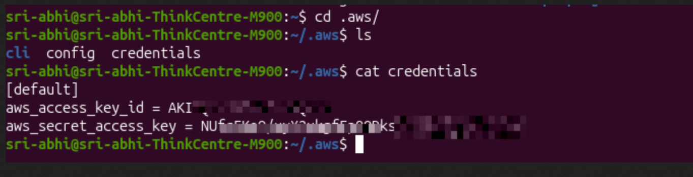
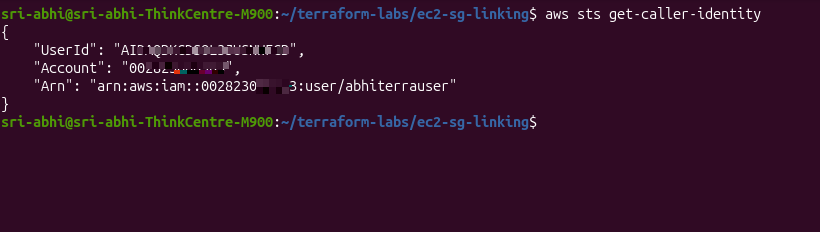

---

## Step 2: Create Lab Directory

### Commands:

```bash
mkdir -p ~/terraform-labs/ec2-sg-linking
cd ~/terraform-labs/ec2-sg-linking
```

You should now be in the lab directory:
```
~/terraform-labs/ec2-sg-linking/
```

---

## Step 3: Create Provider Configuration

### File: `provider.tf`

This file tells Terraform to use AWS provider version 5.x in the us-east-1 region.

```bash
cat > provider.tf << 'EOF'
terraform {
  required_providers {
    aws = {
      source  = "hashicorp/aws"
      version = "~> 5.0"
    }
  }
}

provider "aws" {
  region = "us-east-1"  # Change to your region if needed
}
EOF
```

**What it does:**
- Requires AWS provider version 5.x
- Configures AWS region to us-east-1
- This is the foundation for all AWS resources

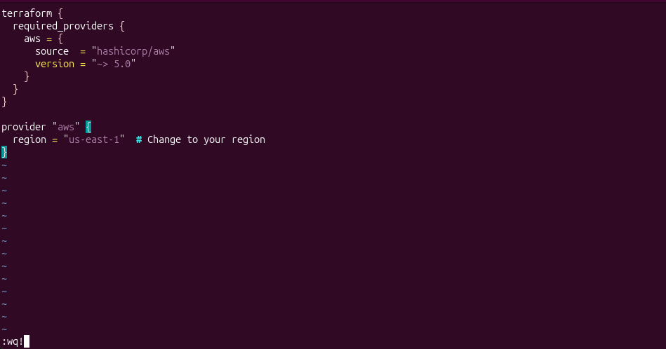

---

## Step 4: Create Security Group

### File: `security_group.tf`

This file defines a security group that allows SSH (22), HTTP (80), and HTTPS (443) traffic.

```bash
cat > security_group.tf << 'EOF'
resource "aws_security_group" "allow_ssh" {
  name        = "allow-ssh"
  description = "Allow SSH inbound traffic"

  # Allow SSH (port 22)
  ingress {
    from_port   = 22
    to_port     = 22
    protocol    = "tcp"
    cidr_blocks = ["0.0.0.0/0"]  # Warning: Open to all IPs (for lab only)
  }

  # Allow HTTP (port 80)
  ingress {
    from_port   = 80
    to_port     = 80
    protocol    = "tcp"
    cidr_blocks = ["0.0.0.0/0"]
  }

  # Allow HTTPS (port 443)
  ingress {
    from_port   = 443
    to_port     = 443
    protocol    = "tcp"
    cidr_blocks = ["0.0.0.0/0"]
  }

  # Allow all outbound traffic
  egress {
    from_port   = 0
    to_port     = 0
    protocol    = "-1"
    cidr_blocks = ["0.0.0.0/0"]
  }

  tags = {
    Name = "allow-ssh-sg"
  }
}
EOF
```

**What it does:**
- Creates a security group named "allow-ssh"
- Opens ports 22 (SSH), 80 (HTTP), 443 (HTTPS) for incoming traffic
- Allows all outbound traffic
- Tags it for easy identification

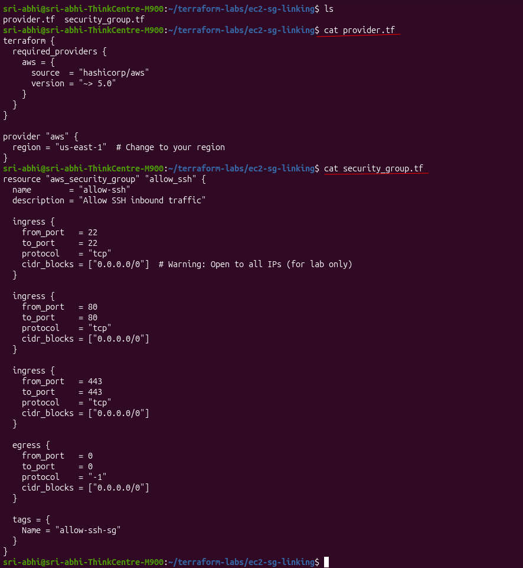

---

## Step 5: Create EC2 Instance (LINKED to Security Group)

### File: `ec2_instance.tf`

This is the KEY file! It shows how to **link** the EC2 instance to the security group using resource attributes.

```bash
cat > ec2_instance.tf << 'EOF'
resource "aws_instance" "web_server" {
  ami           = "ami-054d6a336762e438e"  # Ubuntu 20.04 LTS (us-east-1)
  instance_type = "t2.micro"
  
  # *** THIS IS THE LINKING! ***
  # References security group ID dynamically
  # Instead of hardcoding: vpc_security_group_ids = ["sg-12345678"]
  # We link it dynamically:
  vpc_security_group_ids = [aws_security_group.allow_ssh.id]
  
  tags = {
    Name = "web-server"
  }
}
EOF
```

**Key Points:**

❌ **Without Linking (Hardcoded - BAD):**
```hcl
vpc_security_group_ids = ["sg-12345678"]  # What if SG ID changes?
```

✅ **With Linking (Dynamic - GOOD):**
```hcl
vpc_security_group_ids = [aws_security_group.allow_ssh.id]  # Always current!
```

**Why This Matters:**
- If security group ID changes, instance automatically knows
- No manual updates needed
- Terraform manages the dependency automatically

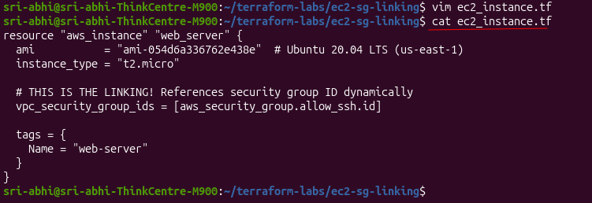
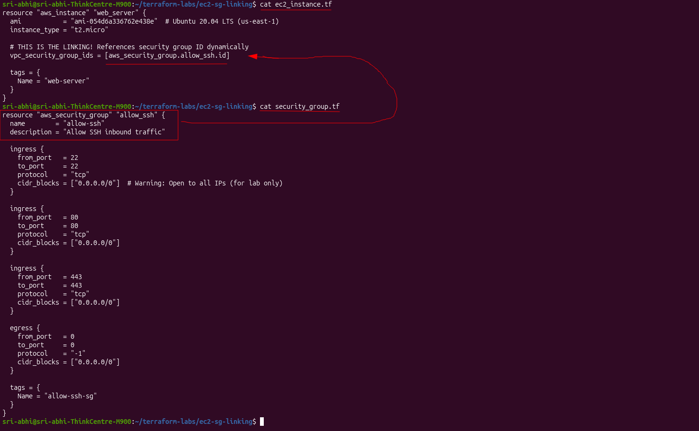

---

## Step 6: Create Outputs

### File: `outputs.tf`

This file exports important values so you can see them after `terraform apply`.

```bash
cat > outputs.tf << 'EOF'
output "security_group_id" {
  description = "Security Group ID"
  value       = aws_security_group.allow_ssh.id
}

output "instance_id" {
  description = "EC2 Instance ID"
  value       = aws_instance.web_server.id
}

output "instance_public_ip" {
  description = "Public IP of EC2 Instance"
  value       = aws_instance.web_server.public_ip
}

output "linked_sg_id" {
  description = "Security Group ID attached to instance"
  value       = aws_instance.web_server.vpc_security_group_ids
}
EOF
```

**What it shows:**
- Security Group ID created
- Instance ID created
- Instance Public IP (for SSH access)
- Linked Security Group ID (proves the connection!)

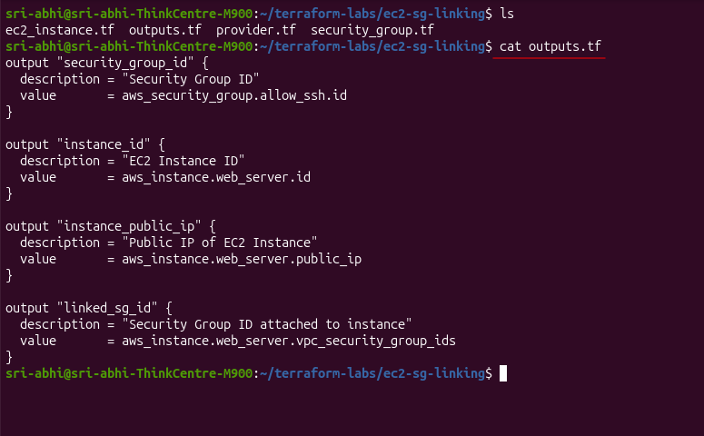

---

## Step 7: Verify Files

### Command:

```bash
ls -la
```

**You should see:**
```
provider.tf
security_group.tf
ec2_instance.tf
outputs.tf
```

---

## Step 8: Initialize Terraform

### Command:

```bash
terraform init
```

**What happens:**
- Downloads AWS provider plugin (~200MB)
- Creates `.terraform/` directory
- Creates `terraform.lock.hcl` file (locks provider version)

**Expected Output:**
```
Initializing the backend...
Initializing provider plugins...
- Finding hashicorp/aws versions matching "~> 5.0"...
- Installing hashicorp/aws v5.100.0...
- Installed hashicorp/aws v5.100.0 (signed by HashiCorp)

Terraform has been successfully initialized!
```

⏳ **This takes 1-5 minutes the first time** (downloads large provider file)

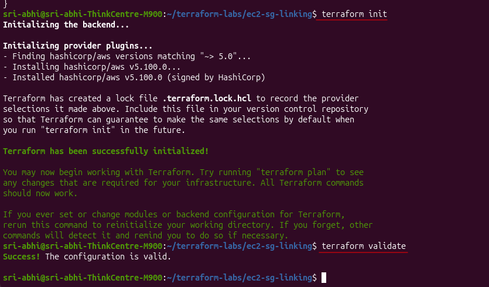

---

## Step 9: Validate Configuration

### Command:

```bash
terraform validate
```

**Expected Output:**
```
Success! The configuration is valid.
```

✅ This checks for syntax errors before applying

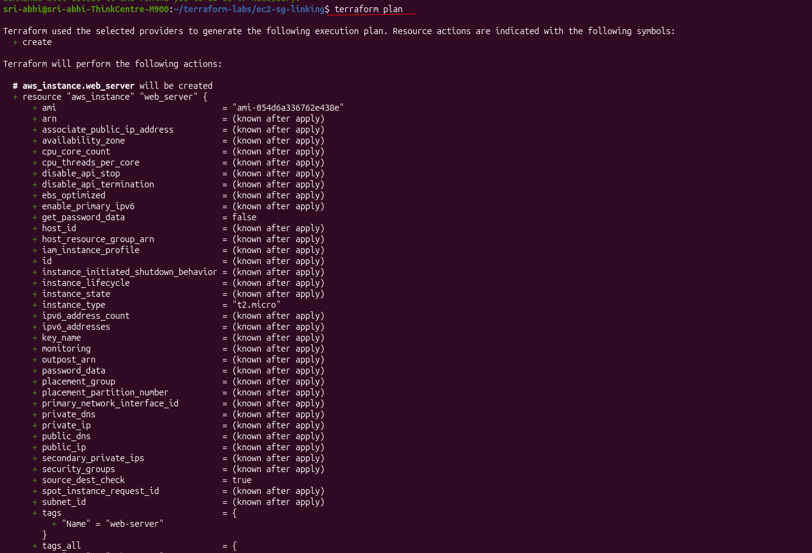

---

## Step 10: Plan the Infrastructure

### Command:

```bash
terraform plan
```

**What it shows:**
- All resources that will be created
- Attributes and their values
- The **linking** between resources

**Key part of output:**
```
# aws_security_group.allow_ssh will be created
+ resource "aws_security_group" "allow_ssh" {
    + id   = (known after apply)
    + name = "allow-ssh"
    ...
  }

# aws_instance.web_server will be created
+ resource "aws_instance" "web_server" {
    + ami                    = "ami-054d6a336762e438e"
    + instance_type          = "t2.micro"
    + vpc_security_group_ids = [
        + aws_security_group.allow_ssh.id  # ← THE LINK!
      ]
    ...
  }
```

**Notice:** Terraform shows `aws_security_group.allow_ssh.id` - it knows they're linked!

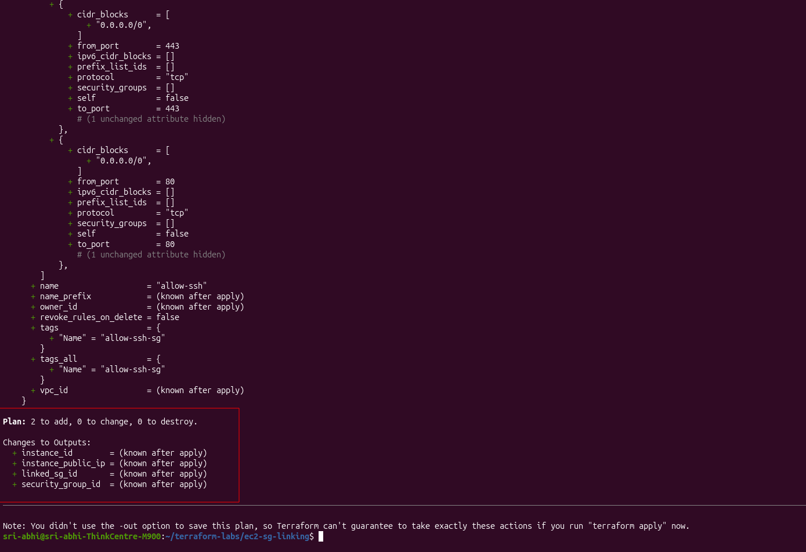
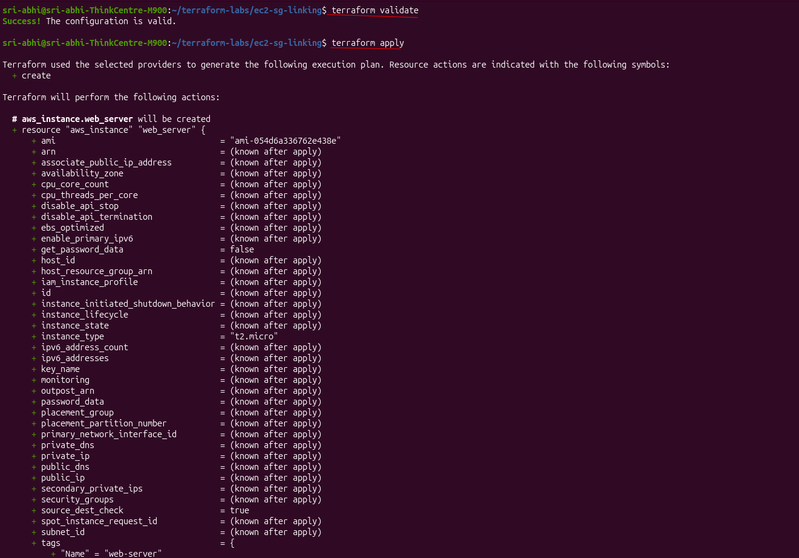

---

## Step 11: Apply the Infrastructure

### Command:

```bash
terraform apply
```

When prompted:
```
Do you want to perform these actions?
Enter a value: yes
```

**What happens:**
1. Creates security group first
2. Gets security group ID (e.g., "sg-0123456789abcdef0")
3. Creates EC2 instance with that SG ID
4. Shows outputs

**Expected Output:**
```
aws_security_group.allow_ssh: Creating...
aws_security_group.allow_ssh: Creation complete after 4s [id=sg-00b69160a8e4a380a]

aws_instance.web_server: Creating...
aws_instance.web_server: Creation complete after 15s [id=i-0d785d5b2846d8a7e]

Apply complete! Resources: 2 added, 0 changed, 0 destroyed.

Outputs:

security_group_id = "sg-00b69160a8e4a380a"
instance_id = "i-0d785d5b2846d8a7e"
instance_public_ip = "54.236.36.251"
linked_sg_id = [
  "sg-00b69160a8e4a380a",
]
```

✅ **Both resources created and linked!**

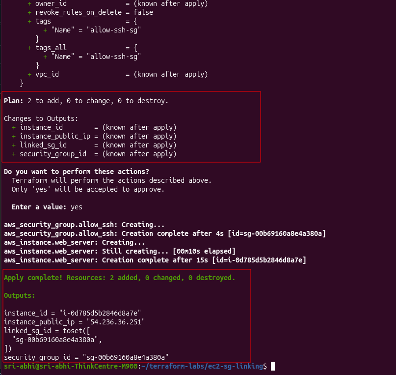
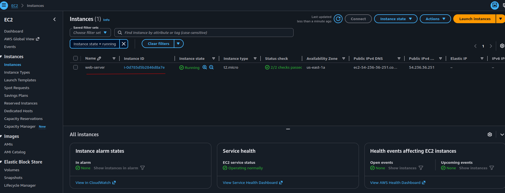

---

## Step 12: Verify in AWS Console

### Step 12a: Check EC2 Instance

1. Go to **AWS Console → EC2 → Instances**
2. You should see your `web-server` instance
3. Instance ID should match the output above
4. State should be "Running"
5. Public IP should match the output

### Step 12b: Check Security Group Link

1. Click on your instance
2. Scroll to **Security** tab
3. You'll see the Security Group attached
4. Click on the Security Group name

### Step 12c: Verify Inbound Rules

1. Go to **Security Groups**
2. Find `allow-ssh` security group
3. Click on it
4. See **Inbound rules** tab showing:
   - SSH (port 22)
   - HTTP (port 80)
   - HTTPS (port 443)

✅ **The instance is successfully linked to the security group!**

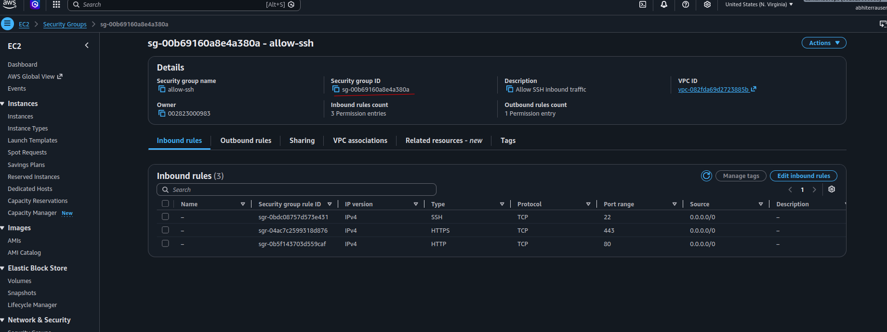
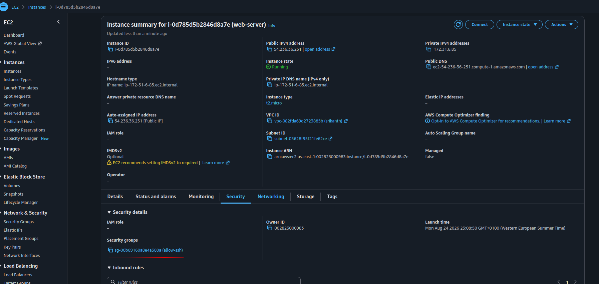
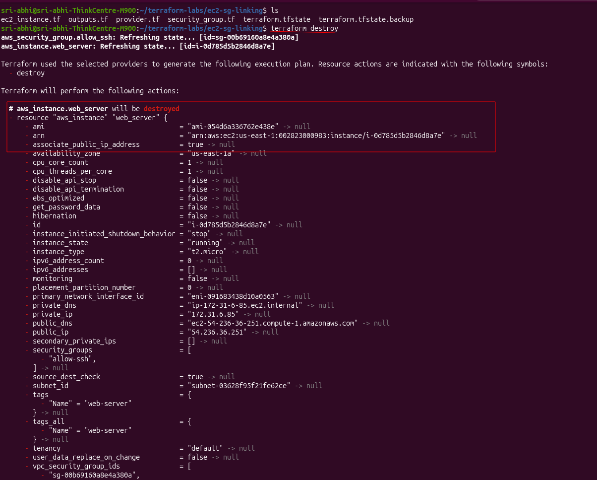

---

## Step 13: Clean Up (Destroy Resources)

### Why Destroy?
- Stop paying for resources
- Clean up AWS account
- Practice `terraform destroy`

### Command:

```bash
terraform destroy
```

When prompted:
```
Do you really want to destroy all resources?
Enter a value: yes
```

**What happens:**
1. Stops EC2 instance
2. Destroys EC2 instance
3. Destroys security group
4. Updates state file

**Expected Output:**
```
aws_instance.web_server: Destroying... [id=i-0d785d5b2846d8a7e]
aws_instance.web_server: Still destroying... [id=i-0d785d5b2846d8a7e, 00m10s elapsed]
aws_instance.web_server: Destruction complete after 30s

aws_security_group.allow_ssh: Destroying... [id=sg-00b69160a8e4a380a]
aws_security_group.allow_ssh: Destruction complete after 1s

Destroy complete! Resources: 2 destroyed.
```

✅ **All resources removed from AWS!**

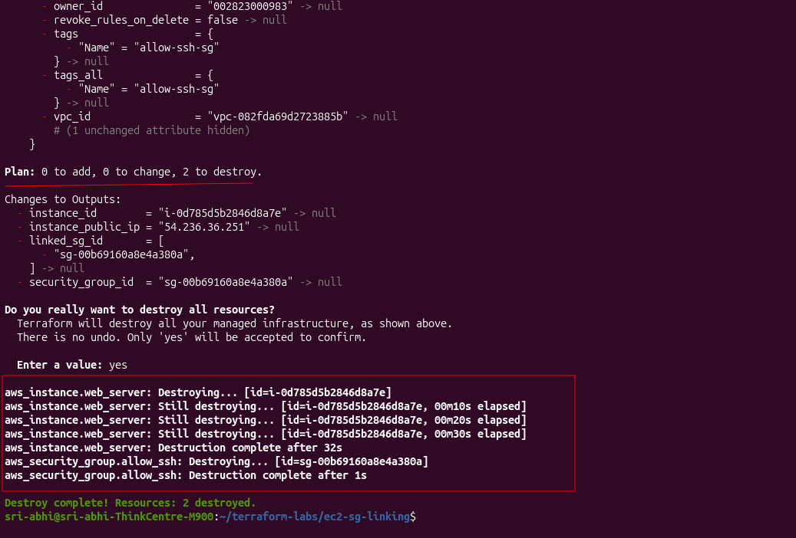


---

## Key Learnings from This Lab

### ✅ Resource Attributes
- Security group **returns** `id` attribute after creation
- EC2 instance **references** that attribute
- Connection is dynamic and automatic

### ✅ Linking Syntax
```hcl
# Reference another resource's attribute
resource_type.resource_name.attribute
```

Example:
```hcl
aws_security_group.allow_ssh.id
```

### ✅ Terraform's Automatic Ordering
- Terraform sees the dependency
- Creates security group FIRST
- Creates EC2 instance AFTER
- No manual ordering needed

### ✅ No Hardcoding
Instead of:
```hcl
vpc_security_group_ids = ["sg-12345678"]  # BAD
```

Do this:
```hcl
vpc_security_group_ids = [aws_security_group.allow_ssh.id]  # GOOD
```

### ✅ State Management
- `terraform.tfstate` tracks all resources
- Stores resource IDs and attributes
- Used for future updates/destroys
- **Commit to git? NO! Use .gitignore**

---

## Important Notes

### ⚠️ Security Best Practices
- Never commit `.tfvars` files with secrets to git
- Never commit `terraform.tfstate` to git
- Use IAM users, never root credentials
- Restrict security group CIDR blocks in production (not 0.0.0.0/0)

### 📝 File Structure After Lab
```
~/terraform-labs/ec2-sg-linking/
├── provider.tf              # AWS provider config
├── security_group.tf        # Security group resource
├── ec2_instance.tf          # EC2 instance resource
├── outputs.tf               # Output values
├── terraform.tfstate        # State file (created by apply)
├── terraform.tfstate.backup # State backup
├── .terraform.lock.hcl      # Provider version lock
└── .terraform/              # Provider cache directory
```

### 🔄 Next Steps
1. Try modifying the AMI ID to a different Ubuntu version
2. Add more ingress rules to the security group
3. Link multiple EC2 instances to the same security group
4. Use variables to make it more reusable

---

## Summary

**What You Did:**
1. ✅ Set up AWS credentials
2. ✅ Created provider configuration
3. ✅ Created security group
4. ✅ **Linked** EC2 instance to security group
5. ✅ Verified in AWS Console
6. ✅ Destroyed resources

**What You Learned:**
- ✅ Resource attributes allow dynamic linking
- ✅ No hardcoding needed
- ✅ Terraform manages dependencies automatically
- ✅ Infrastructure becomes flexible and maintainable

**Real-World Application:**
This pattern is used everywhere:
- EC2 instances linked to security groups ✅ (this lab)
- Databases linked to EC2 instances
- S3 buckets linked to Lambda functions
- Load balancers linked to target groups
- RDS databases linked to security groups

You now understand the foundation of linking AWS resources with Terraform! 🚀

---

**Congratulations on completing this hands-on lab!** 🎉
