# Hands-On Lab: Explicit Dependencies (EC2 + IAM Role Policy)

> Companion hands-on lab for [Module 03.8: Resource Dependencies in Terraform](../../README.md#explicit-dependencies). Code lives in [`explicit-dependency-code/`](explicit-dependency-code).

---

## What I Built

This lab is the counterpart to the [implicit-dependency-lab](../implicit-dependency-lab) — same idea, but for a case where a plain reference isn't enough. I built an EC2 instance that assumes an IAM role through an instance profile:

```hcl
resource "aws_instance" "app_server" {
  ami                  = data.aws_ami.amazon_linux.id
  instance_type        = "t2.micro"
  iam_instance_profile = aws_iam_instance_profile.ec2_profile.name

  depends_on = [
    aws_iam_role_policy.ec2_s3_read  # <- EXPLICIT DEPENDENCY: policy must be attached before the instance boots and assumes the role
  ]

  tags = {
    Name = "app-server-explicit-lab"
  }
}
```

The instance already references `aws_iam_instance_profile.ec2_profile.name`, so Terraform would create the instance profile first *anyway* — that part is implicit. The reason I needed `depends_on` here is `aws_iam_role_policy.ec2_s3_read`: nothing on the instance resource references that policy directly (the instance only cares about the *profile*, not the *policy* attached to the role behind it). Without `depends_on`, Terraform could create the EC2 instance and attach the role before the S3-read policy is actually attached to that role — meaning the instance could boot for a moment with a role that has no permissions yet. Adding the explicit dependency forces the policy attachment to finish first.

Files: `provider.tf`, `iam_role.tf`, `ec2_instance.tf`, `outputs.tf`.

---

## Walking Through It

### 1. Reviewing the code before touching AWS

`provider.tf` — same AWS provider setup as the implicit lab, `us-east-1`, `~> 5.0`.

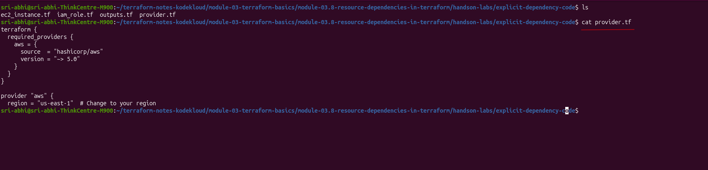

`ec2_instance.tf` and `iam_role.tf` — this is where the `depends_on` lives, plus the IAM role, the inline policy (`ec2_s3_read`, S3 `ListAllMyBuckets` only), and the instance profile that ties the role to the instance.

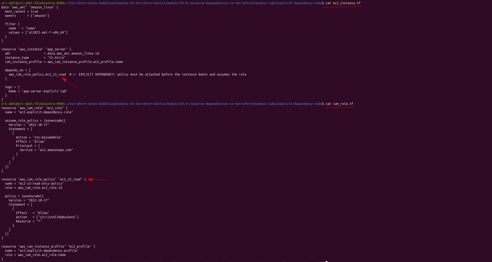

`outputs.tf` — outputs the IAM role name, instance ID, and public IP.

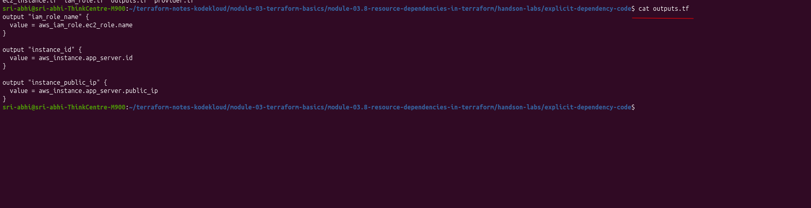

Side-by-side in the editor, with the explicit dependency arrow pointing at `depends_on = [aws_iam_role_policy.ec2_s3_read]`:

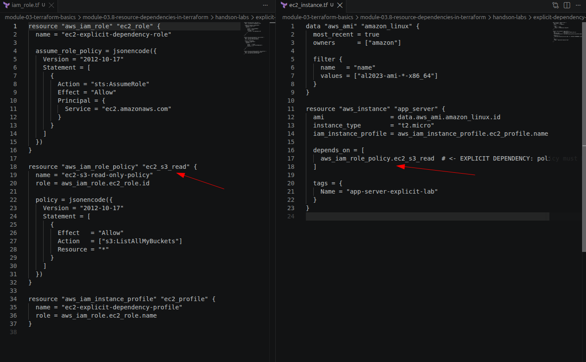

### 2. `terraform init`

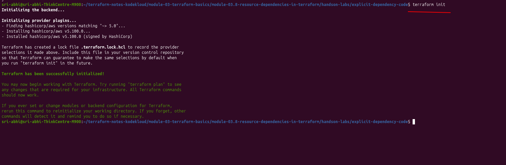

### 3. `terraform plan`

The plan confirmed 4 resources to create: the IAM role, the inline role policy, the instance profile, and the EC2 instance itself.

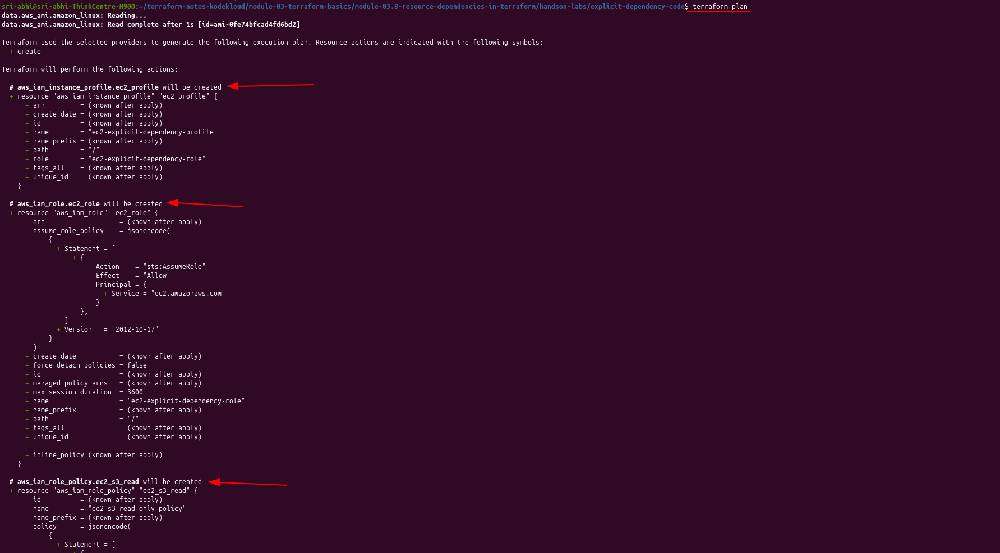

Plan summary: 4 to add, 0 to change, 0 to destroy.

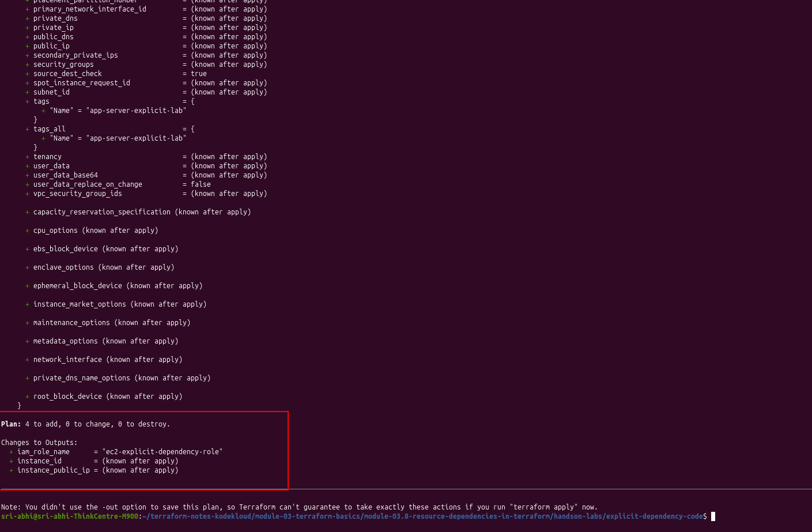

### 4. `terraform apply`

```
aws_iam_role.ec2_role: Creating...
aws_iam_role.ec2_role: Creation complete after 1s [id=ec2-explicit-dependency-role]
aws_iam_role_policy.ec2_s3_read: Creating...
aws_iam_instance_profile.ec2_profile: Creating...
aws_iam_role_policy.ec2_s3_read: Creation complete after 0s
aws_iam_instance_profile.ec2_profile: Creation complete after 6s [id=ec2-explicit-dependency-profile]
aws_instance.app_server: Creating...
aws_instance.app_server: Still creating... [00m10s elapsed]
aws_instance.app_server: Creation complete after 17s [id=i-00f4b86f2213781df]

Apply complete! Resources: 4 added, 0 changed, 0 destroyed.
```

The order tells the whole story: **IAM role → role policy → instance profile → EC2 instance.** The role policy and instance profile actually kicked off "Creating..." at nearly the same moment (both only need the role to exist), but the policy finished first, and the EC2 instance didn't start until *both* the profile (implicit ref) and the policy (explicit `depends_on`) were done. That's the explicit dependency doing its job — without it, nothing here would have stopped the instance from racing ahead of the policy attachment.

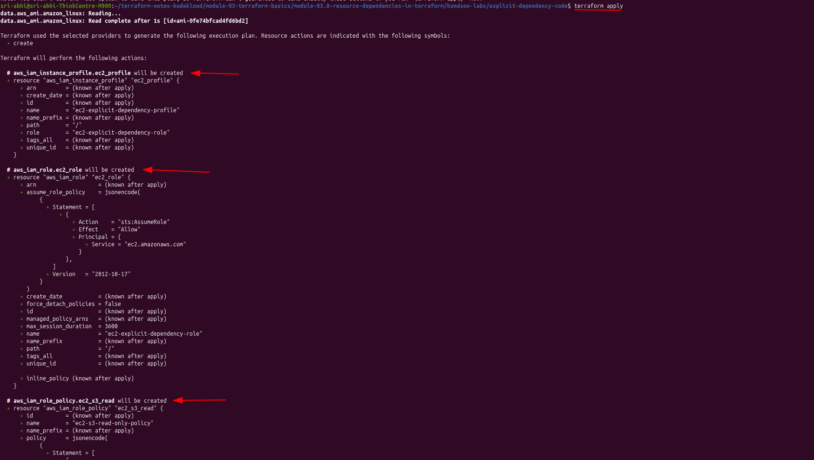

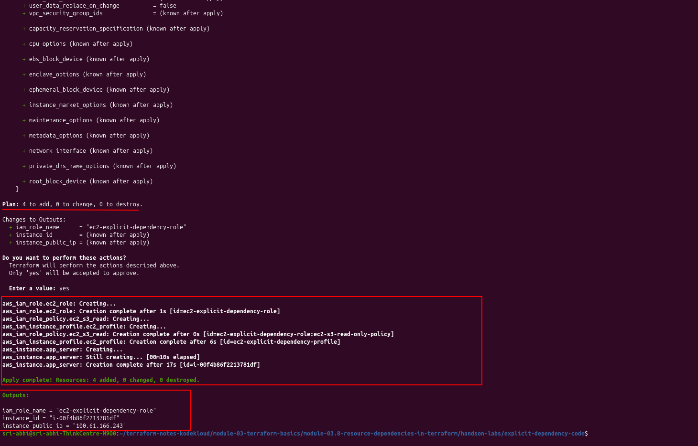

### 5. Verifying with `terraform output`

```
iam_role_name      = "ec2-explicit-dependency-role"
instance_id        = "i-00f4b86f2213781df"
instance_public_ip = "100.61.166.243"
```

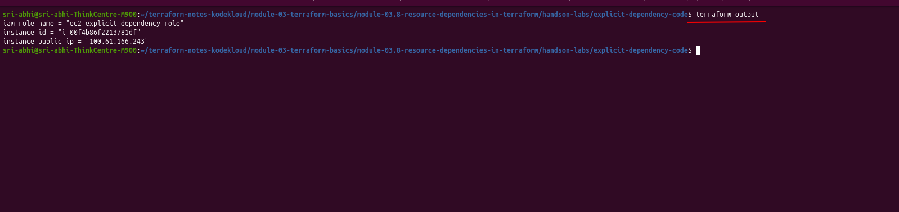

### 6. Checking the AWS Console

Instance summary — running, `t2.micro`, and the **IAM role** field shows `ec2-explicit-dependency-role`, confirming the instance profile actually attached the role correctly:

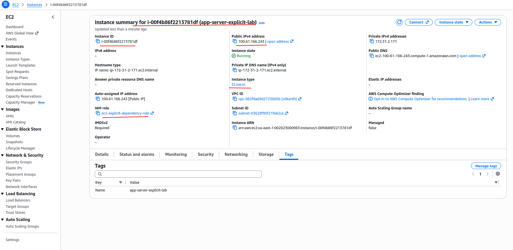

IAM role detail page — one permissions policy attached (`ec2-s3-read-only-policy`), created at 19:41, matching the `terraform apply` timestamp:

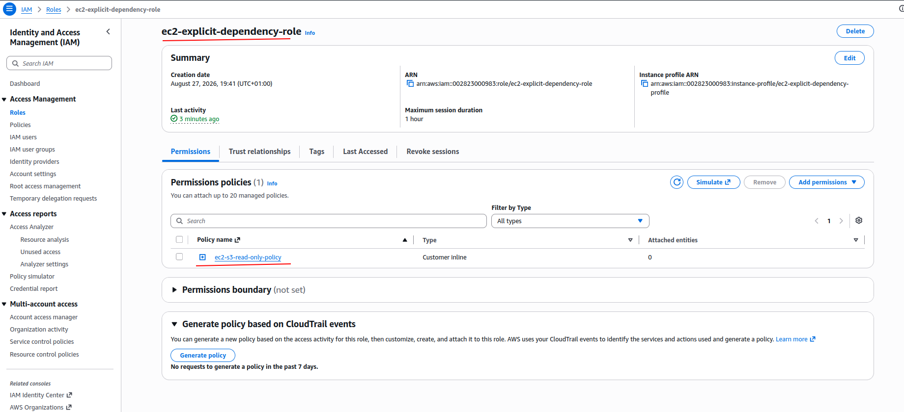

And the policy itself — `s3:ListAllMyBuckets` on `Resource: "*"`, exactly what I wrote in `iam_role.tf`:

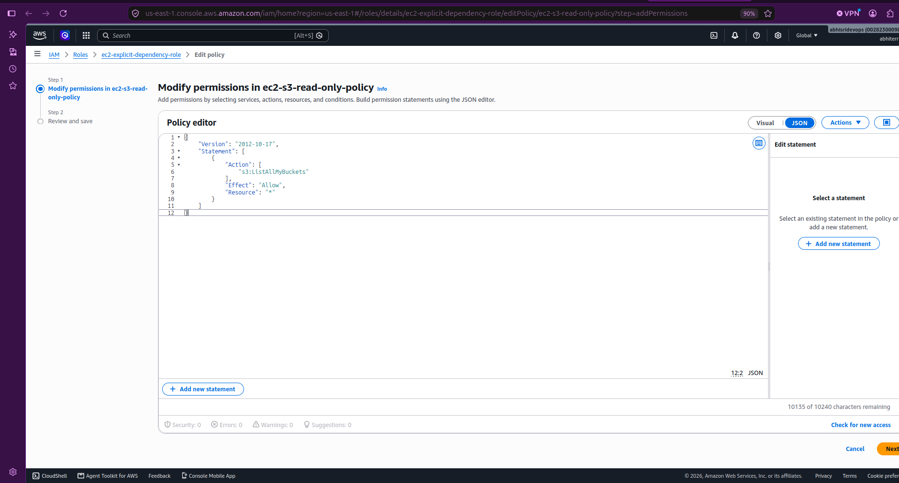

---

## What I Took Away From This

- Two dependencies were at play here, and they're not the same kind:
  - **Implicit** — `iam_instance_profile = aws_iam_instance_profile.ec2_profile.name` (a direct reference, Terraform figures this one out on its own).
  - **Explicit** — `depends_on = [aws_iam_role_policy.ec2_s3_read]` (no direct reference exists between the instance and the policy, so I had to spell it out).
- The rule of thumb from the main notes held up in practice: reach for `depends_on` specifically for IAM policy attachments and other "hidden" relationships that don't show up as a resource attribute reference.
- Creation order matched the dependency graph exactly: role → (policy + profile in parallel) → instance.

> ⚠️ **Cleanup status:** unlike the implicit-dependency lab, I didn't capture a `terraform destroy` run for this one — the last screenshot in the walkthrough is still me inspecting the IAM role/policy in the console, not tearing it down. If these resources (`app-server-explicit-lab` EC2 instance, `ec2-explicit-dependency-role` IAM role/policy/profile) are still running in AWS, run `terraform destroy` from inside `explicit-dependency-code/` to clean them up.

Back to [explicit dependencies in the main notes](../../README.md#explicit-dependencies).
