# Hands-On Lab: Implicit Dependencies (EC2 + Security Group)

> Companion hands-on lab for [Module 03.8: Resource Dependencies in Terraform](../../README.md#implicit-dependencies). Code lives in [`implicit-dependency-code/`](implicit-dependency-code).

---

## What I Built

The goal here was to see an **implicit dependency** happen for real, not just read about it. I wrote a security group and an EC2 instance where the instance references the security group's `id` directly:

```hcl
resource "aws_instance" "web_server" {
  ami                    = data.aws_ami.amazon_linux.id
  instance_type          = "t2.micro"
  vpc_security_group_ids = [aws_security_group.web.id]  # <- IMPLICIT DEPENDENCY

  tags = {
    Name = "web-server-implicit-lab"
  }
}
```

I never told Terraform "create the security group before the instance" anywhere — there's no `depends_on`. Just by referencing `aws_security_group.web.id` inside `vpc_security_group_ids`, Terraform figured out the ordering on its own. I also used a `data "aws_ami"` lookup instead of hardcoding an AMI ID, so the lab always grabs the latest Amazon Linux 2023 AMI instead of one that might not exist in my region anymore.

Files: `provider.tf`, `security_group.tf`, `ec2_instance.tf`, `outputs.tf`.

---

## Walking Through It

### 1. Reviewing the code before touching AWS

Before running anything, I just `cat`-ed through my files to make sure the reference was wired up right.

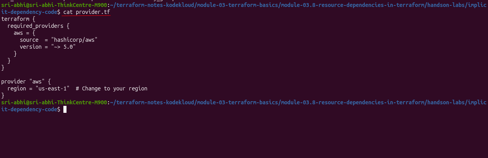

`security_group.tf` and `ec2_instance.tf` — the arrow points at the line where the implicit dependency actually happens:

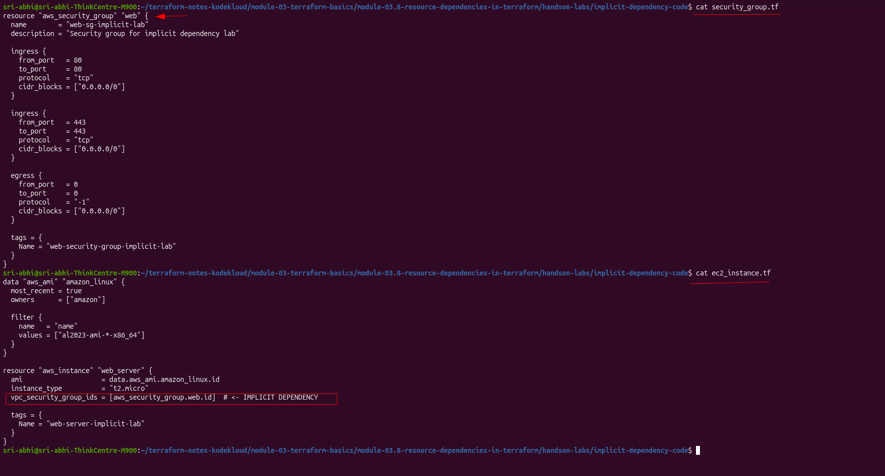

`outputs.tf` — I output the security group ID, instance ID, and public IP so I can verify everything from the CLI afterward instead of jumping into the console every time.

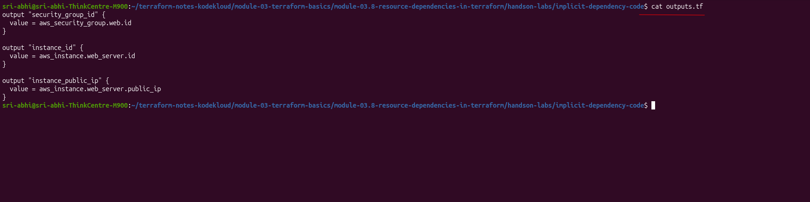

### 2. `terraform init`

Standard init, nothing special — just pulled in the `hashicorp/aws` provider (`~> 5.0`, resolved to `5.100.0`) and created `.terraform.lock.hcl`.

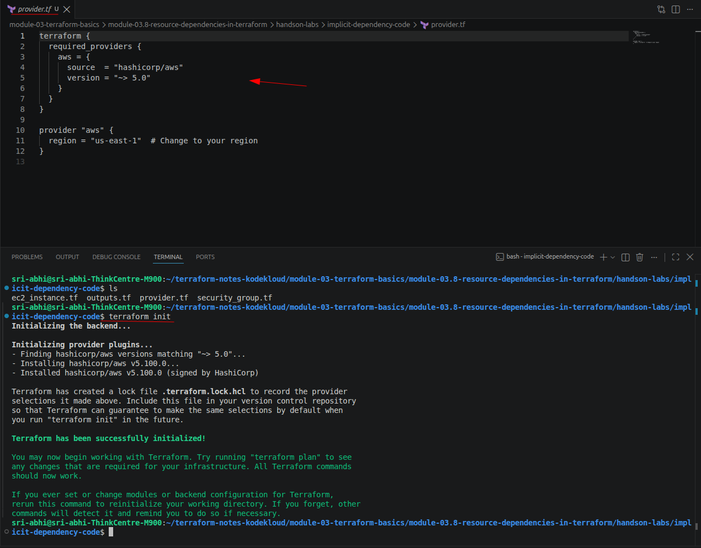

### 3. `terraform plan`

This is the important part. Even with no `depends_on` anywhere, `terraform plan` shows Terraform already knows the security group has to exist before the instance can reference its `id`. Looking at the plan output, `vpc_security_group_ids` shows up as `(known after apply)` on the instance — because that value depends on a resource that doesn't exist yet.

Scrolling through the full plan — every attribute on `aws_instance.web_server` that isn't known yet is marked `(known after apply)`, exactly what I'd expect for a resource that hasn't been created:

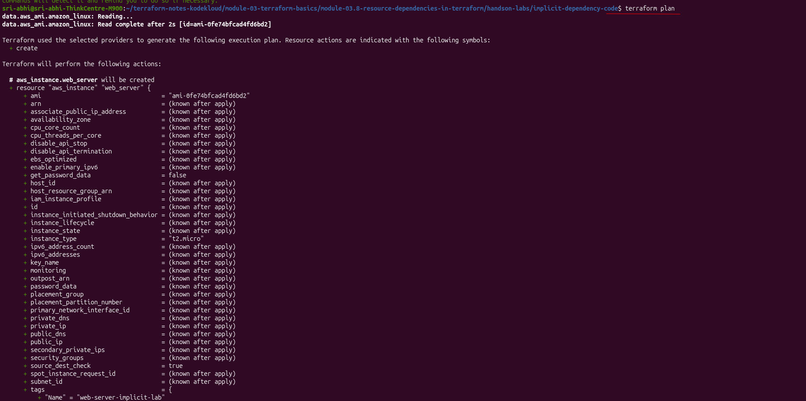

And the plan summary: 2 resources to add, 0 to change, 0 to destroy.

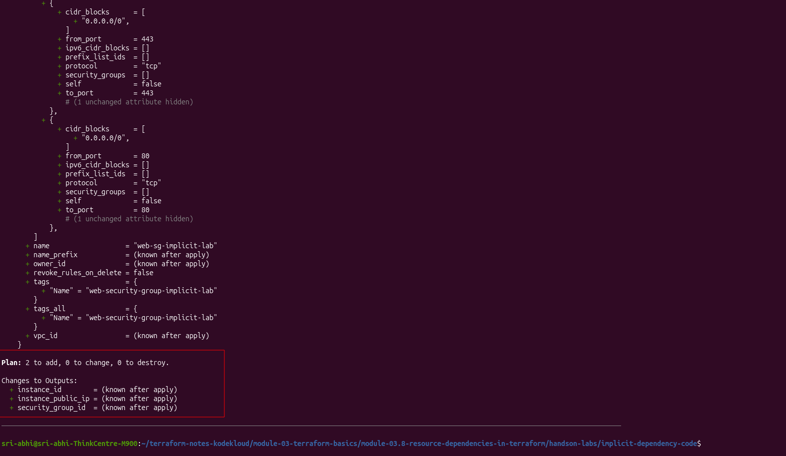

### 4. `terraform apply`

Ran `terraform apply`, confirmed with `yes`, and watched the resource creation order in real time:

```
aws_security_group.web: Creating...
aws_security_group.web: Creation complete after 4s [id=sg-01e4cae2f5a8cb4dc]
aws_instance.web_server: Creating...
aws_instance.web_server: Still creating... [00m10s elapsed]
aws_instance.web_server: Creation complete after 14s [id=i-0a96121c5456a4f5d]
```

**Security group first, EC2 instance second** — exactly what the implicit dependency graph said would happen. No instance can reference a security group ID that doesn't exist yet, so Terraform had no choice but to create the SG first.

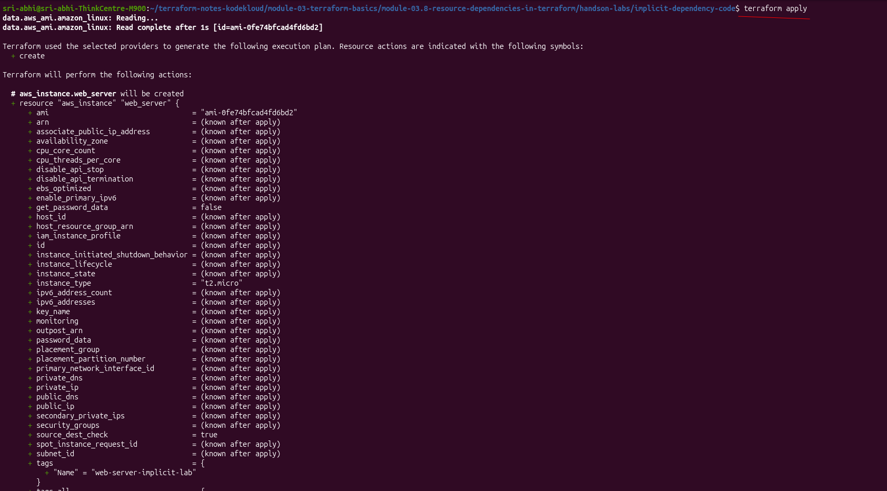

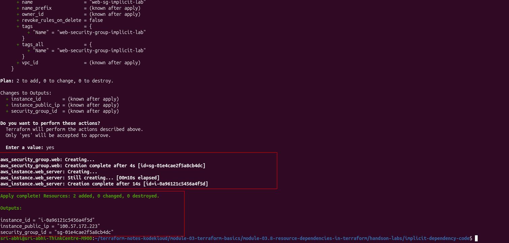

### 5. Verifying with `terraform output`

```
instance_id       = "i-0a96121c5456a4f5d"
instance_public_ip = "100.57.172.223"
```

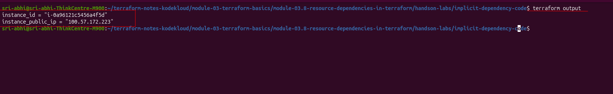

### 6. Checking the AWS Console

Instance is up and running, `2/2` status checks passed:

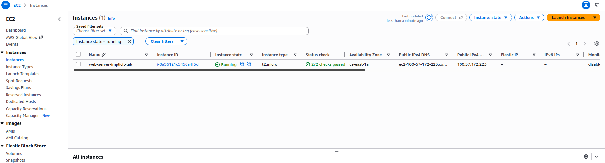

Instance summary confirms the public IP and instance ID match what Terraform printed, and the attached security group is `web-sg-implicit-lab`:

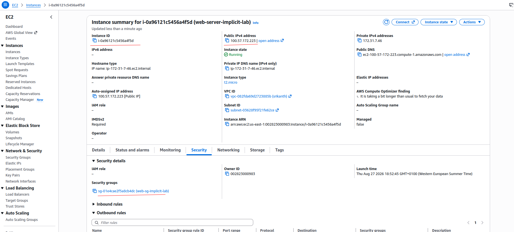

And the security group itself — port 80 and 443 inbound from `0.0.0.0/0`, matching what's in `security_group.tf`:

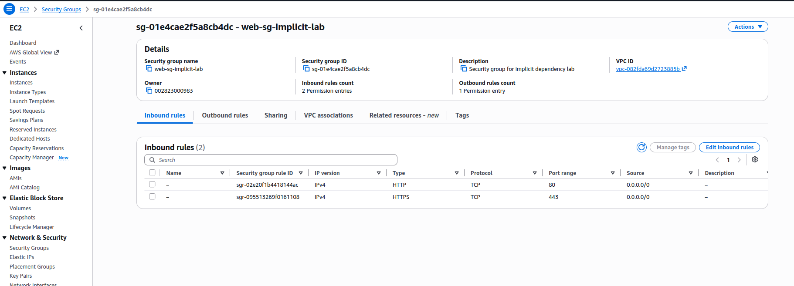

### 7. `terraform destroy` — watching the reverse order

This was the whole point of the lab: does Terraform tear things down in the **opposite** order it created them in?

```
aws_instance.web_server: Destroying... [id=i-0a96121c5456a4f5d]
aws_instance.web_server: Still destroying... [00m10s elapsed]
...
aws_instance.web_server: Destruction complete after 31s
aws_security_group.web: Destroying... [id=sg-01e4cae2f5a8cb4dc]
aws_security_group.web: Destruction complete after 1s

Destroy complete! Resources: 2 destroyed.
```

**Yes.** EC2 instance destroyed first, security group destroyed second — the reverse of creation. This makes sense: AWS won't let you delete a security group while an instance is still attached to it, so Terraform *has* to remove the instance first.

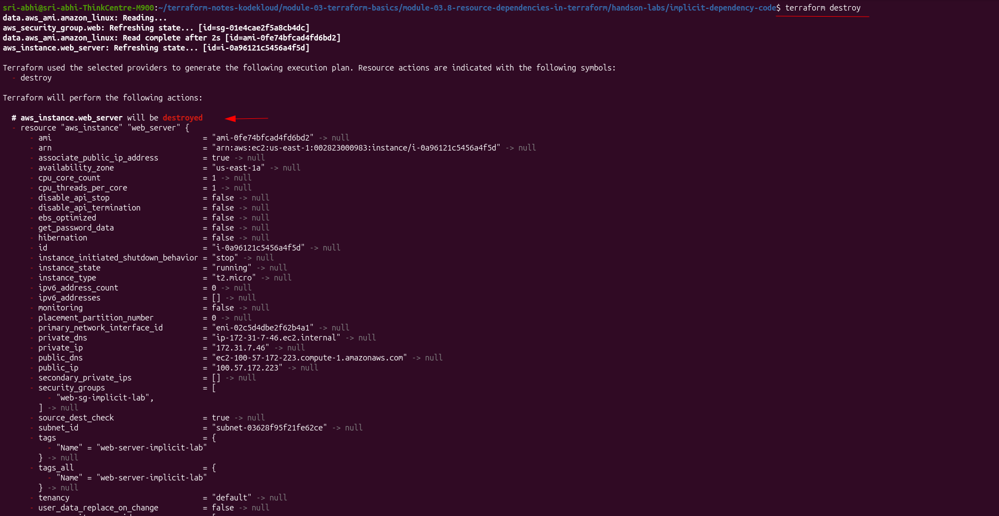

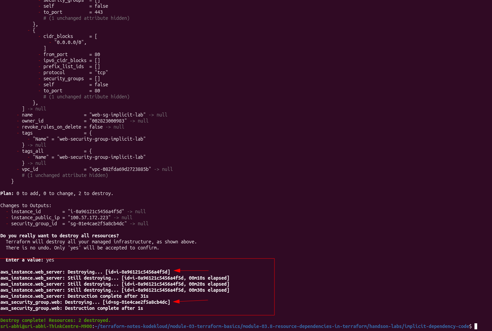

Confirmed clean in the console afterward — no matching instances found:

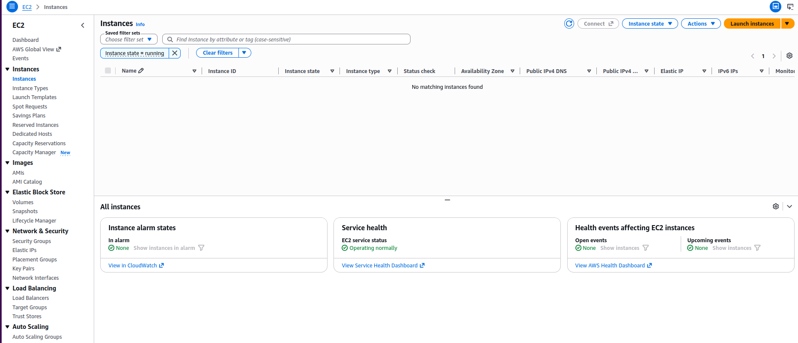

---

## What I Took Away From This

- I didn't have to tell Terraform the ordering at all — referencing `aws_security_group.web.id` was enough for it to build the dependency graph itself.
- Creation order followed the reference: security group → instance.
- Destruction order was the exact reverse: instance → security group. This isn't arbitrary — AWS itself wouldn't allow deleting an in-use security group, so it's really AWS's own constraints being respected by Terraform's dependency graph.
- Using `data "aws_ami"` with `most_recent = true` instead of a hardcoded AMI ID meant I didn't have to go hunt down a valid AMI ID for `us-east-1` myself.

Lab was destroyed cleanly at the end — no resources left running in AWS from this one.

Back to [implicit dependencies in the main notes](../../README.md#implicit-dependencies).
