# Module 04.0: Introduction to Terraform State

> In this class we will learn Terraform state and state management, understanding how it tracks infrastructure changes and the significance of the state file in managing AWS resources.

In the hands-on lab below I create an EC2 instance and a security group, watch `terraform.tfstate` get created on the first apply, inspect it, then modify `main.tf` to attach an IAM instance profile to the running instance and apply again — watching the state file track that change too.

---

## What is Terraform State?

Terraform state is a record of all the infrastructure Terraform has created. It maps your real-world AWS resources to the resource definitions in your Terraform configuration files. Without state, Terraform wouldn't know which resources exist or how to update them.

**The state file serves as:**
- **Single source of truth** — the authoritative record of what Terraform actually created
- **Change detector** — compares real infrastructure against config on every plan/apply
- **Dependency tracker** — knows which resources depend on others
- **Performance optimizer** — avoids re-deriving everything from scratch on every run
- **Safety mechanism** — prevents Terraform from trying to create duplicates of resources that already exist

---

## Terraform Workflow Overview

My actual project directory, `terraform-state-demo`, starts out with just the three config files — no state yet:

```bash
$ ls terraform-state-demo
main.tf  provider.tf  variables.tf
```

The starting `main.tf` — a data source lookup for the latest Amazon Linux 2 AMI, one EC2 instance, and one security group:

```hcl
data "aws_ami" "amazon_linux_2" {
  most_recent = true
  owners      = ["amazon"]
  filter {
    name   = "name"
    values = ["amzn2-ami-hvm-*-x86_64-gp2"]
  }
  filter {
    name   = "virtualization-type"
    values = ["hvm"]
  }
}

resource "aws_security_group" "web_sg" {
  name        = "web-security-group"
  description = "Security group for web server"
  
  ingress {
    from_port   = 80
    to_port     = 80
    protocol    = "tcp"
    cidr_blocks = ["0.0.0.0/0"]
  }
  
  egress {
    from_port   = 0
    to_port     = 0
    protocol    = "-1"
    cidr_blocks = ["0.0.0.0/0"]
  }
}

resource "aws_instance" "web_server" {
  ami                    = data.aws_ami.amazon_linux_2.id
  instance_type          = var.instance_type
  vpc_security_group_ids = [aws_security_group.web_sg.id]  # ✅ ATTACHED!
  
  tags = {
    Name = "my-web-server"
  }
}
```

> I used a `data "aws_ami"` lookup instead of a hardcoded AMI id. AWS deprecates old AMIs as newer ones get published, so a pinned id can quietly stop resolving in `us-east-1` — the plan/apply then fails with an invalid AMI error that has nothing to do with state. The lookup always resolves to whichever Amazon Linux 2 HVM/gp2 AMI is currently newest.

`variables.tf` just declares the instance type:

```hcl
variable "instance_type" {
  default = "t2.micro"
}
```

`provider.tf` pins the AWS provider and region:

```hcl
terraform {
  required_providers {
    aws = {
      source  = "hashicorp/aws"
      version = "~> 5.0"
    }
  }
}

provider "aws" {
  region = "us-east-1"
}
```

My actual lab directory — [`hands-on-lab/terraform-state-demo/`](hands-on-lab/terraform-state-demo/) — with these three files:

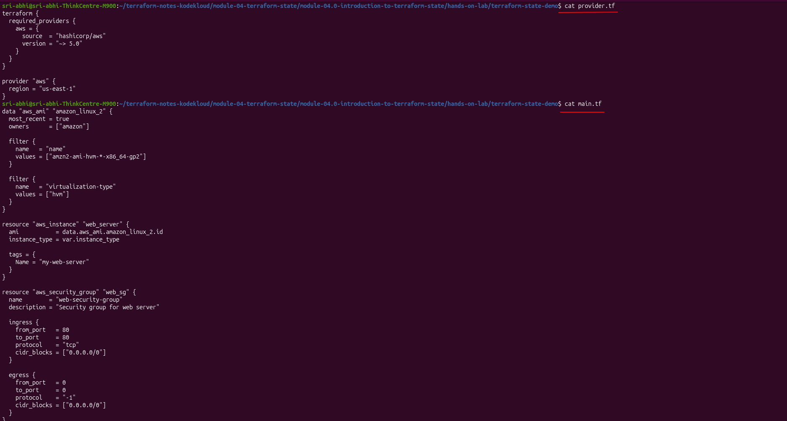

At this stage, no AWS resources have been created yet.

---

## Hands-On Lab: Creating Infrastructure

### Step 1: Initialize Terraform

```bash
$ cat variables.tf
$ terraform init
```

`terraform init` downloads the AWS provider plugin and sets up the working directory:

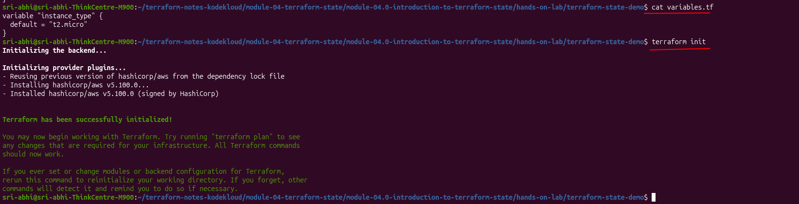

### Step 2: Plan the Infrastructure

```bash
$ terraform plan
```

Because the AMI is a data source, Terraform reads it first — `data.aws_ami.amazon_linux_2: Reading...` — before it can show what the instance will look like, since the resolved AMI id feeds into the instance's `ami` attribute:

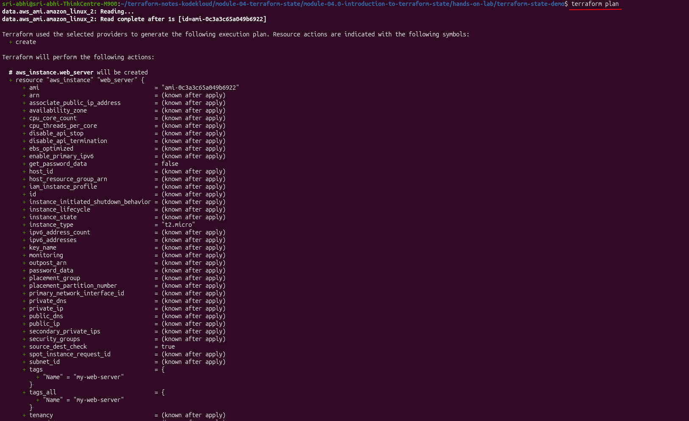
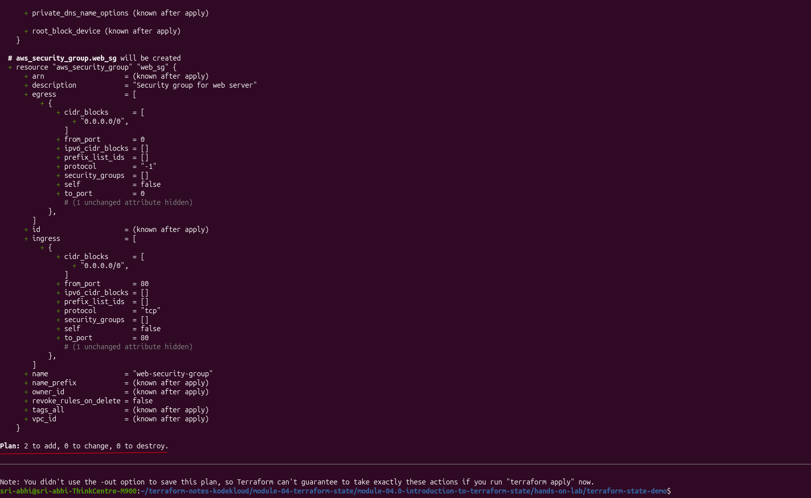

```
Plan: 2 to add, 0 to change, 0 to destroy.
```

Since no state file exists yet, Terraform knows both resources are new.

### Step 3: Apply the Configuration

```bash
$ terraform apply
```

I confirmed with `yes` at the prompt:

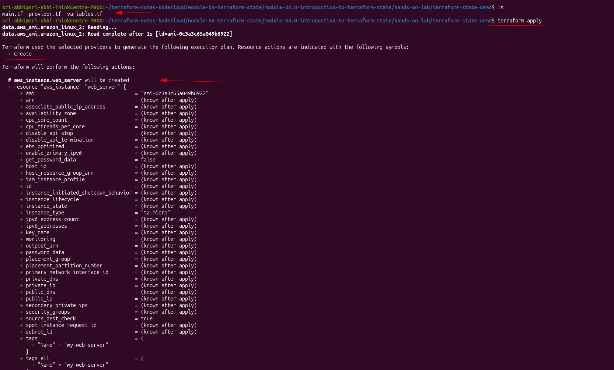


```
aws_security_group.web_sg: Creating...
aws_instance.web_server: Creating...
aws_security_group.web_sg: Creation complete after 5s [id=sg-03ee8ffc10cd43d96]
aws_instance.web_server: Still creating... [00m10s elapsed]
aws_instance.web_server: Creation complete after 15s [id=i-077f37d5b08506306]

Apply complete! Resources: 2 added, 0 changed, 0 destroyed.
```

Upon confirmation, Terraform:
- Created the security group: `sg-03ee8ffc10cd43d96`
- Created the EC2 instance: `i-077f37d5b08506306`
- Wrote `terraform.tfstate` for the first time

> **⚠️ Real gotcha:** I created a security group but forgot to attach it to the instance. Terraform didn't warn me, but the state file revealed it instantly.
> 
> 📌 **See:** [Troubleshooting: Security Group Not Attached](../troubleshooting-notes/module-04.0-sg-attachment.md)

### Step 4: Verify the State File Appeared

```bash
$ ls
main.tf  provider.tf  terraform.tfstate  terraform.tfstate.backup  variables.tf
```

`terraform.tfstate.backup` shows up too — a copy of state from just before the most recent apply.

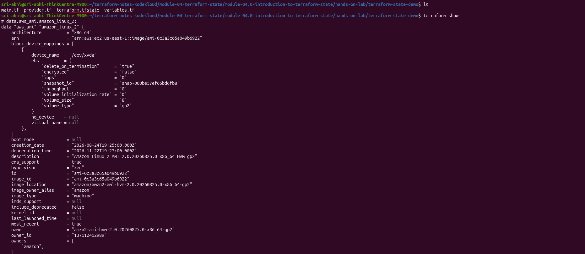

---

## Understanding State Files

Inspecting `terraform.tfstate` after the first apply (`cat terraform.tfstate | jq .`) shows a detailed record of the infrastructure — the AMI data source, both resources, their real AWS ids and attributes:

```json
{
  "version": 4,
  "terraform_version": "1.15.8",
  "serial": 3,
  "lineage": "0fee184e-8d23-b4b9-90c0-46f92dbbbb35",
  "resources": [
    {
      "mode": "data",
      "type": "aws_ami",
      "name": "amazon_linux_2",
      "instances": [
        { "attributes": { "id": "ami-0c3a3c65a049b6922", "architecture": "x86_64" } }
      ]
    },
    {
      "mode": "managed",
      "type": "aws_security_group",
      "name": "web_sg",
      "instances": [
        { "attributes": { "id": "sg-03ee8ffc10cd43d96", "name": "web-security-group" } }
      ]
    },
    {
      "mode": "managed",
      "type": "aws_instance",
      "name": "web_server",
      "instances": [
        {
          "attributes": {
            "id": "i-077f37d5b08506306",
            "instance_type": "t2.micro",
            "private_ip": "172.31.15.133",
            "public_ip": "3.231.50.210",
            "iam_instance_profile": ""
          }
        }
      ]
    }
  ]
}
```

| Field | Meaning |
|-------|---------|
| **version** | Terraform state format version |
| **terraform_version** | Terraform CLI version that wrote this state — `1.15.8` |
| **serial** | Version counter, incremented on every write — mine landed on `3` after a couple of plan/apply iterations |
| **lineage** | Unique id tracking this state file across backups |
| **resources** | Every data source and managed resource — data sources included, tagged `"mode": "data"` |

A couple of plain-English things worth knowing about this file:

- **Data sources get saved here too**, just marked `"mode": "data"` instead of `"mode": "managed"`. That's why the AMI lookup shows `Reading...` every single time you run `plan` or `apply`, instead of just `Refreshing state...` like the other resources — Terraform looks the data source up fresh every run instead of only checking that it still exists.
- **`terraform.tfstate.backup` is just a copy of the previous state** — think of it like an undo file, holding whatever was in `terraform.tfstate` right before the last change. Terraform itself always reads the current `terraform.tfstate`, not the backup, to decide what to create, change, or leave alone.

---

## Hands-On Lab: Modifying Infrastructure

### Step 1: Add an IAM Role and Instance Profile

I edited `main.tf` in place, in the same directory I already applied — so the existing state file is what gets refreshed and updated, not a fresh one. I added an IAM role, an instance profile, and wired the profile into the instance:

```hcl
data "aws_ami" "amazon_linux_2" {
  most_recent = true
  owners      = ["amazon"]

  filter {
    name   = "name"
    values = ["amzn2-ami-hvm-*-x86_64-gp2"]
  }

  filter {
    name   = "virtualization-type"
    values = ["hvm"]
  }
}

# NEW: IAM Role
resource "aws_iam_role" "ec2_role" {
  name = "ec2-web-server-role"

  assume_role_policy = jsonencode({
    Version = "2012-10-17"
    Statement = [
      {
        Action = "sts:AssumeRole"
        Effect = "Allow"
        Principal = {
          Service = "ec2.amazonaws.com"
        }
      }
    ]
  })
}

# NEW: Instance Profile
resource "aws_iam_instance_profile" "ec2_profile" {
  name = "ec2-web-server-profile"
  role = aws_iam_role.ec2_role.name
}

resource "aws_security_group" "web_sg" {
  name        = "web-security-group"
  description = "Security group for web server"

  ingress {
    from_port   = 80
    to_port     = 80
    protocol    = "tcp"
    cidr_blocks = ["0.0.0.0/0"]
  }

  egress {
    from_port   = 0
    to_port     = 0
    protocol    = "-1"
    cidr_blocks = ["0.0.0.0/0"]
  }
}

# MODIFIED: Added iam_instance_profile
resource "aws_instance" "web_server" {
  ami                    = data.aws_ami.amazon_linux_2.id
  instance_type          = var.instance_type
  iam_instance_profile   = aws_iam_instance_profile.ec2_profile.name  # ✅ Role
  vpc_security_group_ids = [aws_security_group.web_sg.id]            # ✅ SG
  
  tags = {
    Name = "my-web-server"
  }
}
```

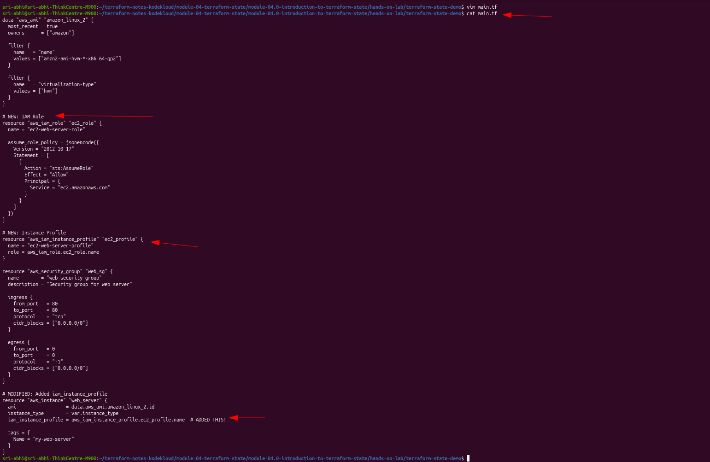

### Step 2: Run terraform plan

```bash
$ terraform plan
```

Terraform refreshes the security group and instance state first, then works out the diff:

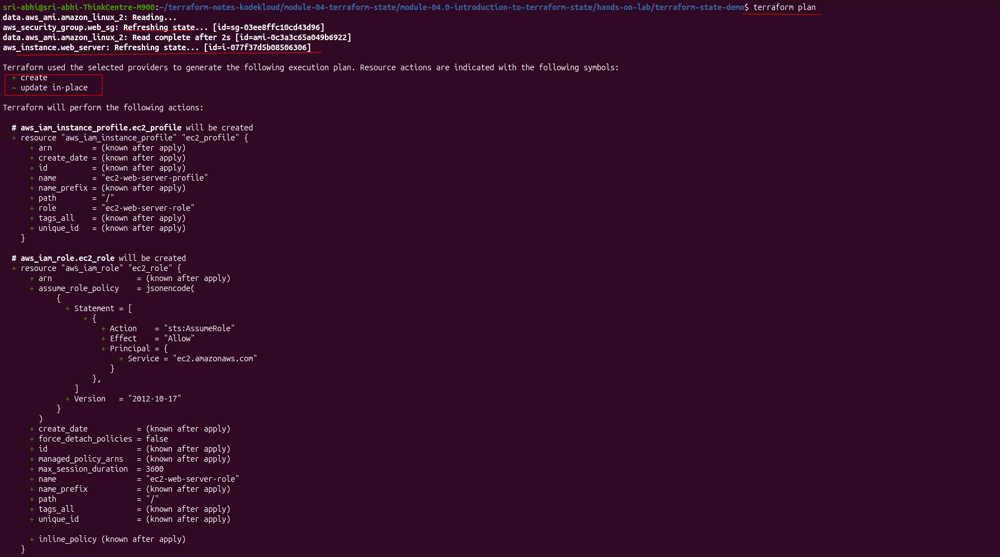

The interesting part is what it decides to do with the *existing* instance:

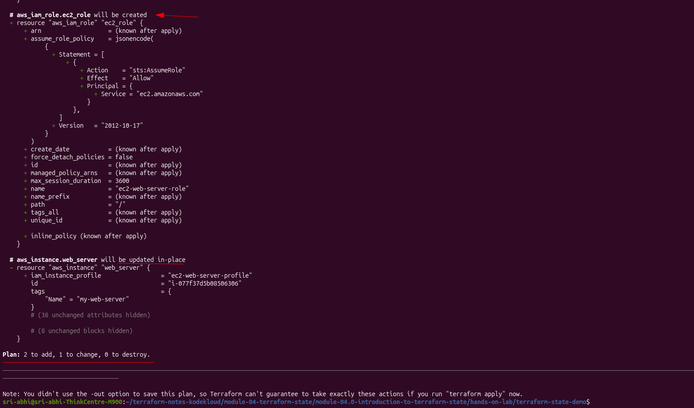

```
# aws_iam_instance_profile.ec2_profile will be created
# aws_iam_role.ec2_role will be created

# aws_instance.web_server will be updated in-place
~ resource "aws_instance" "web_server" {
    + iam_instance_profile = "ec2-web-server-profile"
      id                   = "i-077f37d5b08506306"
      tags                 = { "Name" = "my-web-server" }
      # (38 unchanged attributes hidden)
      # (8 unchanged blocks hidden)
  }

Plan: 2 to add, 1 to change, 0 to destroy.
```

So here's what happened: I added the IAM instance profile to `main.tf` and ran `plan` again. Terraform did **not** plan to delete and recreate the EC2 instance — it planned to just update it in place (`~ update in-place`, not `-/+ replace`), keeping the same instance and only adding the one new attribute.

### Step 3: Apply the Change

```bash
$ terraform apply
```

I confirmed with `yes` again:

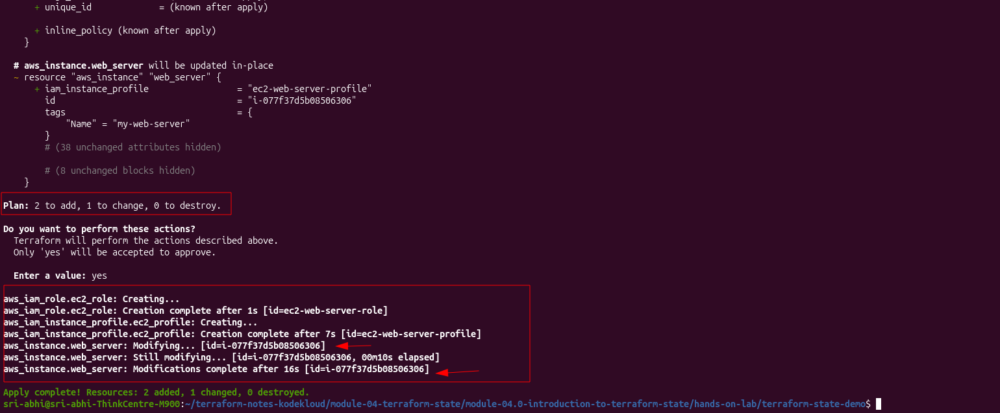

```
aws_iam_role.ec2_role: Creating...
aws_iam_role.ec2_role: Creation complete after 1s [id=ec2-web-server-role]
aws_iam_instance_profile.ec2_profile: Creating...
aws_iam_instance_profile.ec2_profile: Creation complete after 7s [id=ec2-web-server-profile]
aws_instance.web_server: Modifying... [id=i-077f37d5b08506306]
aws_instance.web_server: Still modifying... [id=i-077f37d5b08506306, 00m10s elapsed]
aws_instance.web_server: Modifications complete after 16s [id=i-077f37d5b08506306]

Apply complete! Resources: 2 added, 1 changed, 0 destroyed.
```

I observed Terraform create the IAM role and instance profile, then modify the existing EC2 instance to attach that new role — same instance ID (`i-077f37d5b08506306`), same AMI, nothing rebuilt. Only the `iam_instance_profile` attribute changed.

### Step 4: Verify the State File Was Updated

```bash
$ ls
main.tf  provider.tf  terraform.tfstate  terraform.tfstate.backup  variables.tf

$ terraform show
```

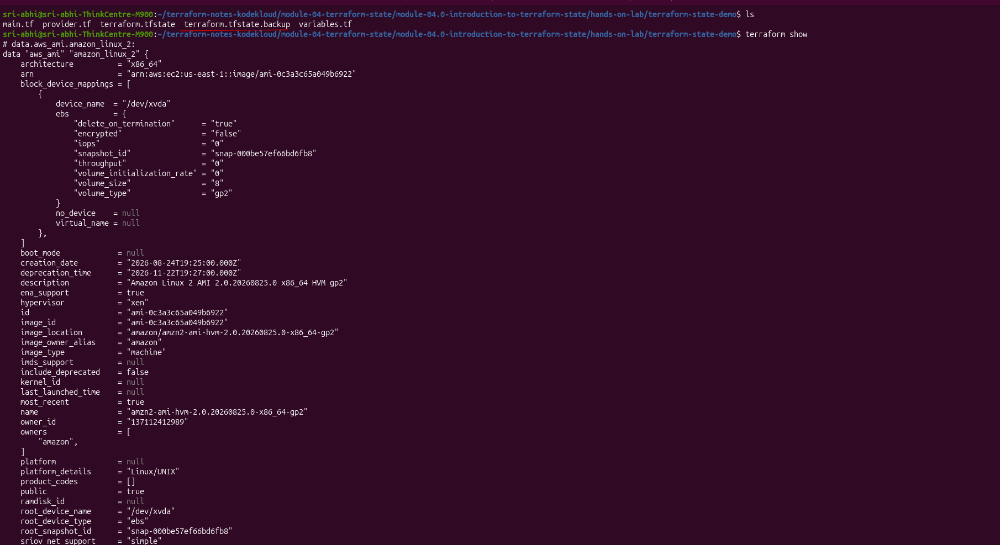

### Step 5: Compare Resource Types

```bash
echo "=== Resources in OLD State (backup) ==="
cat terraform.tfstate.backup | jq '.resources[] | .type' | sort | uniq

echo "=== Resources in NEW State (current) ==="
cat terraform.tfstate | jq '.resources[] | .type' | sort | uniq
```

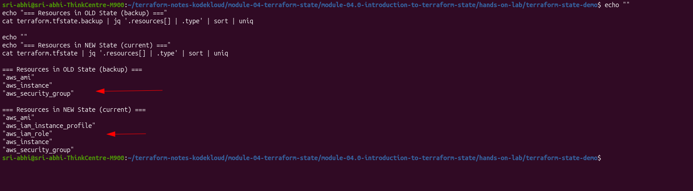

```
=== Resources in OLD State (backup) ===
"aws_ami"
"aws_instance"
"aws_security_group"

=== Resources in NEW State (current) ===
"aws_ami"
"aws_iam_instance_profile"
"aws_iam_role"
"aws_instance"
"aws_security_group"
```

Two new resource types (`aws_iam_role`, `aws_iam_instance_profile`), same three from before — no `aws_instance` entry was duplicated or replaced, confirming the in-place update.

### Step 6: Verify in the AWS Console

Cross-checking the state file against the actual console — the instance still shows the original id, now with the role attached. The security group column shows the *default* security group, not `web-security-group` — because we missed attaching the security group we defined in the config to the `aws_instance` block. Since we never told the instance which security group to use, AWS just fell back to the default one:

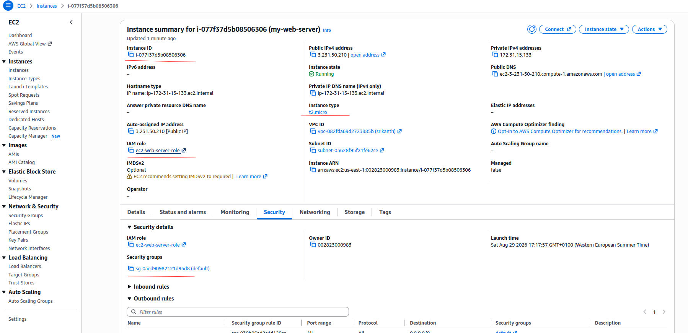


---

## Summary

**First apply — starting from nothing:**
1. No state file existed yet, so Terraform knew nothing about my AWS account.
2. I ran `apply`, and Terraform created 2 resources — the security group and the EC2 instance.
3. Terraform wrote `terraform.tfstate` for the first time, recording their real AWS ids (`sg-03ee8ffc10cd43d96`, `i-077f37d5b08506306`).

**Second apply — after adding the IAM role and instance profile:**
1. Terraform read the existing `terraform.tfstate` to see what already existed.
2. It compared that against my updated `main.tf`.
3. It created the 2 new resources — the IAM role and the instance profile.
4. It updated the existing EC2 instance in place to attach the new profile — same instance ID as before, nothing destroyed.
5. Terraform wrote the updated state file, and `serial` went up (`3` → `7`).

Without that state file, the second apply would have had no memory of the first one — Terraform would have tried to create everything again from scratch instead of just adding what was new.

---

## Key Concepts

| Term | Meaning |
|------|---------|
| **State File** | JSON record of your infrastructure (`terraform.tfstate`) |
| **Refresh** | Terraform checking real infrastructure against what's recorded in state |
| **Plan** | Shows what changes Terraform will make before it makes them |
| **Apply** | Creates, modifies, or destroys resources to match configuration |
| **Serial** | Counter incremented on every state write |
| **Lineage** | Unique id tracking one state file's history across backups |
| **Drift** | When real infrastructure differs from what's recorded in state |

---

## Cleanup

```bash
terraform destroy
```

Deletes the EC2 instance, security group, IAM role, and instance profile, and updates `terraform.tfstate` accordingly.

---

## Hands-On Lab

The [`hands-on-lab/terraform-state-demo/`](hands-on-lab/terraform-state-demo/) folder holds the runnable `.tf` files for both stages covered above, applied one after another in this single directory so they share one state file:

1. Starting config (security group + EC2 instance, AMI resolved via a `data "aws_ami"` lookup). Run `terraform init`, `terraform plan`, and `terraform apply` here first — the full walkthrough with screenshots is above.
2. Edit `main.tf` in place to add the IAM role and instance profile (this is the version currently checked into the folder), then `apply` again in the same directory to see Terraform update the existing EC2 instance in place and watch `serial` bump in the state file.

---

## Official Resources

- [Terraform State Documentation](https://www.terraform.io/language/state)
- [AWS Provider Documentation](https://registry.terraform.io/providers/hashicorp/aws/latest/docs)
- [Terraform CLI Reference](https://www.terraform.io/cli)
