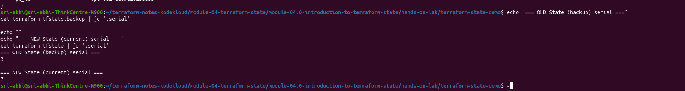
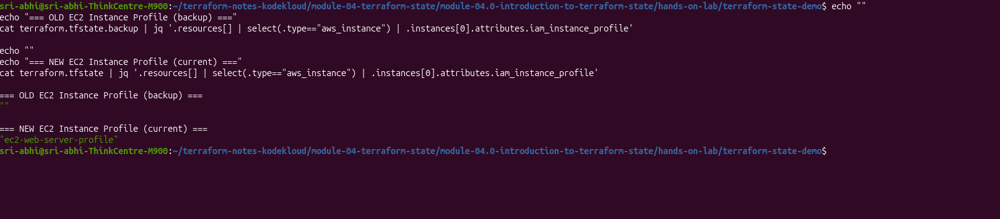
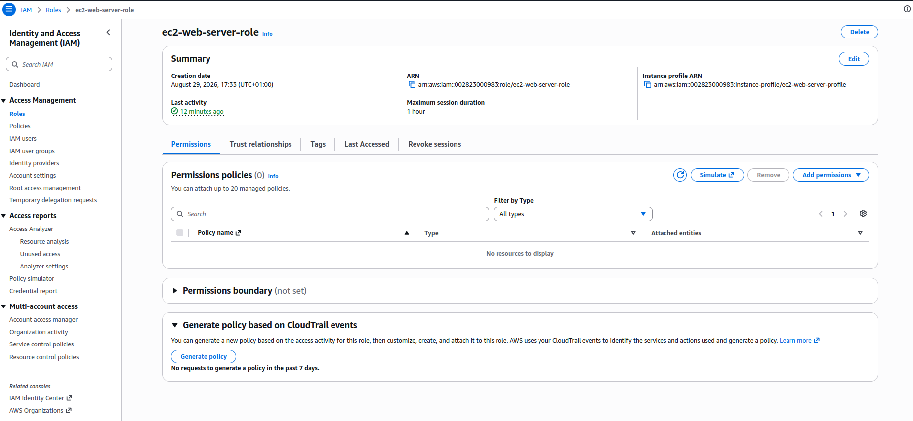

# Module 04.0: Introduction to Terraform State

> In this class we will learn Terraform state and state management, understanding how it tracks infrastructure changes and the significance of the state file in managing AWS resources.

In the hands-on lab below I create an EC2 instance and a security group, watch `terraform.tfstate` get created on the first apply, inspect it, then modify `main.tf` to attach an IAM instance profile to the running instance and apply again — watching the state file track that change too.

---

## What is Terraform State?

Terraform state is a record of all the infrastructure Terraform has created. It maps your real-world AWS resources to the resource definitions in your Terraform configuration files. Without state, Terraform wouldn't know which resources exist or how to update them.

**The state file serves as:**
- **Single source of truth** — the authoritative record of what Terraform actually created
- **Change detector** — compares real infrastructure against config on every plan/apply
- **Dependency tracker** — knows which resources depend on others
- **Performance optimizer** — avoids re-deriving everything from scratch on every run
- **Safety mechanism** — prevents Terraform from trying to create duplicates of resources that already exist

---

## Terraform Workflow Overview

My actual project directory, `terraform-state-demo`, starts out with just the three config files — no state yet:

```bash
$ ls terraform-state-demo
main.tf  provider.tf  variables.tf
```

The starting `main.tf` — a data source lookup for the latest Amazon Linux 2 AMI, one EC2 instance, and one security group:

```hcl
data "aws_ami" "amazon_linux_2" {
  most_recent = true
  owners      = ["amazon"]

  filter {
    name   = "name"
    values = ["amzn2-ami-hvm-*-x86_64-gp2"]
  }

  filter {
    name   = "virtualization-type"
    values = ["hvm"]
  }
}

resource "aws_instance" "web_server" {
  ami           = data.aws_ami.amazon_linux_2.id
  instance_type = var.instance_type

  tags = {
    Name = "my-web-server"
  }
}

resource "aws_security_group" "web_sg" {
  name        = "web-security-group"
  description = "Security group for web server"

  ingress {
    from_port   = 80
    to_port     = 80
    protocol    = "tcp"
    cidr_blocks = ["0.0.0.0/0"]
  }

  egress {
    from_port   = 0
    to_port     = 0
    protocol    = "-1"
    cidr_blocks = ["0.0.0.0/0"]
  }
}
```

> I used a `data "aws_ami"` lookup instead of a hardcoded AMI id. AWS deprecates old AMIs as newer ones get published, so a pinned id can quietly stop resolving in `us-east-1` — the plan/apply then fails with an invalid AMI error that has nothing to do with state. The lookup always resolves to whichever Amazon Linux 2 HVM/gp2 AMI is currently newest.

`variables.tf` just declares the instance type:

```hcl
variable "instance_type" {
  default = "t2.micro"
}
```

`provider.tf` pins the AWS provider and region:

```hcl
terraform {
  required_providers {
    aws = {
      source  = "hashicorp/aws"
      version = "~> 5.0"
    }
  }
}

provider "aws" {
  region = "us-east-1"
}
```

My actual lab directory — [`hands-on-lab/terraform-state-demo/`](hands-on-lab/terraform-state-demo/) — with these three files:


At this stage, no AWS resources have been created yet.

---

## Hands-On Lab: Creating Infrastructure

### Step 1: Initialize Terraform

```bash
$ cat variables.tf
$ terraform init
```

`terraform init` downloads the AWS provider plugin and sets up the working directory:


### Step 2: Plan the Infrastructure

```bash
$ terraform plan
```

Because the AMI is a data source, Terraform reads it first — `data.aws_ami.amazon_linux_2: Reading...` — before it can show what the instance will look like, since the resolved AMI id feeds into the instance's `ami` attribute:


```
Plan: 2 to add, 0 to change, 0 to destroy.
```

Since no state file exists yet, Terraform knows both resources are new.

### Step 3: Apply the Configuration

```bash
$ terraform apply
```

I confirmed with `yes` at the prompt:


```
aws_security_group.web_sg: Creating...
aws_instance.web_server: Creating...
aws_security_group.web_sg: Creation complete after 5s [id=sg-03ee8ffc10cd43d96]
aws_instance.web_server: Still creating... [00m10s elapsed]
aws_instance.web_server: Creation complete after 15s [id=i-077f37d5b08506306]

Apply complete! Resources: 2 added, 0 changed, 0 destroyed.
```

Upon confirmation, Terraform:
- Created the security group: `sg-03ee8ffc10cd43d96`
- Created the EC2 instance: `i-077f37d5b08506306`
- Wrote `terraform.tfstate` for the first time

> **Real gotcha I noticed:** `aws_security_group.web_sg` gets created, but `aws_instance.web_server` never actually references it — there's no `vpc_security_group_ids` or `security_groups` argument on the instance. So the security group exists in AWS and in state, but the instance just falls back to the VPC's **default** security group instead. I confirmed this later in the state file — the instance's `vpc_security_group_ids` is a completely different id (`sg-0aed90982121d95d8`, the default SG) than `web_sg`'s own id (`sg-03ee8ffc10cd43d96`). Terraform doesn't warn about this — an unreferenced resource is still a perfectly valid plan. This is a config bug, not a state bug, but it's the kind of thing that's easy to miss unless you cross-check the state file against what you actually intended.

### Step 4: Verify the State File Appeared

```bash
$ ls
main.tf  provider.tf  terraform.tfstate  terraform.tfstate.backup  variables.tf
```

`terraform.tfstate.backup` shows up too — a copy of state from just before the most recent apply.


---

## Understanding State Files

Inspecting `terraform.tfstate` after the first apply (`cat terraform.tfstate | jq .`) shows a detailed record of the infrastructure — the AMI data source, both resources, their real AWS ids and attributes:

```json
{
  "version": 4,
  "terraform_version": "1.15.8",
  "serial": 3,
  "lineage": "0fee184e-8d23-b4b9-90c0-46f92dbbbb35",
  "resources": [
    {
      "mode": "data",
      "type": "aws_ami",
      "name": "amazon_linux_2",
      "instances": [
        { "attributes": { "id": "ami-0c3a3c65a049b6922", "architecture": "x86_64" } }
      ]
    },
    {
      "mode": "managed",
      "type": "aws_security_group",
      "name": "web_sg",
      "instances": [
        { "attributes": { "id": "sg-03ee8ffc10cd43d96", "name": "web-security-group" } }
      ]
    },
    {
      "mode": "managed",
      "type": "aws_instance",
      "name": "web_server",
      "instances": [
        {
          "attributes": {
            "id": "i-077f37d5b08506306",
            "instance_type": "t2.micro",
            "private_ip": "172.31.15.133",
            "public_ip": "3.231.50.210",
            "iam_instance_profile": ""
          }
        }
      ]
    }
  ]
}
```

| Field | Meaning |
|-------|---------|
| **version** | Terraform state format version |
| **terraform_version** | Terraform CLI version that wrote this state — `1.15.8` |
| **serial** | Version counter, incremented on every write — mine landed on `3` after a couple of plan/apply iterations |
| **lineage** | Unique id tracking this state file across backups |
| **resources** | Every data source and managed resource — data sources included, tagged `"mode": "data"` |

The `data.aws_ami.amazon_linux_2` entry is recorded the same way as the managed resources, just tagged `"mode": "data"` instead of `"mode": "managed"`. That's also why a data source shows `Reading...` on every subsequent plan/apply rather than just `Refreshing state...` — unlike a managed resource, it re-resolves from AWS each run instead of only checking that what's in state still exists.

`terraform.tfstate.backup` holds the state from just before the most recent write — one `serial` behind the current file. This is the single source of truth Terraform consults on every `plan`/`apply` to decide what, if anything, needs to change.

---

## Hands-On Lab: Modifying Infrastructure

### Step 1: Add an IAM Role and Instance Profile

I edited `main.tf` in place, in the same directory I already applied — so the existing state file is what gets refreshed and updated, not a fresh one. I added an IAM role, an instance profile, and wired the profile into the instance:

```hcl
data "aws_ami" "amazon_linux_2" {
  most_recent = true
  owners      = ["amazon"]

  filter {
    name   = "name"
    values = ["amzn2-ami-hvm-*-x86_64-gp2"]
  }

  filter {
    name   = "virtualization-type"
    values = ["hvm"]
  }
}

# NEW: IAM Role
resource "aws_iam_role" "ec2_role" {
  name = "ec2-web-server-role"

  assume_role_policy = jsonencode({
    Version = "2012-10-17"
    Statement = [
      {
        Action = "sts:AssumeRole"
        Effect = "Allow"
        Principal = {
          Service = "ec2.amazonaws.com"
        }
      }
    ]
  })
}

# NEW: Instance Profile
resource "aws_iam_instance_profile" "ec2_profile" {
  name = "ec2-web-server-profile"
  role = aws_iam_role.ec2_role.name
}

resource "aws_security_group" "web_sg" {
  name        = "web-security-group"
  description = "Security group for web server"

  ingress {
    from_port   = 80
    to_port     = 80
    protocol    = "tcp"
    cidr_blocks = ["0.0.0.0/0"]
  }

  egress {
    from_port   = 0
    to_port     = 0
    protocol    = "-1"
    cidr_blocks = ["0.0.0.0/0"]
  }
}

# MODIFIED: Added iam_instance_profile
resource "aws_instance" "web_server" {
  ami                  = data.aws_ami.amazon_linux_2.id
  instance_type        = var.instance_type
  iam_instance_profile = aws_iam_instance_profile.ec2_profile.name  # ADDED THIS!

  tags = {
    Name = "my-web-server"
  }
}
```


### Step 2: Run terraform plan

```bash
$ terraform plan
```

Terraform refreshes the security group and instance state first, then works out the diff:


The interesting part is what it decides to do with the *existing* instance:


```
# aws_iam_instance_profile.ec2_profile will be created
# aws_iam_role.ec2_role will be created

# aws_instance.web_server will be updated in-place
~ resource "aws_instance" "web_server" {
    + iam_instance_profile = "ec2-web-server-profile"
      id                   = "i-077f37d5b08506306"
      tags                 = { "Name" = "my-web-server" }
      # (38 unchanged attributes hidden)
      # (8 unchanged blocks hidden)
  }

Plan: 2 to add, 1 to change, 0 to destroy.
```

**This surprised me.** A lot of Terraform material (including my own earlier draft of these notes) says attaching `iam_instance_profile` to an already-running instance forces a replacement, because it can't be set on a live instance. That's not what actually happened here — Terraform shows `~ update in-place`, not `-/+ replace`, and the plan is `2 to add, 1 to change, 0 to destroy` with zero destructions. The current AWS provider evidently supports attaching an instance profile to a running instance via the `associate-iam-instance-profile` API instead of forcing a recreate. Worth remembering: whether an attribute forces replacement depends on the provider version, not just general Terraform lore — always read the actual plan output rather than assuming.

### Step 3: Apply the Change

```bash
$ terraform apply
```

I confirmed with `yes` again:


```
aws_iam_role.ec2_role: Creating...
aws_iam_role.ec2_role: Creation complete after 1s [id=ec2-web-server-role]
aws_iam_instance_profile.ec2_profile: Creating...
aws_iam_instance_profile.ec2_profile: Creation complete after 7s [id=ec2-web-server-profile]
aws_instance.web_server: Modifying... [id=i-077f37d5b08506306]
aws_instance.web_server: Still modifying... [id=i-077f37d5b08506306, 00m10s elapsed]
aws_instance.web_server: Modifications complete after 16s [id=i-077f37d5b08506306]

Apply complete! Resources: 2 added, 1 changed, 0 destroyed.
```

What happened:
- IAM role created: `ec2-web-server-role`
- Instance profile created: `ec2-web-server-profile`
- The **same** EC2 instance, `i-077f37d5b08506306`, was modified in place — no destroy, no new instance id

### Step 4: Verify the State File Was Updated

```bash
$ ls
main.tf  provider.tf  terraform.tfstate  terraform.tfstate.backup  variables.tf

$ terraform show
```


### Step 5: Compare Backup vs. Current State

```bash
echo "=== OLD State (backup) serial ==="
cat terraform.tfstate.backup | jq '.serial'

echo "=== NEW State (current) serial ==="
cat terraform.tfstate | jq '.serial'
```



```
=== OLD State (backup) serial ===
3

=== NEW State (current) serial ===
7
```

`serial` jumped from `3` to `7`, not `1` to `2` — every `plan` refresh and every `apply` I ran while iterating on this lab bumped it, not just the one "real" change.

### Step 6: Compare the EC2 Instance's IAM Profile

```bash
echo "=== OLD EC2 Instance Profile (backup) ==="
cat terraform.tfstate.backup | jq '.resources[] | select(.type=="aws_instance") | .instances[0].attributes.iam_instance_profile'

echo "=== NEW EC2 Instance Profile (current) ==="
cat terraform.tfstate | jq '.resources[] | select(.type=="aws_instance") | .instances[0].attributes.iam_instance_profile'
```



```
=== OLD EC2 Instance Profile (backup) ===
""

=== NEW EC2 Instance Profile (current) ===
"ec2-web-server-profile"
```

Same instance id in both files (`i-077f37d5b08506306`) — only the `iam_instance_profile` attribute changed.

### Step 7: Compare Resource Types

```bash
echo "=== Resources in OLD State (backup) ==="
cat terraform.tfstate.backup | jq '.resources[] | .type' | sort | uniq

echo "=== Resources in NEW State (current) ==="
cat terraform.tfstate | jq '.resources[] | .type' | sort | uniq
```


```
=== Resources in OLD State (backup) ===
"aws_ami"
"aws_instance"
"aws_security_group"

=== Resources in NEW State (current) ===
"aws_ami"
"aws_iam_instance_profile"
"aws_iam_role"
"aws_instance"
"aws_security_group"
```

Two new resource types (`aws_iam_role`, `aws_iam_instance_profile`), same three from before — no `aws_instance` entry was duplicated or replaced, confirming the in-place update.

### Step 8: Verify in the AWS Console

Cross-checking the state file against the actual console — the instance still shows the original id, now with the role attached, and (as noted above) the *default* security group rather than `web-security-group`:




---

## How State Management Worked Here

```
1. Terraform read terraform.tfstate.backup
   └─ Found: EC2 instance i-077f37d5b08506306, iam_instance_profile = ""

2. Terraform read the updated main.tf
   └─ Saw: aws_instance.web_server should have iam_instance_profile = "ec2-web-server-profile"

3. Terraform compared old state vs. new config
   └─ Determined the AWS provider can attach this via an in-place API call
   └─ No replacement needed — unlike some other forces-replacement attributes (AMI, subnet)

4. Terraform built the plan
   └─ 2 to add (role, profile), 1 to change (instance), 0 to destroy

5. I approved with "yes"

6. Terraform executed
   └─ Created the role and profile
   └─ Modified the existing instance in place
   └─ Wrote the updated state, serial incremented
```

### Changes Comparison Table

| Item | Backup (before) | Current (after) | Changed? |
|------|------------------|------------------|----------|
| **serial** | 3 | 7 | incremented |
| **aws_ami** | `ami-0c3a3c65a049b6922` | `ami-0c3a3c65a049b6922` | unchanged |
| **aws_security_group** | `sg-03ee8ffc10cd43d96` | `sg-03ee8ffc10cd43d96` | unchanged |
| **aws_iam_role** | missing | `ec2-web-server-role` | new |
| **aws_iam_instance_profile** | missing | `ec2-web-server-profile` | new |
| **aws_instance id** | `i-077f37d5b08506306` | `i-077f37d5b08506306` | **same** — updated in place |
| **iam_instance_profile** | `""` (empty) | `"ec2-web-server-profile"` | now attached |

---

## Why State File Is Crucial

**Without a state file**, re-running `apply` after adding the IAM resources would have had no way to know the security group and instance already exist — it would try to create all five resources from scratch and AWS would reject the duplicate security group name.

**With the state file**, Terraform:
- Knew exactly what already existed (3 resources)
- Compared that against the new config (5 resources)
- Worked out precisely what was new (2) vs. what needed changing (1) vs. what was already correct
- Updated only the instance's `iam_instance_profile`, leaving everything else alone
- Recorded the new resource ids and bumped `serial`

That's the whole point of state: without it, Terraform is blind to what it already built.

---

## Key Lab Observations

1. **The state file only appears after the first apply.** Before it, there's no `terraform.tfstate` — Terraform only has the config and whatever it can read live from AWS.
2. **State records real AWS ids, not placeholders.** Security group `sg-03ee8ffc10cd43d96`, instance `i-077f37d5b08506306`, its actual IPs — these become the source of truth once written.
3. **Data sources live in state too.** `data.aws_ami.amazon_linux_2` is stored in the same shape as a managed resource, just tagged `"mode": "data"`.
4. **Not every attribute change forces a replacement.** `iam_instance_profile` updated in place here — the provider supports attaching it live. Attributes like the AMI or subnet id generally still force a rebuild. Trust the plan output over general rules of thumb.
5. **A resource that exists in state isn't necessarily wired up in config.** `aws_security_group.web_sg` was created and tracked in state, but the instance never referenced it, so it silently used the VPC default security group instead. State tracks what Terraform manages — it doesn't validate that your resources are actually connected the way you intended.
6. **`terraform.tfstate.backup` is your one-step-back safety net.** It's the state from immediately before the last write, letting you diff exactly what one apply changed.

### Cleanup

```bash
terraform destroy
```

Deletes the EC2 instance, security group, IAM role, and instance profile, and updates `terraform.tfstate` accordingly.

---

## Key Concepts

| Term | Meaning |
|------|---------|
| **State File** | JSON record of your infrastructure (`terraform.tfstate`) |
| **Refresh** | Terraform checking real infrastructure against what's recorded in state |
| **Plan** | Shows what changes Terraform will make before it makes them |
| **Apply** | Creates, modifies, or destroys resources to match configuration |
| **Serial** | Counter incremented on every state write |
| **Lineage** | Unique id tracking one state file's history across backups |
| **Drift** | When real infrastructure differs from what's recorded in state |

---

## Summary

This lesson walked through how Terraform leverages a state file — created on the first successful apply — to track and manage real AWS infrastructure. The first apply created two resources and wrote `terraform.tfstate` for the first time. Editing `main.tf` to add an IAM role and instance profile, then applying again, showed Terraform read the existing state, compared it to the new config, and made exactly the changes needed: two new resources created, one existing resource updated in place, nothing destroyed. Comparing `terraform.tfstate.backup` against the new `terraform.tfstate` (serial `3` → `7`) made that diff concrete — same instance id throughout, just a new attribute recorded.

The state file is what let Terraform do this precisely instead of guessing: without it, every apply would be a blind re-creation attempt.

---

## Hands-On Lab

The [`hands-on-lab/terraform-state-demo/`](hands-on-lab/terraform-state-demo/) folder holds the runnable `.tf` files for both stages covered above, applied one after another in this single directory so they share one state file:

1. Starting config (security group + EC2 instance, AMI resolved via a `data "aws_ami"` lookup). Run `terraform init`, `terraform plan`, and `terraform apply` here first — the full walkthrough with screenshots is above.
2. Edit `main.tf` in place to add the IAM role and instance profile (this is the version currently checked into the folder), then `apply` again in the same directory to see Terraform update the existing EC2 instance in place and watch `serial` bump in the state file.

---

## Official Resources

- [Terraform State Documentation](https://www.terraform.io/language/state)
- [AWS Provider Documentation](https://registry.terraform.io/providers/hashicorp/aws/latest/docs)
- [Terraform CLI Reference](https://www.terraform.io/cli)
