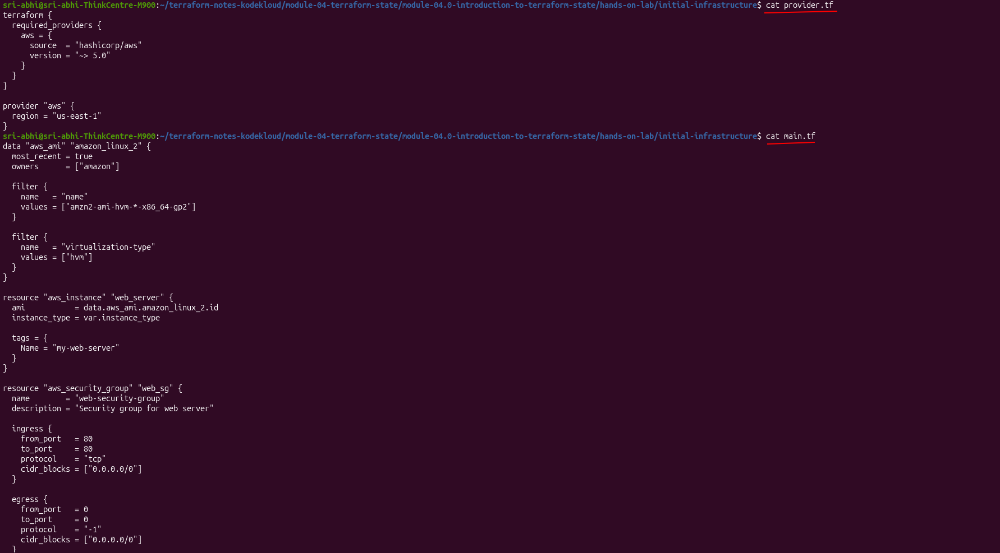
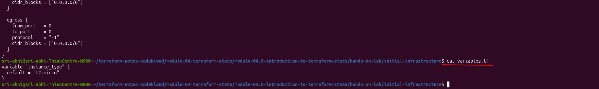
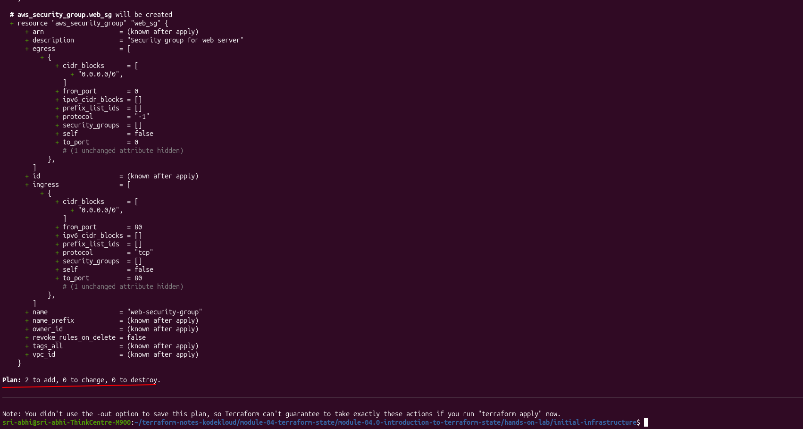
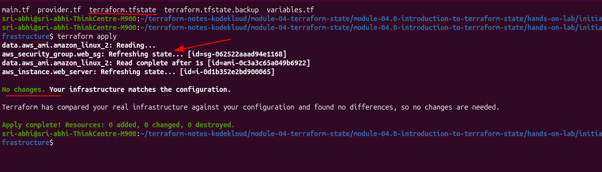
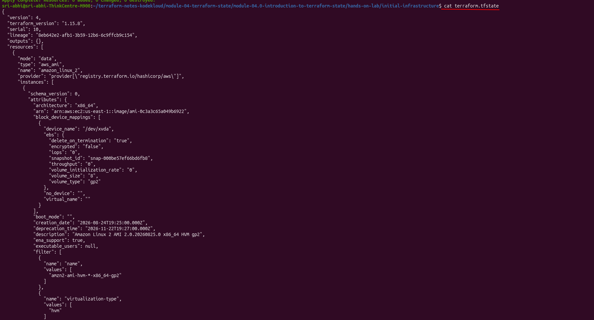

# Module 04.0: Introduction to Terraform State

> In this class we will learn Terraform state and state management, understanding how it tracks infrastructure changes and the significance of the state file in managing AWS resources.

In the hands-on lab below I create an EC2 instance and a security group, watch `terraform.tfstate` get created on the first apply, inspect it, then run `apply` a second time to see state management in action — Terraform refreshes state, compares it to my config, and makes no changes.

---

## What is Terraform State?

Terraform state is a record of all the infrastructure Terraform has created. It maps your real-world AWS resources to the resource definitions in your Terraform configuration files. Without state, Terraform wouldn't know which resources exist or how to update them.

---

## Terraform Workflow Overview

My actual project directory, `terraform-state-demo`, contains the following files:

```bash
$ ls terraform-state-demo
main.tf  variables.tf  provider.tf
```

The primary Terraform configuration is defined in `main.tf`:

```hcl
data "aws_ami" "amazon_linux_2" {
  most_recent = true
  owners      = ["amazon"]

  filter {
    name   = "name"
    values = ["amzn2-ami-hvm-*-x86_64-gp2"]
  }

  filter {
    name   = "virtualization-type"
    values = ["hvm"]
  }
}

resource "aws_instance" "web_server" {
  ami           = data.aws_ami.amazon_linux_2.id
  instance_type = var.instance_type

  tags = {
    Name = "my-web-server"
  }
}

resource "aws_security_group" "web_sg" {
  name        = "web-security-group"
  description = "Security group for web server"

  ingress {
    from_port   = 80
    to_port     = 80
    protocol    = "tcp"
    cidr_blocks = ["0.0.0.0/0"]
  }

  egress {
    from_port   = 0
    to_port     = 0
    protocol    = "-1"
    cidr_blocks = ["0.0.0.0/0"]
  }
}
```

The variables are declared in `variables.tf`:

```hcl
variable "instance_type" {
  default = "t2.micro"
}
```

> I originally hardcoded the AMI with `variable "ami_id" { default = "ami-0c55b159cbfafe1f0" }` and referenced it as `var.ami_id`. AWS deprecates old AMIs as newer ones get published, so a pinned ID like that can quietly stop resolving in `us-east-1` — the plan/apply then fails with an invalid AMI error that has nothing to do with state. I replaced it with the `data "aws_ami" "amazon_linux_2"` lookup above, which always resolves to whichever Amazon Linux 2 HVM/gp2 AMI is currently newest.

The AWS provider is configured in `provider.tf`:

```hcl
terraform {
  required_providers {
    aws = {
      source  = "hashicorp/aws"
      version = "~> 5.0"
    }
  }
}

provider "aws" {
  region = "us-east-1"
}
```

Here's my actual lab directory — [`hands-on-lab/terraform-state-demo/`](hands-on-lab/terraform-state-demo/) — with these three files:




At this stage, no AWS resources have been created yet.

---

## Initializing and Running Terraform Plan

Before provisioning any resources, initialize Terraform by executing the `terraform init` command. This downloads the necessary AWS provider plugin. Next, generate an execution plan with the `terraform plan` command.

Because the AMI is a data source, Terraform reads it first — `data.aws_ami.amazon_linux_2: Reading...` — before it can even show what the instance will look like, since the AMI id feeds into the instance's `ami` attribute. Here's the actual output from my run:

```bash
$ terraform plan
data.aws_ami.amazon_linux_2: Reading...
data.aws_ami.amazon_linux_2: Read complete after 1s [id=ami-0c3a3c65a049b6922]

Terraform used the selected providers to generate the following execution plan.
Resource actions are indicated with the following symbols:
  + create

Terraform will perform the following actions:

  # aws_security_group.web_sg will be created
  + resource "aws_security_group" "web_sg" {
      + arn                    = (known after apply)
      + description            = "Security group for web server"
      + egress                 = [
          + {
              + cidr_blocks      = [
                  + "0.0.0.0/0",
                ]
              + from_port        = 0
              + protocol         = "-1"
              + to_port          = 0
            },
        ]
      + id                     = (known after apply)
      + ingress                = [
          + {
              + cidr_blocks      = [
                  + "0.0.0.0/0",
                ]
              + from_port        = 80
              + protocol         = "tcp"
              + to_port          = 80
            },
        ]
      + name                   = "web-security-group"
      + owner_id               = (known after apply)
      + vpc_id                 = (known after apply)
    }

  # aws_instance.web_server will be created
  + resource "aws_instance" "web_server" {
      + ami                    = "ami-0c3a3c65a049b6922"
      + availability_zone      = (known after apply)
      + id                     = (known after apply)
      + instance_state         = (known after apply)
      + instance_type          = "t2.micro"
      + private_ip             = (known after apply)
      + public_ip              = (known after apply)
      + tags                   = {
          + "Name" = "my-web-server"
        }
    }

Plan: 2 to add, 0 to change, 0 to destroy.
```




Since the state file does not yet exist, Terraform understands that all resources defined in the configuration will be newly created.

---

## Applying the Terraform Configuration

To apply the configuration, run the `terraform apply` command. Terraform shows the same plan, re-reading the AMI data source first, then prompts for confirmation:

```bash
$ terraform apply
data.aws_ami.amazon_linux_2: Reading...
data.aws_ami.amazon_linux_2: Read complete after 1s [id=ami-0c3a3c65a049b6922]

Terraform will perform the following actions:

  # aws_security_group.web_sg will be created
  + resource "aws_security_group" "web_sg" { ... }

  # aws_instance.web_server will be created
  + resource "aws_instance" "web_server" { ... }

Plan: 2 to add, 0 to change, 0 to destroy.

Do you want to perform these actions?
  Terraform will perform the actions described above.
  Only 'yes' will be accepted to approve.

Enter a value: yes

aws_security_group.web_sg: Creating...
aws_instance.web_server: Creating...
aws_security_group.web_sg: Creation complete after 5s [id=sg-062522aaad94e1168]
aws_instance.web_server: Still creating... [00m10s elapsed]
aws_instance.web_server: Creation complete after 16s [id=i-0d1b352e2bd900065]

Apply complete! Resources: 2 added, 0 changed, 0 destroyed.
```


Upon confirmation, Terraform:

- Creates the security group: `sg-062522aaad94e1168`
- Creates the EC2 instance: `i-0d1b352e2bd900065`
- Writes `terraform.tfstate` for the first time
- Writes `terraform.tfstate.backup` alongside it

Now for the key moment of the lab — running `terraform apply` again, with nothing changed in the config:

```bash
$ terraform apply
data.aws_ami.amazon_linux_2: Reading...
aws_security_group.web_sg: Refreshing state... [id=sg-062522aaad94e1168]
data.aws_ami.amazon_linux_2: Read complete after 1s [id=ami-0c3a3c65a049b6922]
aws_instance.web_server: Refreshing state... [id=i-0d1b352e2bd900065]

No changes. Your infrastructure matches the configuration.
Terraform has compared your real infrastructure against your configuration and found no differences, so no changes are needed.

Apply complete! Resources: 0 added, 0 changed, 0 destroyed.
```



Terraform re-read the AMI data source, refreshed both resources from AWS, compared everything against my config, and made zero changes. First apply: "Plan: 2 to add." Second apply: "0 added, 0 changed, 0 destroyed." That's state doing its job — without `terraform.tfstate` telling Terraform these resources already exist, it would have no way to know that and could try to create duplicates.

---

## The Terraform State File

After the initial successful `terraform apply`, an additional file named `terraform.tfstate` is created in the project directory, along with `terraform.tfstate.backup` (a copy of the previous state). The directory now looks like:

```bash
$ ls
main.tf  provider.tf  terraform.tfstate  terraform.tfstate.backup  variables.tf
```

Inspecting `terraform.tfstate` reveals a detailed record of the infrastructure, including the AMI data source, resource IDs, and resource attributes:

```json
{
  "version": 4,
  "terraform_version": "1.15.8",
  "serial": 10,
  "lineage": "8eb642e2-afb1-3b59-12b6-6c9ffcb9c154",
  "outputs": {},
  "resources": [
    {
      "mode": "data",
      "type": "aws_ami",
      "name": "amazon_linux_2",
      "provider": "provider[\"registry.terraform.io/hashicorp/aws\"]",
      "instances": [
        {
          "schema_version": 0,
          "attributes": {
            "id": "ami-0c3a3c65a049b6922",
            "description": "Amazon Linux 2 AMI 2.0.20260825.0 x86_64 HVM gp2",
            "architecture": "x86_64",
            "owner_id": "137112412989"
          }
        }
      ]
    },
    {
      "mode": "managed",
      "type": "aws_security_group",
      "name": "web_sg",
      "provider": "provider[\"registry.terraform.io/hashicorp/aws\"]",
      "instances": [
        {
          "schema_version": 1,
          "attributes": {
            "arn": "arn:aws:ec2:us-east-1:123456789:security-group/sg-062522aaad94e1168",
            "description": "Security group for web server",
            "egress": [
              { "cidr_blocks": ["0.0.0.0/0"], "from_port": 0, "protocol": "-1", "to_port": 0 }
            ],
            "id": "sg-062522aaad94e1168",
            "ingress": [
              { "cidr_blocks": ["0.0.0.0/0"], "from_port": 80, "protocol": "tcp", "to_port": 80 }
            ],
            "name": "web-security-group",
            "tags": { "Name": "web-security-group" },
            "vpc_id": "vpc-082fda69d2723885b"
          }
        }
      ]
    },
    {
      "mode": "managed",
      "type": "aws_instance",
      "name": "web_server",
      "provider": "provider[\"registry.terraform.io/hashicorp/aws\"]",
      "instances": [
        {
          "schema_version": 1,
          "attributes": {
            "ami": "ami-0c3a3c65a049b6922",
            "arn": "arn:aws:ec2:us-east-1:123456789:instance/i-0d1b352e2bd900065",
            "availability_zone": "us-east-1a",
            "id": "i-0d1b352e2bd900065",
            "instance_state": "running",
            "instance_type": "t2.micro",
            "private_ip": "172.31.2.35",
            "public_ip": "34.205.48.246",
            "public_dns": "ec2-34-205-48-246.compute-1.amazonaws.com",
            "vpc_security_group_ids": ["sg-062522aaad94e1168"],
            "tags": { "Name": "my-web-server" }
          }
        }
      ]
    }
  ]
}
```



| Field | Meaning |
|-------|---------|
| **version** | Terraform state format version |
| **terraform_version** | Terraform CLI version that created this state |
| **serial** | Version number, incremented on each change — mine reached `10` after re-running plan/apply a few times while iterating on this lab |
| **lineage** | Unique ID tracking this state across backups |
| **resources** | Every data source and managed resource — data sources included |

The `data.aws_ami.amazon_linux_2` entry is recorded the same way as the managed resources — just tagged `"mode": "data"` instead of `"mode": "managed"`. That's also why a data source shows `Reading...` on every subsequent `plan`/`apply` rather than just `Refreshing state...`: unlike a managed resource, it re-resolves from AWS each run instead of only checking that what's in state still exists.

`terraform.tfstate.backup` holds the state from just before the most recent apply (`serial` one lower than the current file):

```bash
$ cat terraform.tfstate.backup
```


This state file is the single source of truth for Terraform. It is used during subsequent commands like `terraform plan` and `terraform apply` to determine if any changes to the infrastructure are required.

---

## Key Lab Observations

**1. The state file only appears after the first apply.** Before it, there's no `terraform.tfstate` — Terraform only has the config and whatever it can read live from AWS.

**2. State records real AWS ids, not placeholders.** Security group `sg-062522aaad94e1168`, instance `i-0d1b352e2bd900065`, its actual IPs — these become the source of truth once written.

**3. Data sources live in state too.** `data.aws_ami.amazon_linux_2` is stored in the same shape as a managed resource, just tagged `"mode": "data"`.

**4. Second apply = no changes.** First apply: 2 to add. Second: 0 added, 0 changed, 0 destroyed, because state already matched config.

**5. Every apply refreshes state first.** `Refreshing state...` on the security group and instance is Terraform re-checking with AWS that what's in `terraform.tfstate` still matches reality before deciding what (if anything) to change.

### Cleanup

```bash
terraform destroy
```

Deletes the EC2 instance and security group, updates `terraform.tfstate`, and keeps `terraform.tfstate.backup` around. I noted the resource ids above before tearing this down, in case I wanted to cross-check them against the AWS console.

---

## Updating the Configuration

Consider updating the configuration in `main.tf` to add an IAM role for the EC2 instance. I make this change in place, in the same [`hands-on-lab/terraform-state-demo/`](hands-on-lab/terraform-state-demo/) directory I already applied above — so the existing state file is what gets refreshed and updated, not a fresh one.

```hcl
data "aws_ami" "amazon_linux_2" {
  most_recent = true
  owners      = ["amazon"]

  filter {
    name   = "name"
    values = ["amzn2-ami-hvm-*-x86_64-gp2"]
  }

  filter {
    name   = "virtualization-type"
    values = ["hvm"]
  }
}

resource "aws_iam_role" "ec2_role" {
  name = "ec2-web-server-role"

  assume_role_policy = jsonencode({
    Version = "2012-10-17"
    Statement = [
      {
        Action = "sts:AssumeRole"
        Effect = "Allow"
        Principal = {
          Service = "ec2.amazonaws.com"
        }
      }
    ]
  })
}

resource "aws_iam_instance_profile" "ec2_profile" {
  name = "ec2-web-server-profile"
  role = aws_iam_role.ec2_role.name
}

resource "aws_instance" "web_server" {
  ami                  = data.aws_ami.amazon_linux_2.id
  instance_type        = var.instance_type
  iam_instance_profile = aws_iam_instance_profile.ec2_profile.name

  tags = {
    Name = "my-web-server"
  }
}
```

After this change, running `terraform apply` causes Terraform to refresh the state and detect a difference between the new configuration and the existing state. Consequently, Terraform decides the instance must be replaced:

```bash
$ terraform apply
data.aws_ami.amazon_linux_2: Reading...
aws_security_group.web_sg: Refreshing state... [id=sg-0987654321fedcba0]
data.aws_ami.amazon_linux_2: Read complete after 1s [id=ami-0c3a3c65a049b6922]
aws_instance.web_server: Refreshing state... [id=i-0c55b159cbfafe1f0]
aws_iam_role.ec2_role: Creating...
aws_iam_role.ec2_role: Creation complete after 1s [id=ec2-web-server-role]
aws_iam_instance_profile.ec2_profile: Creating...
aws_iam_instance_profile.ec2_profile: Creation complete after 1s [id=ec2-web-server-profile]

Terraform will perform the following actions:

  # aws_instance.web_server must be replaced
  -/+ resource "aws_instance" "web_server" {
        ami                   = "ami-0c3a3c65a049b6922"
        instance_type         = "t2.micro"
      ~ id                    = "i-0c55b159cbfafe1f0" -> (known after apply)
      + iam_instance_profile  = "ec2-web-server-profile" # forces replacement
        tags = {
            "Name" = "my-web-server"
          }
      }

Do you want to perform these actions?
  Terraform will perform the actions described above.
  Only 'yes' will be accepted to approve.

Enter a value: yes

aws_instance.web_server: Destroying... [id=i-0c55b159cbfafe1f0]
aws_instance.web_server: Destruction complete after 3s
aws_instance.web_server: Creating...
aws_instance.web_server: Creation complete after 30s [id=i-1a2b3c4d5e6f7g8h9]

Apply complete! Resources: 3 added, 0 changed, 1 destroyed.
```

After applying these changes, Terraform deletes the old instance and creates a new one with a different unique ID. The updated `terraform.tfstate` now reflects the new state with the AMI data source, IAM role, and instance profile:

```json
{
  "version": 4,
  "terraform_version": "1.5.0",
  "serial": 2,
  "lineage": "e35dde72-a943-de50-3c8b-1df8986e5a31",
  "outputs": {},
  "resources": [
    {
      "mode": "data",
      "type": "aws_ami",
      "name": "amazon_linux_2",
      "provider": "provider[\"registry.terraform.io/hashicorp/aws\"]",
      "instances": [
        {
          "schema_version": 0,
          "attributes": {
            "id": "ami-0c3a3c65a049b6922",
            "architecture": "x86_64",
            "owner_id": "137112412989"
          }
        }
      ]
    },
    {
      "mode": "managed",
      "type": "aws_iam_role",
      "name": "ec2_role",
      "provider": "provider[\"registry.terraform.io/hashicorp/aws\"]",
      "instances": [
        {
          "schema_version": 0,
          "attributes": {
            "arn": "arn:aws:iam::123456789:role/ec2-web-server-role",
            "id": "ec2-web-server-role",
            "name": "ec2-web-server-role"
          }
        }
      ]
    },
    {
      "mode": "managed",
      "type": "aws_iam_instance_profile",
      "name": "ec2_profile",
      "provider": "provider[\"registry.terraform.io/hashicorp/aws\"]",
      "instances": [
        {
          "schema_version": 0,
          "attributes": {
            "arn": "arn:aws:iam::123456789:instance-profile/ec2-web-server-profile",
            "id": "ec2-web-server-profile",
            "name": "ec2-web-server-profile",
            "role": "ec2-web-server-role"
          }
        }
      ]
    },
    {
      "mode": "managed",
      "type": "aws_instance",
      "name": "web_server",
      "provider": "provider[\"registry.terraform.io/hashicorp/aws\"]",
      "instances": [
        {
          "schema_version": 1,
          "attributes": {
            "ami": "ami-0c3a3c65a049b6922",
            "id": "i-1a2b3c4d5e6f7g8h9",
            "iam_instance_profile": "ec2-web-server-profile",
            "instance_type": "t2.micro",
            "private_ip": "10.0.1.55",
            "public_ip": "54.234.12.34",
            "tags": {
              "Name": "my-web-server"
            }
          }
        }
      ]
    }
  ]
}
```

Now that the configuration file and the state file are in sync, any subsequent runs of `terraform apply` will report that no changes are necessary.

---

## Understanding State Importance

The state file serves critical purposes:

✅ **Resource Tracking** — Knows which resources exist in AWS
✅ **Change Detection** — Identifies what needs to be created, modified, or destroyed
✅ **Dependency Management** — Understands relationships between resources
✅ **Performance** — Avoids querying AWS every time you run terraform plan
✅ **Consistency** — Ensures configuration and reality stay in sync

---

## Key Concepts

| Term | Meaning |
|------|---------|
| **State File** | JSON record of your infrastructure (terraform.tfstate) |
| **Refresh** | Terraform queries AWS to check current resource status |
| **Plan** | Shows what changes Terraform will make |
| **Apply** | Creates, modifies, or destroys resources to match configuration |
| **Drift** | When real infrastructure differs from state file |

---

## Summary

In this lesson, we explored how Terraform leverages a state file—initially created during the first successful apply—to track and manage real AWS infrastructure. This state file serves as the authoritative record for your resources and is essential for Terraform to efficiently plan and apply configuration changes.

Managing your Terraform state is crucial for ensuring consistent and predictable infrastructure behavior. In upcoming lessons, we will further explore the significance of state management and discuss best practices for handling it effectively.

---

## Hands-On Lab

The [`hands-on-lab/terraform-state-demo/`](hands-on-lab/terraform-state-demo/) folder holds the runnable `.tf` files for both stages covered above, applied one after another in this single directory so they share one state file:

1. Starting config (security group + EC2 instance, AMI resolved via a `data "aws_ami"` lookup). Run `terraform init`, `terraform plan`, and `terraform apply` here first, then `apply` again to see "No changes" — the full walkthrough with screenshots is above.
2. Edit `main.tf` in place to add the IAM role and instance profile, then `apply` again in the same directory to see Terraform force-replace the EC2 instance and watch `serial` bump in the state file.

---

## Official Resources

- [Terraform State Documentation](https://www.terraform.io/language/state)
- [AWS Provider Documentation](https://registry.terraform.io/providers/hashicorp/aws/latest/docs)
- [Terraform CLI Reference](https://www.terraform.io/cli)
