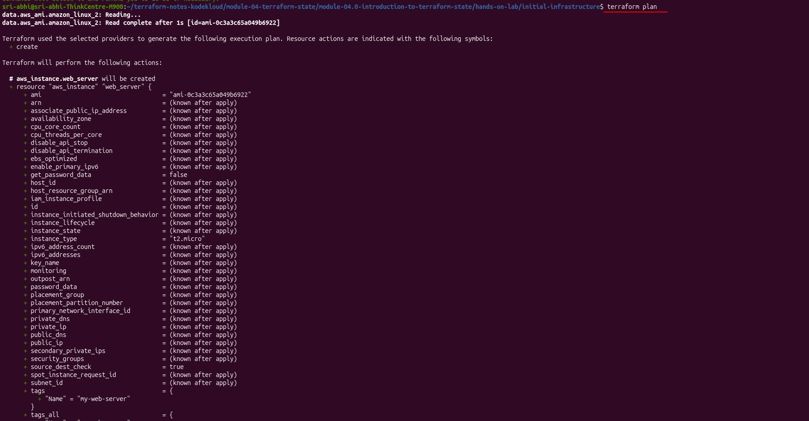
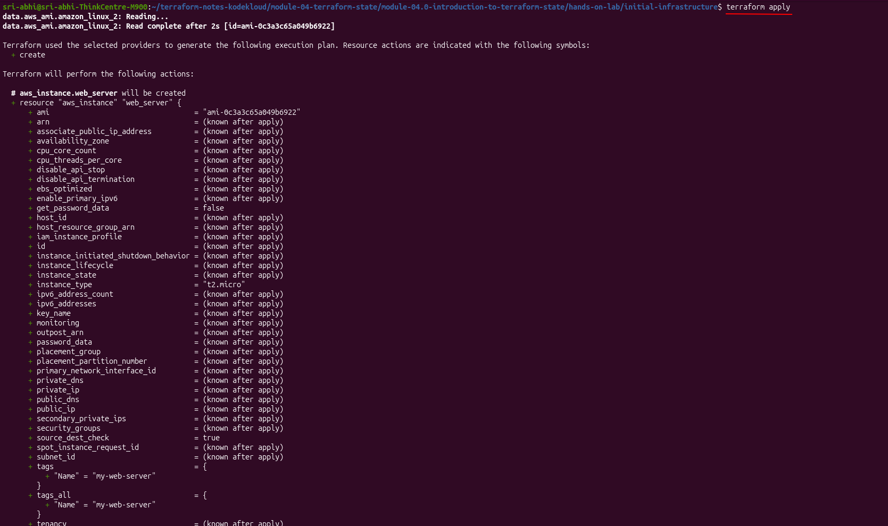
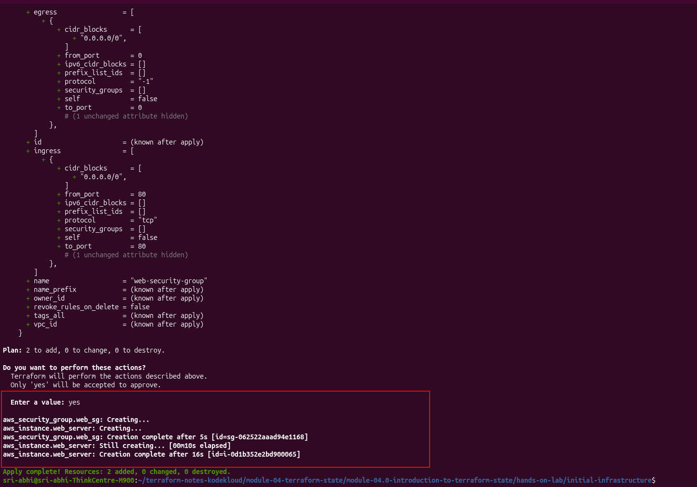
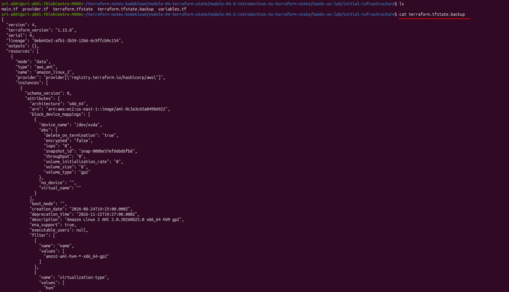

# Module 4.0 Hands-On Lab: Introduction to Terraform State

This is my walkthrough of the `initial-infrastructure/` lab for [Module 04.0 — Introduction to Terraform State](../../README.md). I create an EC2 instance and a security group, watch `terraform.tfstate` get created on the first apply, inspect it, then run `apply` a second time to see state management in action — Terraform refreshes state, compares it to my config, and makes no changes.

## What I set out to do

- Create AWS resources with Terraform
- Watch `terraform.tfstate` get created
- Understand how Terraform tracks infrastructure
- Run `terraform apply` twice and see state prevent duplicate resources
- Inspect the actual state file JSON

---

## Folder structure

```
initial-infrastructure/
├── main.tf
├── variables.tf
├── provider.tf
└── terraform.tfstate       # created after terraform apply
```

---

## Configuration files

**provider.tf**

```hcl
terraform {
  required_providers {
    aws = {
      source  = "hashicorp/aws"
      version = "~> 5.0"
    }
  }
}

provider "aws" {
  region = "us-east-1"
}
```

**variables.tf**

```hcl
variable "instance_type" {
  default = "t2.micro"
}
```

**main.tf**

```hcl
# Find latest Amazon Linux 2 AMI
data "aws_ami" "amazon_linux_2" {
  most_recent = true
  owners      = ["amazon"]

  filter {
    name   = "name"
    values = ["amzn2-ami-hvm-*-x86_64-gp2"]
  }

  filter {
    name   = "virtualization-type"
    values = ["hvm"]
  }
}

# Create security group
resource "aws_security_group" "web_sg" {
  name        = "web-security-group"
  description = "Security group for web server"

  ingress {
    from_port   = 80
    to_port     = 80
    protocol    = "tcp"
    cidr_blocks = ["0.0.0.0/0"]
  }

  egress {
    from_port   = 0
    to_port     = 0
    protocol    = "-1"
    cidr_blocks = ["0.0.0.0/0"]
  }
}

# Create EC2 instance
resource "aws_instance" "web_server" {
  ami           = data.aws_ami.amazon_linux_2.id
  instance_type = var.instance_type

  tags = {
    Name = "my-web-server"
  }
}
```


### Why `main.tf` looks up the AMI instead of hardcoding it

My first pass at this lab hardcoded the AMI like this:

```hcl
# variables.tf
variable "ami_id" {
  default = "ami-0c55b159cbfafe1f0"
}

# main.tf
resource "aws_instance" "web_server" {
  ami           = var.ami_id
  instance_type = var.instance_type
  ...
}
```

That AMI ID pins one specific Amazon Linux 2 image. AWS periodically deprecates old AMIs as it publishes new ones, so a ~~hardcoded~~ ID like that can silently stop resolving in `us-east-1` months later — the `terraform plan`/`apply` in this lab would fail with an invalid AMI ID error, unrelated to anything about state. I replaced the variable with a `data "aws_ami" "amazon_linux_2"` block that always resolves to whichever Amazon Linux 2 HVM/gp2 AMI is currently newest, filtered by name and virtualization type. `var.ami_id` and its declaration in `variables.tf` are gone — `instance_type` is the only variable left.

---

## Step-by-step execution

### Step 1: Initialize Terraform

```bash
terraform init
```

Downloads the AWS provider plugin and creates the `.terraform` directory.

### Step 2: Plan the infrastructure

```bash
terraform plan
```

Because the AMI is now a data source, Terraform reads it first — `data.aws_ami.amazon_linux_2: Reading...` — before it can even show me what the instance will look like, since the AMI id feeds into the instance's `ami` attribute:

```
data.aws_ami.amazon_linux_2: Reading...
data.aws_ami.amazon_linux_2: Read complete after 1s [id=ami-0c3a3c65a049b6922]

Terraform used the selected providers to generate the following execution plan.
Resource actions are indicated with the following symbols:
  + create

Terraform will perform the following actions:

  # aws_instance.web_server will be created
  + resource "aws_instance" "web_server" {
      + ami                    = "ami-0c3a3c65a049b6922"
      + instance_type          = "t2.micro"
      + id                     = (known after apply)
      + public_ip              = (known after apply)
      ...
    }

  # aws_security_group.web_sg will be created
  + resource "aws_security_group" "web_sg" {
      + name        = "web-security-group"
      + description = "Security group for web server"
      + id          = (known after apply)
      ...
    }

Plan: 2 to add, 0 to change, 0 to destroy.
```




No state file exists yet, so Terraform knows both resources will be newly created.

### Step 3: Apply the configuration

```bash
terraform apply
```

Terraform shows the same plan, re-reading the AMI data source first, then prompts for confirmation:

```
Do you want to perform these actions?
  Terraform will perform the actions described above.
  Only 'yes' will be accepted to approve.

Enter a value: yes

aws_security_group.web_sg: Creating...
aws_instance.web_server: Creating...
aws_security_group.web_sg: Creation complete after 5s [id=sg-062522aaad94e1168]
aws_instance.web_server: Still creating... [00m10s elapsed]
aws_instance.web_server: Creation complete after 16s [id=i-0d1b352e2bd900065]

Apply complete! Resources: 2 added, 0 changed, 0 destroyed.
```




- Security group created: `sg-062522aaad94e1168`
- EC2 instance created: `i-0d1b352e2bd900065`
- `terraform.tfstate` created automatically
- `terraform.tfstate.backup` created alongside it

### Step 4: Check the files created

```bash
$ ls
main.tf  provider.tf  terraform.tfstate  terraform.tfstate.backup  variables.tf
```

### Step 5: Inspect the state file

```bash
cat terraform.tfstate
```


The data source is recorded right alongside the managed resources:

```json
{
  "mode": "data",
  "type": "aws_ami",
  "name": "amazon_linux_2",
  "instances": [
    {
      "attributes": {
        "id": "ami-0c3a3c65a049b6922",
        "description": "Amazon Linux 2 AMI 2.0.20260825.0 x86_64 HVM gp2",
        "architecture": "x86_64",
        "creation_date": "2026-08-24T19:25:00.000Z"
      }
    }
  ]
}
```

That's the AMI the data source resolved to at apply time — pinned into state now, even though the lookup itself (`most_recent = true`) is dynamic. The security group and instance resources are recorded the same way as before, with their real AWS ids, IPs, and tags.

### Step 6: Apply again — state management in action

```bash
terraform apply
```

```
data.aws_ami.amazon_linux_2: Reading...
aws_security_group.web_sg: Refreshing state... [id=sg-062522aaad94e1168]
data.aws_ami.amazon_linux_2: Read complete after 1s [id=ami-0c3a3c65a049b6922]
aws_instance.web_server: Refreshing state... [id=i-0d1b352e2bd900065]

No changes. Your infrastructure matches the configuration.

Apply complete! Resources: 0 added, 0 changed, 0 destroyed.
```


**This is the key moment of the lab.** Terraform re-read the AMI data source, refreshed both resources from AWS, compared everything against my config, found no differences, and made no changes. First apply: "Plan: 2 to add." Second apply: "0 added, 0 changed, 0 destroyed." That's state doing its job — without `terraform.tfstate` telling Terraform these resources already exist, it would have no way to know that and could try to create duplicates.

`terraform.tfstate.backup` still holds the state from just before this apply (`serial` one lower than the current file):

```bash
$ ls
main.tf  provider.tf  terraform.tfstate  terraform.tfstate.backup  variables.tf

$ cat terraform.tfstate.backup
```



---

## Understanding the state file

```json
{
  "version": 4,
  "terraform_version": "1.15.8",
  "serial": 10,
  "lineage": "8eb642e2-afb1-3b59-12b6-6c9ffcb9c154",
  "outputs": {},
  "resources": [
    // data.aws_ami.amazon_linux_2, aws_security_group.web_sg, aws_instance.web_server
  ],
  "check_results": null
}
```

| Field | Meaning |
|-------|---------|
| **version** | Terraform state format version |
| **terraform_version** | Terraform CLI version that created this state |
| **serial** | Version number, incremented on each change — mine reached `10` after re-running plan/apply a few times while iterating on this lab |
| **lineage** | Unique ID tracking this state across backups |
| **resources** | Every data source and managed resource, data sources included |

---

## Key observations

**1. The state file only appears after the first apply.** Before it, there's no `terraform.tfstate` — Terraform only has my config and whatever it can read live from AWS.

**2. State records real AWS ids, not placeholders.** Security group `sg-062522aaad94e1168`, instance `i-0d1b352e2bd900065`, its actual IPs — these are the source of truth once written.

**3. Data sources live in state too.** `data.aws_ami.amazon_linux_2` is stored the same shape as a managed resource, just tagged `"mode": "data"` instead of `"mode": "managed"`. That's why the second apply still shows `data.aws_ami.amazon_linux_2: Reading...` — a data source re-reads every run regardless of state, unlike a managed resource, which only refreshes.

**4. Second apply == no changes.** First apply: 2 to add. Second: 0 added, 0 changed, 0 destroyed, because state already matched config.

**5. Every apply refreshes state first.** `Refreshing state...` on the security group and instance is Terraform re-checking with AWS that what's in `terraform.tfstate` still matches reality before deciding what (if anything) to change.

---

## Cleanup

```bash
terraform destroy
```

Deletes the EC2 instance and security group, updates `terraform.tfstate`, and keeps `terraform.tfstate.backup` around. I noted the resource ids above before tearing this down, in case I wanted to cross-check them against the AWS console.

---

## Back to the lesson

[Module 04.0 — Introduction to Terraform State](../../README.md)
