# Hands-On Lab: S3 Backend + Native State Locking

> Companion hands-on lab for [Module 04.2: Terraform State Considerations](../README.md#securing-state-in-s3) — see that note for the full explanation of how remote state and S3 native locking actually work. Code lives in [`bootstrap/`](bootstrap) and [`app/`](app).

## Table of Contents

1. [What I Built](#what-i-built)
2. [Walking Through It](#walking-through-it)
   1. [Create the backend resources](#1-create-the-backend-resources)
   2. [Point `app/` at that bucket](#2-point-app-at-that-bucket)
   3. [Initialize `app/` against the S3 backend](#3-initialize-app-against-the-s3-backend)
   4. [Apply and confirm state actually moved](#4-apply-and-confirm-state-actually-moved)
   5. [Simulate a held lock](#5-simulate-a-held-lock)
   6. [Resolve the lock](#6-resolve-the-lock)
   7. [Clean up](#7-clean-up)
3. [What This Confirms](#what-this-confirms)

---

## What I Built

- **`bootstrap/`** — creates the S3 bucket. Stays on local state, since it's creating the very backend other configs will point at.
- **`app/`** — one free-tier EC2 instance, using the bucket from `bootstrap/` as its `backend "s3"`, with `use_lockfile = true` for locking (no DynamoDB table).

---

## Walking Through It

### 1. Create the backend resources

```bash
cd bootstrap
terraform init
terraform apply
```

Apply complete — bucket created, nothing else:

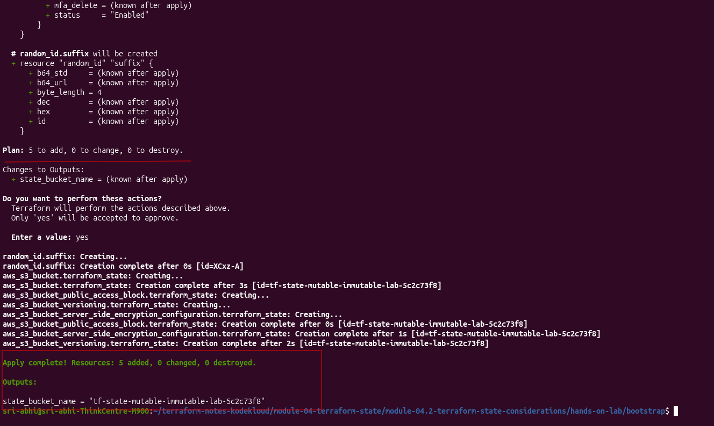

Confirmed in the console — bucket exists and is empty, since nothing's used it as a backend yet:

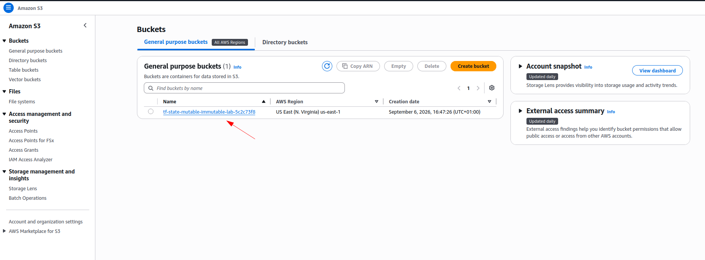

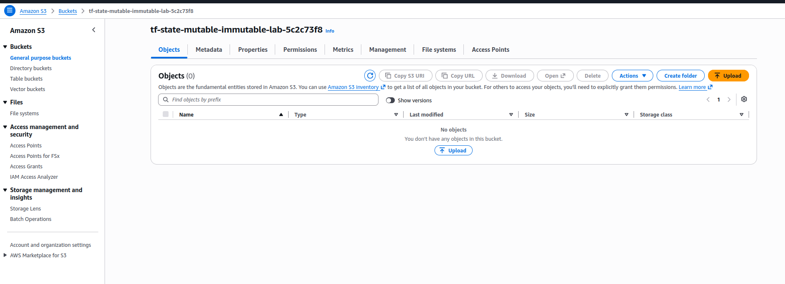

### 2. Point `app/` at that bucket

Typed the real bucket name into `app/provider.tf`'s backend block by hand — Terraform reads this block before anything else runs, so it can't pull the value from a variable or another config's output. It has to be plain text:

```hcl
backend "s3" {
  bucket       = "tf-state-mutable-immutable-lab-5c2c73f8"
  key          = "state-locking-lab/terraform.tfstate"
  region       = "us-east-1"
  use_lockfile = true
  encrypt      = true
}
```

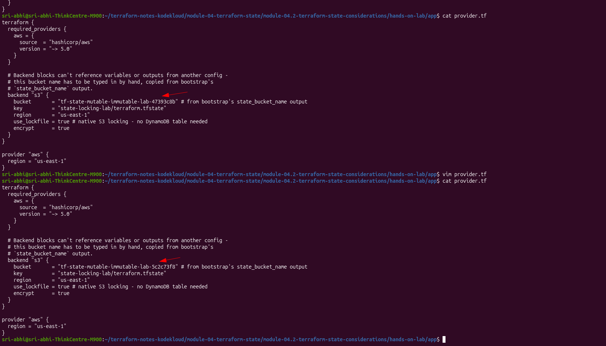

### 3. Initialize `app/` against the S3 backend

`app/` already had some local state left over from an earlier test apply, so this needed `-migrate-state` to carry it into the new backend instead of starting fresh:

```bash
cd ../app
terraform init -migrate-state
```

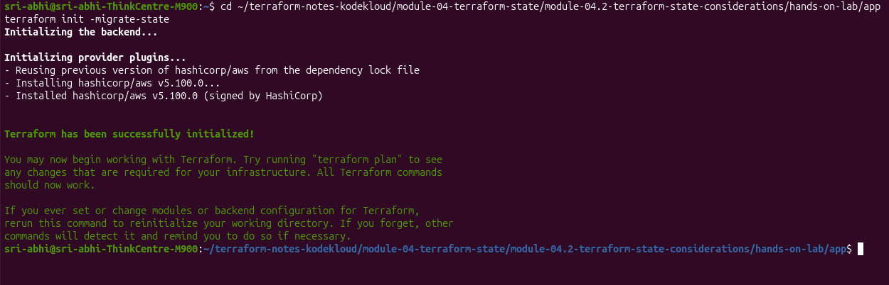

### 4. Apply and confirm state actually moved

```bash
terraform plan
terraform apply
```

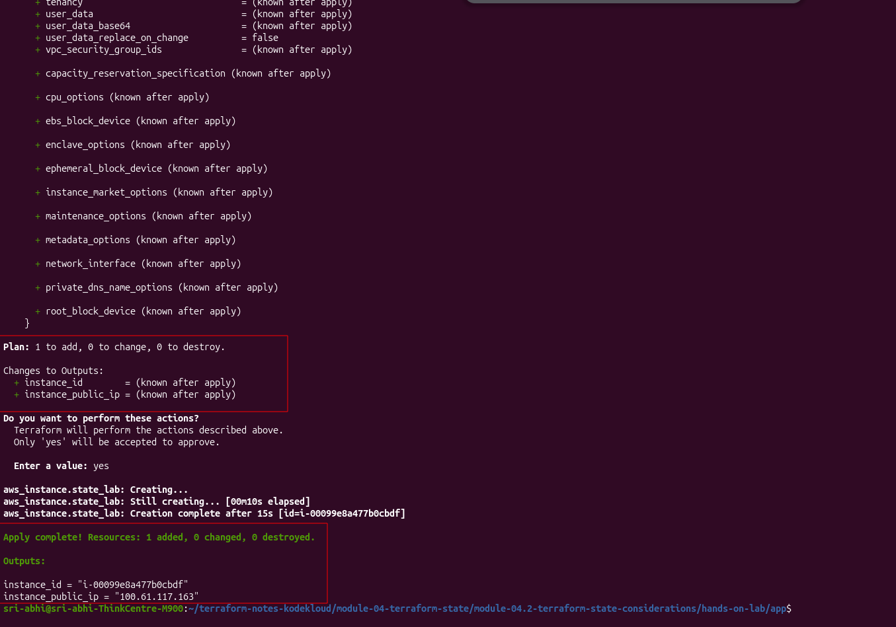

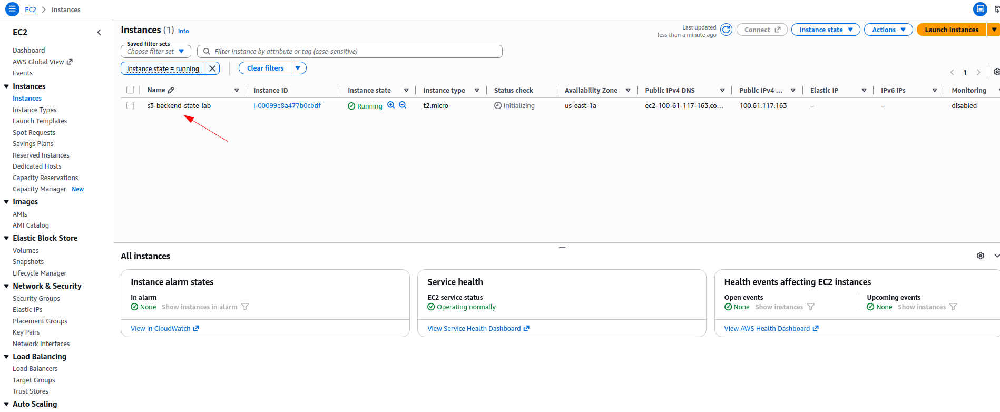

Proof state didn't land locally — `ls` in `app/` shows only the `.tf` files, no `terraform.tfstate` anywhere:

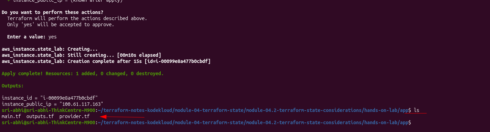

And in S3, exactly where the backend block's `key` said it would be:

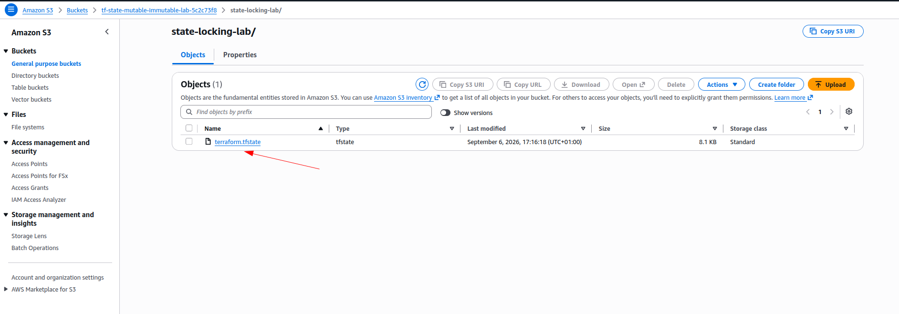

### 5. Simulate a held lock

The plan was to fake a held lock by writing my own lock file straight into the bucket. First problem: the lock object isn't named `<state key>.tflock` like I'd assumed going in — it's a fixed filename, `.terraform.lock.terraform`, sitting next to the state file in the same folder.

```bash
cat > fake-lock.json << 'EOF'
{
  "ID": "test-lock-123",
  "Operation": "OperationTypeApply",
  "Who": "someone-else@another-machine",
  "Version": "1.5.0",
  "Created": "2024-09-06T17:20:00Z"
}
EOF
```

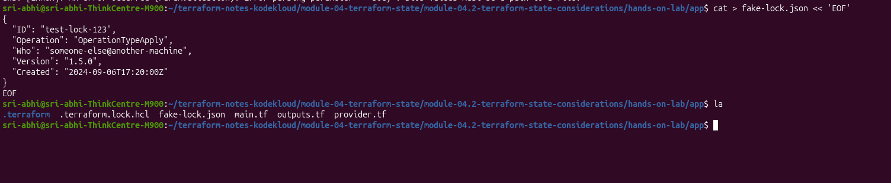

After uploading that as `state-locking-lab/.terraform.lock.terraform`, `terraform plan` refused outright:

```
Error: Error acquiring the state lock

Error message: operation error S3: PutObject, https response error StatusCode: 412, ...
api error PreconditionFailed: At least one of the pre-conditions you specified did not hold
Lock Info:
  ID:        6b05becb-9114-a314-4e0e-a0dffc5807ad
  Path:      tf-state-mutable-immutable-lab-5c2c73f8/state-locking-lab/terraform.tfstate
  Operation: OperationTypeApply
  Who:       sri-abhi@sri-abhi-ThinkCentre-M900
  Version:   1.15.8
  Created:   2026-09-06 16:35:45.433458945 +0000 UTC
```

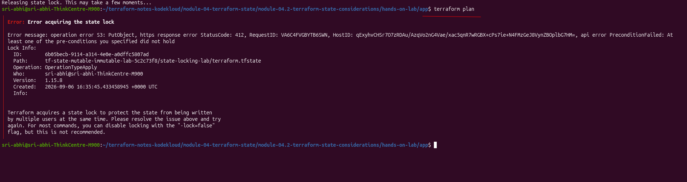

Worth noting: that Lock Info doesn't actually match the fake JSON I uploaded (different ID, my own machine instead of "someone-else"). I confirmed via the console that the object sitting in the bucket really was my `fake-lock.json` content — so unlike DynamoDB locking's error (which echoes the real blocking record), the S3 native-locking error here didn't reliably reflect the actual content of the file blocking it.

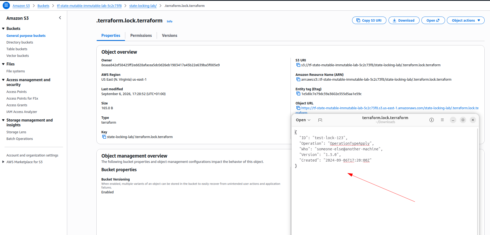

### 6. Resolve the lock

I tried `force-unlock` using the ID from the error:

```bash
terraform force-unlock 6b05becb-9114-a314-4e0e-a0dffc5807ad
```

It failed — but for an unexpected reason:

```
Failed to unlock state: unable to retrieve file from S3 bucket 'tf-state-mutable-immutable-lab-5c2c73f8'
with key 'state-locking-lab/terraform.tfstate.tflock': ... NoSuchKey: The specified key does not exist.
```

`force-unlock` went looking for the old `<key>.tflock` naming — not `.terraform.lock.terraform`, which is what the bucket actually had. A real mismatch between how this Terraform version's `force-unlock` looks up a native S3 lock and where that lock actually lives. Despite that failure, the next `terraform apply` went through cleanly on its own, and a follow-up `plan` came back clean too:

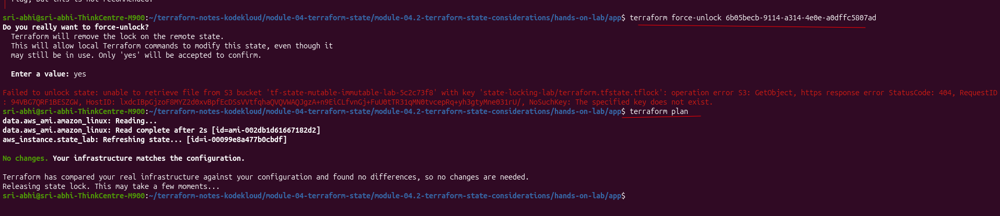

### 7. Clean up

```bash
cd app && terraform destroy
cd ../bootstrap && terraform destroy
```

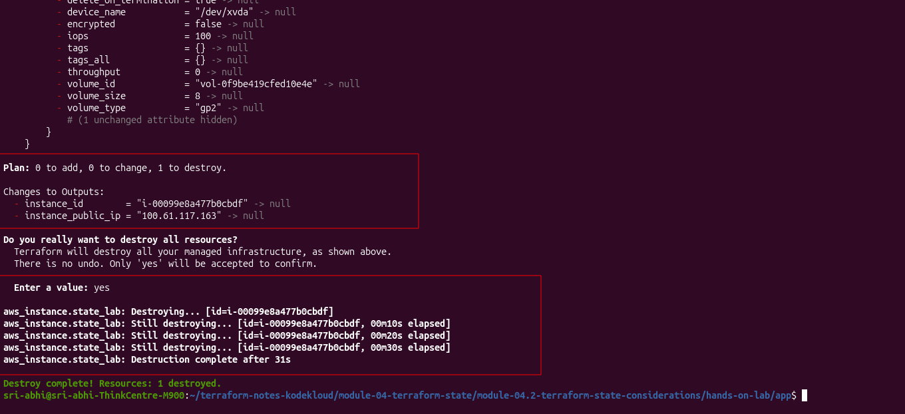

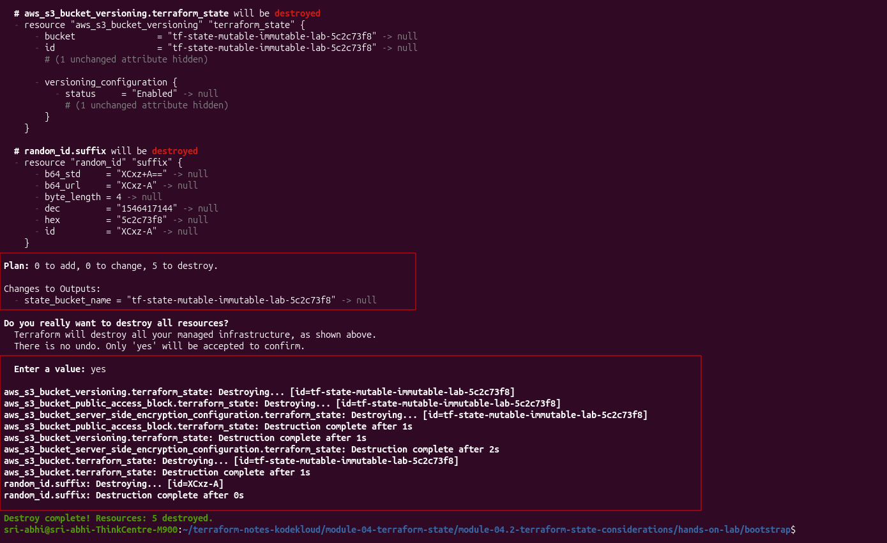

---

## What This Confirms

| | Local state (default) | S3 + native locking (this lab) |
|---|---|---|
| Where state lives | `terraform.tfstate` on disk | The same file, but in S3 (confirmed) |
| Visible to teammates/CI | No | Yes |
| Concurrent `apply` protection | None | The S3 lock file blocked `plan` outright |
| Extra AWS resources for locking | N/A | None |
| Lost-laptop risk | State gone with it | State untouched |

Full breakdown of *why* each row matters: [Module 04.2](../README.md#securing-state-in-s3).

The lock step didn't go exactly as scripted — I went in planning to fake a clean lock conflict and instead ran into a real naming mismatch (`.terraform.lock.terraform` vs. the `.tflock` suffix I'd assumed) and a `force-unlock` command that failed for the wrong reason. Leaving that in rather than smoothing it over, since it's a more honest picture of what native S3 locking actually looks like in practice than the tidy version would have been.
