# Hands-On Lab: S3 Backend + DynamoDB State Locking

> Companion hands-on lab for [Module 04.2: Terraform State Considerations](../README.md#securing-state-in-s3). Code lives in [`bootstrap/`](bootstrap) and [`app/`](app).

---

## What I Built

[Module 04.2](../README.md) lists remote state + locking as best practice but doesn't show either one happening. This lab does:

1. **Remote state** — move state off my laptop and into an S3 bucket instead of a local `terraform.tfstate`.
2. **State locking** — see what Terraform actually does when a lock is already held, using DynamoDB as the lock table.

Two separate configs, on purpose:

- **`bootstrap/`** — creates the S3 bucket and DynamoDB table. Stays on **local** state, because it's creating the very backend that other configs will point at — it can't use a backend that doesn't exist yet.
- **`app/`** — a single free-tier EC2 instance (the instance itself is incidental — this lab is about where its state lives, not the instance), configured to use the S3 bucket + DynamoDB table from `bootstrap/` as its `backend "s3"`.

---

## Walking Through It

### 1. Create the backend resources

Reviewed `bootstrap/main.tf` before running anything — the S3 bucket (versioned, encrypted, public access blocked) plus the `terraform-state-locks` DynamoDB table with `LockID` as its hash key, which is the specific attribute name and type Terraform's S3 backend expects for locking:

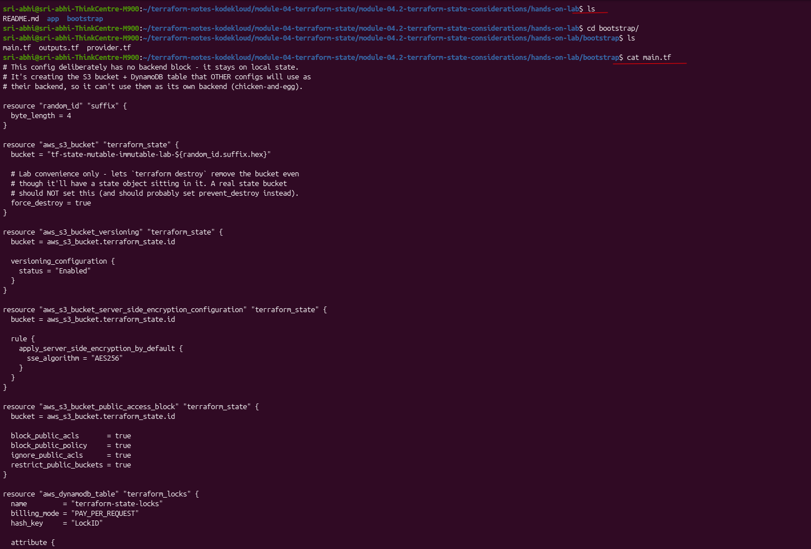
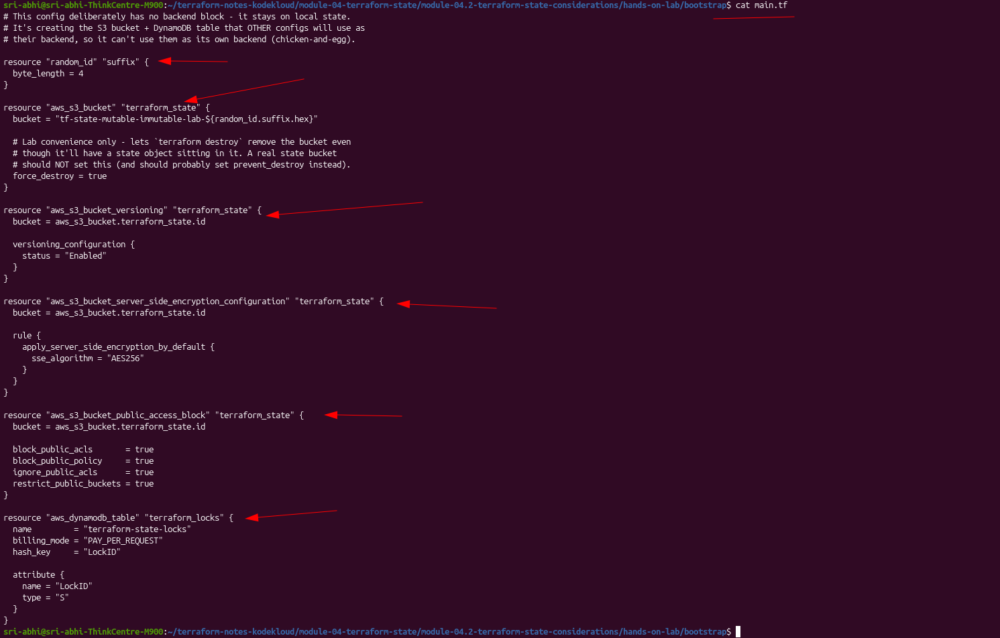

```bash
cd bootstrap
terraform init
```

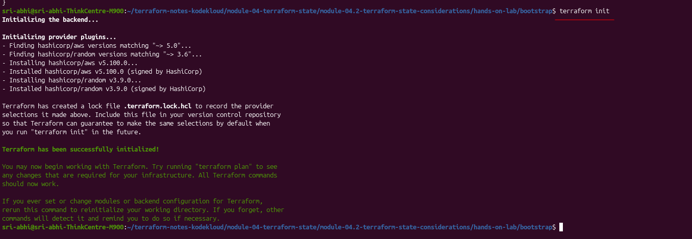

```bash
terraform apply
```

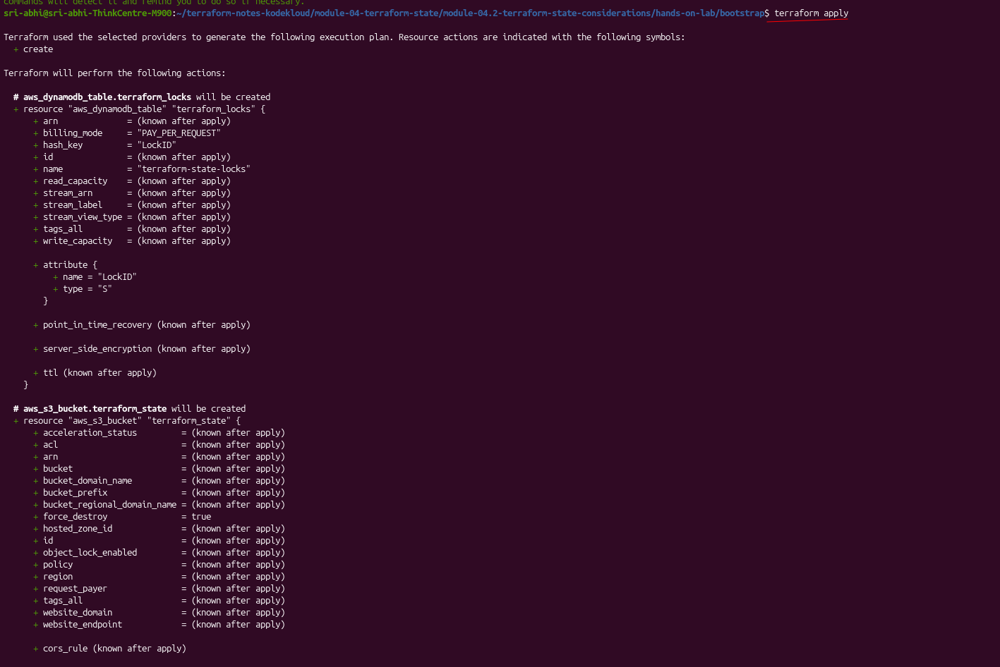

```
Apply complete! Resources: 6 added, 0 changed, 0 destroyed.

Outputs:
lock_table_name   = "terraform-state-locks"
state_bucket_name = "tf-state-mutable-immutable-lab-47393c8b"
```

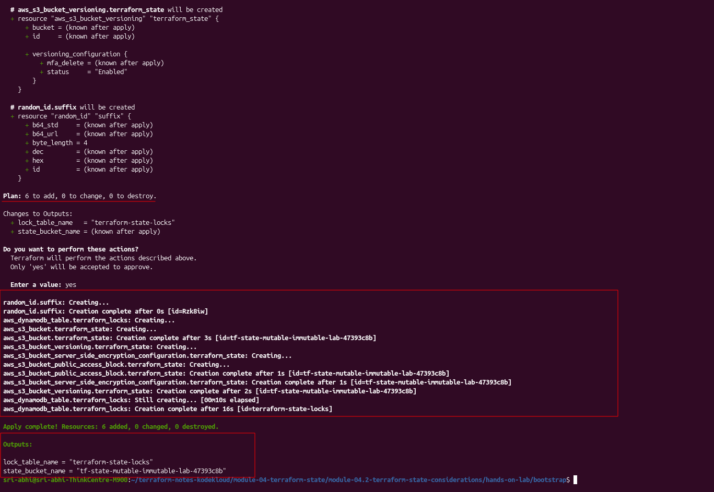

Confirmed in the console — bucket created:

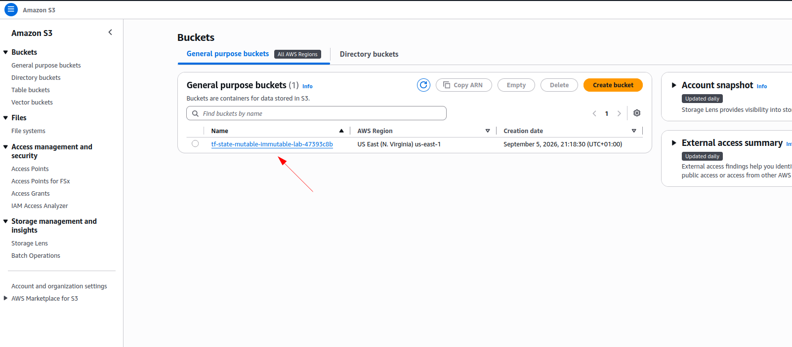

Empty, as expected — nothing's used it as a backend yet:

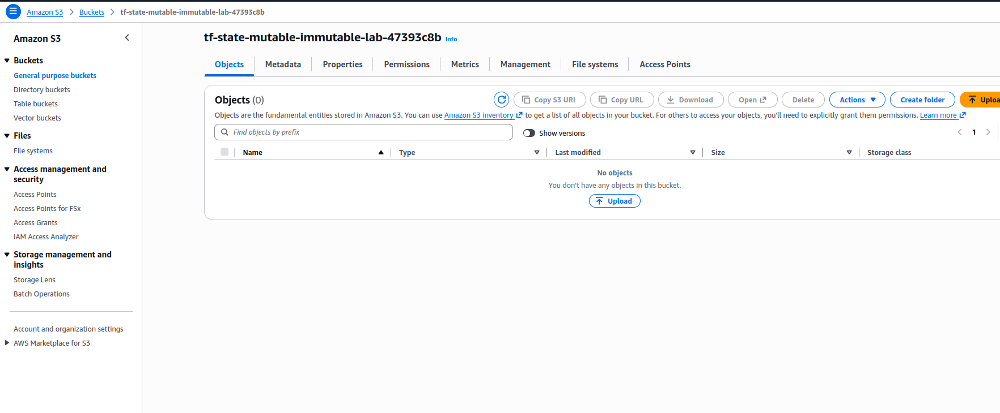

And back in the terminal, `bootstrap/`'s own state is exactly where it should be — **local**, sitting right next to the code that created the bucket:

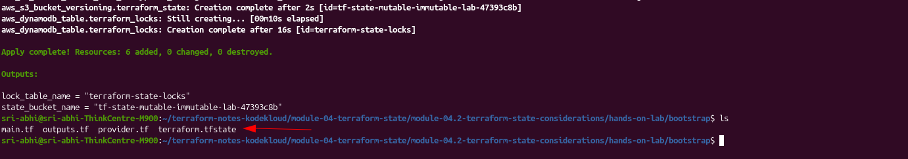

DynamoDB table, `Active`, partition key `LockID (S)`:

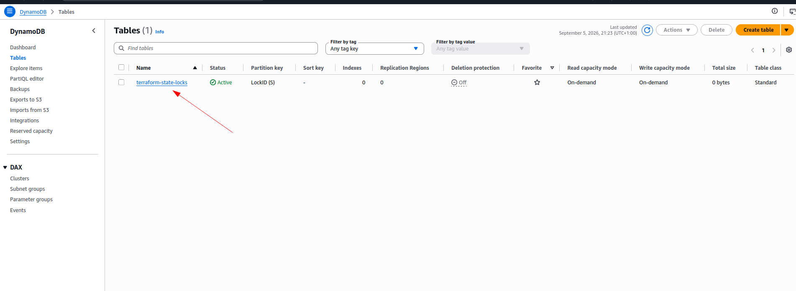

### 2. Point `app/` at that bucket

`app/provider.tf` ships with a placeholder bucket name:

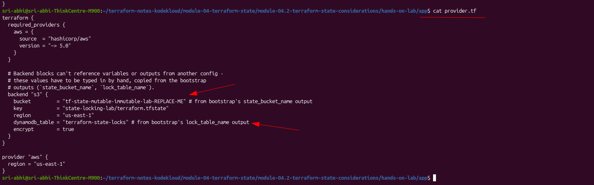

Swapped in the real `state_bucket_name` from step 1 (backend blocks can't reference variables or another config's outputs — this has to be a literal value):

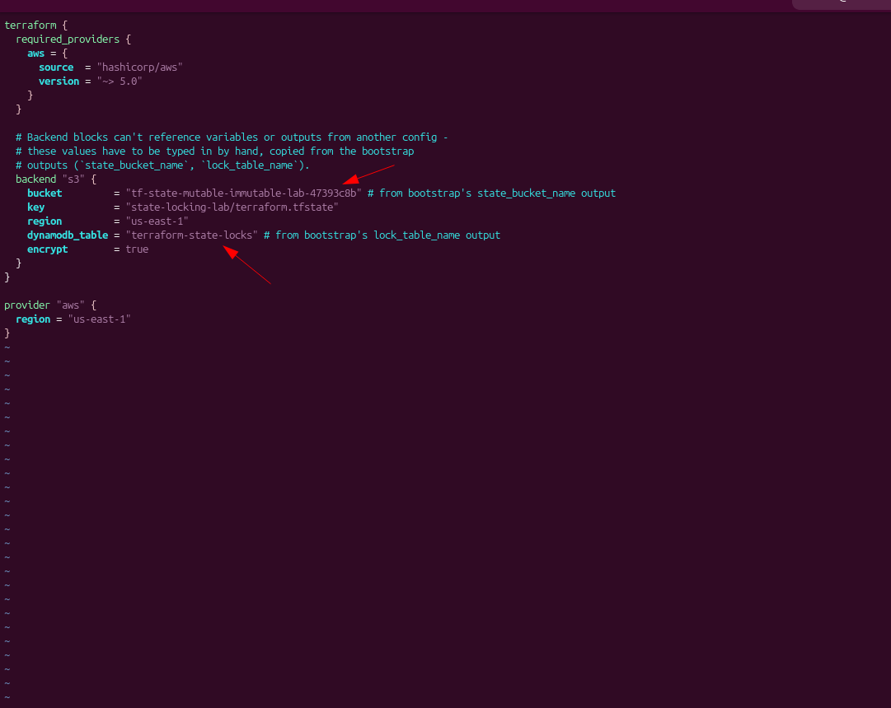

### 3. Initialize `app/` against the S3 backend

```bash
cd ../app
terraform init
```

```
Initializing the backend...

Successfully configured the backend "s3"! Terraform will automatically
use this backend unless the backend configuration changes.
```

No "copy existing state to the new backend?" prompt here — this was `app/`'s very first init, so there was no prior local state to migrate. That prompt only shows up when a config *already has* local state and switches backends mid-flight.

One thing worth flagging: Terraform also printed a **deprecation warning** I hadn't expected:

```
Warning: Deprecated Parameter
  The parameter "dynamodb_table" is deprecated. Use parameter "use_lockfile" instead.
```

Turns out recent Terraform versions support native S3 locking via a lockfile instead of a separate DynamoDB table (`use_lockfile = true`). `dynamodb_table` still works — it's what this lab explicitly set out to test — but it's the older mechanism now.

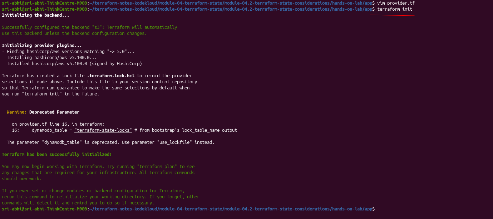

### 4. Apply and confirm state actually moved

`app/main.tf` — one EC2 instance, nothing more:

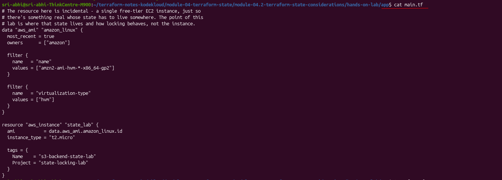

```bash
terraform plan
```

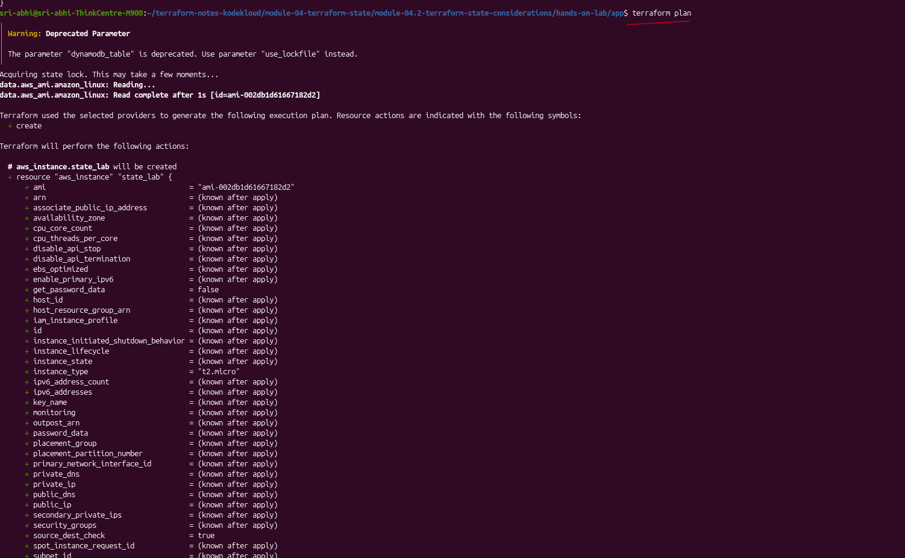
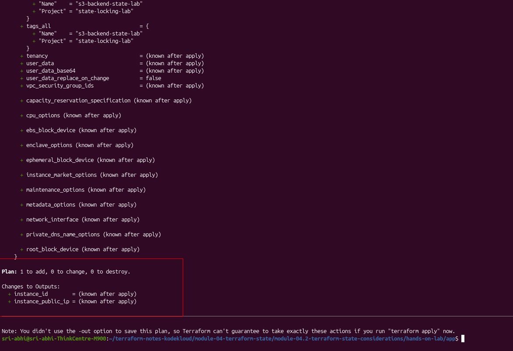

```bash
terraform apply
```

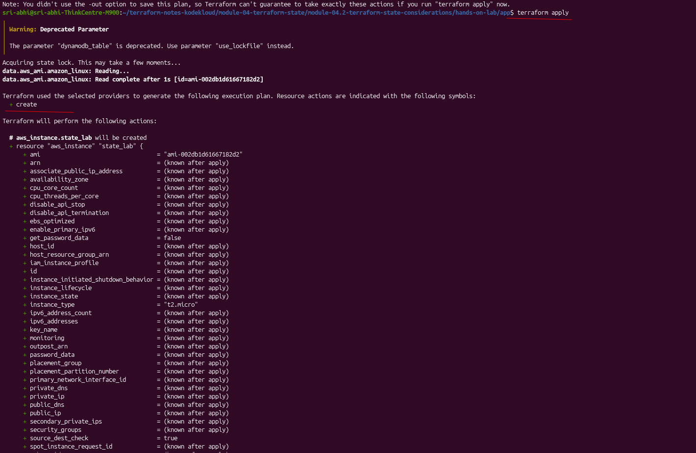

```
aws_instance.state_lab: Creation complete after 15s [id=i-0bdaa3485bf7b291a]

Apply complete! Resources: 1 added, 0 changed, 0 destroyed.

instance_id        = "i-0bdaa3485bf7b291a"
instance_public_ip = "3.223.141.64"
```

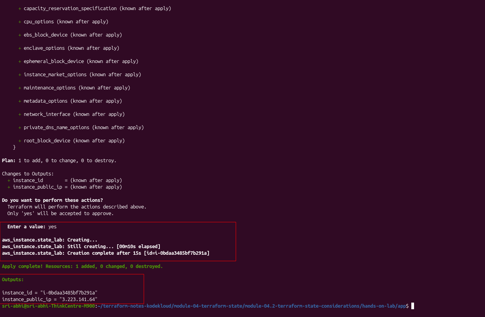

Proof state didn't land locally — `ls` in `app/` shows only the `.tf` files, no `terraform.tfstate` anywhere:

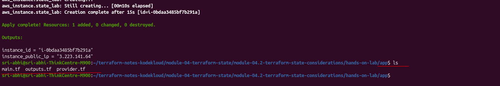

And in S3, exactly where the backend block's `key` said it would be — `state-locking-lab/terraform.tfstate`, 8.1 KB:

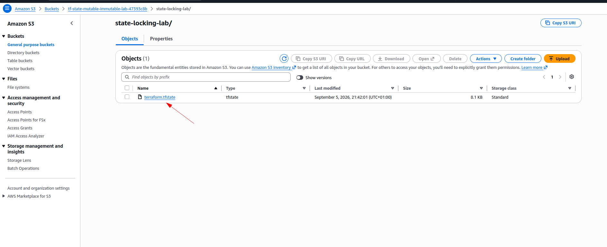
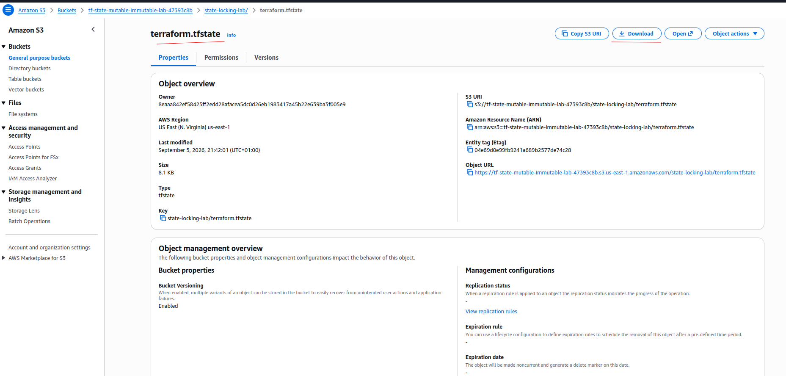

### 5. Simulate a held lock

The realistic way this happens is two people (or two CI jobs) running `apply` at the same moment. The deterministic way to force it for a lab is to write a fake lock item directly into the DynamoDB table, using the same `LockID` Terraform itself would use — `<bucket>/<key>`:

```bash
aws dynamodb put-item \
  --table-name terraform-state-locks \
  --item '{
    "LockID": {"S": "tf-state-mutable-immutable-lab-47393c8b/state-locking-lab/terraform.tfstate"},
    "Info": {"S": "{\"ID\":\"fake-lock-id\",\"Operation\":\"OperationTypeApply\",\"Who\":\"someone-else@another-machine\"}"}
  }'

terraform plan
```

Terraform refused outright:

```
Error: Error acquiring the state lock

Error message: operation error DynamoDB: PutItem, https response error StatusCode: 400,
RequestID: UJH3CL73TCM3J7K51IRT5KFHVVV4KQNSO5AEMVJF66Q9ASUAAJG, ConditionalCheckFailedException:
The conditional request failed
Lock Info:
  ID:        fake-lock-id
  Path:
  Operation: OperationTypeApply
  Who:       someone-else@another-machine
  Version:
  Created:   0001-01-01 00:00:00 +0000 UTC
  Info:

Terraform acquires a state lock to protect the state from being written
by multiple users at the same time. Please resolve the issue above and
try again.
```

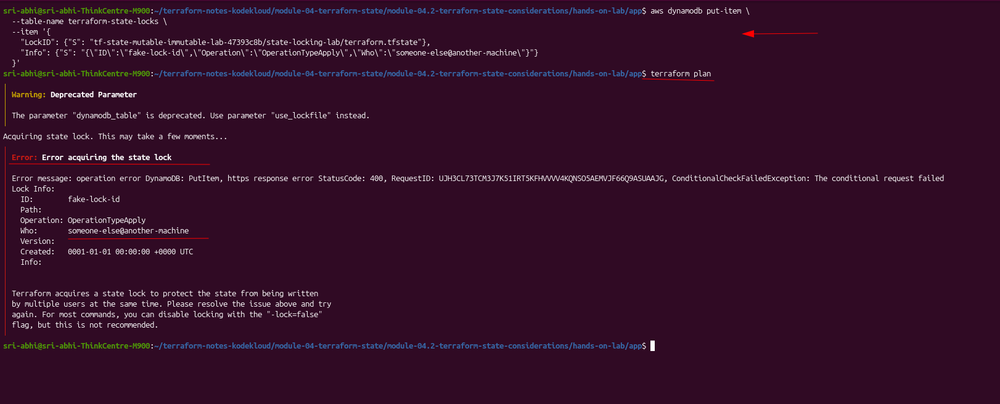

This is the entire point of locking: it's what stops two applies from racing each other and corrupting or overwriting each other's state. Terraform doesn't try to be clever about it — the DynamoDB write itself is a conditional put that fails outright if a lock item already exists at that key, and Terraform surfaces that failure as-is.

Checked the table directly afterward — the fake lock item is really there, sitting alongside DynamoDB's own **digest** item (a separate, `Info`-less entry the S3 backend maintains for state checksum verification, not a lock itself):

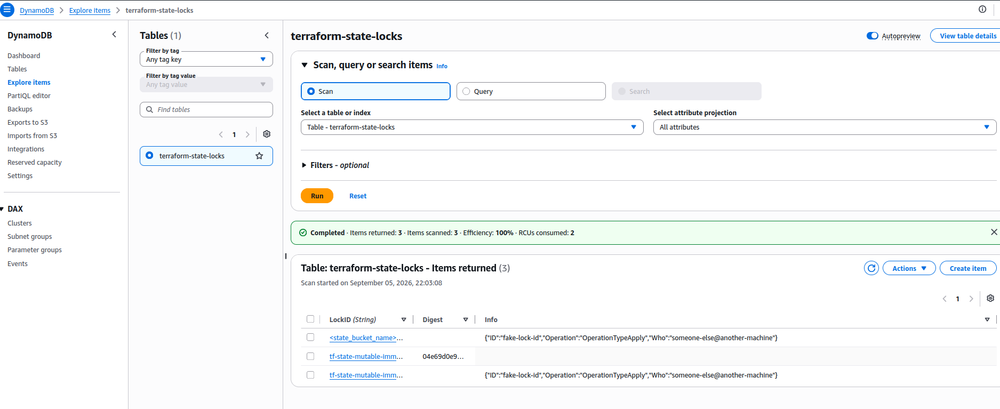

### 6. Resolve the lock (not yet run)

Two ways, both legitimate depending on the situation:

```bash
# Option A: you know it's genuinely stale/fake and safe to clear
terraform force-unlock fake-lock-id

# Option B: go straight at the DynamoDB item (what force-unlock does under the hood)
aws dynamodb delete-item \
  --table-name terraform-state-locks \
  --key '{"LockID": {"S": "tf-state-mutable-immutable-lab-47393c8b/state-locking-lab/terraform.tfstate"}}'
```

`terraform plan` should go back to normal immediately after.

### 7. Clean up (not yet run)

```bash
# Remove the EC2 instance first
cd app
terraform destroy

# Then tear down the bucket + lock table
cd ../bootstrap
terraform destroy
```

Order matters here — `bootstrap`'s bucket has `force_destroy = true` specifically so this works even with a state object still inside it, but destroying `app/`'s resource first is still the cleaner sequence (its state literally lives in that bucket).

---

## What This Confirms

| | Local state (default) | S3 + DynamoDB (this lab) |
|---|---|---|
| Where state lives | `terraform.tfstate` on disk | S3 object (`state-locking-lab/terraform.tfstate`, confirmed) |
| Visible to teammates/CI | No — one laptop only | Yes — shared |
| Concurrent `apply` protection | None | DynamoDB lock — a fake one was enough to block `plan` outright |
| Lost-laptop risk | State gone with it | State untouched, just re-point at the same backend |
| Encryption at rest | Whatever the disk has | SSE on the bucket, `encrypt = true` in the backend block |

Matches [Module 04.2](../README.md#securing-state-in-s3)'s "Securing State in S3" checklist point for point — this lab is what each of those bullets actually looks like happening.

**Still outstanding:** the fake lock item is still sitting in `terraform-state-locks`, and the EC2 instance (`i-0bdaa3485bf7b291a`) plus the S3 bucket and DynamoDB table are all still up. Steps 6 and 7 above still need to be run to actually clear the lock and tear everything down.
