# Experiment: What Happens If You Delete the State File?

> Related to [Module 04.2: Terraform State Considerations](../module-04.2-terraform-state-considerations/README.md#editing-the-state-file) — that note says state should be backed up because it's "genuinely hard to reconstruct if it's lost." I wanted to actually see what "hard to reconstruct" looks like, so I deleted it on purpose.

Ran this against the EC2 instance from the [Module 5.2 mutable-vs-immutable lab](../../module-05-working-with-terraform/module-05.2-mutable-vs-immutable-infrastructure/hands-on-lab/README.md), which was still up and running.

## The Question

**Does deleting `terraform.tfstate` and running `terraform plan` show drift, or does Terraform try to create the instance again?**

## What I Did

The instance `i-0292984e9644234f4` was running, tracked in state, tagged `web-server-v2`.

```bash
ls
# ec2_instance.tf  outputs.tf  provider.tf  terraform.tfstate  terraform.tfstate.backup

rm -r terraform.tfstate
rm -r terraform.tfstate.backup

ls
# ec2_instance.tf  outputs.tf  provider.tf   <- state and backup both gone

terraform plan
```

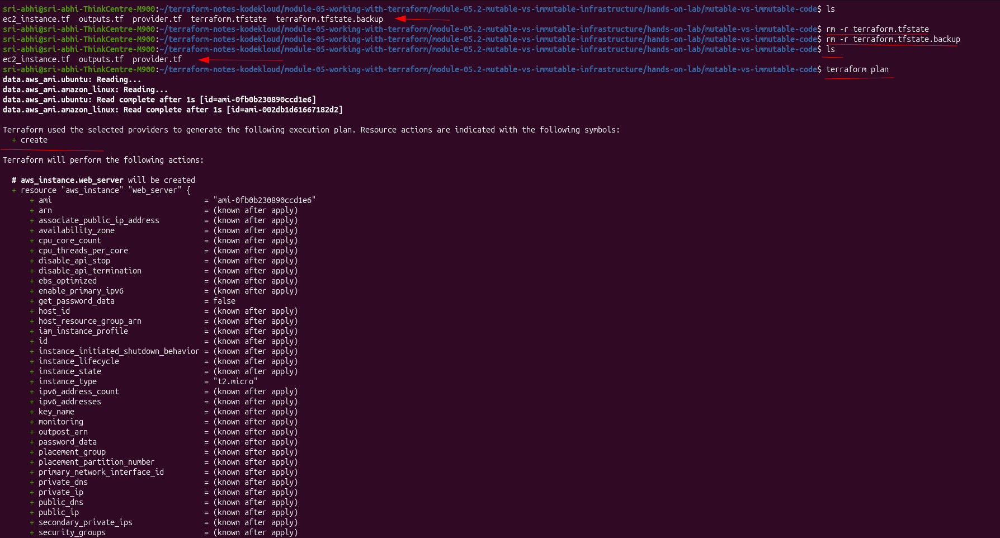

## The Result: No Drift — Just a Fresh "Create"

With no state file, Terraform has nothing to compare the real world against. It doesn't know `i-0292984e9644234f4` exists at all. So the plan wasn't `~` (drift) or even `-/+` (replace) — it was a plain `+ create`, identical in shape to the very first `terraform apply` I ever ran against this config:

```
Terraform used the selected providers to generate the following execution plan.
Resource actions are indicated with the following symbols:
  + create

  # aws_instance.web_server will be created
  + resource "aws_instance" "web_server" {
      + ami           = "ami-0fb0b230890ccd1e6"
      + instance_type = "t2.micro"
      ...
    }

Plan: 1 to add, 0 to change, 0 to destroy.
```

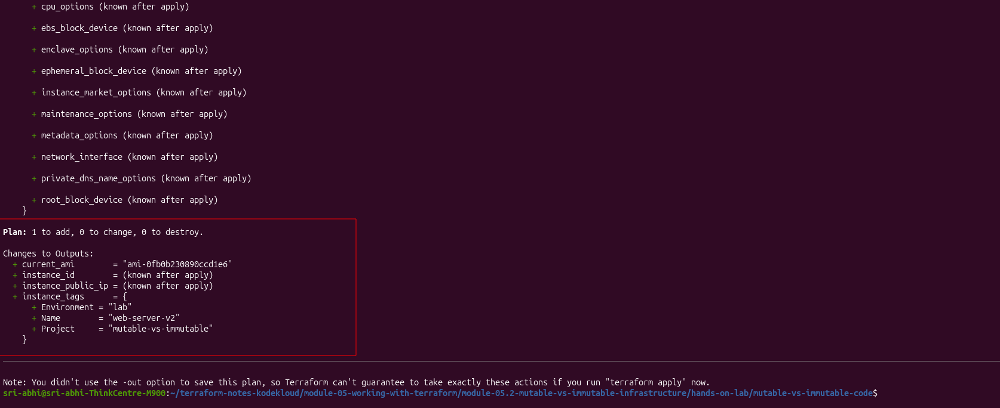

I ran `terraform apply` to see it through:

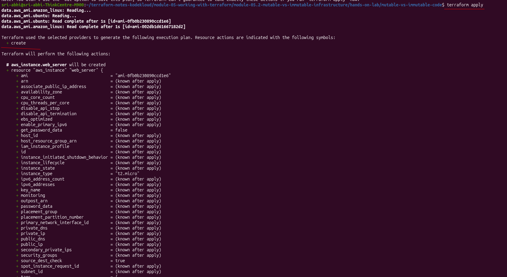

```
aws_instance.web_server: Creating...
aws_instance.web_server: Creation complete after 14s [id=i-0b27b7db8bc982f02]

Apply complete! Resources: 1 added, 0 changed, 0 destroyed.

instance_id        = "i-0b27b7db8bc982f02"
instance_public_ip = "98.92.145.55"
```

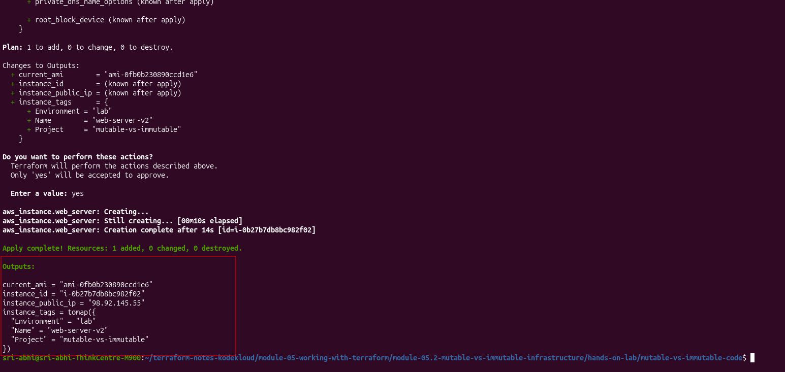

## The Actual Damage

The EC2 console now shows **two running instances**, both tagged `web-server-v2`:

| Instance ID | State | Notes |
|---|---|---|
| `i-0292984e9644234f4` | Running | The original — still alive, but no longer in Terraform's state |
| `i-0b27b7db8bc982f02` | Running | The new one Terraform just created and is now tracking |

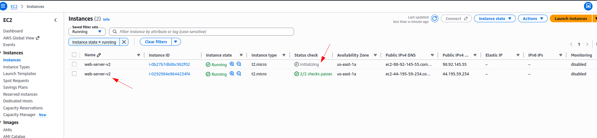

The new state file only knows about the new instance:

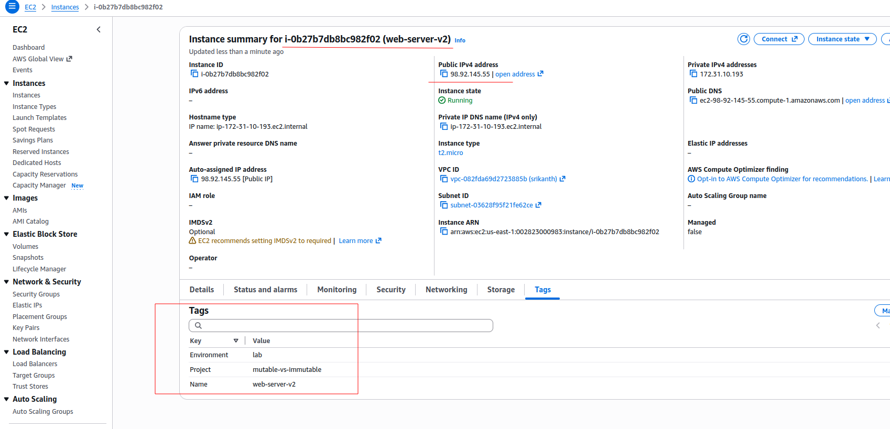

The old one, `i-0292984e9644234f4`, is now **orphaned** — it's real, it's billable, and `terraform destroy` will never touch it, because as far as Terraform's state is concerned it doesn't exist. Getting it back under management would need `terraform import`, or it just gets cleaned up by hand from the console.

Proof the new state is now self-consistent — running `terraform apply` again against the *new* instance shows no changes:

```
aws_instance.web_server: Refreshing state... [id=i-0b27b7db8bc982f02]

No changes. Your infrastructure matches the configuration.

Apply complete! Resources: 0 added, 0 changed, 0 destroyed.
```

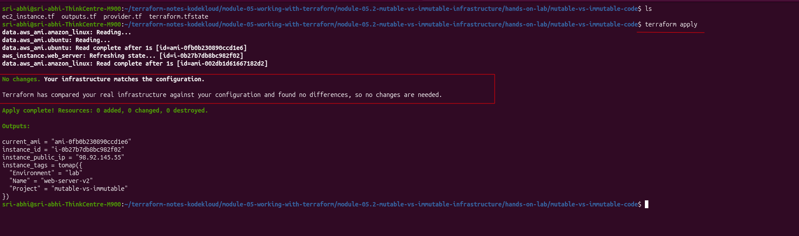

## Follow-Up: Does `destroy` Get the Orphan Too, or Just the Tracked One?

Natural next question — with two real instances running and only one of them in state, does `terraform destroy` clean up both, or only the one Terraform actually knows about?

### 1. Destroy — only the tracked instance goes

```bash
terraform destroy
```

Plan targeted exactly one resource: `aws_instance.web_server`, `id = "i-0b27b7db8bc982f02"` — the newer instance, the one currently in state. No mention of the orphan anywhere in the plan.

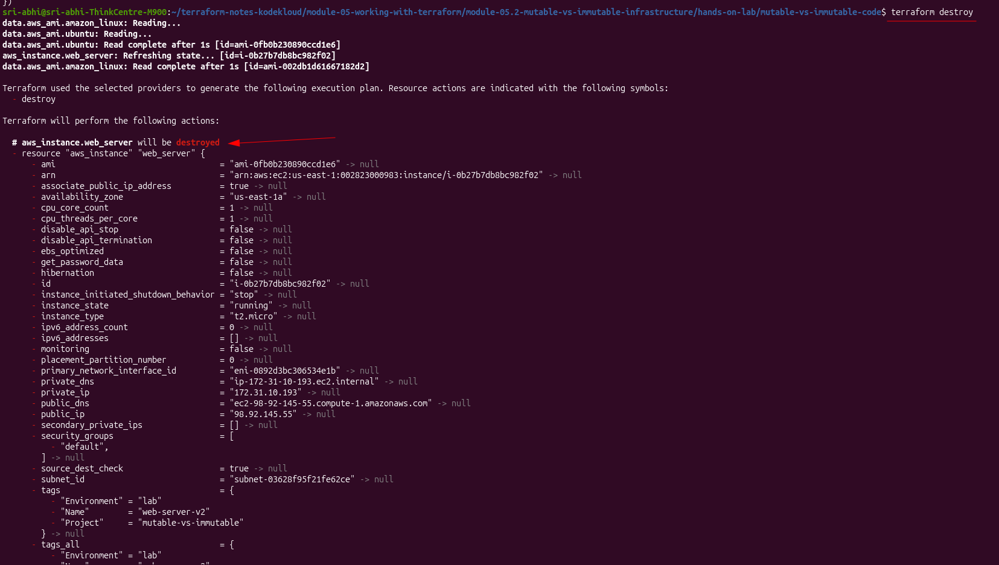

```
aws_instance.web_server: Destroying... [id=i-0b27b7db8bc982f02]
aws_instance.web_server: Destruction complete after 21s

Destroy complete! Resources: 1 destroyed.
```

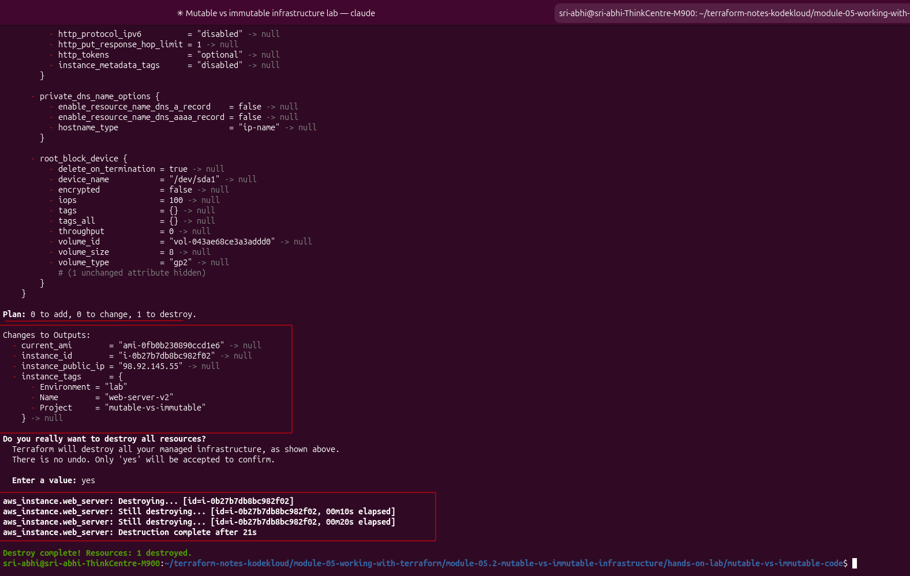

Confirmed in the console: exactly one instance still running, and it's the **orphan**, `i-0292984e9644234f4` — untouched, because `destroy` only ever acts on what's in state:

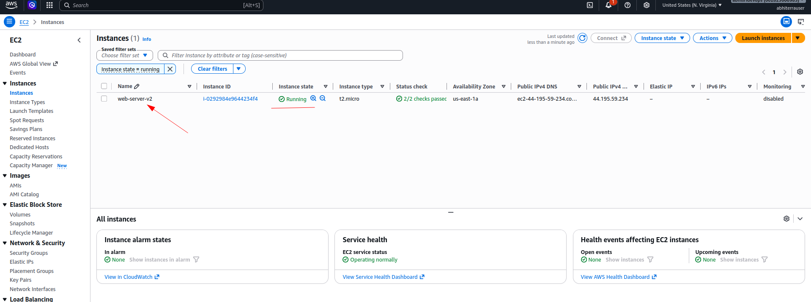

This is the same fact as the original experiment, just from the other direction: state isn't just what creates resources, it's the *only* thing that gets to destroy them too. Anything Terraform doesn't know about is invisible to it either way.

### 2. Import the orphan back into state

With the tracked instance gone, `aws_instance.web_server` is a free address in state again — so the orphan can be imported straight into it:

```bash
terraform import aws_instance.web_server i-0292984e9644234f4
```

```
aws_instance.web_server: Importing from ID "i-0292984e9644234f4"...
aws_instance.web_server: Import prepared!
  Prepared aws_instance for import
aws_instance.web_server: Refreshing state... [id=i-0292984e9644234f4]

Import successful!
```

Ran `terraform plan` right after, expecting some `~` reconciliation drift between the imported reality and the config (import only pulls in real attribute values, it doesn't check them against `ec2_instance.tf`). Got none:

```
No changes. Your infrastructure matches the configuration.
```

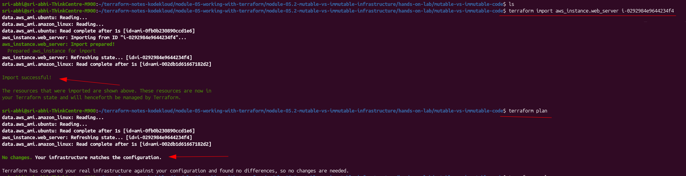

Makes sense in hindsight — this particular orphan (`i-0292984e9644234f4`) was itself created by an earlier `apply` of this exact config (it's the instance from the [AMI-swap part of the mutable-vs-immutable lab](../../module-05-working-with-terraform/module-05.2-mutable-vs-immutable-infrastructure/hands-on-lab/README.md)), so its real attributes already matched `ec2_instance.tf` exactly. Importing a resource that was hand-created or edited outside Terraform would be the case where that diff actually shows up.

### 3. Destroy again — now it takes the orphan too

```bash
terraform destroy
```

```
# aws_instance.web_server will be destroyed
- resource "aws_instance" "web_server" {
    - id = "i-0292984e9644234f4" -> null
    ...
}

Plan: 0 to add, 0 to change, 1 to destroy.
```

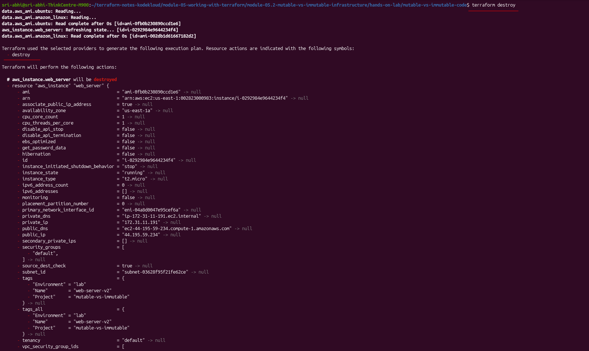

```
aws_instance.web_server: Destroying... [id=i-0292984e9644234f4]
aws_instance.web_server: Destruction complete after 31s

Destroy complete! Resources: 1 destroyed.
```

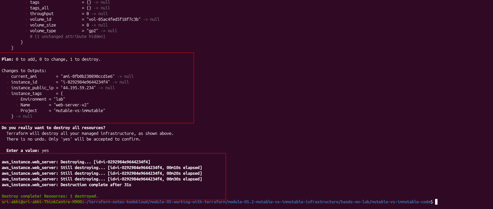

Console confirms both instances are finally gone:

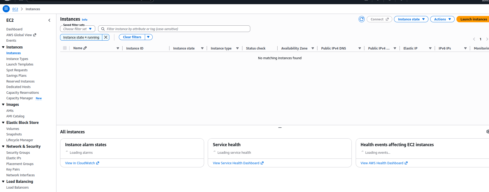

### What This Adds

`import` isn't "make Terraform aware of this resource in addition to what it already manages" — it's "bind this specific real resource to this specific resource *address*." Since `aws_instance.web_server` can only ever point at one real instance at a time, recovering an orphan needs that address to be free first (here, freed by destroying the other instance that was occupying it). If both instances had needed to stay alive and managed simultaneously, the fix would've been adding a second `resource "aws_instance"` block and importing into *that* address instead.

## Takeaway

Deleting state doesn't make Terraform "notice" anything is missing — it makes Terraform **forget the real infrastructure exists at all**. `plan`/`apply` fall back to their only other job: making reality match config, which here meant building a second copy from scratch. Drift detection depends entirely on state being present and accurate; with no state, there's nothing to detect drift *against*.

This is the concrete version of [Module 04.2](../module-04.2-terraform-state-considerations/README.md)'s "back up state files regularly" advice — the failure mode isn't a scary error message, it's a silently duplicated, silently orphaned, silently billable resource.
