# Hands-On Lab: Mutable vs Immutable Infrastructure

> Companion hands-on lab for [Module 5.2: Mutable vs Immutable Infrastructure](../README.md). Code lives in [`mutable-vs-immutable-code/`](mutable-vs-immutable-code).

---

## What I Built

One EC2 instance, two different kinds of changes, to see the theory from the module notes actually happen on AWS:

1. Change a **tag** → mutable, in-place update (`~` in the plan, same instance ID).
2. Change the **AMI** → immutable, destroy-and-recreate (`-/+` in the plan, brand new instance ID).

**Why AMI and not instance type:** my first pass at this lab used `instance_type` (`t2.micro` → `t2.small`) as the "immutable" example. Wrong — `instance_type` is *not* a ForceNew attribute on `aws_instance`. Terraform just stops the instance, calls `ModifyInstanceAttribute`, and starts it back up with the same instance ID. `ami`, on the other hand, actually is ForceNew, so swapping it is the real destroy-and-recreate case — which is what I ran below.

Files: `provider.tf`, `ec2_instance.tf`, `outputs.tf`.

---

## Walking Through It

### 1. Reviewing the code before touching AWS

Two AMI data sources — Amazon Linux 2 (the starting AMI) and Ubuntu (the swap-to AMI for Part 2) — and one `aws_instance` starting on `t2.micro` with `Name = "web-server-v1"`.

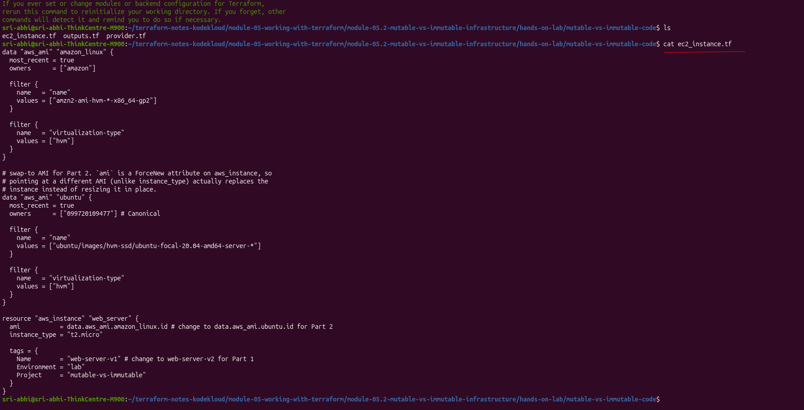

### 2. Deploy the baseline

```bash
terraform plan
terraform apply
```

`terraform plan` resolved the AMI data sources and showed everything as `+ create` for a new `t2.micro` instance:

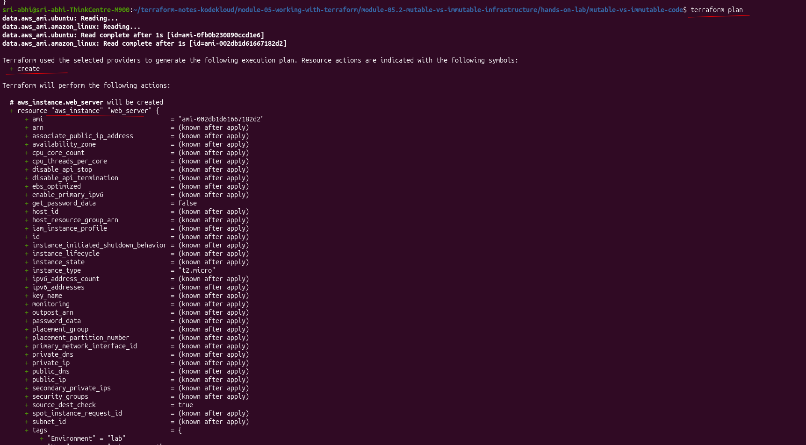

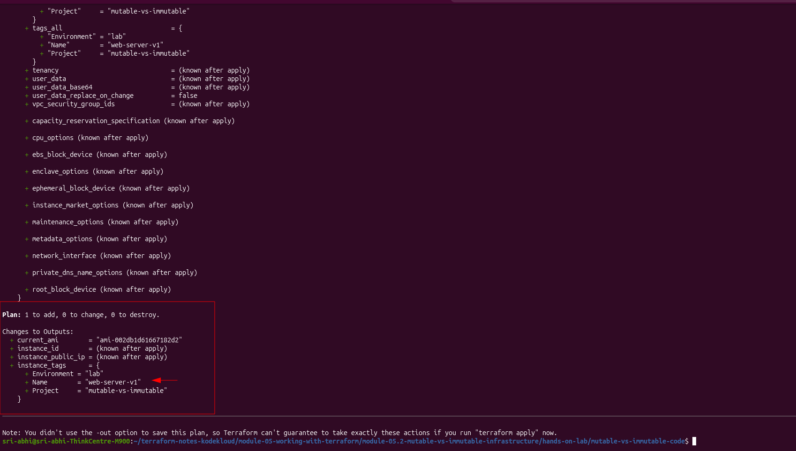

`terraform apply`, confirmed with `yes`:

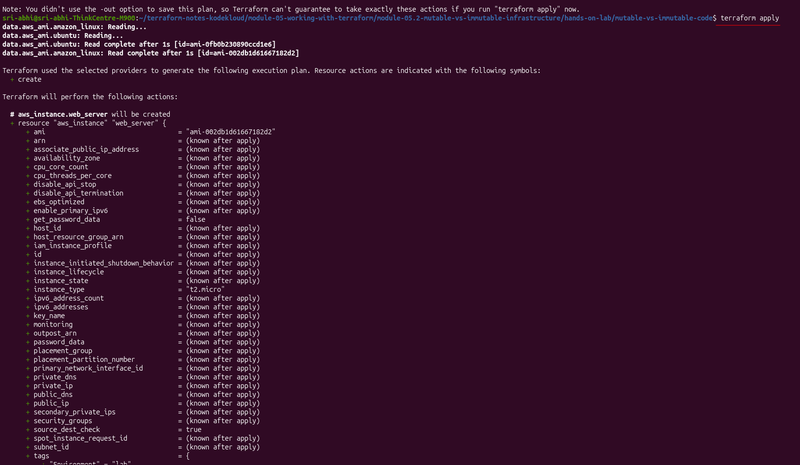

Instance came up in 14s:

```
aws_instance.web_server: Creation complete after 14s [id=i-0b2662ef8fc8a1b9e]

current_ami         = "ami-002db1d61667182d2"
instance_id         = "i-0b2662ef8fc8a1b9e"
instance_public_ip  = "98.82.31.193"
instance_tags       = { Name = "web-server-v1", Environment = "lab", Project = "mutable-vs-immutable" }
```

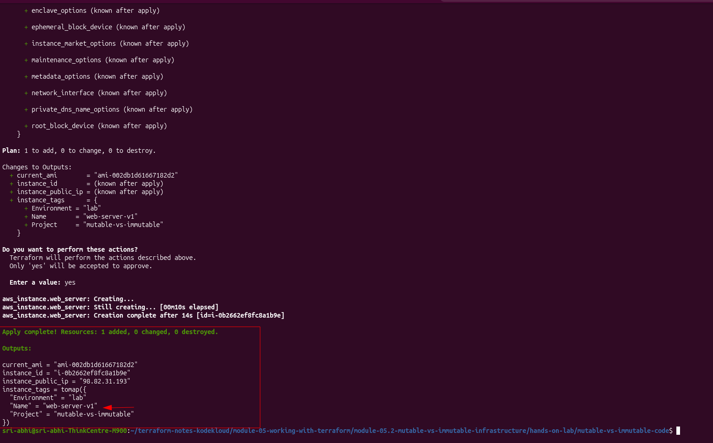

Confirmed in the AWS console — `i-0b2662ef8fc8a1b9e`, tagged `web-server-v1`:

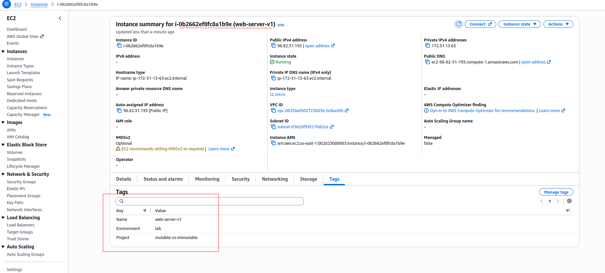

### 3. Part 1 — mutable change (tag)

Changed the tag in `ec2_instance.tf`:

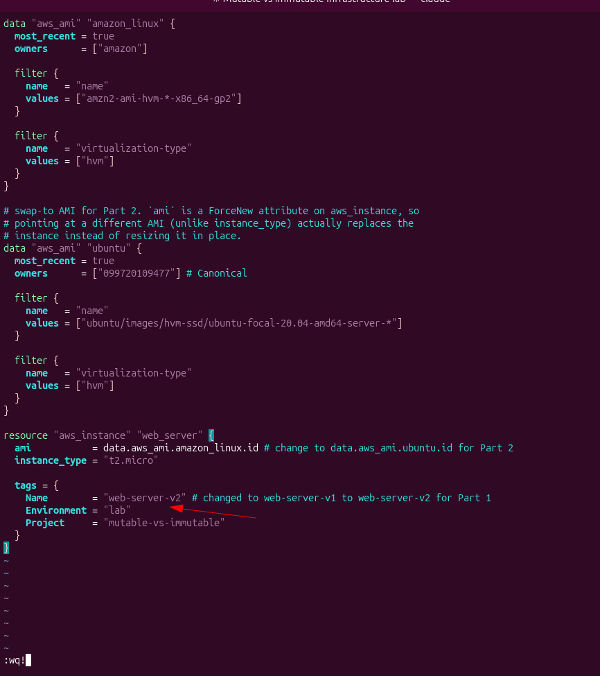

```bash
terraform plan
```

Exactly the symbol I was testing for — `~ update in-place`, not `-/+`. The `id` field doesn't even show as changing:

```
Terraform will perform the following actions:
  # aws_instance.web_server will be updated in-place
  ~ resource "aws_instance" "web_server" {
        id   = "i-0b2662ef8fc8a1b9e"
      ~ tags = {
          ~ "Name" = "web-server-v1" -> "web-server-v2"
        }
    }

Plan: 0 to add, 1 to change, 0 to destroy.
```

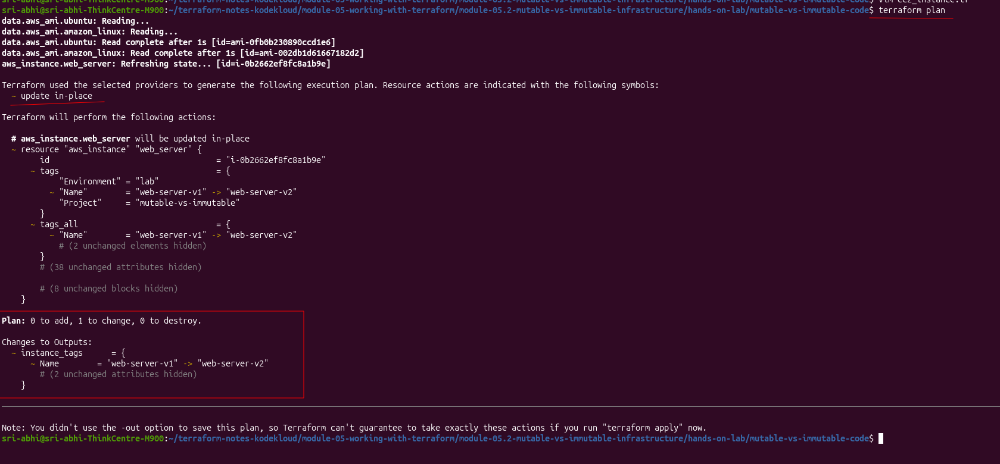

```bash
terraform apply
```

```
aws_instance.web_server: Modifying... [id=i-0b2662ef8fc8a1b9e]
aws_instance.web_server: Modifications complete after 3s [id=i-0b2662ef8fc8a1b9e]

Apply complete! Resources: 0 added, 1 changed, 0 destroyed.
```

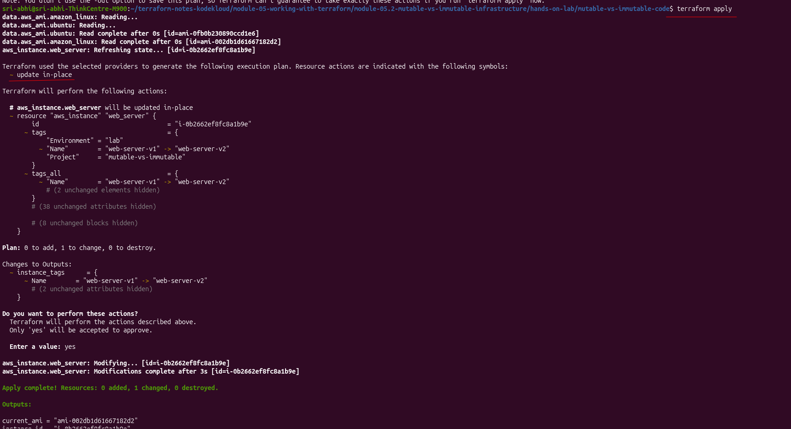

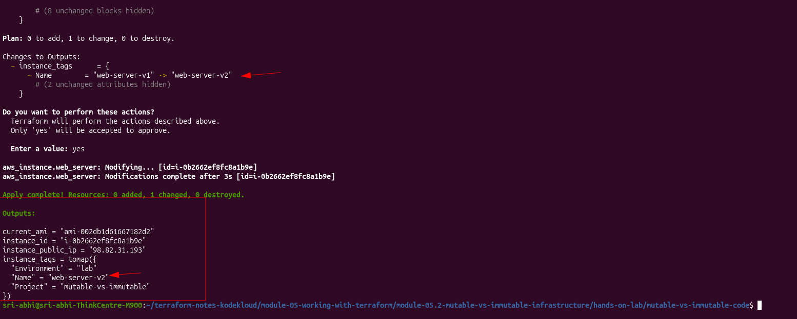

Back in the AWS console: **same instance ID**, `i-0b2662ef8fc8a1b9e`, now tagged `web-server-v2`. Same public IP too — it never stopped running.

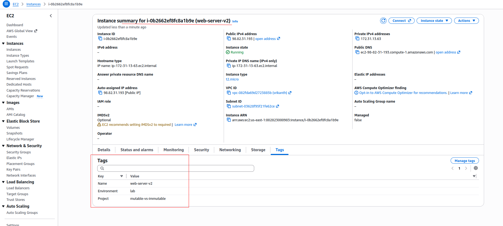

### 4. Part 2 — immutable change (AMI)

Pointed the instance at the Ubuntu AMI instead of Amazon Linux 2:

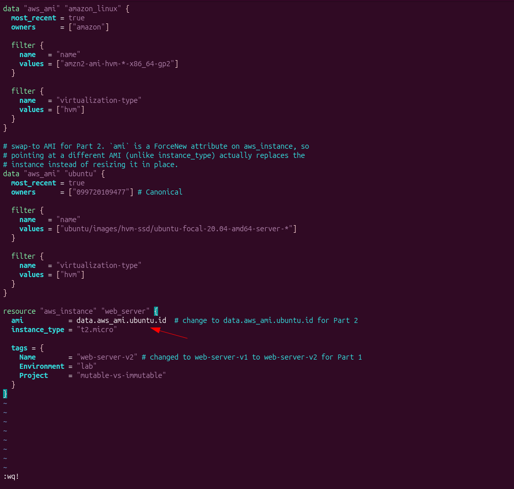

```bash
terraform plan
```

Completely different symbol this time — `-/+ destroy and then create replacement`, `must be replaced`, and `ami` explicitly called out with `# forces replacement`:

```
# aws_instance.web_server must be replaced
-/+ resource "aws_instance" "web_server" {
      ~ ami = "ami-002db1d61667182d2" -> "ami-0fb0b230890ccd1e6" # forces replacement
      ~ id  = "i-0b2662ef8fc8a1b9e" -> (known after apply)
      ...
    }

Plan: 1 to add, 0 to change, 1 to destroy.
```

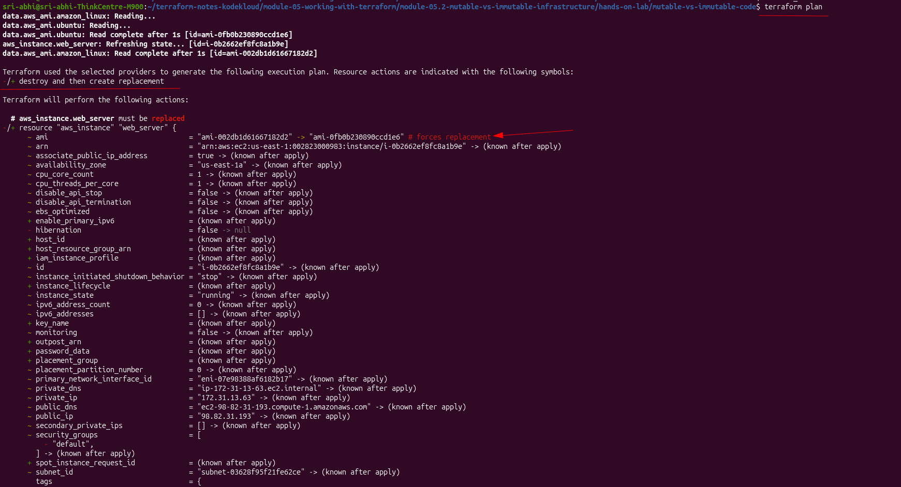

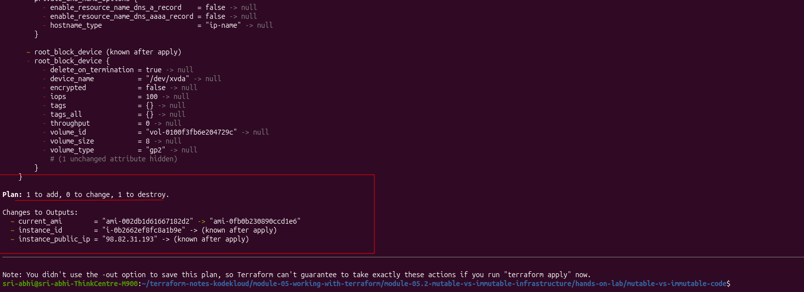

```bash
terraform apply
```

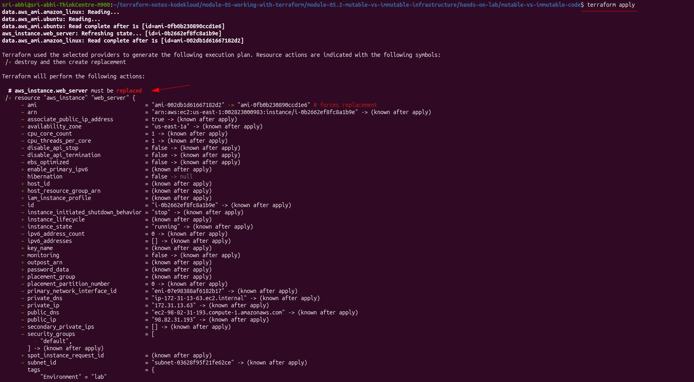

```
aws_instance.web_server: Destroying... [id=i-0b2662ef8fc8a1b9e]
aws_instance.web_server: Still destroying... [id=i-0b2662ef8fc8a1b9e, 00m30s elapsed]
aws_instance.web_server: Destruction complete after 31s

aws_instance.web_server: Creating...
aws_instance.web_server: Creation complete after 14s [id=i-0292984e9644234f4]

Apply complete! Resources: 1 added, 0 changed, 1 destroyed.

current_ami         = "ami-0fb0b230890ccd1e6"
instance_id         = "i-0292984e9644234f4"
instance_public_ip  = "44.195.59.234"
```

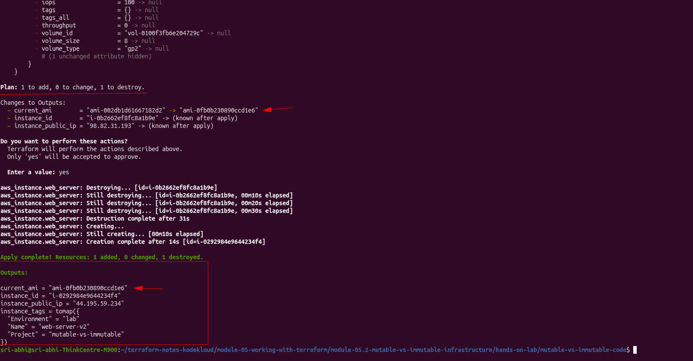

Genuinely a different instance now: new ID (`i-0292984e9644234f4`, was `i-0b2662ef8fc8a1b9e`), new public IP (`44.195.59.234`, was `98.82.31.193`), new AMI. The old instance shows up in the console as **Terminated**:

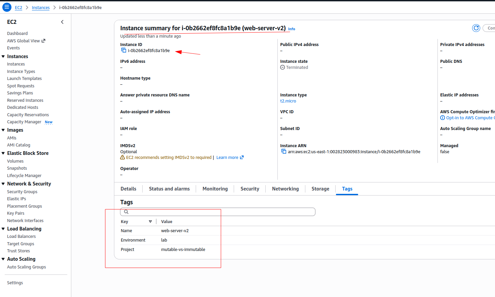

### 5. Clean up

```bash
terraform destroy
```

---

## What This Confirms

| | Tag change (Part 1) | AMI change (Part 2) |
|---|---|---|
| Plan symbol | `~` | `-/+` |
| Instance ID | `i-0b2662ef8fc8a1b9e` both times | `i-0b2662ef8fc8a1b9e` → `i-0292984e9644234f4` |
| Public IP | `98.82.31.193` both times | `98.82.31.193` → `44.195.59.234` |
| Action | Modify | Destroy & Create |
| Downtime | none | ~31s destroy + 14s create, unless I add `create_before_destroy` |

Matches what [Module 5.2](../README.md) says: Terraform isn't purely mutable or purely immutable — it picks per-attribute, based on whether the provider marks that attribute as ForceNew. Tags aren't ForceNew. `ami` is. `instance_type` isn't (a common assumption I got wrong the first time around, before actually running this).

**Optional follow-up:** add `lifecycle { create_before_destroy = true }` to the resource, re-run the AMI change, and watch the plan create the new instance *before* destroying the old one instead of after.
