# Hands-On Lab: Lifecycle Rules

> Companion hands-on lab for [Module 5.3: Lifecycle Rules](../README.md). Code lives in [`lifecycle-rules-code/`](lifecycle-rules-code) — this is what you actually run locally (`cd` into that folder and use standard `terraform init`/`plan`/`apply`).

---

## What I Built

One EC2 instance and one S3 bucket, in the same config, each set up to demonstrate different rules:

- **`aws_instance.web`** (`ec2_instance.tf`) — `create_before_destroy = true` and `ignore_changes = [tags]` together, so I can test both rules against the same instance without spinning up extra resources.
- **`aws_s3_bucket.protected`** (`protected_bucket.tf`) — `prevent_destroy = true`, to test that Terraform actually refuses to remove it.

Files: `provider.tf`, `ec2_instance.tf`, `protected_bucket.tf`, `outputs.tf`.

---

## Walking Through It

### 1. Deploy the baseline

```bash
cd lifecycle-rules-code
terraform init
terraform apply
```

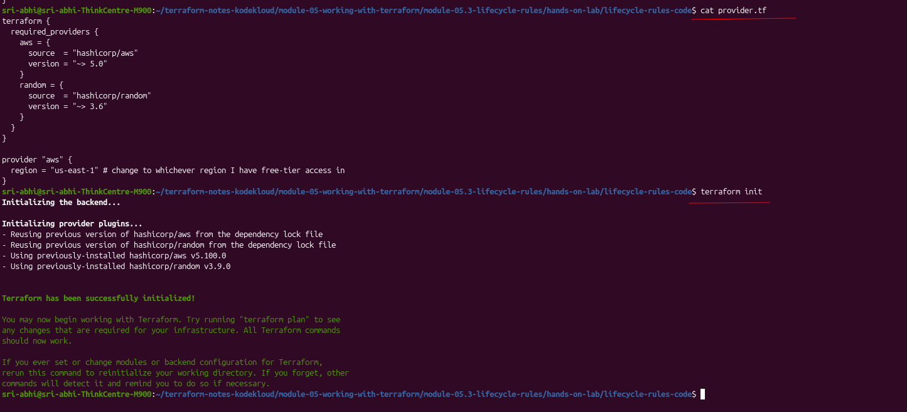

`terraform plan` (folded into `apply`) resolved the AMI data sources and showed a plain `+ create` for both resources — nothing lifecycle-related kicks in until something actually *changes*:

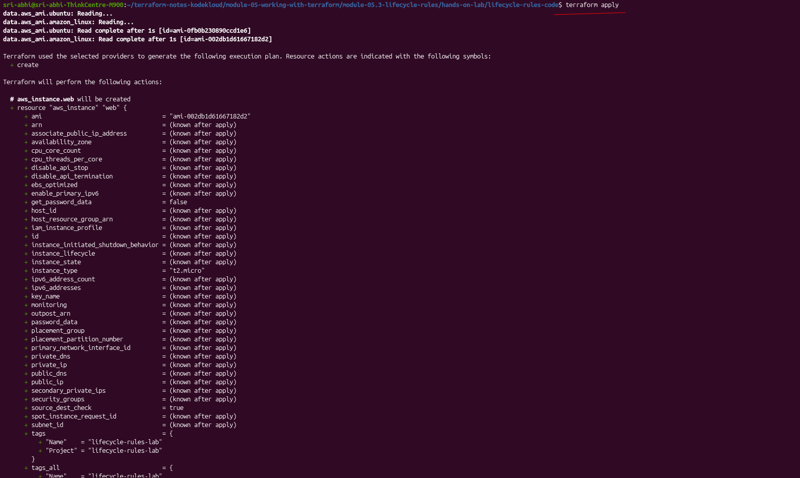

```
random_id.bucket_suffix: Creation complete after 0s [id=jD8Xfg]
aws_s3_bucket.protected: Creation complete after 3s [id=lifecycle-rules-lab-8c3f177e]
aws_instance.web: Creation complete after 15s [id=i-04f451ea77a3e83dc]

Apply complete! Resources: 3 added, 0 changed, 0 destroyed.

instance_ami        = "ami-002db1d61667182d2"
instance_id         = "i-04f451ea77a3e83dc"
instance_public_ip  = "44.201.42.123"
protected_bucket_name = "lifecycle-rules-lab-8c3f177e"
```

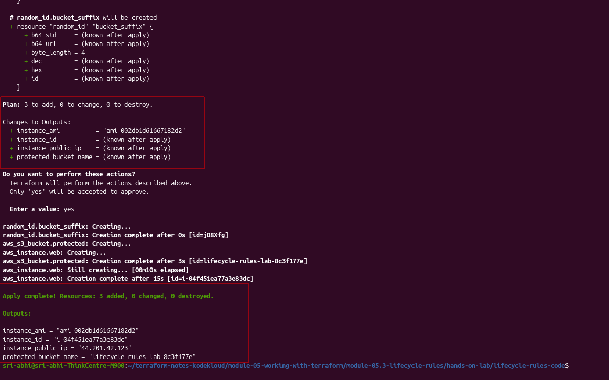

Confirmed in the console — instance `i-04f451ea77a3e83dc`, tagged `Name = lifecycle-rules-lab`, `Project = lifecycle-rules-lab`:

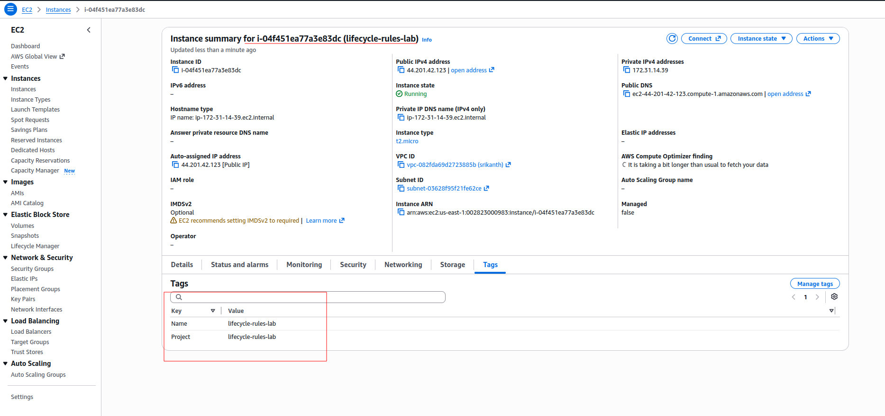

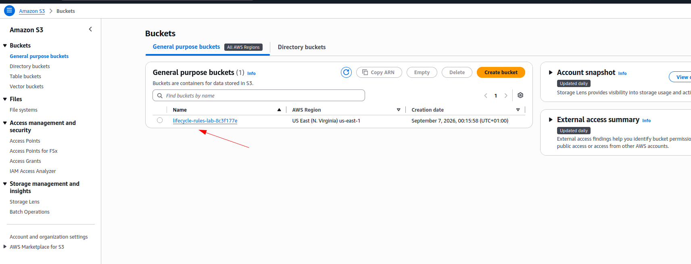

### 2. Test `create_before_destroy`

Edited `ec2_instance.tf`, swapping the instance's `ami` from `data.aws_ami.amazon_linux.id` to `data.aws_ami.ubuntu.id` — the `lifecycle` block (`create_before_destroy = true`, `ignore_changes = [tags]`) is still in place at this point:

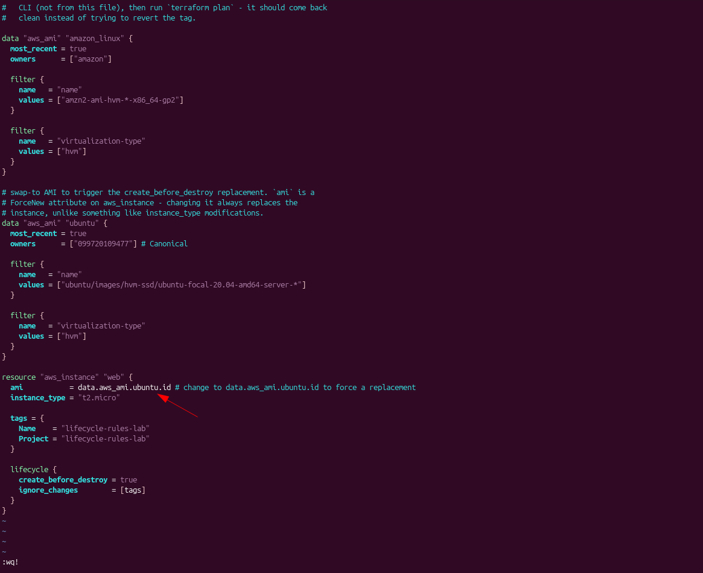

```bash
terraform plan
```

With the rule active, the plan header reads `+/- create replacement and then destroy` — new instance first:

```
# aws_instance.web must be replaced
+/- resource "aws_instance" "web" {
      ~ ami = "ami-002db1d61667182d2" -> "ami-0fb0b230890ccd1e6" # forces replacement
      ...
    }

Plan: 1 to add, 0 to change, 1 to destroy.
```


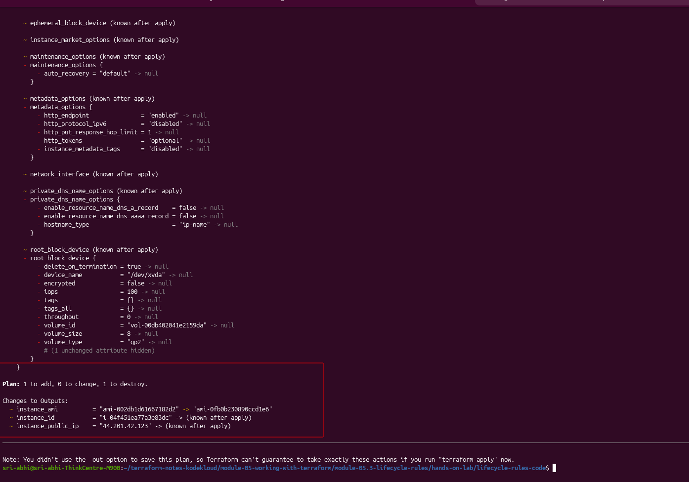

To actually see the contrast, I temporarily deleted the `lifecycle` block from the file and reran the plan:

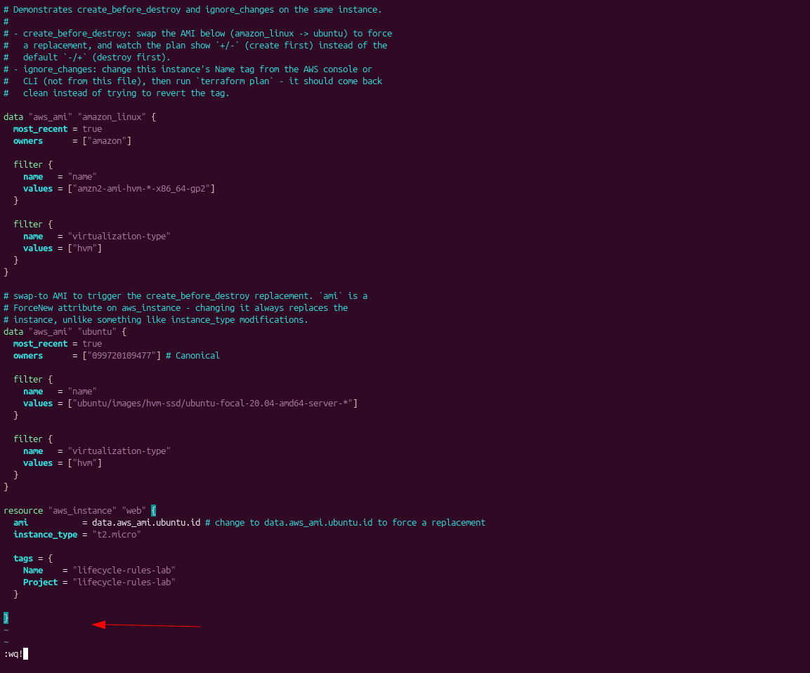

Without the rule, the header flips to `-/+ destroy and then create replacement` — the default, old instance torn down first:

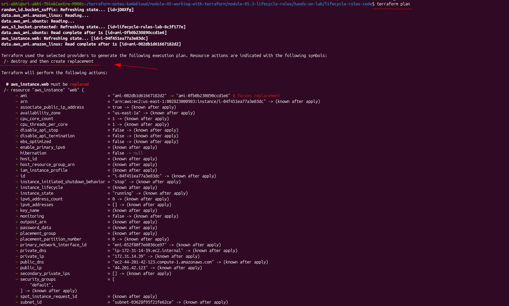

Restored the `lifecycle` block (both `create_before_destroy` and `ignore_changes`) and ran it for real:

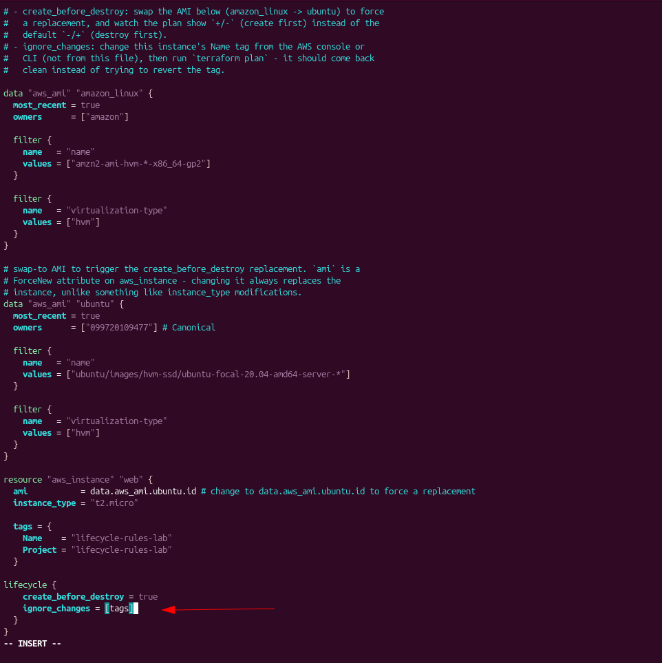

```bash
terraform apply
```

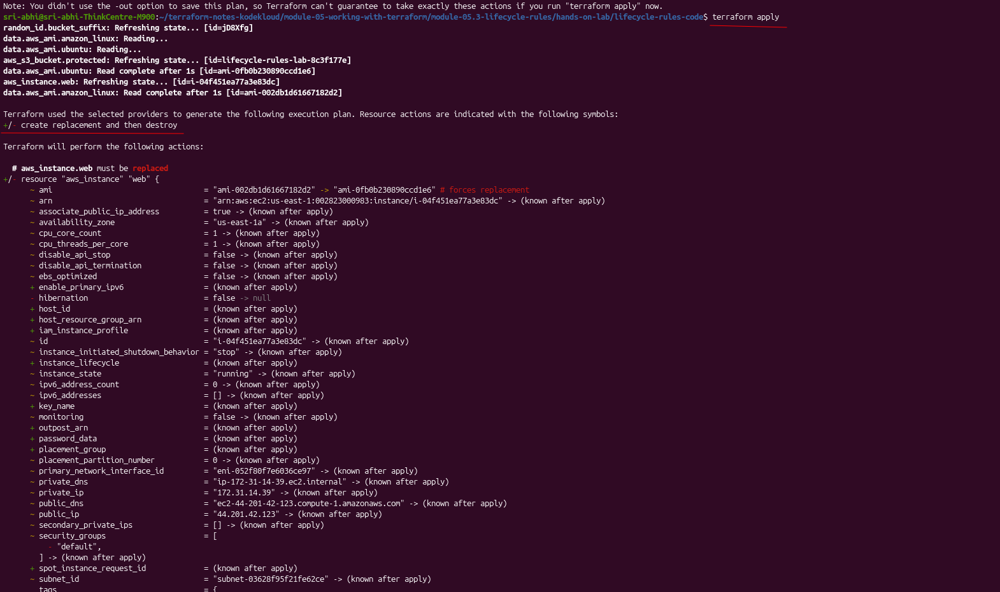

```
aws_instance.web: Creating...
aws_instance.web: Still creating... [00m10s elapsed]
aws_instance.web: Creation complete after 15s [id=i-0e833f3ec038c41a9]
aws_instance.web (deposed object 2bcb33d1): Destroying... [id=i-04f451ea77a3e83dc]
aws_instance.web: Still destroying... [id=i-04f451ea77a3e83dc, 00m10s elapsed]
aws_instance.web: Still destroying... [id=i-04f451ea77a3e83dc, 00m20s elapsed]
aws_instance.web: Destruction complete after 21s

Apply complete! Resources: 1 added, 0 changed, 1 destroyed.

instance_ami        = "ami-0fb0b230890ccd1e6"
instance_id         = "i-0e833f3ec038c41a9"
instance_public_ip  = "44.201.47.85"
```

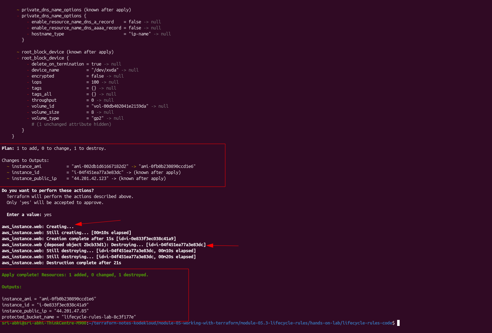

Right there in the log: the **new** instance (`i-0e833f3ec038c41a9`) finished creating before the **old** one (`i-04f451ea77a3e83dc`, now shown as a "deposed object") started destroying. Console confirms the new instance up and running:

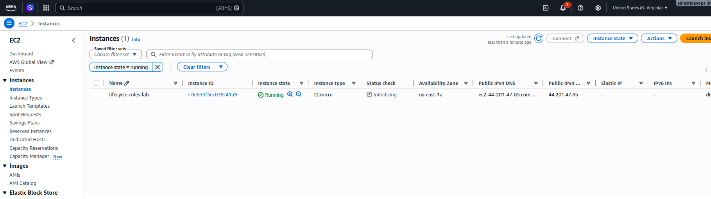

### 3. Test `ignore_changes`

Starting point: the new instance (`i-0e833f3ec038c41a9`) with its normal tags —

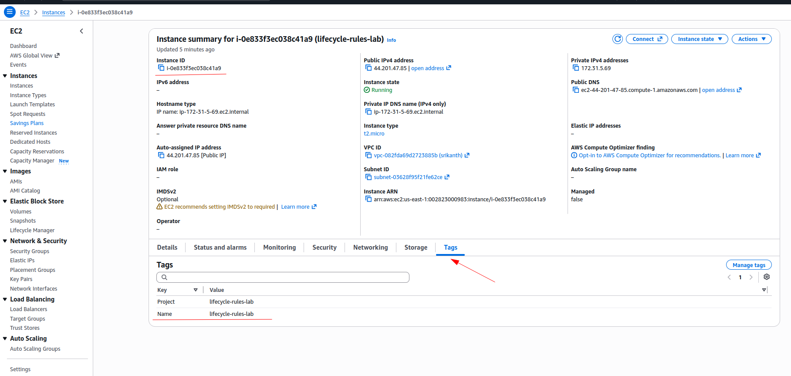

Changed the `Name` tag from outside Terraform, via the CLI:

```bash
terraform output instance_id
# i-0e833f3ec038c41a9

aws ec2 create-tags \
  --resources i-0e833f3ec038c41a9 \
  --tags Key=Name,Value=changed-externally
```

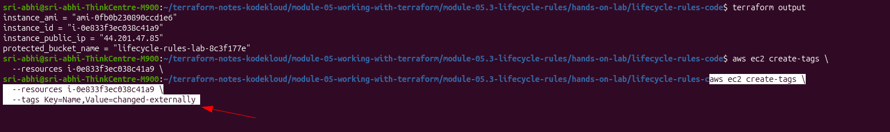

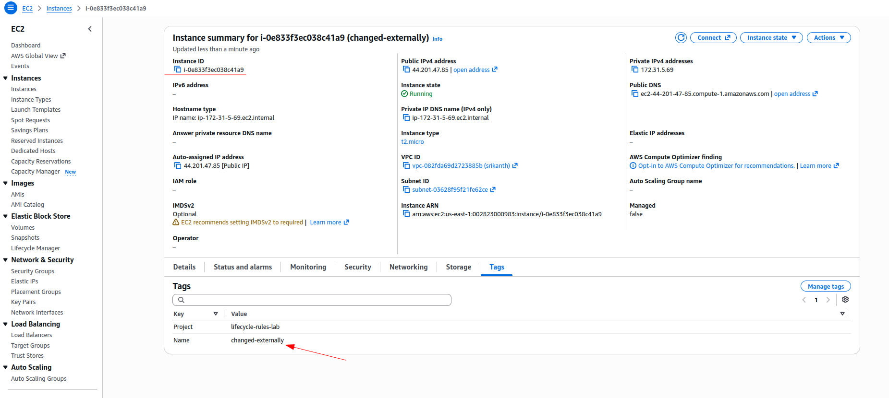

With `ignore_changes = [tags]` still active in `ec2_instance.tf`:

```bash
terraform plan
```

```
No changes. Your infrastructure matches the configuration.
```

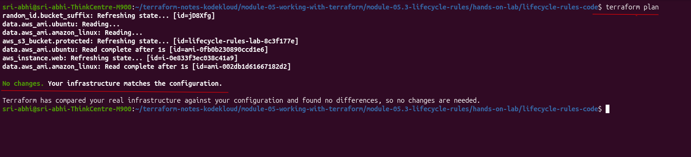

Confirmed the rule was actually there before removing it:

![ec2_instance.tf - ignore_changes = [tags] confirmed present](images/19-ec2-instance-tf-ignore-changes-present.png)

Then removed the `ignore_changes = [tags]` line to see what Terraform *would* have done without it:

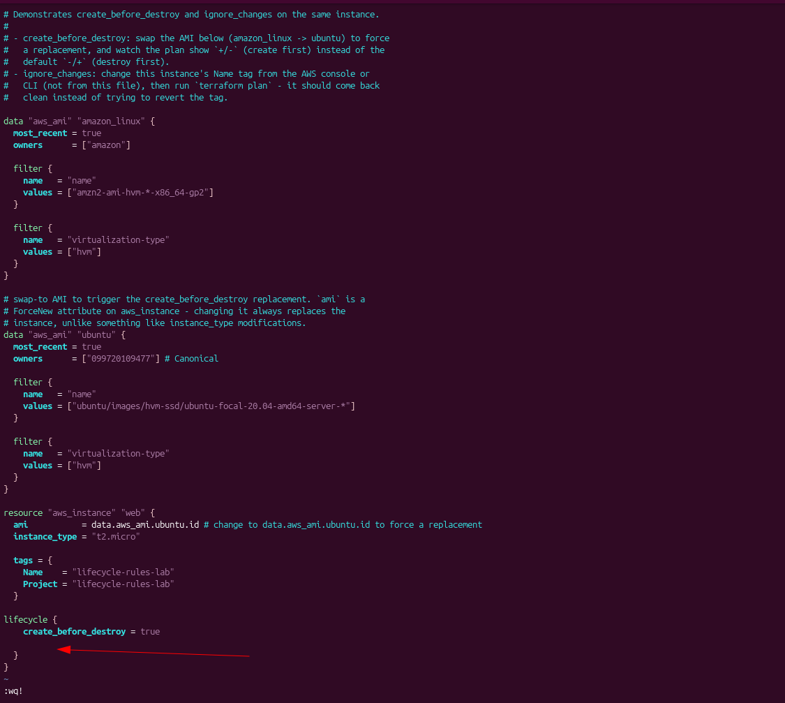

```bash
terraform plan
```

```
# aws_instance.web will be updated in-place
~ resource "aws_instance" "web" {
      id   = "i-0e833f3ec038c41a9"
    ~ tags = {
        ~ "Name" = "changed-externally" -> "lifecycle-rules-lab"
          "Project" = "lifecycle-rules-lab"
        }
    }

Plan: 0 to add, 1 to change, 0 to destroy.
```

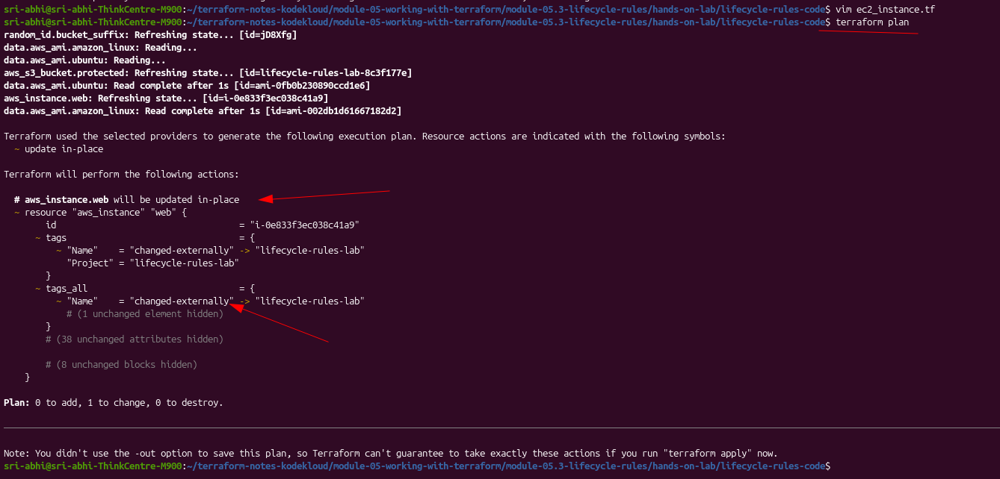

Without the rule, Terraform wants to fight the external change and revert it. Ran `apply` to actually watch that happen:

```
aws_instance.web: Modifying... [id=i-0e833f3ec038c41a9]
aws_instance.web: Modifications complete after 3s [id=i-0e833f3ec038c41a9]

Apply complete! Resources: 0 added, 1 changed, 0 destroyed.
```

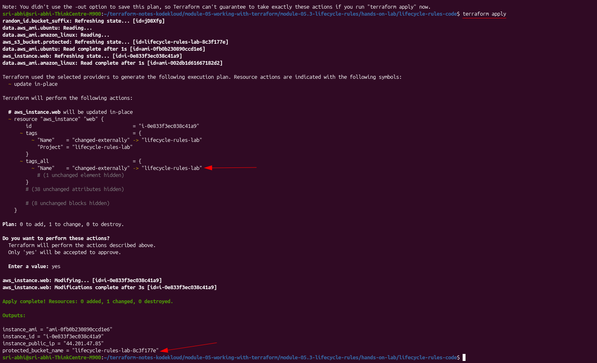

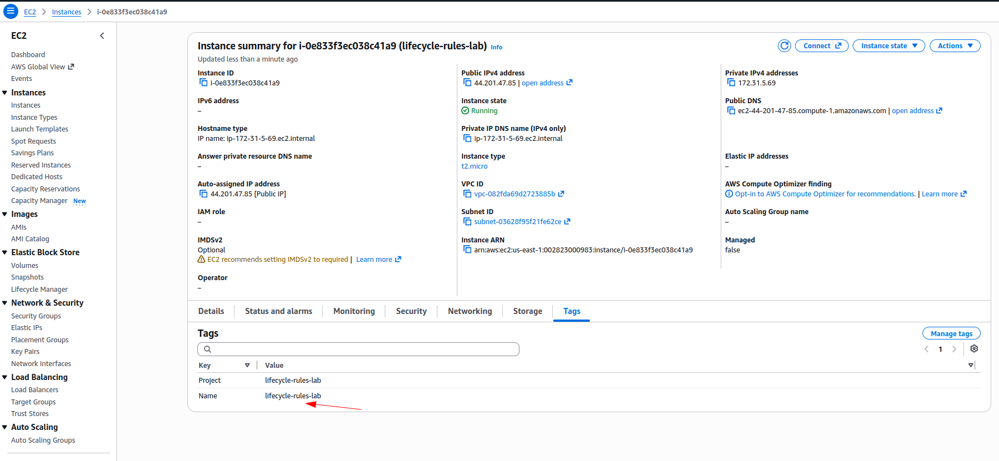

Restored `ignore_changes = [tags]` in the file afterward, before moving on to the `prevent_destroy` test.

### 4. Test `prevent_destroy`

With both rules back in place — `ignore_changes` on the instance, `prevent_destroy = true` on the bucket:

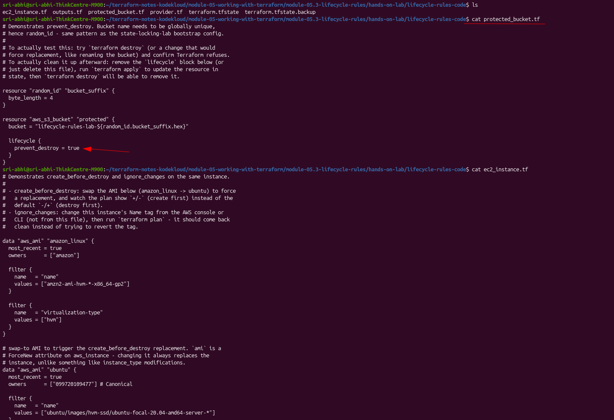

```bash
terraform destroy
```

Terraform builds the destroy plan (2 resources — the instance has no `prevent_destroy`, only the bucket does), then refuses to go through with it:

```
Terraform planned the following actions, but then encountered a problem:
  # aws_instance.web will be destroyed
  # aws_s3_bucket.protected will be destroyed

Plan: 0 to add, 0 to change, 2 to destroy.

Error: Instance cannot be destroyed

  on protected_bucket.tf line 14:
  14: resource "aws_s3_bucket" "protected" {

Resource aws_s3_bucket.protected has lifecycle.prevent_destroy set, but the
plan calls for this resource to be destroyed. To avoid this error and
continue with the plan, either disable lifecycle.prevent_destroy or reduce
the scope of the plan using the -target option.
```

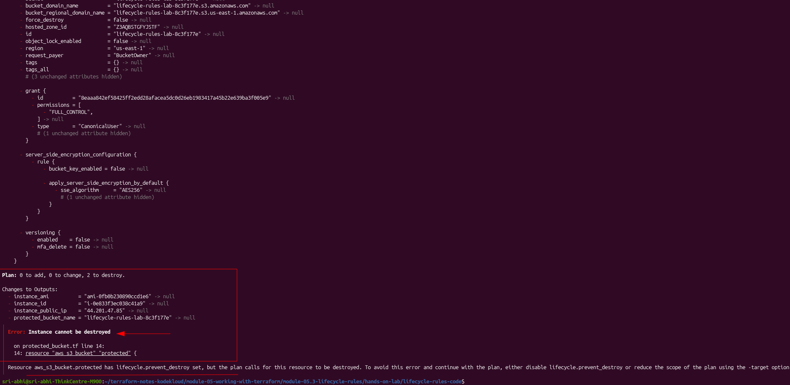

One protected resource, and the *entire* destroy plan fails — not just the bucket. That's the "all-or-nothing" behavior: Terraform won't selectively destroy everything else and leave the protected resource dangling; it stops the whole operation up front.

### 5. Clean up

`prevent_destroy` reads the *current config*, not state — so I didn't need an intermediate `terraform apply` to "disarm" it before destroying, contrary to what I expected going in. Deleting the `lifecycle` block from `protected_bucket.tf` and running `terraform destroy` directly was enough:

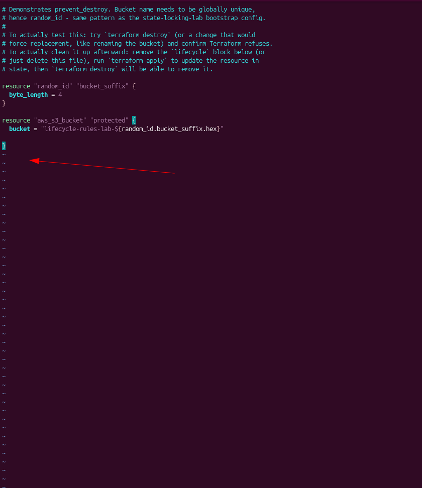

```bash
terraform destroy
```

```
Plan: 0 to add, 0 to change, 3 to destroy.

Do you really want to destroy all resources?
  Enter a value: yes

aws_s3_bucket.protected: Destroying... [id=lifecycle-rules-lab-8c3f177e]
aws_instance.web: Destroying... [id=i-0e833f3ec038c41a9]
aws_s3_bucket.protected: Destruction complete after 1s
random_id.bucket_suffix: Destruction complete after 0s
aws_instance.web: Still destroying... [id=i-0e833f3ec038c41a9, 00m10s elapsed]
aws_instance.web: Still destroying... [id=i-0e833f3ec038c41a9, 00m20s elapsed]
aws_instance.web: Destruction complete after 21s

Destroy complete! Resources: 3 destroyed.
```

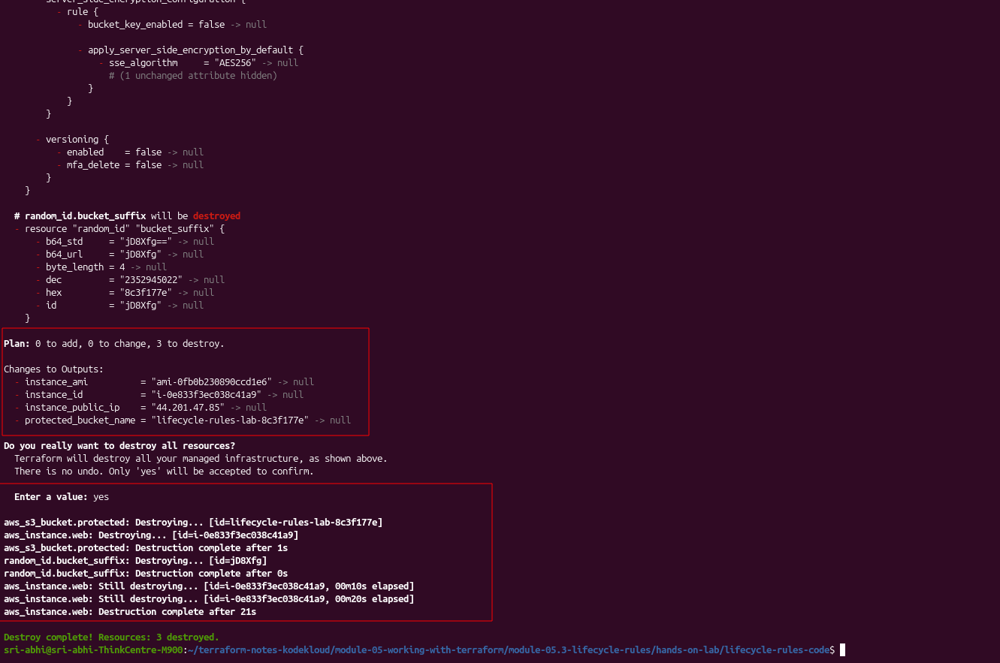

---

## What This Confirms

| Rule | Test | Without the rule | With the rule |
|---|---|---|---|
| `create_before_destroy` | Swap the AMI (forces replacement) | `-/+` destroy and then create — old instance gone before the new one exists | `+/-` create replacement and then destroy — new instance (`i-0e833f3ec038c41a9`) up 15s before the old one (`i-04f451ea77a3e83dc`) is destroyed |
| `ignore_changes` | Change the `Name` tag from the AWS CLI | Plan reverts the tag back to `lifecycle-rules-lab` on the next `apply` | `No changes.` — Terraform leaves the externally-set tag alone |
| `prevent_destroy` | `terraform destroy` | *(no comparison — this rule has no useful "without" state; that's just the default)* | Whole destroy plan blocked with `Error: Instance cannot be destroyed`, even though only the bucket has the rule |

**What surprised me:** I assumed cleaning up a `prevent_destroy` resource needed a `terraform apply` first to update the state before `terraform destroy` would cooperate. It doesn't — `prevent_destroy` is a config-time check, not a state-time one, so removing the `lifecycle` block and going straight to `terraform destroy` worked in one step.

**Real-world takeaways:**
- `create_before_destroy` is what you'd actually want on anything serving live traffic — the AMI-swap test is a stand-in for a real deploy.
- `ignore_changes` is for resources some other system also touches — auto-tagging, ASG-managed attributes, etc. — where you want Terraform to stop fighting them.
- `prevent_destroy` is a real safety net: it blocked the *entire* `terraform destroy`, not just the protected resource, which is exactly the behavior you'd want on something like a production database.

Matches [Module 5.3](../README.md)'s framing of all three rules — this just makes it concrete with actual instance IDs and AWS console screenshots instead of theory.
