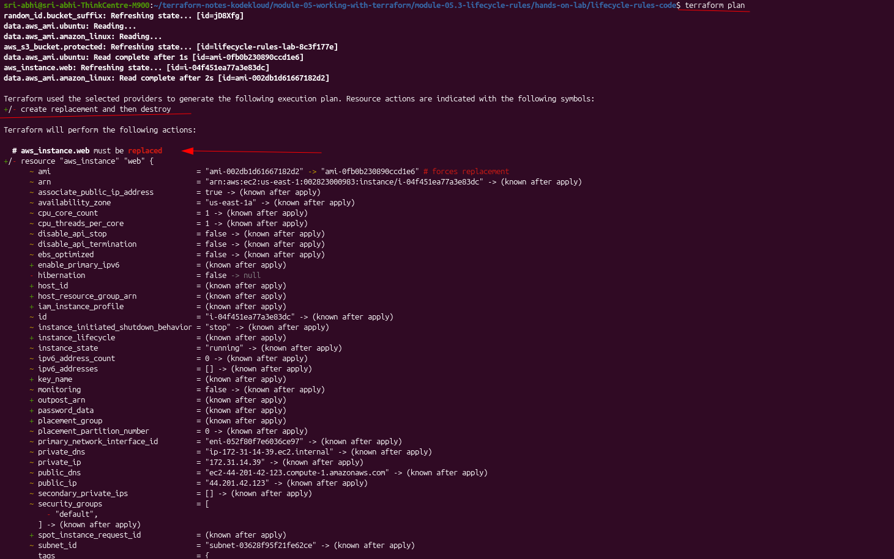

# 📘 Module 5.5: Meta-Arguments

> Special arguments that work on any resource block — controlling creation order, lifecycle, and how many copies get created

---

## Introduction

**Meta-arguments** are special arguments that modify how Terraform resources behave. They're not specific to any one provider or resource type — they control advanced behavior like resource dependencies, lifecycle, and creating multiple instances.

By default, Terraform figures out the order to create resources on its own, based on references between them. Meta-arguments let you step in and control exactly **how** and **when** resources are created, on top of that default behavior.

---

## Understanding the Problem

### The Problem: Terraform Can't Always See the Dependency

Terraform usually infers order automatically — if one resource references another's attribute (like `aws_security_group.app.id`), Terraform knows to create the security group first. But not every dependency shows up as a reference in the code:

```hcl
resource "aws_instance" "app" {
  ami           = data.aws_ami.ubuntu.id
  instance_type = "t2.micro"
}

resource "aws_security_group" "app" {
  name = "app-sg"

  ingress {
    from_port   = 80
    to_port     = 80
    protocol    = "tcp"
    cidr_blocks = ["0.0.0.0/0"]
  }
}
```

**Problem:** Nothing in `aws_instance.app` actually references `aws_security_group.app` here, so Terraform has no way to know one depends on the other. It might create them in any order. ❌

### The Solution: Use a Meta-Argument

```hcl
resource "aws_instance" "app" {
  ami           = data.aws_ami.ubuntu.id
  instance_type = "t2.micro"

  depends_on = [aws_security_group.app]  # ← wait for this first
}

resource "aws_security_group" "app" {
  name = "app-sg"

  ingress {
    from_port   = 80
    to_port     = 80
    protocol    = "tcp"
    cidr_blocks = ["0.0.0.0/0"]
  }
}
```

**Solution:** `depends_on` makes the dependency explicit — the security group is guaranteed to exist before the instance is created. ✅

---

## What Are Meta-Arguments?

Meta-arguments are special arguments that apply to **any** resource block, regardless of provider or resource type. They control:
- Resource creation order (`depends_on`)
- How a resource is replaced (`lifecycle`)
- How many copies of a resource get created (`count`, and `for_each` — covered next module)

They sit alongside a resource's normal arguments but aren't part of the underlying AWS API — Terraform intercepts and handles them itself.

---

## Common Meta-Arguments

### 1. `depends_on`

**What it does:** Explicitly declares a dependency between resources, for cases Terraform can't infer on its own.

```hcl
resource "aws_security_group" "web" {
  name = "web-sg"

  ingress {
    from_port   = 80
    to_port     = 80
    protocol    = "tcp"
    cidr_blocks = ["0.0.0.0/0"]
  }
}

resource "aws_instance" "web" {
  ami           = data.aws_ami.ubuntu.id
  instance_type = "t2.micro"

  depends_on = [aws_security_group.web]  # create SG first
}
```

**What happens:**
1. Security group created first ✅
2. EC2 instance created second, once the SG exists ✅

**When to use it:** Only when Terraform genuinely can't see the dependency — e.g. an IAM policy that has to exist before code that assumes it runs, with no direct attribute reference tying them together. If a resource already references another resource's attribute (like `security_groups = [aws_security_group.web.id]`), Terraform infers the order automatically and `depends_on` is redundant.

From the [Module 3.8 explicit-dependency lab](../../module-03-terraform-basics/module-03.8-resource-dependencies-in-terraform/README.md) — an EC2 instance's IAM instance profile only works once the role policy is attached, but nothing in `aws_instance.app_server` references `aws_iam_role_policy.ec2_s3_read` directly, so `depends_on` spells it out:

![aws_iam_role_policy.ec2_s3_read next to aws_instance.app_server with depends_on = [aws_iam_role_policy.ec2_s3_read], commented "EXPLICIT DEPENDENCY: policy must be attached before the instance boots and assumes the role"](images/01-depends-on-explicit-dependency.png)

---

### 2. `lifecycle`

**What it does:** Controls how a resource is created, updated, and destroyed. Covered in detail in [Module 5.3: Lifecycle Rules](../module-05.3-lifecycle-rules/README.md) — `create_before_destroy`, `prevent_destroy`, `ignore_changes`.

```hcl
resource "aws_instance" "web" {
  ami           = data.aws_ami.ubuntu.id
  instance_type = "t2.micro"

  lifecycle {
    create_before_destroy = true
  }
}
```

**When to use it:** Production resources that can't tolerate downtime, critical databases, anything where the default destroy-then-create behavior is a problem.

From the [Module 5.3 lifecycle-rules lab](../module-05.3-lifecycle-rules/hands-on-lab/README.md) — the same `create_before_destroy` in real code, and the effect it has on the plan when the AMI changes:

![ec2_instance.tf with lifecycle { create_before_destroy = true, ignore_changes = [tags] }](images/02-lifecycle-create-before-destroy-code.png)



---

### 3. `count`

**What it does:** Creates multiple copies of the same resource from a single block.

```hcl
resource "aws_instance" "app" {
  count         = 3
  ami           = data.aws_ami.ubuntu.id
  instance_type = "t2.micro"

  tags = {
    Name = "app-server-${count.index}"
  }
}
```

**What happens:** Three EC2 instances get created — `app-server-0`, `app-server-1`, `app-server-2` — each addressed internally as `aws_instance.app[0]`, `aws_instance.app[1]`, `aws_instance.app[2]`.

**When to use it:** Identical resources where a numeric index is enough to tell them apart. For resources that need distinct, named configuration (not just a number), `for_each` is usually the better fit — covered next module.

---

## When to Use Each

| Meta-Argument | Use When | Example |
|---|---|---|
| **`depends_on`** | Terraform can't infer a real dependency on its own | EC2 waits for a security group with no direct attribute reference |
| **`lifecycle`** | You need to control how a resource is replaced | `create_before_destroy` for zero-downtime updates |
| **`count`** | You need N identical copies of a resource | Three EC2 instances, indexed `0`, `1`, `2` |

---

## Summary Table — All Meta-Arguments

Terraform has 7 meta-arguments in total. This module only went deep on the first three (`depends_on`, `lifecycle`, `count`) — `for_each`, `provider`, `provisioner`, and `timeouts` are here for the full picture, with their own modules or callouts coming later.

| Meta-Argument | Purpose | Common Use |
|---|---|---|
| `depends_on` | Explicit dependencies | Control creation order |
| `count` | Create multiple instances | Simple looping |
| `for_each` | Iterate over maps/lists | Advanced looping |
| `lifecycle` | Control replacement | Zero-downtime updates |
| `provider` | Specify which provider | Multi-region/account |
| `provisioner` | Run scripts | NOT recommended ❌ |
| `timeouts` | Operation duration limits | Slow resources |

---

## How Many Meta-Arguments?

**7 meta-arguments in Terraform:**

- ✅ `depends_on` — control order
- ✅ `count` — create N copies
- ✅ `for_each` — iterate over a map/list
- ✅ `lifecycle` — control replacement
- ✅ `provider` — multi-region / multi-account
- ⚠️ `provisioner` — avoid where possible
- ✅ `timeouts` — operation limits

**Most important 3:**
1. `depends_on` — control order
2. `count` — create multiple
3. `for_each` — advanced looping

---

## Summary

Meta-arguments aren't resource-specific — they work the same way on any `resource` block. Without them, Terraform still does the right thing most of the time — it infers order from references and creates one of everything. They're for the cases where you need to say more than that. 🎯

---

## Next Steps

- [Module 5.6: Count](../module-05.6-count/README.md) — static vs. dynamic count, and the index-shifting pitfall when a `count`-driven list changes
- Module 5.7: `for_each` — advanced looping with maps
