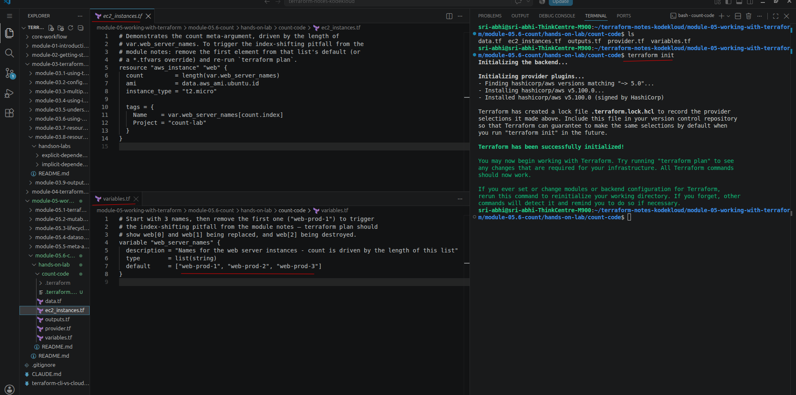
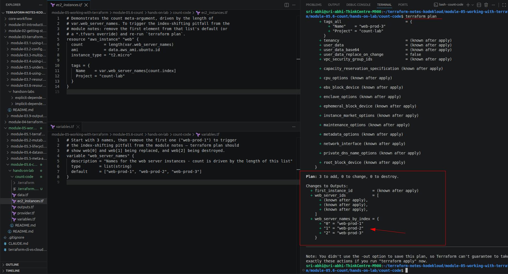
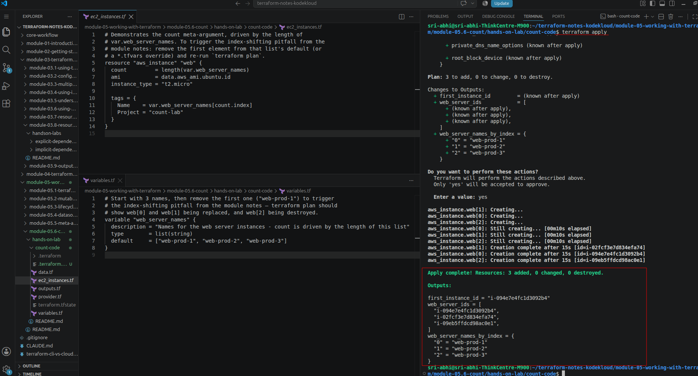
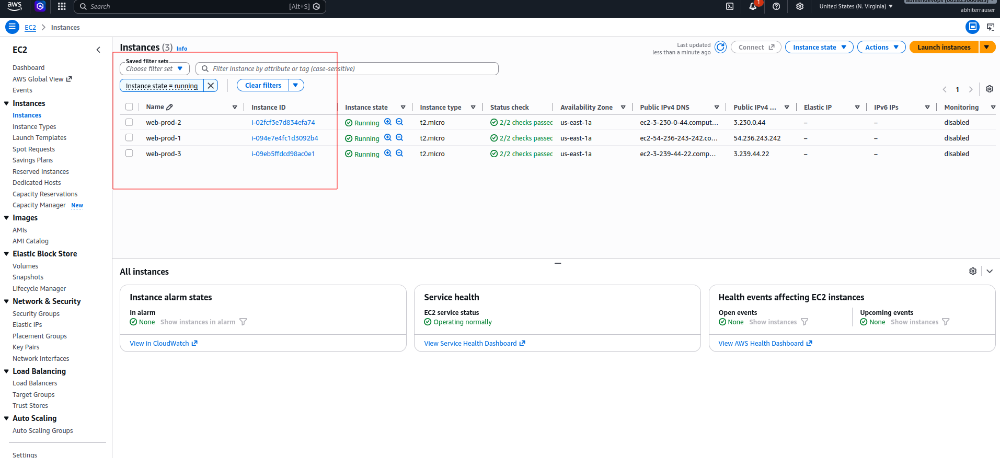
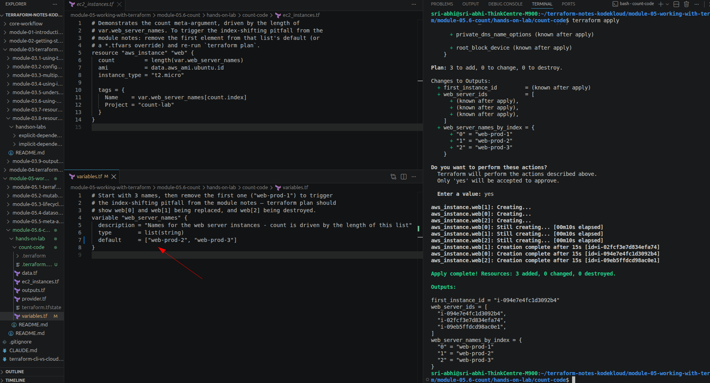
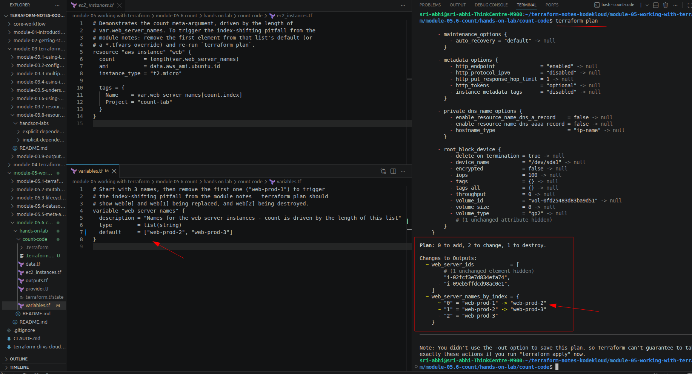
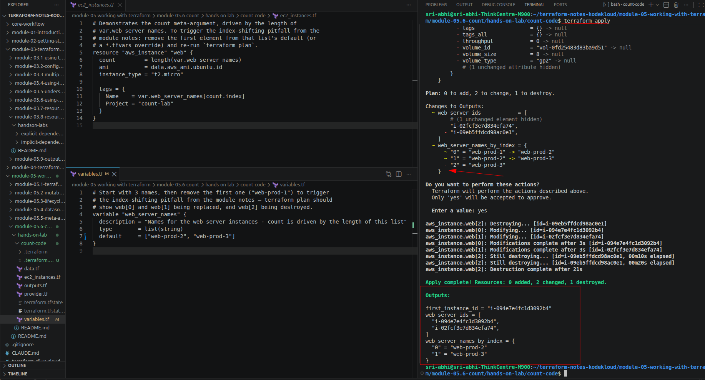
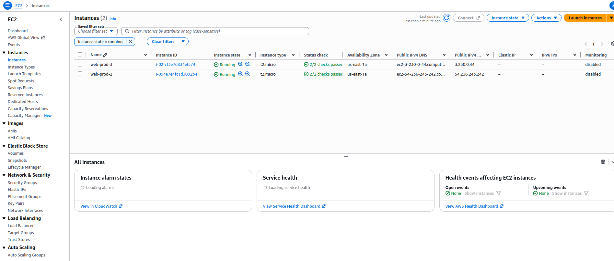
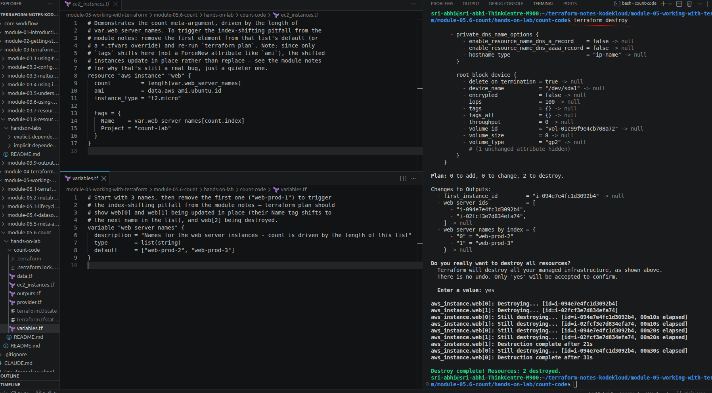

# Hands-On Lab: Count

> Companion hands-on lab for [Module 5.6: Count](../README.md). Code lives in [`count-code/`](count-code) — this is what you actually run locally (`cd` into that folder and use standard `terraform init`/`plan`/`apply`).

---

## What I Built

One `aws_instance` block with `count = length(var.web_server_names)`, so the number of instances — and their names — comes entirely from `variables.tf`:

- **`variables.tf`** — `web_server_names`, a list of 3 names (`web-prod-1`, `web-prod-2`, `web-prod-3`).
- **`ec2_instances.tf`** — `aws_instance.web`, `count` driven by `length(var.web_server_names)`, each instance tagged `Name = var.web_server_names[count.index]`.
- **`data.tf`** — the same Ubuntu AMI datasource pattern from the [05.3](../../module-05.3-lifecycle-rules/hands-on-lab/README.md) and [05.4](../../module-05.4-datasources/README.md) labs.
- **`outputs.tf`** — all instance IDs (`[*]`), a map of index → name, and one specific instance (`[0]`).

The point of this lab isn't the instances themselves — it's what happens to their *indices* when the list they're generated from changes.

Files: `provider.tf`, `data.tf`, `variables.tf`, `ec2_instances.tf`, `outputs.tf`.

---

## Walking Through It

### 1. Deploy the baseline

```bash
cd count-code
terraform init
```



```bash
terraform plan
```

Plain `+ create` for all 3 — nothing lifecycle-related here, just `count` reading `length(var.web_server_names)` as `3`:

```
Plan: 3 to add, 0 to change, 0 to destroy.

Changes to Outputs:
  + web_server_names_by_index = {
      + "0" = "web-prod-1"
      + "1" = "web-prod-2"
      + "2" = "web-prod-3"
    }
```



```bash
terraform apply
```

```
aws_instance.web[1]: Creation complete after 15s [id=i-02fcf3e7d834efa74]
aws_instance.web[0]: Creation complete after 15s [id=i-094e7e4fc1d3092b4]
aws_instance.web[2]: Creation complete after 15s [id=i-09eb5ffdcd98ac0e1]

Apply complete! Resources: 3 added, 0 changed, 0 destroyed.

web_server_names_by_index = {
  "0" = "web-prod-1"
  "1" = "web-prod-2"
  "2" = "web-prod-3"
}
```



Confirmed in the AWS console — 3 running instances, names matching `web[0]`/`web[1]`/`web[2]`:



### 2. Trigger the index-shifting pitfall

Edited `variables.tf` and removed the **first** element from the default list — `web-prod-1` gone, `web-prod-2`/`web-prod-3` still there:



```bash
terraform plan
```

**Not** a clean "1 to destroy." Instead:

```
Plan: 0 to add, 2 to change, 1 to destroy.

Changes to Outputs:
  ~ web_server_names_by_index = {
      ~ "0" = "web-prod-1" -> "web-prod-2"
      ~ "1" = "web-prod-2" -> "web-prod-3"
      - "2" = "web-prod-3"
    }
```



This is the pitfall from the [module notes](../README.md#️-the-pitfall-index-shifting) happening for real — but note the plan says **"2 to change,"** not "2 to replace." `tags` isn't a ForceNew attribute on `aws_instance`, so `web[0]` and `web[1]` just get their `Name` tag updated in place; only `web[2]`, which no longer exists in the new list, actually gets destroyed. (If the shifted attribute had been something ForceNew, like `ami`, this same plan would show `must be replaced` for `web[0]`/`web[1]` instead.)

### 3. Apply it and watch what actually moves

```bash
terraform apply
```

```
aws_instance.web[2]: Destroying... [id=i-09eb5ffdcd98ac0e1]
aws_instance.web[0]: Modifying... [id=i-094e7e4fc1d3092b4]
aws_instance.web[1]: Modifying... [id=i-02fcf3e7d834efa74]
aws_instance.web[0]: Modifications complete after 3s [id=i-094e7e4fc1d3092b4]
aws_instance.web[1]: Modifications complete after 3s [id=i-02fcf3e7d834efa74]
aws_instance.web[2]: Destruction complete after 21s

Apply complete! Resources: 0 added, 2 changed, 1 destroyed.

web_server_names_by_index = {
  "0" = "web-prod-2"
  "1" = "web-prod-3"
}
```



Right there in the log: `Modifying...`, not `Destroying...`, for `web[0]` and `web[1]` — and the instance IDs (`i-094e7e4fc1d3092b4`, `i-02fcf3e7d834efa74`) are **identical** to the ones from the baseline apply. Confirmed in the console — same 2 instance IDs still running, just relabeled:



So removing `web-prod-1` from the front of the list didn't delete the `web-prod-1` instance at all. `i-094e7e4fc1d3092b4` — the physical VM that was originally created *as* `web-prod-1` — is still running right now, just wearing a `web-prod-2` tag. The instance that actually got destroyed, `i-09eb5ffdcd98ac0e1`, was originally `web-prod-3` — the one instance I never asked to touch.

### 4. Clean up

```bash
terraform destroy
```

```
Plan: 0 to add, 0 to change, 2 to destroy.

aws_instance.web[0]: Destroying... [id=i-094e7e4fc1d3092b4]
aws_instance.web[1]: Destroying... [id=i-02fcf3e7d834efa74]
aws_instance.web[1]: Destruction complete after 2s
aws_instance.web[0]: Destruction complete after 31s

Destroy complete! Resources: 2 destroyed.
```



---

## What This Confirms

| | Wanted | Expected (naively) | What actually happened |
|---|---|---|---|
| Removing `web-prod-1` | Delete exactly 1 instance — the one named `web-prod-1` | `terraform plan` shows `1 to destroy`, nothing else touched | `2 to change, 1 to destroy` — `web[0]`/`web[1]` get their `Name` tag silently rewritten, and the instance actually destroyed (`i-09eb5ffdcd98ac0e1`) was originally `web-prod-3`, not `web-prod-1` |
| The `web-prod-1` instance (`i-094e7e4fc1d3092b4`) | Gone | Gone | Still running, now mislabeled `web-prod-2` |

**Why this happens:** Terraform doesn't remember instances by name — it remembers them by their *slot number* (`web[0]`, `web[1]`, `web[2]`). When I deleted `web-prod-1` from the list, everything after it just slid up one slot. Terraform has no way to know I meant "delete the first one" — all it sees is "slot 0's name changed, slot 1's name changed, and slot 2 doesn't exist anymore." So it relabels slots 0 and 1, and deletes whatever was sitting in slot 2 — which just happened to be `web-prod-3`, the one instance I never wanted to touch.

**What surprised me:** I expected to see instances get destroyed and recreated, like the module notes described. That didn't happen — the tag is just a label, and Terraform is fine changing a label without rebuilding the instance. So instead of an obvious "these got rebuilt," what I got was quieter and sneakier: two instances silently got renamed, and the *last* instance in the list — not the one I actually removed — is the one that got deleted. If I hadn't checked the instance IDs, I'd have easily believed it deleted the right one.

**The fix:** `for_each` (Module 5.7) keys each resource by the string value itself (`aws_instance.web["web-prod-1"]`), so removing that one key only touches that one resource — no shifting, no wrong instance destroyed.
