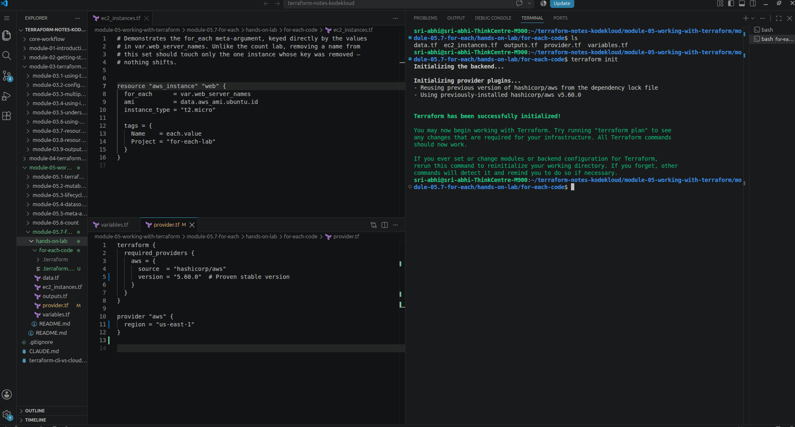
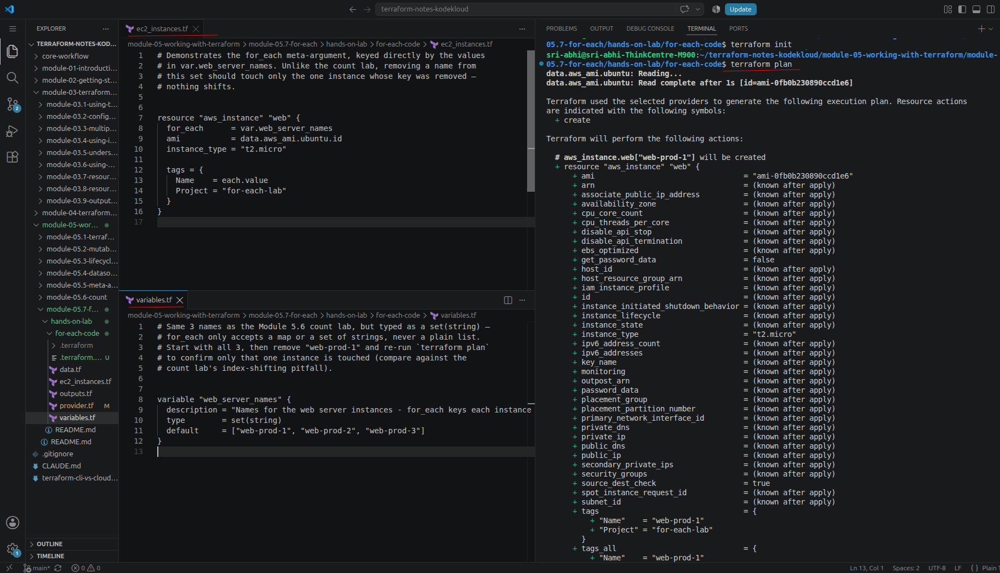
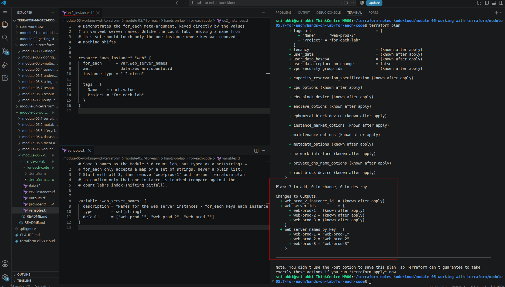
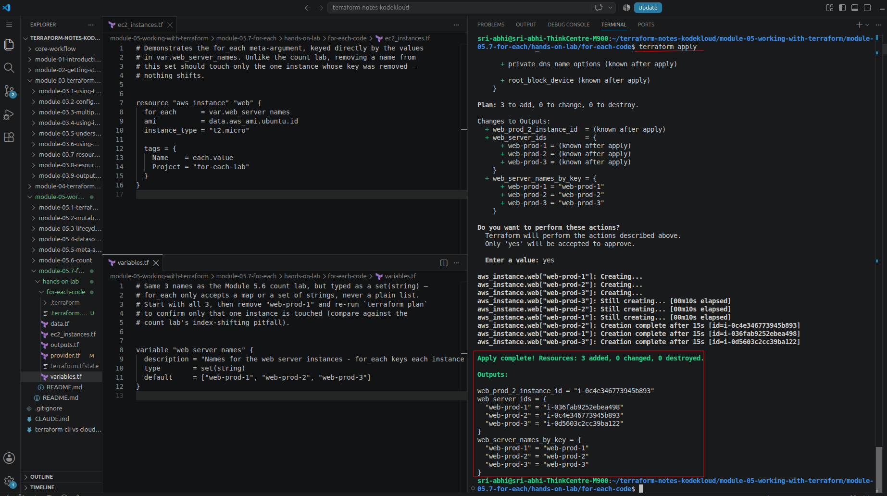
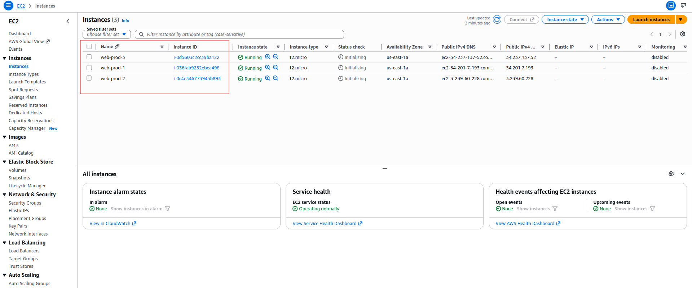
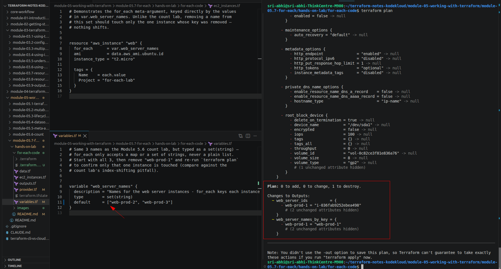
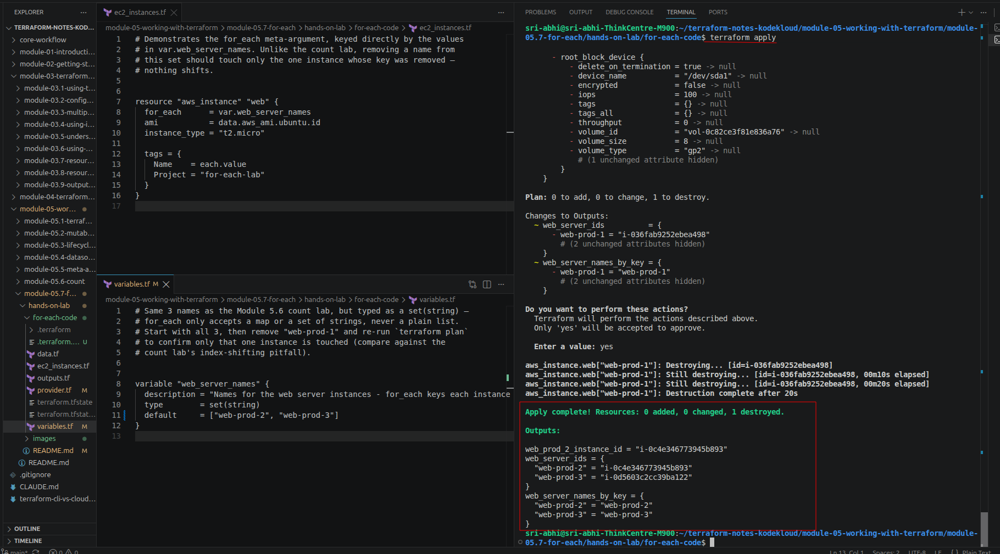
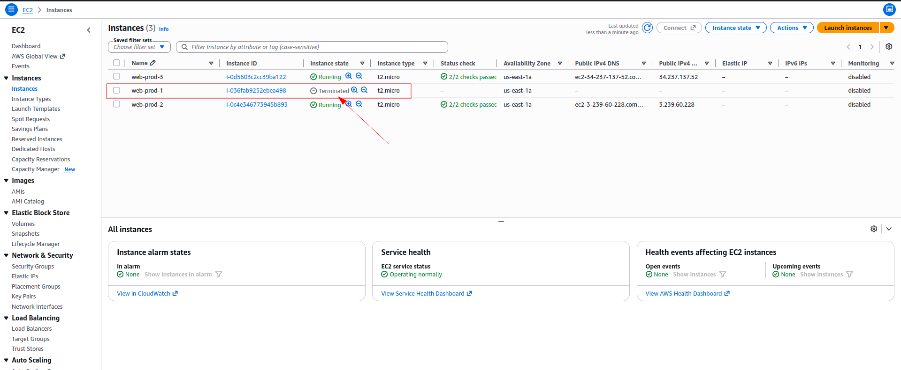

# Hands-On Lab: for_each

> Companion hands-on lab for [Module 5.7: for_each](../README.md). Code lives in [`for-each-code/`](for-each-code) — this is what you actually run locally (`cd` into that folder and use standard `terraform init`/`plan`/`apply`).

---

## What I Built

The same 3 servers as the [Module 5.6 count lab](../../module-05.6-count/hands-on-lab/README.md), rebuilt with `for_each` instead of `count` — so the two labs can be compared directly:

- **`variables.tf`** — `web_server_names`, now typed `set(string)` (not `list(string)`) since `for_each` won't accept a plain list.
- **`ec2_instances.tf`** — `aws_instance.web`, `for_each = var.web_server_names`, each instance tagged `Name = each.value`. No `count.index` anywhere.
- **`data.tf`** — the same Ubuntu AMI datasource pattern as the other Module 5 labs.
- **`outputs.tf`** — instance IDs keyed by name (a map, not a list), and one instance referenced directly by key (`aws_instance.web["web-prod-2"]`).

The point of this lab is the opposite of 5.6's: remove a name from the set and confirm that *only* the matching instance is touched — no shifting, no surprise deletions.

Files: `provider.tf`, `data.tf`, `variables.tf`, `ec2_instances.tf`, `outputs.tf`.

---

## Walking Through It

### 1. Deploy the baseline

```bash
cd for-each-code
terraform init
```

Reused the pinned AWS provider (`5.60.0`) from the dependency lock file:



```bash
terraform plan
```

Plain `+ create` for all 3, keyed by name instead of index — this is the part that matters, compared to 5.6:

```
# aws_instance.web["web-prod-1"] will be created
```



```
Plan: 3 to add, 0 to change, 0 to destroy.

Changes to Outputs:
  + web_prod_2_instance_id  = (known after apply)
  + web_server_ids          = {
      + web-prod-1 = (known after apply)
      + web-prod-2 = (known after apply)
      + web-prod-3 = (known after apply)
    }
  + web_server_names_by_key = {
      + web-prod-1 = "web-prod-1"
      + web-prod-2 = "web-prod-2"
      + web-prod-3 = "web-prod-3"
    }
```



```bash
terraform apply
```

```
aws_instance.web["web-prod-2"]: Creation complete after 15s [id=i-0c4e346773945b893]
aws_instance.web["web-prod-1"]: Creation complete after 15s [id=i-036fab9252ebea498]
aws_instance.web["web-prod-3"]: Creation complete after 15s [id=i-0d5603c2cc39ba122]

Apply complete! Resources: 3 added, 0 changed, 0 destroyed.

Outputs:

web_prod_2_instance_id = "i-0c4e346773945b893"
web_server_ids = {
  "web-prod-1" = "i-036fab9252ebea498"
  "web-prod-2" = "i-0c4e346773945b893"
  "web-prod-3" = "i-0d5603c2cc39ba122"
}
web_server_names_by_key = {
  "web-prod-1" = "web-prod-1"
  "web-prod-2" = "web-prod-2"
  "web-prod-3" = "web-prod-3"
}
```



Confirmed in the AWS console — 3 running instances, named `web-prod-1`/`web-prod-2`/`web-prod-3`, addressed in the plan/state by those same names instead of `[0]`/`[1]`/`[2]`:



### 2. Remove an element and confirm nothing shifts

Edited `variables.tf` and removed `"web-prod-1"` from the set:

```hcl
variable "web_server_names" {
  # ...
  default = ["web-prod-2", "web-prod-3"] # was ["web-prod-1", "web-prod-2", "web-prod-3"]
}
```

```bash
terraform plan
```

Exactly one line of change, like the notes predicted:

```
# aws_instance.web["web-prod-1"] will be destroyed

Plan: 0 to add, 0 to change, 1 to destroy.

Changes to Outputs:
  ~ web_server_ids          = {
      - web-prod-1 = "i-036fab9252ebea498"
        # (2 unchanged attributes hidden)
    }
  ~ web_server_names_by_key = {
      - web-prod-1 = "web-prod-1"
        # (2 unchanged attributes hidden)
    }
```



`web-prod-2` and `web-prod-3` don't appear in the plan at all — their keys never changed. Compare this directly against [Module 5.6's plan output](../../module-05.6-count/hands-on-lab/README.md) for the identical change (`2 to change, 1 to destroy`, and the wrong instance ending up deleted).

### 3. Apply it and confirm in the console

```bash
terraform apply
```

```
aws_instance.web["web-prod-1"]: Destroying... [id=i-036fab9252ebea498]
aws_instance.web["web-prod-1"]: Still destroying... [id=i-036fab9252ebea498, 00m10s elapsed]
aws_instance.web["web-prod-1"]: Still destroying... [id=i-036fab9252ebea498, 00m20s elapsed]
aws_instance.web["web-prod-1"]: Destruction complete after 20s

Apply complete! Resources: 0 added, 0 changed, 1 destroyed.

Outputs:

web_prod_2_instance_id = "i-0c4e346773945b893"
web_server_ids = {
  "web-prod-2" = "i-0c4e346773945b893"
  "web-prod-3" = "i-0d5603c2cc39ba122"
}
web_server_names_by_key = {
  "web-prod-2" = "web-prod-2"
  "web-prod-3" = "web-prod-3"
}
```



Only `aws_instance.web["web-prod-1"]` gets destroyed — `web-prod-2` and `web-prod-3` are never mentioned in the apply log at all, and their instance IDs (`i-0c4e346773945b893`, `i-0d5603c2cc39ba122`) are unchanged from the baseline apply. Confirmed in the AWS console: `web-prod-1` shows `Terminated`, `web-prod-2` and `web-prod-3` are still `Running` — not renamed, not recreated:



### 4. (Optional) Try removing a name from the middle instead of the end

Repeat step 2, but this time delete `"web-prod-2"` (the middle one) instead of the first. With `count`, removing a middle element is exactly as disruptive as removing the first — everything after it still shifts. With `for_each`, it shouldn't matter where in the set the removed name was; only that one key's instance should show up in the plan. Worth confirming for yourself since it's easy to assume "removing the first item is the special case."

### 5. Clean up

```bash
terraform destroy
```

---

## What This Confirms

| | Wanted | Expected (from the module notes) | What actually happened |
|---|---|---|---|
| Baseline deploy | 3 instances, keyed by name | `aws_instance.web["web-prod-1"]` etc., not `web[0]` | Matched — 3 clean creates, addressed by name throughout |
| Removing `web-prod-1` | Delete exactly 1 instance — the one named `web-prod-1` | `terraform plan` shows `1 to destroy`, nothing else touched | Matched exactly — `Plan: 0 to add, 0 to change, 1 to destroy`, only `web-prod-1` in the plan |
| `web-prod-2` / `web-prod-3` | Untouched | Never appear in the plan or apply log | Confirmed — same instance IDs (`i-0c4e346773945b893`, `i-0d5603c2cc39ba122`) before and after, never mentioned in either the plan or the apply log |

**Same baseline deploy, two addressing styles — side by side.** Both plans say `Plan: 3 to add, 0 to change, 0 to destroy`. The difference that matters is what each *instance* is called in the log:

`for_each` (this lab):

```
aws_instance.web["web-prod-2"]: Creation complete after 15s [id=i-0c4e346773945b893]
aws_instance.web["web-prod-1"]: Creation complete after 15s [id=i-036fab9252ebea498]
aws_instance.web["web-prod-3"]: Creation complete after 15s [id=i-0d5603c2cc39ba122]

Apply complete! Resources: 3 added, 0 changed, 0 destroyed.

Outputs:

web_prod_2_instance_id = "i-0c4e346773945b893"
web_server_ids = {
  "web-prod-1" = "i-036fab9252ebea498"
  "web-prod-2" = "i-0c4e346773945b893"
  "web-prod-3" = "i-0d5603c2cc39ba122"
}
web_server_names_by_key = {
  "web-prod-1" = "web-prod-1"
  "web-prod-2" = "web-prod-2"
  "web-prod-3" = "web-prod-3"
}
```

`count` ([5.6's baseline apply](../../module-05.6-count/hands-on-lab/README.md)):

```
aws_instance.web[1]: Creation complete after 15s [id=i-02fcf3e7d834efa74]
aws_instance.web[0]: Creation complete after 15s [id=i-094e7e4fc1d3092b4]
aws_instance.web[2]: Creation complete after 15s [id=i-09eb5ffdcd98ac0e1]

Apply complete! Resources: 3 added, 0 changed, 0 destroyed.

web_server_names_by_index = {
  "0" = "web-prod-1"
  "1" = "web-prod-2"
  "2" = "web-prod-3"
}
```

Notice `for_each`'s log already tells you *which server* each line is about — `web["web-prod-2"]` — while `count`'s log only tells you *which slot* — `web[1]` — and you'd have to cross-reference `web_server_names_by_index` separately to know that slot `1` means `web-prod-2`. That readability gap is the same root cause as the removal pitfall: `count` identity is a position, `for_each` identity is the value itself.

**Why this happens:** `for_each` keys each instance by the string value itself (`each.key` = `"web-prod-1"`), not by its position in the set. Removing `"web-prod-1"` from `variables.tf` just makes that one key disappear from the map Terraform is iterating over — `web-prod-2` and `web-prod-3` still have the same keys they always had, so Terraform has no reason to touch them. There's no slot to shift into, because there was never a slot to begin with.

**Direct contrast with [5.6's pitfall](../../module-05.6-count/hands-on-lab/README.md#what-this-confirms):** removing the identical name from the identical starting list produced `2 to change, 1 to destroy` under `count` (with the *wrong* instance — `web-prod-3` — actually getting destroyed), versus a clean `0 to change, 1 to destroy` under `for_each` (with the *right* instance destroyed, `web-prod-1`, exactly as named). Same starting data, same edit, same intent — the only variable is `count` vs `for_each`, and that's the whole difference between a silent-relabeling bug and a plan that does exactly what it says.

**Not yet done:** step 4 (removing a name from the *middle* of the set, to rule out "only the first item is special"). Step 5 is done — `web-prod-2` and `web-prod-3` have been destroyed via `terraform destroy`, so nothing from this lab is running anymore.
