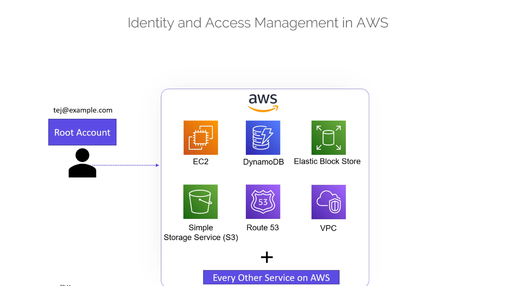
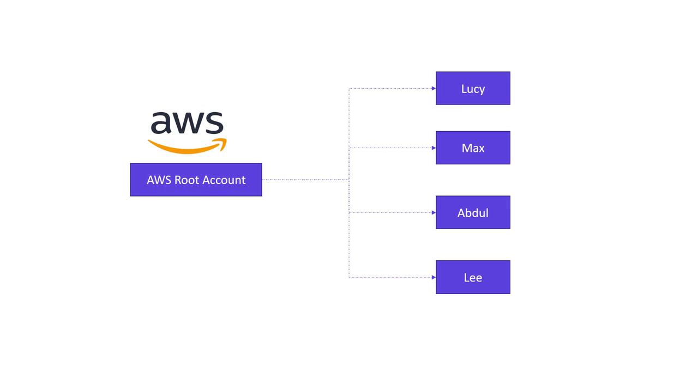
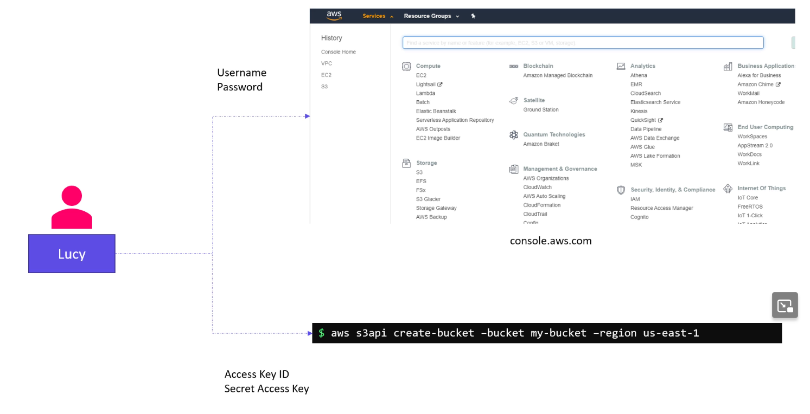
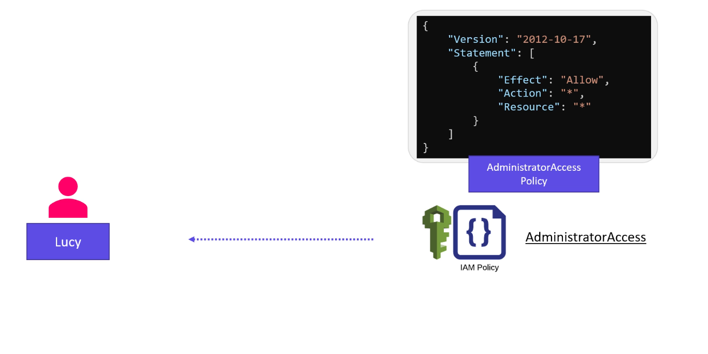
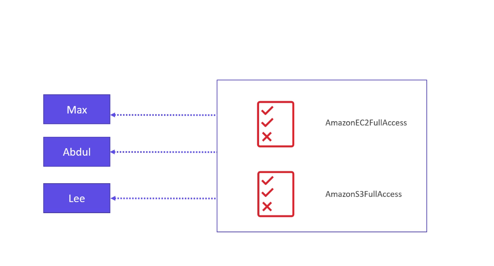
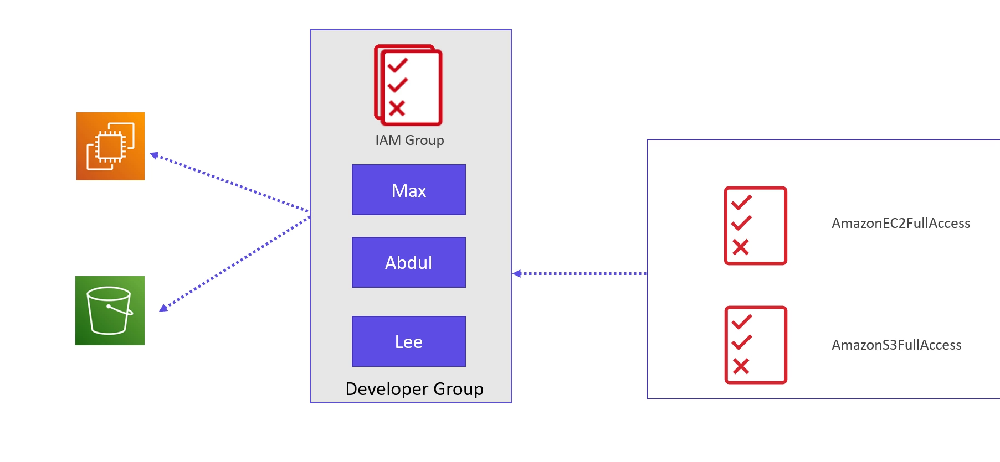
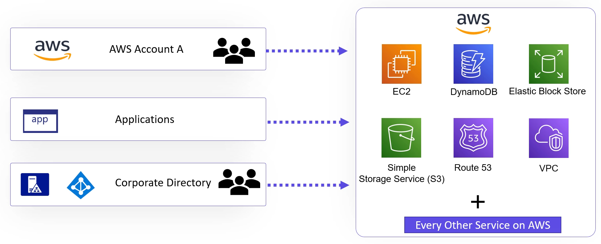

# 📘 Module 6.1: Introduction to IAM

> AWS won't let anything touch a resource without permission first — IAM is where I define who (or what) is allowed to do what.

---

## Introduction

Every AWS lab in this repo so far has quietly assumed I already have permission to create the EC2 instances, S3 buckets, and DynamoDB tables Terraform asks for. The [4.1 purpose-of-state](../../module-04-terraform-state/module-04.1-purpose-of-state/README.md) and [5.9 terraform block](../../module-05-working-with-terraform/module-05.9-the-terraform-block/README.md) notes both use an S3 backend without ever explaining *why* my AWS credentials are allowed to touch that bucket in the first place. That's the gap IAM (Identity and Access Management) fills — it's the system that decides who gets to do what to which AWS resource, and it's what my AWS provider is actually authenticating against every time I run `terraform plan`.

Module 6 is an AWS-services detour before I go further with Terraform: IAM first, then S3 and DynamoDB — the exact two services the state backend from Module 4 already leans on.



---

## Root Account vs IAM Users

Signing up for AWS with an email and password creates the **root account** — full, unrestricted access to everything in that account, comparable to `root` on Linux or Administrator on Windows.

AWS's own guidance is blunt about this: don't use the root account for daily work. Use it once, to create individual **IAM users**, then lock the root credentials away (MFA on it, credentials not stored anywhere routine) and do everything else as one of those IAM users instead.

So a small team — Lucy, Max, Abdul, Lee — each gets their own IAM user, created from the root account, instead of everyone sharing root logins.



---

## Two Kinds of Access

An IAM user can be given either or both of:

1. **Console access** — a username and password to sign in to the AWS Management Console (the web UI).
2. **Programmatic access** — an access key ID and secret access key, used by the CLI, SDKs, or (relevant here) Terraform's AWS provider.

```bash
aws s3api create-bucket --bucket my-bucket --region us-east-1
```

That command only works if whatever credentials the AWS CLI is using resolve to an IAM identity with `s3:CreateBucket` permission. Access keys authenticate the *request*; they don't grant console login, and console credentials don't work as CLI/API keys — the two are separate.



---

## Assigning Permissions

A new IAM user starts with **zero permissions** — least privilege by default. Permissions come from **policies**, JSON documents attached to a user, group, or role.

AWS ships managed policies for common cases. `AdministratorAccess` is the broadest one:

```json
{
    "Version": "2012-10-17",
    "Statement": [
        {
            "Effect": "Allow",
            "Action": "*",
            "Resource": "*"
        }
    ]
}
```

`"Action": "*"` on `"Resource": "*"` — every action, every resource. That's what I'd attach to someone like Lucy if she's the project's technical lead and genuinely needs full account access. AWS also has narrower managed policies for specific jobs (billing, database admin, networking) — the point of a *managed* policy is I don't write these by hand, AWS maintains them.



### Groups, for Shared Permissions

If Max, Abdul, and Lee all need the same EC2 and S3 access, I don't attach `AmazonEC2FullAccess` and `AmazonS3FullAccess` to each of them individually —



— I create a **group** (e.g. "Developer Group"), attach the policies to the group once, and add all three users to it. Anyone who needs something extra on top can still get a policy attached directly to their own user.



---

## IAM Roles — Permissions for AWS Services, Not People

Everything above is about human users. But an EC2 instance doesn't have an IAM user of its own, and it might still need to read from an S3 bucket. For that, AWS uses an **IAM role** instead: a set of permissions (a policy, same as before) that isn't tied to a person, but gets *assumed* — by an EC2 instance, another AWS account, or an external identity provider.

Concretely: create a role (e.g. "S3 Access Role"), attach `AmazonS3FullAccess` to it, and attach the role to the EC2 instance. The instance can now call S3 without ever holding a long-lived access key — it gets temporary credentials for as long as the role is attached.

This same mechanism is behind cross-account access, and behind letting users from an external identity source (like an organization's Active Directory) get *temporary* AWS access without becoming full-blown IAM users.



---

## Custom Policies

Managed policies cover common cases; a custom policy is for something specific. If I only want a user able to tag and untag EC2 instances — nothing else:

```json
{
    "Version": "2012-10-17",
    "Statement": [
        {
            "Effect": "Allow",
            "Action": [
                "ec2:CreateTags",
                "ec2:DeleteTags"
            ],
            "Resource": "*"
        }
    ]
}
```

Same JSON shape as a managed policy — `Effect`, `Action`, `Resource` — just scoped to exactly the actions I listed instead of `*`.

---

## Attach a Policy Directly, or Assume a Role?

Both routes land the *exact same* permissions on whoever ends up calling AWS — same JSON, same `Effect`/`Action`/`Resource`. Attaching a policy straight to a user (like `AdministratorAccess` on Lucy, above) and attaching that same policy to a role instead grant identical access. What differs is the **shape of the identity holding it**: a standing one with a permanent credential, or a temporary one you have to actively *become* for a session.

**Attach directly to a user (or group), when:**
- There's genuinely no mechanism available to assume a role instead — the caller isn't running on AWS compute (no EC2/Lambda instance profile to lean on) and isn't coming through a federated identity provider (no SAML/OIDC trust set up).
- A legacy tool or third-party integration only speaks static access keys and has no support for temporary, assumed credentials at all.
- A break-glass/emergency account that has to work even if SSO/federation itself is down — kept tightly locked down (MFA, rarely used, closely audited) as a genuine last resort, not a daily-driver identity.

**Assume a role, when:**
- The caller is an AWS service acting on my behalf — an EC2 instance, a Lambda function. These get an *instance profile* or *execution role*: temporary credentials get injected and rotated automatically, and there's never a static secret sitting in a config file to leak. This is the EC2 → S3 example above.
- It's cross-account access — instead of creating a brand-new IAM user in Account B for someone from Account A, Account B defines a role that trusts Account A, and the person assumes it. No new standing credential exists in Account B at all.
- It's a human, and federation is available (IAM Identity Center, or a corporate identity provider) — the identity lives in the IdP, and AWS just maps it to a role, assumable for the length of that one session. So a team like Lucy, Max, Abdul, and Lee would go through Identity Center → an assumed role, not four standalone IAM users each holding a permanent access key.
- A third-party SaaS tool needs to reach into my AWS account (monitoring, CI/CD, backups) — a cross-account role (with an external ID) is the standard secure pattern instead of handing it an access key.

**Why roles win by default:** the credentials a role hands out are temporary and expire on their own (commonly anywhere from an hour to twelve), so a leaked one has a bounded lifetime instead of staying valid until someone notices and rotates it. There's also nothing sitting at rest to leak in the first place — no access key living in a `.env` file or a CI secret store — because the credentials are minted fresh each time the role is assumed, and every assumption is logged, which makes "who did what, using which identity" far easier to trace than a shared static key.

The one thing a role can't do is grant itself: something has to be *able* to assume it. Where that mechanism genuinely doesn't exist yet, a directly-attached policy on a user is still the correct call, not a shortcut — the goal isn't "never use a user," it's "don't reach for a permanent credential when a temporary one would do the same job."

### What This Looks Like Day-to-Day

Working through the console labs, the pattern I kept landing on was: each person gets **one baseline policy attached directly** — admin, read-only, whatever matches their day-to-day job — and if a specific task needs more than that, I create a role instead, with its own (often multiple) policies attached, and let the person assume it just for that task. The elevated permissions are only active while the role is assumed, and disappear again once the task's done.

That's actually two separate decisions stacked on top of each other, and it's worth keeping them apart:

1. **Is the baseline identity itself permanent or temporary?** A directly-attached policy on an IAM user is permanent — it's not a role, so it doesn't expire on its own. The fuller version of best practice (from the section above) would make even *this* baseline temporary, by putting the person through IAM Identity Center instead of a standalone IAM user — they'd sign in, get a session mapped to a role with that same baseline policy, and the whole thing expires when they sign out.
2. **Do task-specific elevated permissions come from a role?** Yes, always — this is the part I already had right. Multiple policies bundled into a role, assumed only for the task, gone when the session ends.

So "baseline direct policy + temporary role for extra tasks" is a real, reasonable pattern — plenty of teams run exactly this. It's just one step short of the fullest recommendation, which pushes the *baseline* itself to be session-based too, not only the elevated add-on.

---

## Summary

IAM controls who — human or AWS service — can do what to which resource. I covered:

- ✅ Root account vs. IAM users, and why root should only be used to create the latter
- ✅ Console access (password) vs. programmatic access (access key ID + secret), and that they're separate credential types
- ✅ Policies (JSON) as the actual permission grant — managed policies (`AdministratorAccess`) vs. custom ones
- ✅ Groups, for attaching one set of policies to many users at once
- ✅ Roles, for giving an AWS *service* (not a person) temporary, assumable permissions
- ✅ Direct-attach vs. assume-role isn't about the permission (same policy either way) — it's a permanent credential vs. a temporary one, and roles win whenever there's a mechanism available to assume one
- ✅ In practice: one permanent baseline policy per person, plus a temporary role assumed only for tasks that need more — two separate decisions (is the baseline itself permanent or temporary, and do extras come from a role), not one

---

## Key Takeaway

**IAM = who's allowed to do what, to which resource — and that "who" can be a person or an AWS service.**

- ✅ Root account: create IAM users with it, then stop using it
- ✅ Console access and programmatic access (access keys) are separate credential types
- ✅ Policies (JSON: `Effect`/`Action`/`Resource`) are the actual grant — managed or custom
- ✅ Groups share policies across multiple users; roles give services (like EC2) temporary, assumable permissions instead of long-lived keys
- ⚠️ Direct-attach vs. assume-role = permanent credential vs. temporary one, not different permissions — prefer assuming a role (for services, cross-account, or federated humans) whenever the mechanism to assume one exists; fall back to a direct attach only when it genuinely doesn't
- ⚠️ "Permanent baseline + temporary role for extras" is common and reasonable, but the baseline itself being a standing IAM user (not a federated session) is the one piece still short of the fullest recommendation

---

## Practice & Next Steps

In the AWS Console (or a sandbox account), create one IAM user with only programmatic access, attach the custom `ec2:CreateTags`/`ec2:DeleteTags` policy above (nothing else), and confirm with the CLI that tagging an EC2 instance works but, say, `aws ec2 describe-instances` fails with an `AccessDenied` error. That failure is IAM's least-privilege model working as designed — next up in this module: a hands-on IAM demo, programmatic access in practice, and then wiring IAM users/policies into Terraform itself, before moving on to S3 and DynamoDB.
