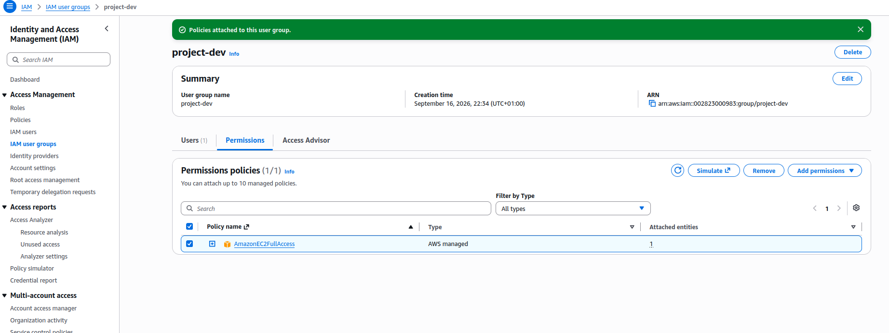
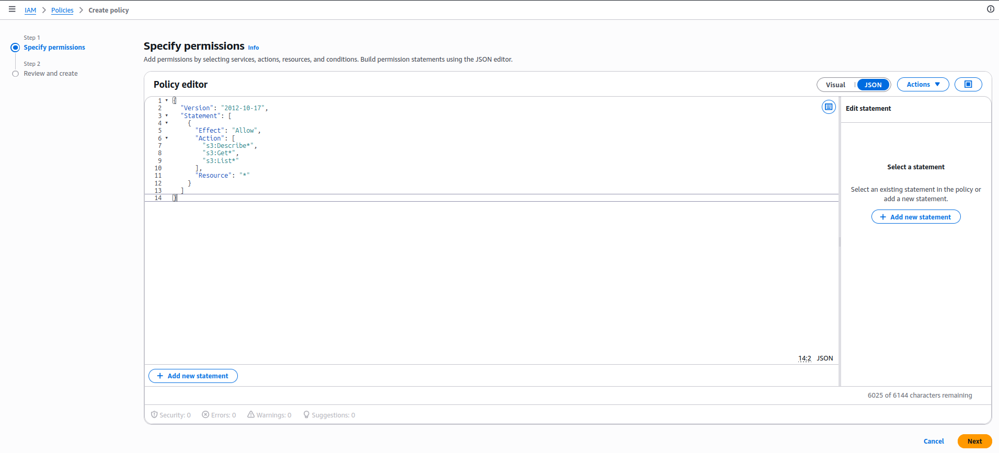
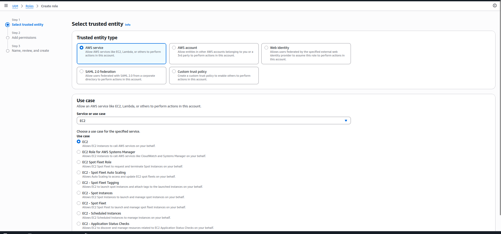
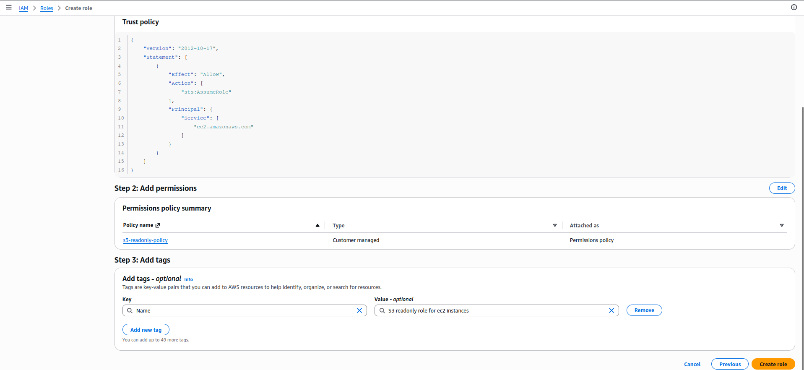

# Hands-On Lab: Demo IAM

> Companion hands-on lab for [Module 6.2: Demo IAM](../README.md). This is the same user/group/policy/role exercise from that lesson, done for real in my own AWS account through the current IAM console — not the older console the course screenshots show.

---

## What I Built

What I set up:

- **User `lucy`** — console access with a custom password, `AdministratorAccess` attached directly to her (no access key — more on why below).
- **Group `project-dev`** — `AmazonEC2FullAccess` and `AmazonS3FullAccess` attached to the group, not to individual users.
- **Users `abdul` and `lee`** — both just added to `project-dev`, no policies attached to either user directly.
- **Custom policy `EC2-list-read`** — `ec2:Describe*` / `ec2:Get*` / `ec2:List*` on all resources.
- **Custom policy `s3-readonly-policy`** — same shape, scoped to S3.
- **Role `s3-readonly-role`** — trusted entity `ec2.amazonaws.com`, `s3-readonly-policy` attached, so an EC2 instance can assume it and read S3 without a static key.

---

## Walking Through It

### 1. Create Lucy, then attach AdministratorAccess separately

The current IAM console's "Create user" wizard doesn't let me pick a managed policy for a brand-new user inline the way the course does it in one pass — I name her, set a custom password, and that's it for step 1:


Step 2 ("Set permissions") defaults to **Add user to group** with no group selected. I skipped that and created Lucy with nothing but the automatic `IAMUserChangePassword` policy — the permission grant happens *after* she exists, from her own Permissions tab: **Add permissions → Attach policies directly**, searched, and checked `AdministratorAccess` out of the full list of AWS managed policies:


That leaves her with two policies — `AdministratorAccess` and the default `IAMUserChangePassword`, same combination the course notes describe:


I did **not** create an access key for her. Her user summary page flags `Access key 1: Create access key` as a link, not a fact — no key exists. This is [6.1's course-age gap](../../module-06.1-introduction-to-iam/README.md) showing up live: the console itself nudges away from long-lived credentials on a human user now ("As a best practice, avoid using long-term credentials like access keys").

### 2. Abdul, Lee, and the `project-dev` group

Creating `abdul`, I picked **Add user to group → Create group** mid-wizard, named it `project-dev`. The group gets created with **zero** policies attached — the wizard doesn't ask me to pick any at that point, unlike the course's single combined step. So the actual permission grant is a separate trip to the group's own Permissions tab afterward: **Add permissions → Attach policies**, searched `ec2`, checked `AmazonEC2FullAccess`:




Created `lee` the same way, adding him to the now-existing `project-dev` group instead of creating a new one. Back on the group's Permissions tab, I attached `AmazonS3FullAccess` on top, the same way — search `s3`, check the box, attach. End state: two managed policies on the group, two users in it, neither user touched individually:


### 3. Custom policies: `EC2-list-read` and `s3-readonly-policy`

**Policies → Create policy**, EC2 as the service, then instead of hand-picking individual actions I expanded the **Access level** groupings and ticked **all of List (224) and all of Read (59)**, leaving Write/Permissions management/Tagging untouched. The visual editor collapses that down to three wildcarded actions in the generated JSON:


Named it `EC2-list-read`. Same List+Read access-level picks against the S3 service produced the S3 equivalent (`s3:Describe*` / `s3:Get*` / `s3:List*`), named `s3-readonly-policy`. Both now sit in the account's policy list as **Customer managed**, same as any hand-written one:



Ticking access-level checkboxes instead of individual actions is faster than the course's action-by-action picker, but it's coarser — "all List actions" pulled in every `Describe*`/`List*`/`Get*`-shaped call EC2 has, not just the handful the course settles on. Worth knowing the tradeoff: quick and broad-within-List/Read, versus slow and exactly-scoped.

### 4. The role: EC2 → `s3-readonly-role`

**Roles → Create role**, trusted entity type **AWS service**, service **EC2**, use case **EC2** (the plain one — not "EC2 Role for AWS Systems Manager" or any of the other EC2-flavored use cases the dropdown offers):



Attached `s3-readonly-policy` on the permissions step, named the role `s3-readonly-role`, and gave it a description ("Allows EC2 instances to read data from S3 buckets") plus a `Name` tag. The review screen shows the auto-generated trust policy — this is what actually encodes "EC2 can assume this role," separate from the permissions policy that encodes "what it can do once assumed":



```json
{
  "Version": "2012-10-17",
  "Statement": [
    {
      "Effect": "Allow",
      "Action": ["sts:AssumeRole"],
      "Principal": { "Service": ["ec2.amazonaws.com"] }
    }
  ]
}
```

That's the piece [6.1's role section](../../module-06.1-introduction-to-iam/README.md#iam-roles--permissions-for-aws-services-not-people) describes in the abstract — the thing that "gets assumed" — made concrete: `sts:AssumeRole` granted to the `ec2.amazonaws.com` service principal, nothing else.

---

## What This Confirms

| | Course (older console) | What I actually saw |
|---|---|---|
| Attach a policy while creating a user | One wizard, pick the policy inline | Wizard only offers group membership inline; a direct policy attach is a separate trip to the user's own Permissions tab afterward |
| Group permissions | Attach a policy while creating the group | Group is created empty; policies get attached from the group's own Permissions tab in a follow-up step |
| Custom policy authoring | Pick individual actions one by one | Access-level checkboxes (`List`, `Read`, `Write`, …) let me grant a whole category in one click — faster, but coarser than picking exact actions |
| Access keys for a human user | Downloaded as part of user creation | Console now treats "no access key" as the default and calls creating one out as something to actively opt into |

**Why this happens:** the IAM console I'm on is a newer redesign than the one in the course recordings — step boundaries moved (permissions got split out of the creation wizard into the identity's own page), but the underlying objects are identical: a user still just holds attached policies, a group still just fans a policy out to its members, and a role still needs a trust policy plus a permissions policy, same as [6.1](../../module-06.1-introduction-to-iam/README.md) describes.

**What surprised me:** I expected "add a group during user creation" to also mean "attach its policies right there," the way the course video does it in one continuous flow. It doesn't — the group gets created empty, and permissions are a deliberate second step on the group object itself. Small thing, but it means "create a group" and "give it permissions" are two separate, revisitable actions in the current console, not one.

**Next up:** wiring this same user/group/policy/role shape with `aws_iam_user`, `aws_iam_group`, `aws_iam_policy`, and `aws_iam_role` resource blocks in Terraform, instead of clicking through the console.
