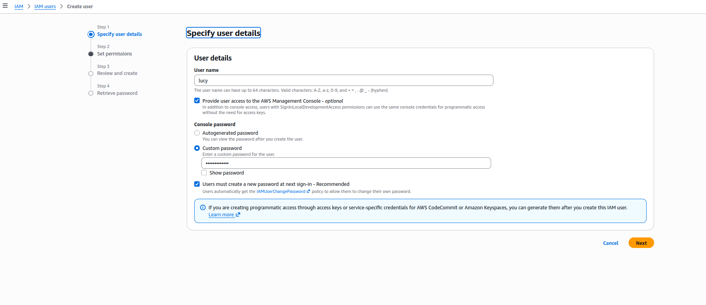
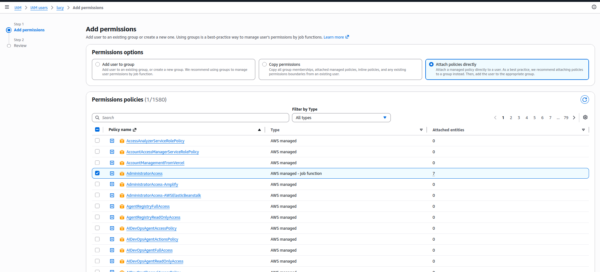
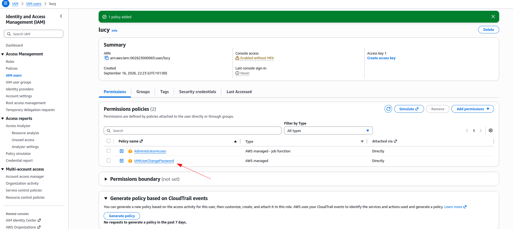
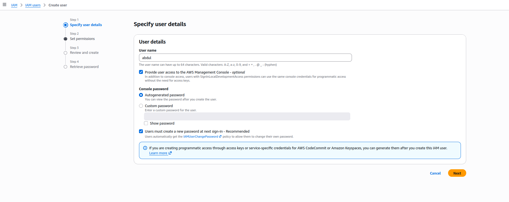
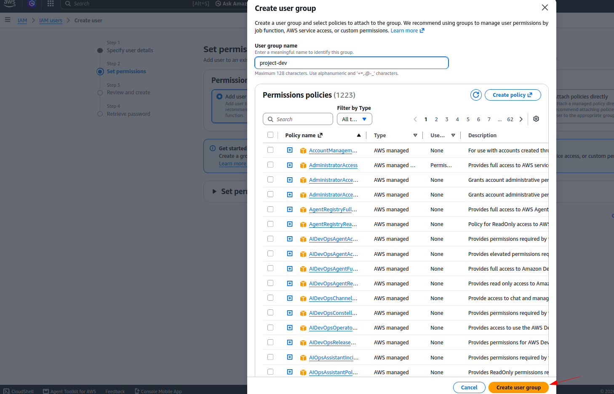
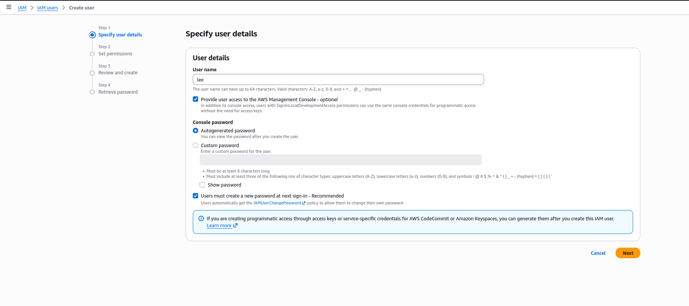
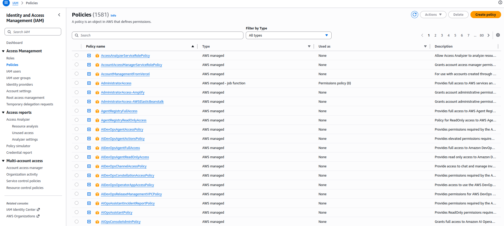
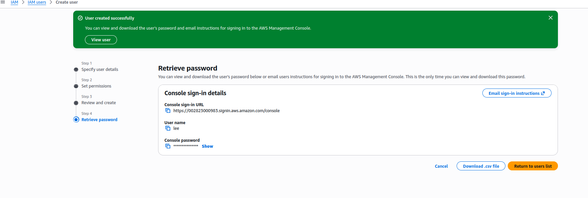
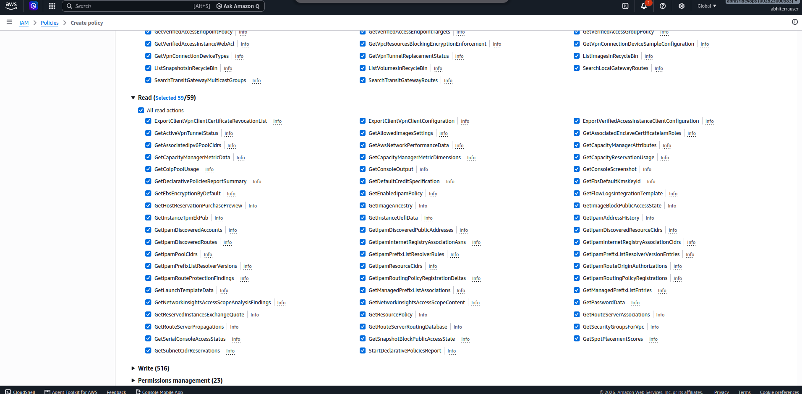

# Hands-On Lab: Demo IAM

> Companion hands-on lab for [Module 6.2: Demo IAM](../README.md). This is the same user/group/policy/role exercise from that lesson, done for real in my own AWS account.

---

## What I Built

What I set up:

- **User `lucy`** — console access with a custom password, `AdministratorAccess` attached directly to her (no access key — more on why below).
- **Group `project-dev`** — `AmazonEC2FullAccess` and `AmazonS3FullAccess` attached to the group, not to individual users.
- **Users `abdul` and `lee`** — both just added to `project-dev`, no policies attached to either user directly.
- **Custom policy `EC2-list-read`** — `ec2:Describe*` / `ec2:Get*` / `ec2:List*` on all resources.
- **Custom policy `s3-readonly-policy`** — same shape, scoped to S3.
- **Role `s3-readonly-role`** — trusted entity `ec2.amazonaws.com`, `s3-readonly-policy` attached, so an EC2 instance can assume it and read S3 without a static key.

---

## Walking Through It

### 1. Create Lucy, then attach AdministratorAccess separately

The IAM console's "Create user" wizard doesn't let me pick a managed policy for a brand-new user inline — I name her, set a custom password, and that's it for step 1:



Step 2 ("Set permissions") defaults to **Add user to group** with no group selected. I skipped that and created Lucy with nothing but the automatic `IAMUserChangePassword` policy — the permission grant happens *after* she exists, from her own Permissions tab: **Add permissions → Attach policies directly**, searched, and checked `AdministratorAccess` out of the full list of AWS managed policies:



That leaves her with two policies — `AdministratorAccess` and the default `IAMUserChangePassword`:



I did **not** create an access key for her. Her user summary page flags `Access key 1: Create access key` as a link, not a fact — no key exists. That matches what I noted in [6.1](../../module-06.1-introduction-to-iam/README.md): AWS's own guidance is to avoid long-lived credentials on a human user where possible.

### 2. Abdul, Lee, and the `project-dev` group

Created `abdul` the same way I created Lucy — name and password first:



Then, on the permissions step, I picked **Add user to group → Create group** mid-wizard, named it `project-dev`. The group gets created with **zero** policies attached — the wizard doesn't ask me to pick any at that point. So the actual permission grant is a separate trip to the group's own Permissions tab afterward: **Add permissions → Attach policies**, searched `ec2`, checked `AmazonEC2FullAccess`:




Created `lee` next, same details step:



— then added him to the now-existing `project-dev` group instead of creating a new one. Back on the group's Permissions tab, I attached `AmazonS3FullAccess` on top, the same way — search `s3`, check the box, attach. End state: two managed policies on the group, two users in it, neither user touched individually:





### 3. Custom policies: `EC2-list-read` and `s3-readonly-policy`

**Policies → Create policy**, EC2 as the service, then instead of hand-picking individual actions I expanded the **Access level** groupings and ticked **all of List (224) and all of Read (59)**, leaving Write/Permissions management/Tagging untouched. The visual editor collapses that down to three wildcarded actions in the generated JSON:



Named it `EC2-list-read`. Same List+Read access-level picks against the S3 service produced the S3 equivalent (`s3:Describe*` / `s3:Get*` / `s3:List*`), named `s3-readonly-policy`. Both now sit in the account's policy list as **Customer managed**, same as any hand-written one:


Ticking access-level checkboxes instead of individual actions is fast, but coarser — "all List actions" pulled in every `Describe*`/`List*`/`Get*`-shaped call EC2 has, not just a hand-picked few. Worth knowing the tradeoff: quick and broad-within-List/Read, versus slow and exactly-scoped.

### 4. The role: EC2 → `s3-readonly-role`

**Roles → Create role**, trusted entity type **AWS service**, service **EC2**, use case **EC2** (the plain one — not "EC2 Role for AWS Systems Manager" or any of the other EC2-flavored use cases the dropdown offers):


Attached `s3-readonly-policy` on the permissions step, named the role `s3-readonly-role`, and gave it a description ("Allows EC2 instances to read data from S3 buckets") plus a `Name` tag. The review screen shows the auto-generated trust policy — this is what actually encodes "EC2 can assume this role," separate from the permissions policy that encodes "what it can do once assumed":


```json
{
  "Version": "2012-10-17",
  "Statement": [
    {
      "Effect": "Allow",
      "Action": ["sts:AssumeRole"],
      "Principal": { "Service": ["ec2.amazonaws.com"] }
    }
  ]
}
```

That's the piece [6.1's role section](../../module-06.1-introduction-to-iam/README.md#iam-roles--permissions-for-aws-services-not-people) describes in the abstract — the thing that "gets assumed" — made concrete: `sts:AssumeRole` granted to the `ec2.amazonaws.com` service principal, nothing else.

---

## What I Learned

- Attaching a policy to a brand-new user isn't part of the creation wizard — the permissions step there only offers group membership. Attaching a policy directly is a separate trip to the user's own Permissions tab, after the user already exists.
- A new group is created empty. Its policies get attached separately, from the group's own Permissions tab, after the group already exists — so "create a group" and "give it permissions" are two separate, revisitable actions, not one.
- A custom policy can be built from access-level checkboxes (`List`, `Read`, `Write`, …) instead of picking individual actions one by one — faster, but coarser: ticking "List" grants the whole category, not just the specific actions I actually need.
- A human user doesn't get an access key by default. Creating one is a separate, deliberate action, not something bundled into creating the user — and per [6.1](../../module-06.1-introduction-to-iam/README.md), that's the right default to lean into, not just a UI quirk.
- A role needs two separate JSON documents: a trust policy (who can assume it) and a permissions policy (what it can do once assumed) — the console fills the trust policy in for me once I pick "EC2" as the trusted service, but the permissions policy is whatever I explicitly attach.

**Next up:** wiring this same user/group/policy/role shape with `aws_iam_user`, `aws_iam_group`, `aws_iam_policy`, and `aws_iam_role` resource blocks in Terraform, instead of clicking through the console.
