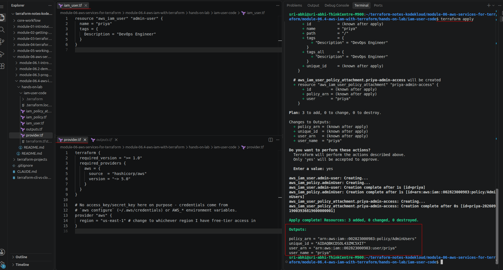
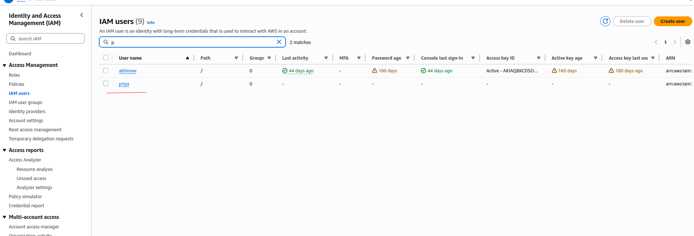
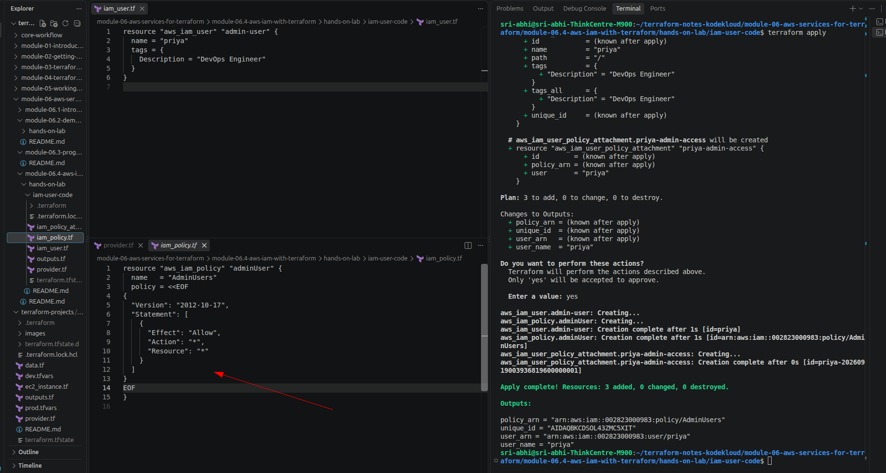
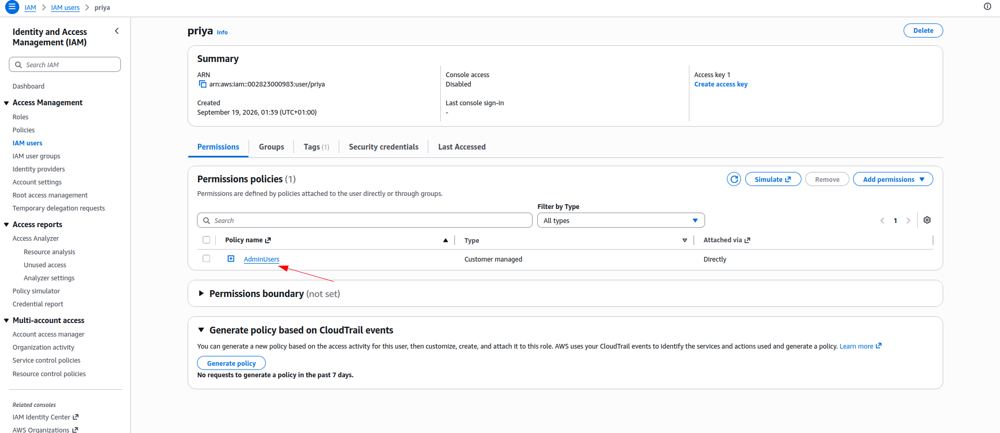
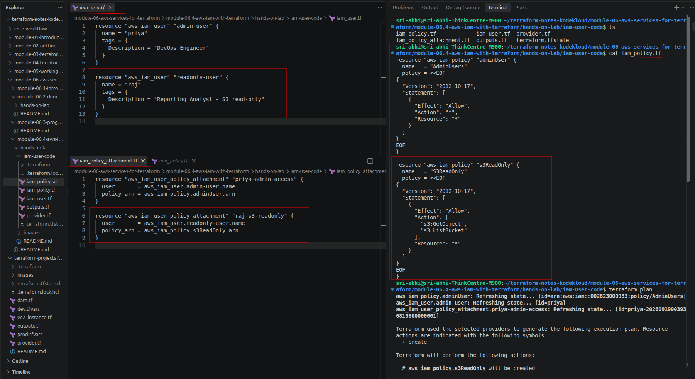
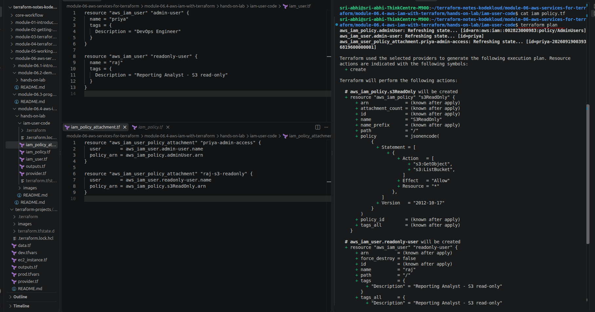
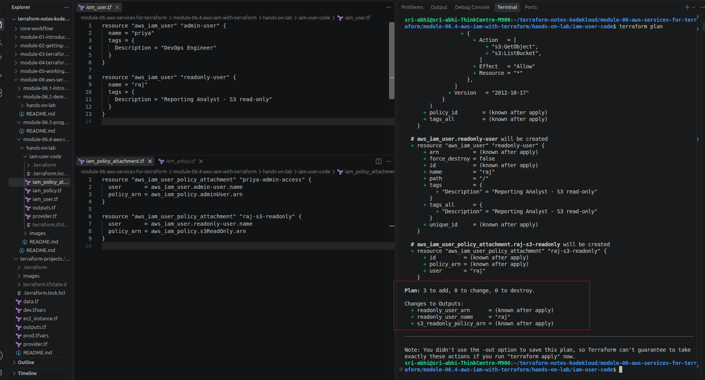
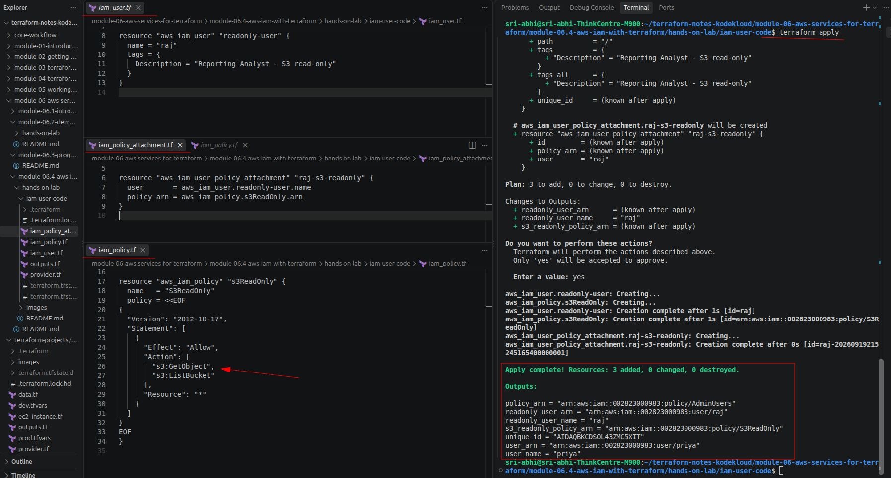
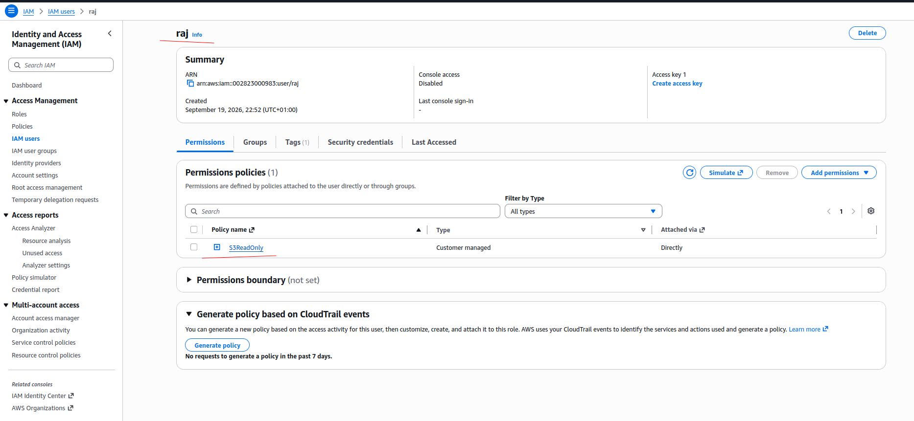

# Hands-On Lab: AWS IAM with Terraform

> Companion hands-on lab for [Module 6.4: AWS IAM with Terraform](../README.md). Code lives in [`iam-user-code/`](iam-user-code) — `cd` into that folder and use standard `terraform init`/`plan`/`apply`.

---

## What I Built

- `aws_iam_user`, named `priya` (not `lucy` — that name's already taken in this account from the console walkthrough in [6.2](../../module-06.2-demo-iam/README.md), and IAM usernames have to be unique per account)
- `aws_iam_policy` — `AdminUsers`, the same `AdministratorAccess`-shaped JSON from [6.1](../../module-06.1-introduction-to-iam/README.md#assigning-permissions), via heredoc
- `aws_iam_user_policy_attachment` — grants that policy to `priya`
- A second `aws_iam_user`, named `raj`, plus his own `aws_iam_policy` (`S3ReadOnly`, custom JSON — `s3:GetObject`/`s3:ListBucket`) and `aws_iam_user_policy_attachment` — same three-resource shape as `priya`, just narrower permissions

No hardcoded `access_key`/`secret_key` in `provider.tf` — credentials come from `aws configure`, per the [Best Practices](../README.md#best-practices-for-managing-credentials) section in the module note.

Files: `provider.tf`, `iam_user.tf`, `iam_policy.tf`, `iam_policy_attachment.tf`, `outputs.tf`.

---

## Walking Through It

All three `.tf` files were already in place before the first `apply`, so `plan` picked up all three resources together — one user, one policy, one attachment:

```bash
cd iam-user-code
terraform init
terraform plan
terraform apply
```



`provider.tf` has no `access_key`/`secret_key` — just a comment saying credentials come from `aws configure` or `AWS_*` environment variables, matching the [Best Practices](../README.md#best-practices-for-managing-credentials) section.

```bash
terraform output
```

`priya` shows up in the IAM console, alongside whatever other users already exist in the account:



`iam_policy.tf` is the heredoc from the module note, applied as part of that same `apply`:



And `priya`'s own **Permissions** tab confirms the attachment actually took — `AdminUsers`, attached directly, not through a group:



### Clean up

```bash
terraform destroy
```

---

## Second User: A Narrower Custom Policy

Same three-resource pattern as `priya` (`aws_iam_user` → `aws_iam_policy` → `aws_iam_user_policy_attachment`), just with a smaller permission set — `raj` gets `s3:GetObject`/`s3:ListBucket` on `Resource: "*"` instead of `AdministratorAccess`:



This is a hand-written policy, not AWS's own `AmazonS3ReadOnlyAccess` managed policy (that one covers a longer list of `s3:Get*`/`s3:List*`/`s3:Describe*` actions) — close enough for read-only access to objects and bucket listings, but worth knowing it's narrower than the AWS-managed equivalent if this were a real account.

```bash
terraform plan
```

With `priya`, her policy, and her attachment already applied, `plan` only picks up the three new resources for `raj` — the new policy document and the new user, both still `(known after apply)` for anything AWS assigns:



```
Plan: 3 to add, 0 to change, 0 to destroy.

Changes to Outputs:
  + readonly_user_arn      = (known after apply)
  + readonly_user_name     = "raj"
  + s3_readonly_policy_arn = (known after apply)
```



```bash
terraform apply
```

```
aws_iam_user.readonly-user: Creating...
aws_iam_policy.s3ReadOnly: Creating...
aws_iam_user.readonly-user: Creation complete after 1s [id=raj]
aws_iam_policy.s3ReadOnly: Creation complete after 1s [id=arn:aws:iam::002823000983:policy/S3ReadOnly]
aws_iam_user_policy_attachment.raj-s3-readonly: Creating...
aws_iam_user_policy_attachment.raj-s3-readonly: Creation complete after 0s [id=raj-20260919215245165400000001]

Apply complete! Resources: 3 added, 0 changed, 0 destroyed.

Outputs:

readonly_user_arn      = "arn:aws:iam::002823000983:user/raj"
readonly_user_name     = "raj"
s3_readonly_policy_arn = "arn:aws:iam::002823000983:policy/S3ReadOnly"
```



`priya`'s outputs (`policy_arn`, `user_arn`, `user_name`) show up in that same output block too — this `apply` only added to state, it never touched her.

`raj`'s own **Permissions** tab confirms it — `S3ReadOnly`, Customer managed, attached directly, not through a group:



Same shape as the least-privilege point from the [module note](../README.md#least-privilege-priya-starts-with-nothing) — `raj` never holds `AdministratorAccess` at any point, he starts and stays scoped to S3 read-only.

---

## Applying It Incrementally Instead

Nothing stops `iam_user.tf` from being applied on its own first — just don't create `iam_policy.tf`/`iam_policy_attachment.tf` yet, run `terraform apply` (1 to add), and add the other two files later. A second `apply` at that point would show **2 to add, 0 to change** — `priya` stays untouched, only the new policy and attachment get created. That's the literal, `plan`-verified version of the least-privilege idea from the [module note](../README.md#least-privilege-priya-starts-with-nothing): start with nothing, add permissions as a deliberate, separate step.

---

## Troubleshooting

| Issue | Fix |
|---|---|
| `EntityAlreadyExists: User with name ... already exists` | That username already exists in the account (created by hand or by a previous apply) — change `name` in `iam_user.tf` to something unused |
| `error validating provider credentials` | Run `aws configure` first — see [6.3](../../module-06.3-programmatic-access/README.md#configuring-the-aws-cli) |
| Terraform prompts for a region | Missing `provider "aws" { region = ... }` — see the module note's [Configuring the AWS Provider](../README.md#configuring-the-aws-provider) section |
