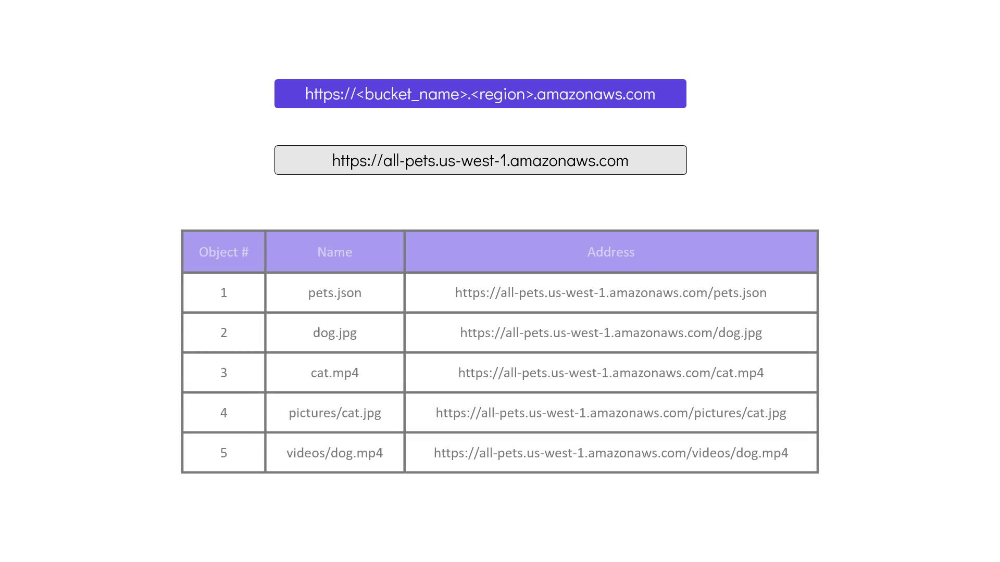
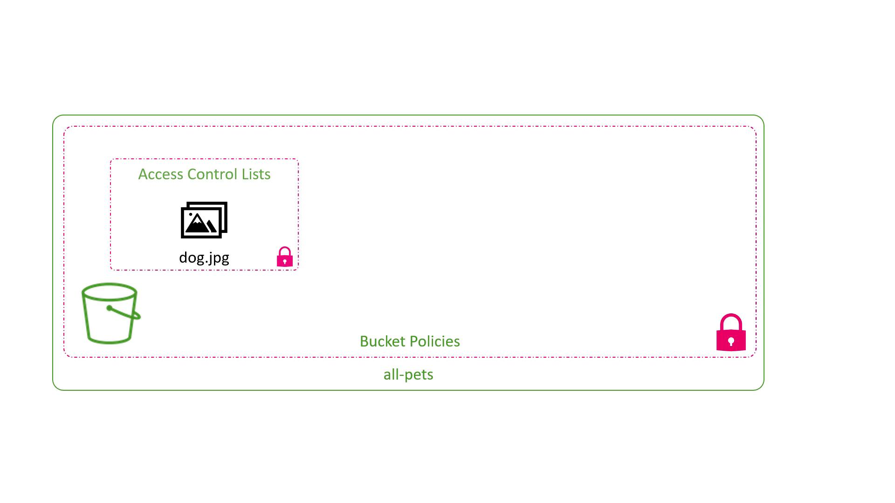

# 📘 Module 6.5: Introduction to AWS S3

> Every S3 backend I've used since [4.1](../../module-04-terraform-state/module-04.1-purpose-of-state/README.md) has quietly assumed a bucket already exists. This module explains what's actually on the other end of that `backend "s3" { bucket = ... }` block.

---

## Introduction

S3 (Simple Storage Service) is AWS's storage service, built for storing basically unlimited files — documents, images, videos, anything — reliably and at scale. It's object storage, not block storage: S3 stores whole files as objects, which is different from block storage solutions that are more suitable for things like operating systems or databases.

## Key Concepts

Data in S3 is organized into containers called **buckets**. Each bucket can hold an unlimited number of objects, and every file I store is treated as a separate object — even when it looks like it's organized into folders, like `pictures/cat.jpg` or `videos/dog.mp4`.

### Bucket Fundamentals

When creating an S3 bucket, a few rules apply:

- **Unique bucket name** — by default, unique across every AWS account worldwide, since AWS gives the bucket a global DNS name. (Since March 2026, AWS also offers an *account regional namespace*, where a name only has to be unique to my own account instead of the whole world — see the [official naming docs](https://docs.aws.amazon.com/AmazonS3/latest/userguide/bucketnamingrules.html) for how to opt in.)
- **DNS-compliant naming** — bucket names can't contain uppercase letters or underscores, and can't end with a dash. They must be between 3 and 63 characters.
- **File upload limit** — each individual file uploaded to S3 can be up to 5 TB in size.

For the comprehensive list of bucket naming restrictions, see the [official AWS documentation](https://docs.aws.amazon.com/AmazonS3/latest/userguide/bucketnamingrules.html).

Once created, the bucket is reachable at its own DNS endpoint. For example, a bucket named `all-pets` in the US West (N. California) region is reachable at:

[https://all-pets.s3.us-west-1.amazonaws.com](https://all-pets.s3.us-west-1.amazonaws.com)

Objects inside the bucket are accessed using that endpoint plus the object's key.



### Object Structure in S3

An object in S3 consists of:

- **Key** — the unique identifier or name of the file.
- **Data** — the file content.
- **Metadata** — additional information such as creation time, owner, and file size.


### Access Control

By default, AWS restricts access to a bucket and its objects so that only the bucket owner has access. AWS manages access through:

- **Bucket Policies** — permissions applied at the bucket level.
- **Access Control Lists (ACLs)** — permissions applied to individual objects. New buckets have ACLs turned off by default (since April 2023) — AWS now recommends controlling access with bucket policies and IAM policies instead of ACLs.



---

## Bucket Policies in Practice

Bucket policies are JSON documents that control access to my S3 buckets. They can grant or restrict permissions for IAM users, groups, or even external accounts.

Here's an example policy that allows an IAM user named Lucy to retrieve all objects from a bucket called `all-pets`:

```json
{
    "Version": "2012-10-17",
    "Statement": [
        {
            "Action": [
                "s3:GetObject"
            ],
            "Effect": "Allow",
            "Resource": "arn:aws:s3:::all-pets/*",
            "Principal": {
                "AWS": [
                    "arn:aws:iam::123456123457:user/Lucy"
                ]
            }
        }
    ]
}
```

Bucket policies work a lot like IAM policies, and can also grant cross-account access or public access when needed.

> ⚠️ Avoid exposing buckets publicly unless it's genuinely required. Improper bucket policy configurations can lead to unauthorized data access.

---

## Summary

- ✅ S3 is object storage — whole files as objects, not filesystem blocks like EBS
- ✅ Buckets hold objects; bucket names are DNS-compliant (lowercase, no underscores, 3–63 chars, no trailing hyphen) and, by default, globally unique — though an opt-in account regional namespace (since March 2026) can scope uniqueness to just my own account+region instead
- ✅ "Folders" in the console are cosmetic — every object's key is flat, even one that looks like `pictures/cat.jpg`
- ✅ An object = key + data + metadata (owner, size, last-modified, plus anything custom)
- ✅ Private by default; bucket policies (JSON, bucket-wide) and ACLs (per-object) are the two access-control mechanisms — though ACLs are off by default on new buckets since 2023, bucket/IAM policies are the current recommended path

---

## Key Takeaway

**S3 stores flat objects in uniquely-named buckets, locked down to the account owner until a bucket policy (or IAM policy) says otherwise.**

- ✅ Object storage, not block storage — files in, files out, no filesystem semantics
- ✅ Bucket names live in a DNS namespace shared by every AWS customer by default — but since March 2026, an account regional namespace is available so a name only has to be unique to my own account
- ⚠️ "Folders" are a UI illusion over flat, prefix-named keys
- ⚠️ Default-private, and ACLs are increasingly a legacy path — bucket policies (and IAM policies on the caller) are the mechanism to reach for now

---

## Practice & Next Steps

In the console (or a sandbox account), create a bucket with a name that violates one of the naming rules and confirm AWS rejects it. Then create a valid bucket, upload a small file, and try to fetch its object URL directly while the bucket is still private — confirm it 403s — before writing a bucket policy scoped to just that object's key and watching the same URL start working.

Next up in Module 6: [wiring S3 into Terraform itself](../module-06.6-s3-with-terraform/README.md) — `aws_s3_bucket` and the resources that go with it, the same way [6.4](../module-06.4-aws-iam-with-terraform/README.md) did for IAM users and policies.
