# Hands-On Lab: S3 with Terraform

> Companion hands-on lab for [Module 6.6: S3 with Terraform](../README.md). Code lives in [`s3-bucket-code/`](s3-bucket-code) — `cd` into that folder and use standard `terraform init`/`plan`/`apply`.

---

## What I Built

- `aws_iam_user` (`meena`) + `aws_iam_group` (`finance-analysts`) + `aws_iam_group_membership` — in a real account this group and its members would already exist; I create them here so the lab is self-contained and can be applied on its own
- `aws_s3_bucket` (`finance`) — named `finance-<my-account-id>` instead of the module note's literal `finance-21092020`, since that name is almost certainly already taken by someone else (bucket names are globally unique by default — see [6.5](../../module-06.5-introduction-to-s3/README.md#bucket-fundamentals))
- `aws_s3_object` — uploads `finance-2020.txt` (a plain-text stand-in for the module note's `.doc` example) into the bucket via `source`
- `data.aws_iam_group` + `aws_s3_bucket_policy` — grants `finance-analysts`' members access, listing their individual ARNs (`users[*].arn`) since a group's own ARN isn't a valid bucket policy principal

No hardcoded `access_key`/`secret_key` in `provider.tf` — credentials come from `aws configure`, per the [Best Practices](../../module-06.4-aws-iam-with-terraform/README.md#best-practices-for-managing-credentials) section back in 6.4.

Files: `provider.tf`, `iam_group.tf`, `s3_bucket.tf`, `s3_object.tf`, `s3_bucket_policy.tf`, `outputs.tf`, `finance-2020.txt`.

---

## Walking Through It

I applied this one resource-group at a time instead of all six at once — moved every file except `provider.tf` out of the folder temporarily, then brought them back one by one.

### 1. The bucket

`s3_bucket.tf` back in the folder, `terraform plan` showed just `aws_s3_bucket.finance` — `1 to add`:

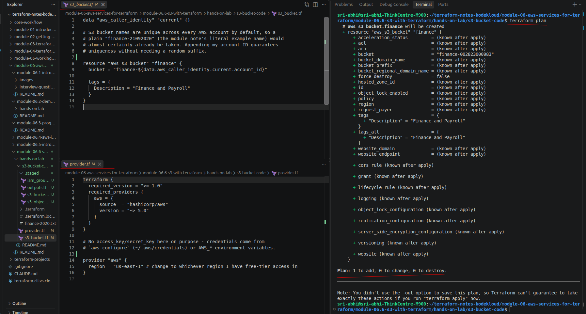

```bash
terraform apply
```

```
aws_s3_bucket.finance: Creating...
aws_s3_bucket.finance: Creation complete after 5s [id=finance-002823000983]

Apply complete! Resources: 1 added, 0 changed, 0 destroyed.
```

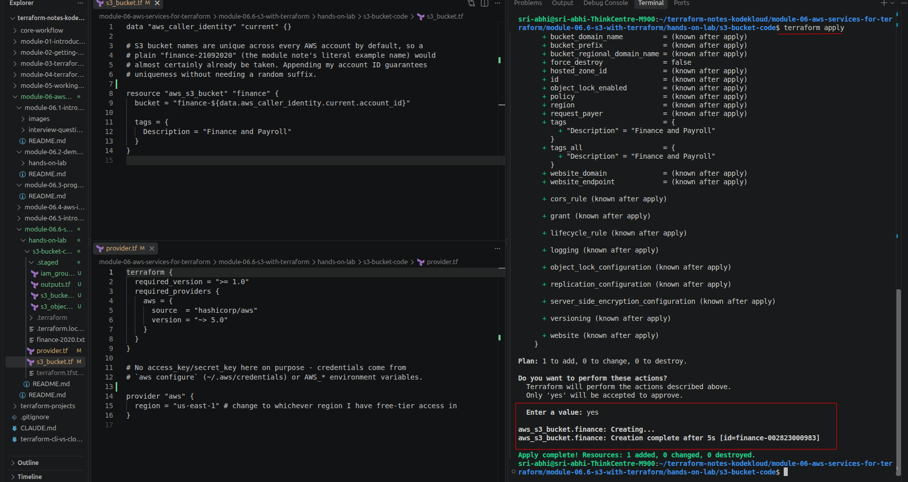

### 2. Uploading the file

`s3_object.tf` back, `plan` showed `1 to add` for `aws_s3_object.finance_2020` (the bucket itself showed no changes):

```
aws_s3_object.finance_2020: Creating...
aws_s3_object.finance_2020: Creation complete after 1s [id=finance-2020.txt]

Apply complete! Resources: 1 added, 0 changed, 0 destroyed.
```

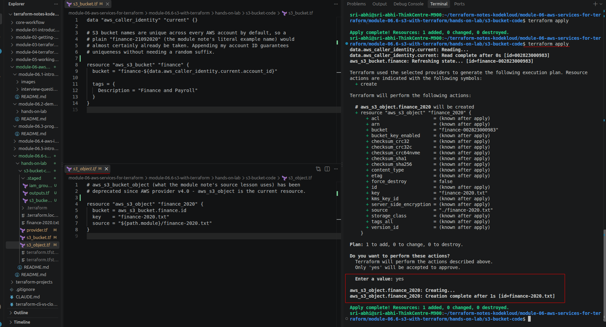

Confirmed in the console — the bucket exists:

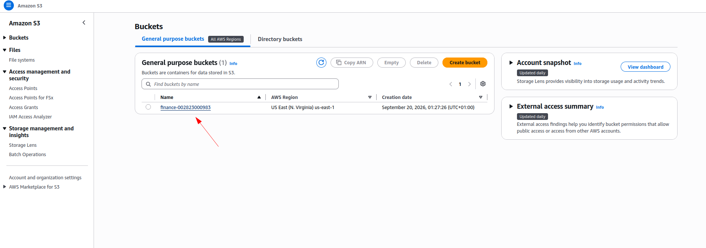

— and `finance-2020.txt` is inside it:

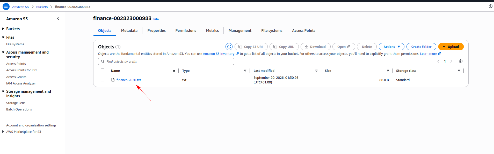

### 3. The IAM group and its member

`iam_group.tf` has three resource blocks, in this order:

```hcl
resource "aws_iam_user" "finance_analyst_1" {
  name = "meena"
  tags = {
    Description = "Finance Analyst"
  }
}

resource "aws_iam_group" "finance_analysts" {
  name = "finance-analysts"
}

resource "aws_iam_group_membership" "finance_analysts" {
  name  = "finance-analysts-membership"
  group = aws_iam_group.finance_analysts.name
  users = [aws_iam_user.finance_analyst_1.name]
}
```

1. **`aws_iam_user`** creates the user `meena` — on her own, with no permissions and no group. Same idea as [6.4](../../module-06.4-aws-iam-with-terraform/README.md) — a user existing doesn't mean the user can do anything yet.
2. **`aws_iam_group`** creates the group `finance-analysts` — also empty at this point, nobody's in it.
3. **`aws_iam_group_membership`** is the resource that actually links the two — it takes the group's name and a list of usernames, and puts `meena` into `finance-analysts`. Without this third block, the user and the group would both exist but have nothing to do with each other.

`plan` showed `3 to add` — the group, the user, and the membership:

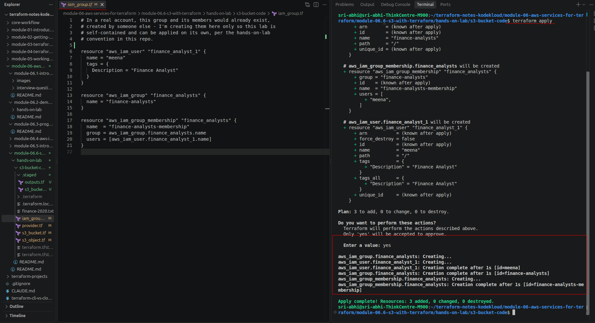

```
aws_iam_group.finance_analysts: Creating...
aws_iam_user.finance_analyst_1: Creating...
aws_iam_user.finance_analyst_1: Creation complete after 1s [id=meena]
aws_iam_group.finance_analysts: Creation complete after 1s [id=finance-analysts]
aws_iam_group_membership.finance_analysts: Creating...
aws_iam_group_membership.finance_analysts: Creation complete after 1s [id=finance-analysts-membership]

Apply complete! Resources: 3 added, 0 changed, 0 destroyed.
```

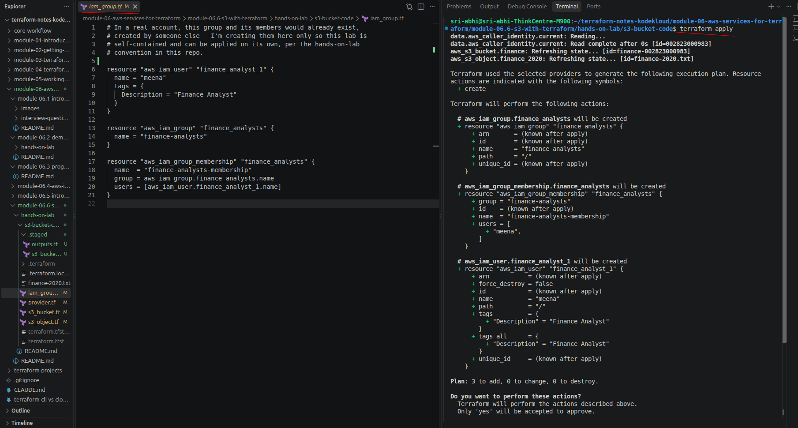

`meena`'s own **Groups** tab confirms membership in `finance-analysts`:

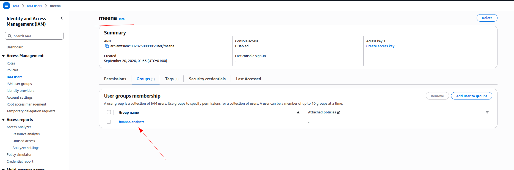

— and from the other direction, `finance-analysts`' **Users** tab shows `meena` as its one member:

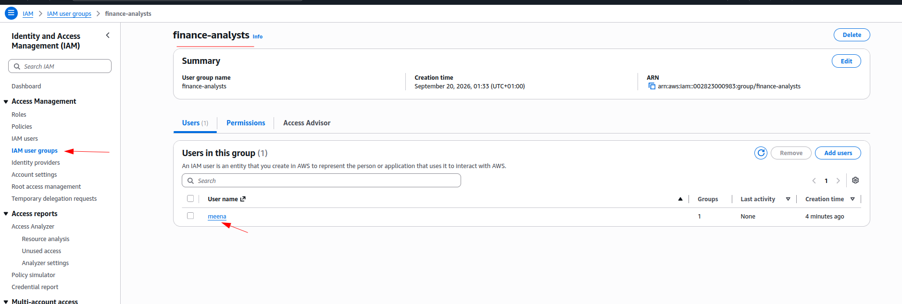

### 4. The bucket policy

`s3_bucket_policy.tf` back. This is the step where the fix from the module note actually matters — the `Principal` block references `data.aws_iam_group.finance_analysts.users[*].arn` (individual member ARNs), not the group's own ARN:

![s3_bucket_policy.tf open in cat output, and terraform plan expanding the policy JSON with jsonencode(data.aws_iam_group.finance_analysts.users[*].arn) for Principal.AWS](images/10-bucket-policy-code-and-plan.png)

The plan confirmed it resolved to `meena`'s actual ARN, not the group's:

```
+ Principal = {
    + AWS = [
        + "arn:aws:iam::002823000983:user/meena",
      ]
  }
```

```bash
terraform apply
```

```
aws_s3_bucket_policy.finance_policy: Creating...
aws_s3_bucket_policy.finance_policy: Creation complete after 1s [id=finance-002823000983]

Apply complete! Resources: 1 added, 0 changed, 0 destroyed.
```

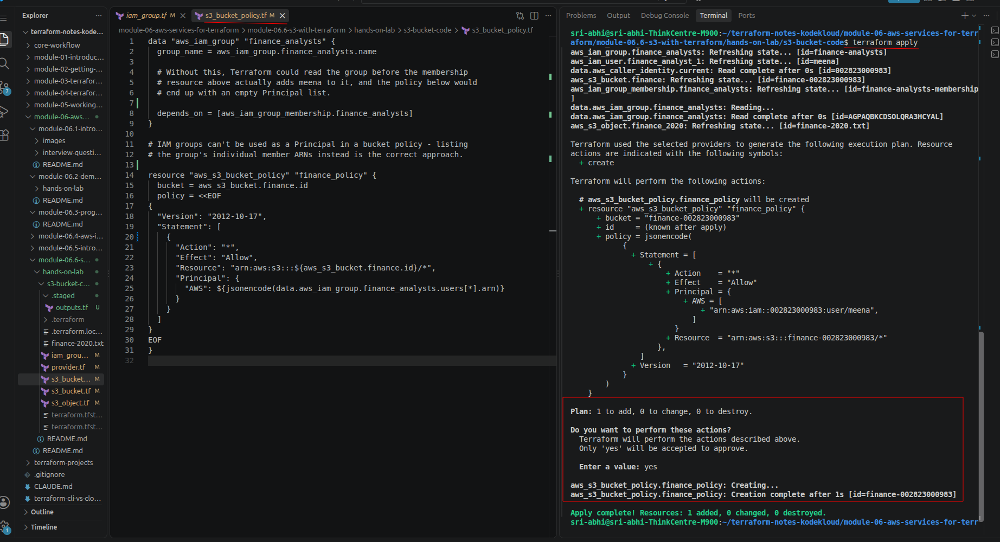

Confirmed in the console — the bucket's **Permissions** tab shows the exact same policy, `meena`'s ARN as `Principal`, `Action: "*"`, scoped to `finance-002823000983/*`:

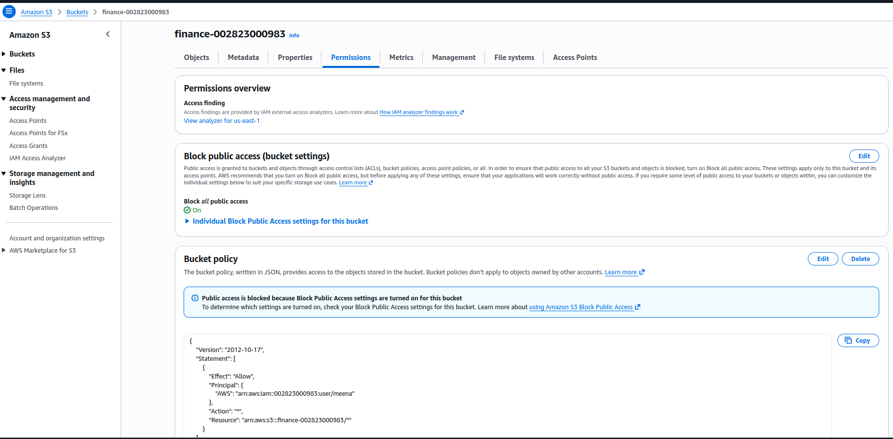

### 5. Outputs

`outputs.tf` back last (it references every other resource, so it has to come after all of them). `terraform apply` here added nothing — `0 added, 0 changed, 0 destroyed` — it only recorded the output values:

```
bucket_arn = "arn:aws:s3:::finance-002823000983"
bucket_name = "finance-002823000983"
finance_analysts_group_arn = "arn:aws:iam::002823000983:group/finance-analysts"
finance_analysts_member_arns = tolist([
  "arn:aws:iam::002823000983:user/meena",
])
object_key = "finance-2020.txt"
```

### Clean up

```bash
terraform destroy
```

---

## Troubleshooting

| Issue | Fix |
|---|---|
| `BucketAlreadyExists` | Someone else already owns that exact bucket name — bucket names are global. Change `bucket` in `s3_bucket.tf` to something else, or confirm the `data.aws_caller_identity.current.account_id` interpolation is actually resolving |
| `EntityAlreadyExists: User with name ... already exists` / `Group with name ... already exists` | That name already exists in the account from a previous apply or another lab (e.g. `priya`/`raj` from [6.4](../../module-06.4-aws-iam-with-terraform/hands-on-lab/README.md)) — change the colliding name |
| `MalformedPolicy: Invalid principal in policy` | Usually means the `Principal.AWS` list ended up empty or contains something that isn't a valid ARN — check that `finance-analysts-membership` actually applied before the bucket policy did |
| `terraform output` says "No outputs found" | `outputs.tf` was added to the folder but never actually applied — run `terraform apply` once more (it'll show `0 to add, 0 to change` if nothing else changed, and just records the output values) |
| `error validating provider credentials` | Run `aws configure` first — see [6.3](../../module-06.3-programmatic-access/README.md#configuring-the-aws-cli) |
