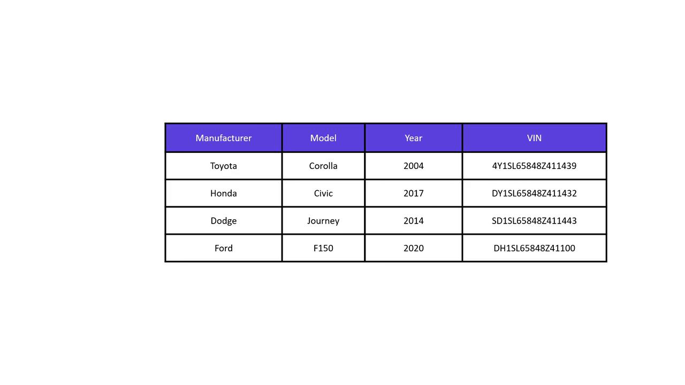

# 📘 Module 6.7: Introduction to DynamoDB

> DynamoDB showed up in this repo back in [4.2](../../module-04-terraform-state/module-04.2-terraform-state-considerations/README.md) — as the table that locked my state file, before I migrated that lab to Terraform's native S3 lockfile locking. This module is about the service itself, not just the one job I was using it for.

---

## Introduction

DynamoDB is AWS's fully managed NoSQL database, built for high scalability and low-latency access — the kind of thing mobile apps, web apps, games, and IoT systems lean on when they need to handle millions of requests a day without me managing any of the underlying infrastructure. Being fully managed means AWS handles installation, upgrades, and patching for me, and it also replicates data across multiple AWS regions, which is where the high availability comes from.

## Key Concepts

DynamoDB organizes data as **key-value pairs and documents**, not rows and columns with a fixed schema like a relational database. Say I'm building a table to store cars — I might start with just `manufacturer` and `model` as keys, then add `year` and `VIN` later as my requirements grow. Nothing forces every entry to share the same shape up front.

### Items and Attributes

Each row in a DynamoDB table is called an **item**, and each item is made up of one or more **attributes** — the actual pieces of data describing it. In the car table, `manufacturer`, `model`, `year`, and `VIN` are all attributes on a single item.



As JSON, a couple of those items would look like this:

```json
{
  "Manufacturer": "Toyota",
  "Make": "Corolla",
  "Year": 2004,
  "VIN": "4Y1SL65848Z411439"
}
{
  "Manufacturer": "Honda",
  "Make": "Civic",
  "Year": 2017,
  "VIN": "DY1SL65848Z411432"
}
```

### Primary Keys

Every DynamoDB table needs a **primary key** to uniquely identify each item. In the car table, VIN is the obvious choice — every vehicle's VIN is unique, so no two items can collide.

> 💡 A value for the primary key is mandatory on every item I add. Every other attribute is optional and can be left off entirely — that's the flexible-schema part of "NoSQL" in practice, not just a marketing word.

DynamoDB actually supports two shapes of primary key, though this intro only needed the simple one:

- **Partition key only** — a single attribute (like VIN) that must be unique across the whole table.
- **Partition key + sort key** — a composite key, where the partition key can repeat as long as the sort key differs. Useful when I want to group related items (e.g., all orders for one customer) under the same partition key but still tell them apart.

---

## Summary

- ✅ DynamoDB is AWS's fully managed NoSQL database — no servers to patch, multi-region replication built in
- ✅ Data is organized as key-value pairs / documents, not a fixed relational schema — a table's items don't all need the same attributes
- ✅ A row is an **item**; the fields on it are **attributes**
- ✅ Every item needs a **primary key** (mandatory, unique); every other attribute is optional
- ✅ A primary key is either a single partition key, or a partition key + sort key composite

---

## Key Takeaway

**DynamoDB trades the fixed schema and joins of a relational database for a flexible, key-addressed item model that scales without me managing infrastructure.**

- ✅ Schema-on-read, not schema-on-write — attributes can vary item to item
- ✅ The primary key is the one thing every item is required to have
- ⚠️ Don't confuse this with the state-locking use case from [4.2](../../module-04-terraform-state/module-04.2-terraform-state-considerations/README.md) — that was one narrow application of DynamoDB (a lock record keyed by state path), not the whole picture of what the service is for

---

## Practice & Next Steps

In the console (or a sandbox account), create a table like the car example with VIN as the partition key, add a couple of items with different attributes on each, and confirm DynamoDB doesn't complain about the mismatched shape. Then try adding an item without the primary key attribute and confirm it's rejected.

Next up in Module 6: [a hands-on demo](../module-06.8-demo-dynamodb/README.md), creating and using this same kind of table by hand in the console — then wiring DynamoDB into Terraform itself, the same way [6.6](../module-06.6-s3-with-terraform/README.md) did for S3.
