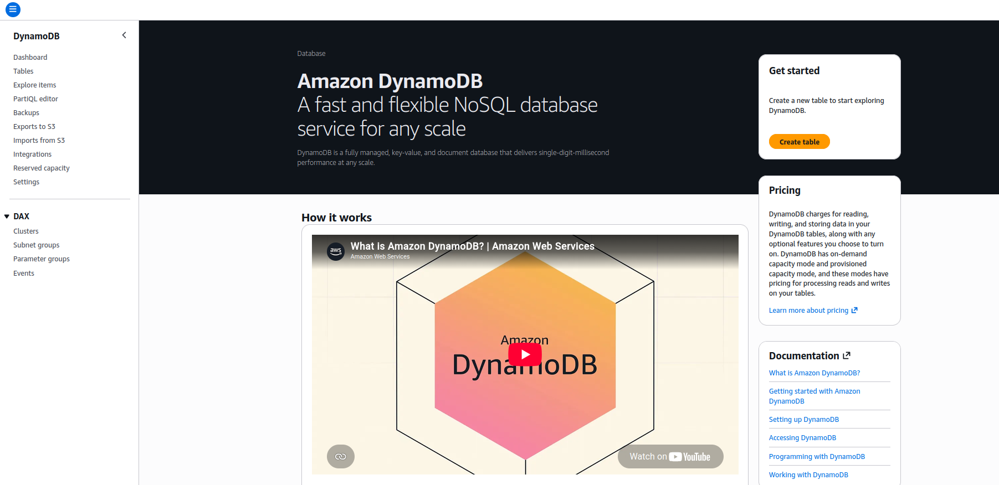
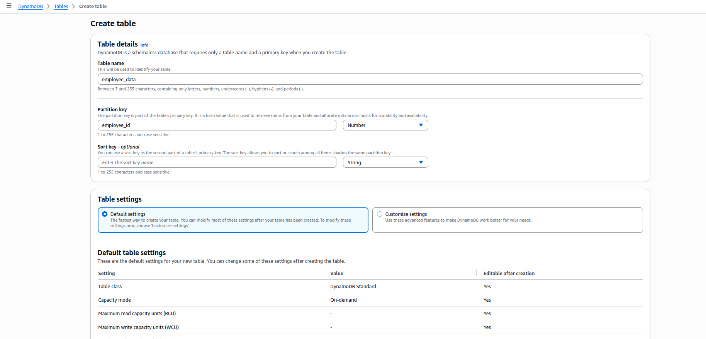
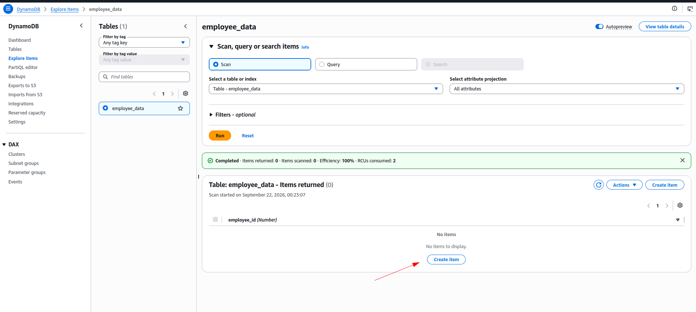
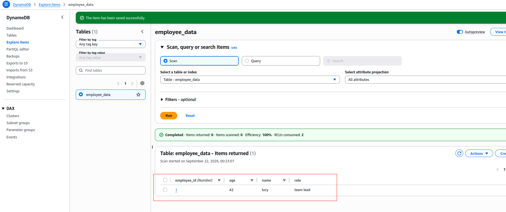
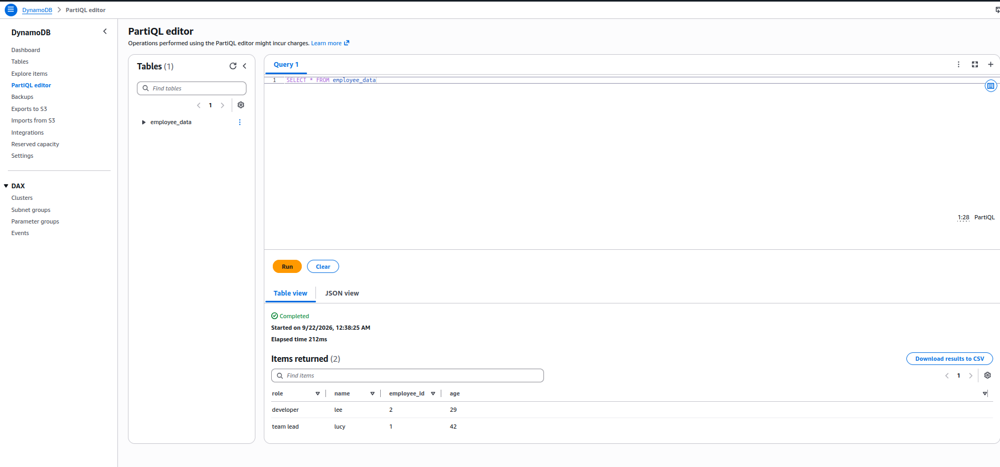
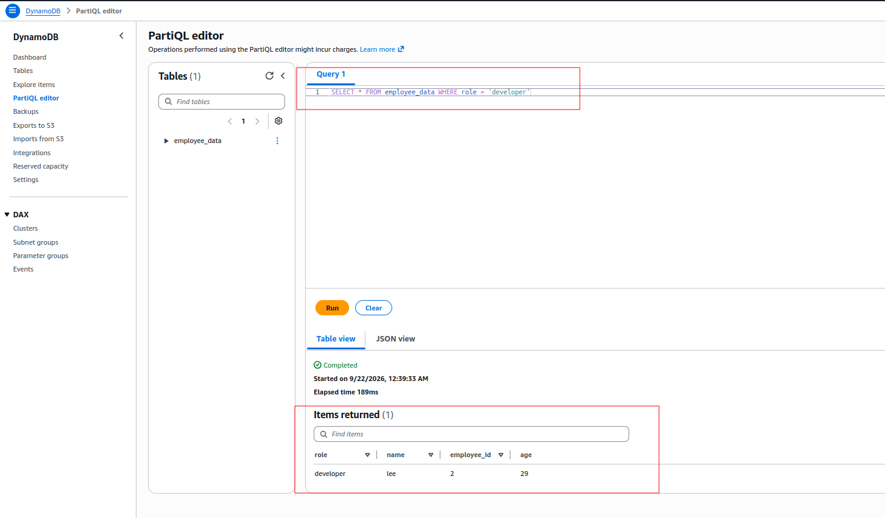

# 📘 Module 6.8: Demo DynamoDB — Creating a Table in the Console

> [6.7](../module-06.7-introduction-to-dynamodb/README.md) covered items, attributes, and primary keys as theory. This lesson is the same ideas clicked through by hand, in my own AWS account: create a table, add a couple of employees, filter down to just the one I care about, then query the same data with SQL-style PartiQL.

---

## Introduction

Create a table to store employee data, add a couple of items with different attributes, filter the results down by one of those attributes, then run a few PartiQL `SELECT` statements against the same table.

---

## Accessing DynamoDB

1. **Services** (top left) → under **Databases**, select **DynamoDB**.
2. Click **Create Table**.



---

## Creating a Table

I name the table `employee_data`, and set the primary key (partition key) to `employee_id`, type **Number** — the same "one attribute that must be unique per item" idea from [6.7](../module-06.7-introduction-to-dynamodb/README.md#primary-keys). No sort key needed for this shape of data. Table settings left on **Default settings**, which the console itself explains: *"DynamoDB is a schemaless database that requires only a table name and a primary key when you create the table."*



> ⚠️ Worth flagging on capacity mode: the **Default table settings** panel lands on `Capacity mode: On-demand`, not Provisioned. AWS recommends On-Demand for most workloads today — no capacity planning needed. The tradeoff: [DynamoDB's Always Free tier (25 GB storage + 25 RCU + 25 WCU) only applies to Provisioned mode](https://docs.aws.amazon.com/amazondynamodb/latest/developerguide/on-demand-capacity-mode.html) — an On-Demand table is billed per request from the very first read or write. For a table this size the cost is a fraction of a cent, but "default settings" doesn't mean "free" the way it might on a Provisioned table.

After a few seconds the table's **Active** and listed, with `Read capacity mode` / `Write capacity mode` both showing **On-demand**:


---

## Adding Items

**Explore items → employee_data**. A first **Scan** with no items yet confirms the table exists but is empty — **Create item** is the way in:



The **Create item** form pre-fills `employee_id` since it's the partition key. I set it to `1`, then **Add new attribute** to add `name = lucy` (String):


Back on the item afterward, I added two more attributes — `age = 42` (Number) and `role = team lead` (String):


```json
{
  "employee_id": 1,
  "name": "lucy",
  "age": 42,
  "role": "team lead"
}
```

A re-run scan confirms the one item, all four attributes together:



Same **Create item** → **Edit item** flow for a second item, `employee_id = 2`:


```json
{
  "employee_id": 2,
  "name": "lee",
  "age": 29,
  "role": "developer"
}
```

Scanning again now returns both items:


> 💡 Only the primary key is required on an item — every other attribute is optional, and different items don't need the same set of attributes. Both of my items here happen to have every attribute filled in, so it doesn't actually show up in this pair — but nothing stops an item from skipping `role` (or `age`, or both) entirely, same as [6.7](../module-06.7-introduction-to-dynamodb/README.md#primary-keys)'s flexible-schema point.

---

## Filtering Items

Back on **Explore items**, I changed **Select attribute projection** to **Specific attributes** and added `role`, then added a filter: `role` **Equal to** `developer` (String), and ran it:


> ⚠️ Worth being precise about what this filter actually does: it's a **filter expression**, applied *after* DynamoDB has already read the matching items — not a query that only reads `role = developer` items off disk. My own run against this two-item table made that concrete: **Items scanned: 2, Items returned: 1, Efficiency: 50%** — DynamoDB read both items and only then dropped the one that didn't match. Invisible on a table this small, but on a large table, filtering post-read is why filtering on anything other than the primary key doesn't save on read cost the way an actual key-based query does. See the [official filter-expression docs](https://docs.aws.amazon.com/amazondynamodb/latest/developerguide/Query.FilterExpression.html) for more.

Selecting the result row opens an **Actions** menu with CSV export options — **Download selected items to CSV** or **Download results to CSV**:


> 💡 **Edit item**, **Duplicate item**, and **Delete items** are all grayed out here — because the projection is scoped to just the `role` attribute, the console doesn't have the full item (its partition key included) loaded to act on. Switching the projection back to **All attributes** before trying to edit or delete a row is the fix.

---

## Querying with PartiQL

DynamoDB also has **PartiQL** — a SQL-compatible query language, in its own **PartiQL editor** tab. I ran a few `SELECT` statements against `employee_data`.

**No `WHERE` at all** — everything in the table, both items:



**`WHERE` on the partition key** — an equality condition on `employee_id`:


**`WHERE` on a non-key attribute** — `role`, not `employee_id`:



> ⚠️ These last two queries *look* identical in shape — `SELECT * ... WHERE <attribute> = <value>` — but they run completely differently under the hood. [AWS's own PartiQL docs](https://docs.aws.amazon.com/amazondynamodb/latest/developerguide/ql-reference.select.html) are explicit about this: a `SELECT` becomes a **Query** only when the `WHERE` clause has an equality (or `IN`) condition on the partition key; anything else — including `WHERE role = 'developer'` here — falls back to a full **Scan**, reading every item and filtering afterward, exactly like the console filter above. PartiQL's `SELECT` syntax hides that distinction; nothing about the query text warns me which one I'm about to run.

A projection — just two columns, no `*`:


And a range condition on a non-key attribute, `age`:


> 💡 `age > 30` is also a Scan, same reasoning as the `role` query above — `age` isn't the partition key, so there's no pruning to do; DynamoDB has to read every item and check the condition on each one.

---

## Summary

- ✅ DynamoDB lives under Services → Databases
- ✅ Created `employee_data` with `employee_id` (Number) as the partition key, on the console's default **On-Demand** capacity mode
- ✅ Added two items with **Create Item** + **Append** for extra attributes — only the primary key is mandatory (neither of mine actually left an attribute off, but nothing requires them to match)
- ✅ Filtered the table down to the one item matching an attribute value (`role = developer`) — confirmed as a scan-then-drop, not a targeted read, from the "Items scanned" vs. "Items returned" counts
- ✅ Queried the same table with PartiQL's SQL-like `SELECT` — partition-key equality runs as a **Query**, everything else (including a non-key `WHERE`) runs as a **Scan**
- ⚠️ DynamoDB's Always Free tier (25 RCU/WCU) only covers Provisioned mode — an On-Demand table (today's default) is billed per-request from the start, though negligible for a table this size

---

## Key Takeaway

**Every concept from 6.7 plays out the same way in the console: a table needs just a primary key to exist, an item needs just that key's value to be valid, and everything else is optional and addable ad hoc.**

- ✅ `employee_id` alone was enough to create the table — no schema for `name`/`age`/`role` had to be declared up front
- ✅ Items in the same table *can* have different attributes — mine happened not to, but nothing enforces uniformity
- ⚠️ A console filter costs the same read as scanning the whole table — it just hides the non-matching rows afterward
- ⚠️ PartiQL's `SELECT ... WHERE` looks identical whether it's cheap or expensive — only a `WHERE` on the partition key gets the cheap path

---

## Practice & Next Steps

Create this same `employee_data` table, add a couple of items, and this time deliberately leave an attribute off one of them to actually see the flexible-schema point instead of just reading about it. Then filter on more than one attribute at once, and try a PartiQL `SELECT` with an `IN` condition on `employee_id` — confirm it still runs as a Query, not a Scan, the same as the plain equality version.

Next up in Module 6: wiring DynamoDB into Terraform — `aws_dynamodb_table` and the resources that go with it, the same way [6.4](../module-06.4-aws-iam-with-terraform/README.md) did for IAM and [6.6](../module-06.6-s3-with-terraform/README.md) did for S3.
