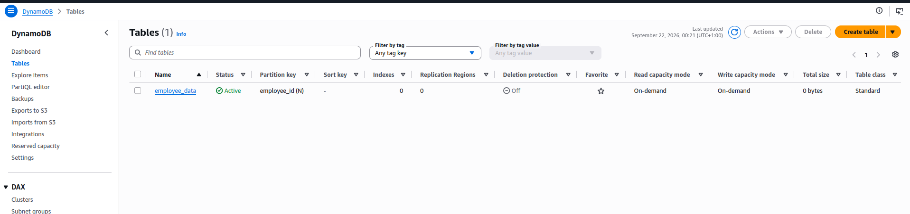
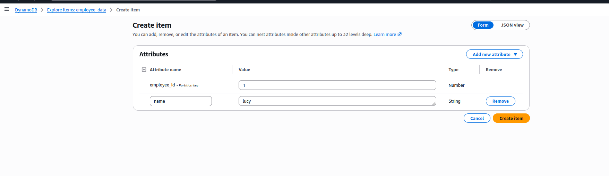
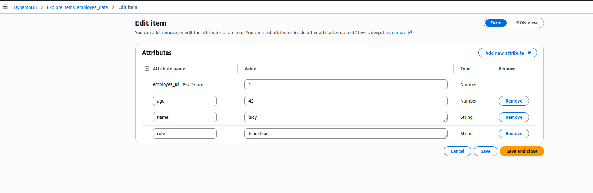
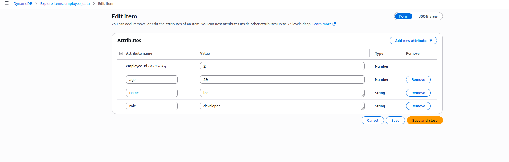
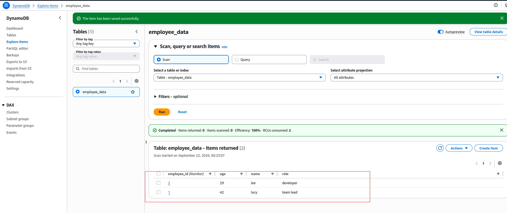
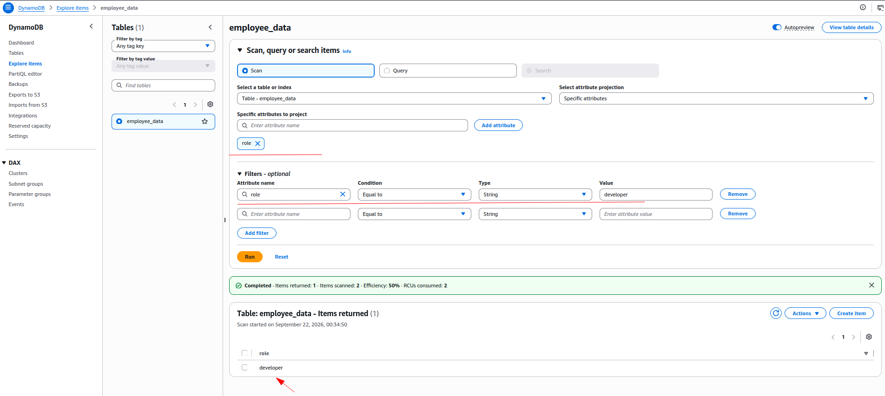
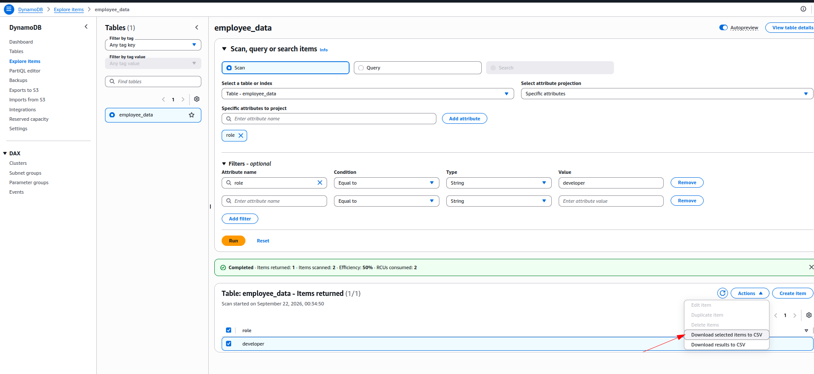
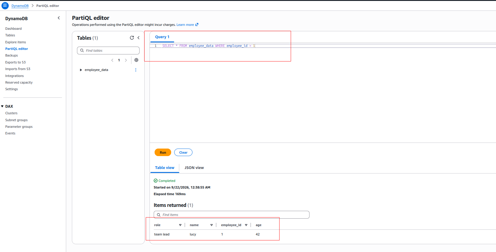
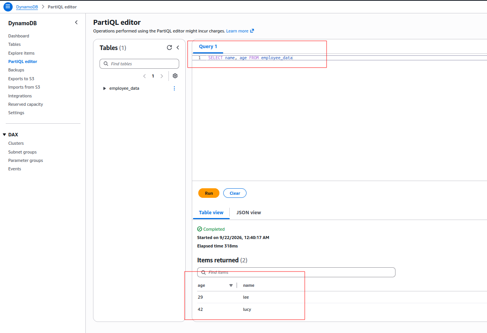
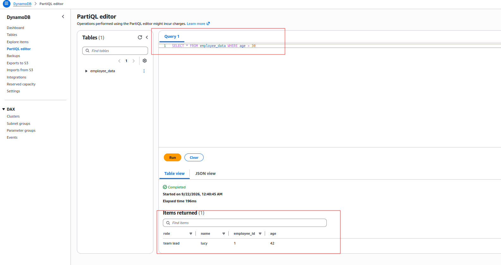

# Hands-On Lab: Demo DynamoDB

> Companion hands-on lab for [Module 6.8: Demo DynamoDB](../README.md). Same `employee_data` table exercise from that lesson, done for real in my own AWS account.

---

## What I Built

- **Table `employee_data`** — partition key `employee_id` (Number), no sort key, Default settings (which today means **On-demand** capacity mode, `DynamoDB Standard` table class).
- **Item 1** — `employee_id: 1`, `name: lucy`, `age: 42`, `role: team lead`.
- **Item 2** — `employee_id: 2`, `name: lee`, `age: 29`, `role: developer`.
- A **filtered scan** projecting just the `role` attribute, filtered to `role = developer`, plus a look at the console's CSV export options on the result.

---

## Walking Through It

### 1. Create the table

From the DynamoDB dashboard, **Create table**:

Table name `employee_data`, partition key `employee_id` typed as **Number**, sort key left blank. Table settings left on **Default settings** — the console's own note here is exact: *"DynamoDB is a schemaless database that requires only a table name and a primary key when you create the table."*

> ⚠️ Same point I flagged in [6.8's main note](../README.md#creating-a-table): the **Default table settings** panel here shows `Capacity mode: On-demand` — not Provisioned — confirming that's genuinely what "leave it at default" produces in the console today.

A few seconds later, the table's **Active** and listed, with `Read capacity mode` / `Write capacity mode` both showing **On-demand**:

### 2. Add the first item: Lucy

**Explore items → employee_data**. A first **Scan** with no items yet confirms the table exists but is empty — **Create item** is the way in:

The **Create item** form pre-fills `employee_id` since it's the partition key. I set it to `1`, then **Add new attribute** to add `name = lucy` (String):

Back on the item afterward, I added two more attributes — `age = 42` (Number) and `role = team lead` (String):

A re-run scan confirms the one item, all four attributes together:

### 3. Add the second item: Lee

Same **Create item** → **Edit item** flow for `employee_id = 2`: `age = 29`, `name = lee`, `role = developer`.

Scanning again now returns both items:

> 💡 Both of my items ended up with every attribute filled in — nothing here demonstrates the "optional attribute" point from [6.7](../../module-06.7-introduction-to-dynamodb/README.md#primary-keys) as directly as it could. The rule still holds — `role` was never required, I just chose to set it on both items — but if I wanted to see DynamoDB actually shrug at a missing attribute, I'd need a third item that skips one.

### 4. Filter down to just the developers

Back on **Explore items**, I changed **Select attribute projection** to **Specific attributes** and added `role`, then added a filter: `role` **Equal to** `developer` (String), and ran it:

The result banner spells out exactly what [6.8's main note](../README.md#filtering-items) says about filter expressions: **Items scanned: 2**, **Items returned: 1** — DynamoDB read both items off the table and only *then* dropped the one that didn't match, landing at 50% efficiency. A key-based query on a two-item table wouldn't look any different in the UI, but on a bigger table that scan-then-drop is the cost this filter doesn't avoid.

Selecting the result row opens an **Actions** menu with CSV export options — **Download selected items to CSV** or **Download results to CSV** — a quick way to get a filtered result set out of the console without touching the CLI:

> 💡 **Edit item**, **Duplicate item**, and **Delete items** are all grayed out here — because the projection is scoped to just the `role` attribute, the console doesn't have the full item (its partition key included) loaded to act on. Switching the projection back to **All attributes** before trying to edit or delete a row is the fix, next time this comes up.

### 5. Querying with PartiQL

DynamoDB also has a SQL-compatible query language, **PartiQL** — a `PartiQL editor` tab sits right next to `Explore items`, and it takes actual `SELECT` statements instead of the scan/query/filter form.

**No `WHERE` at all** — everything in the table, both items:

**`WHERE` on the partition key** — an equality condition on `employee_id`:

**`WHERE` on a non-key attribute** — `role`, not `employee_id`:

> ⚠️ These last two queries *look* identical in shape — `SELECT * ... WHERE <attribute> = <value>` — but they run completely differently under the hood. [AWS's own PartiQL docs](https://docs.aws.amazon.com/amazondynamodb/latest/developerguide/ql-reference.select.html) are explicit about this: a `SELECT` becomes a **Query** only when the `WHERE` clause has an equality (or `IN`) condition on the partition key; anything else — including `WHERE role = 'developer'` here — falls back to a full **Scan**, reading every item and filtering afterward, exactly like the console filter from step 4. PartiQL's `SELECT` syntax hides that distinction; nothing about the query text warns me which one I'm about to run.

A projection — just two columns, no `*`:

And a range condition on a non-key attribute, `age`:

> 💡 `age > 30` is also a Scan, same reasoning as the `role` query above — `age` isn't the partition key, so there's no pruning to do; DynamoDB has to read every item and check the condition on each one.

---

## Summary

- **Table:** partition key only (`employee_id`, Number) — no sort key needed for this shape of data.
- **Items:** `employee_id` is the only mandatory attribute; `name`/`age`/`role` were all added after the fact, one attribute at a time.
- **Filtering:** a console filter is a scan-then-drop, not a targeted read — the result banner's "Items scanned" vs. "Items returned" makes that explicit.
- **Export:** a filtered/projected result set can be pulled out as CSV directly from the Actions menu.
- **PartiQL:** same `SELECT ... WHERE` syntax either turns into an efficient partition-key **Query** or a read-everything **Scan**, entirely depending on which attribute is in the `WHERE` clause — the query text alone doesn't show which one it'll be.

**Next up:** wiring this same table with `aws_dynamodb_table` in Terraform, instead of clicking through the console.
