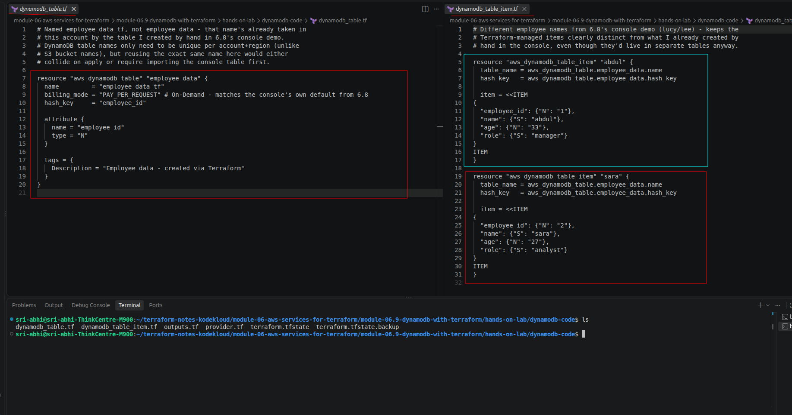
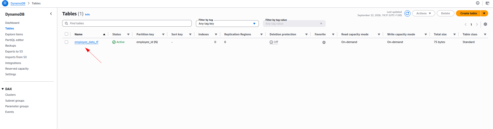
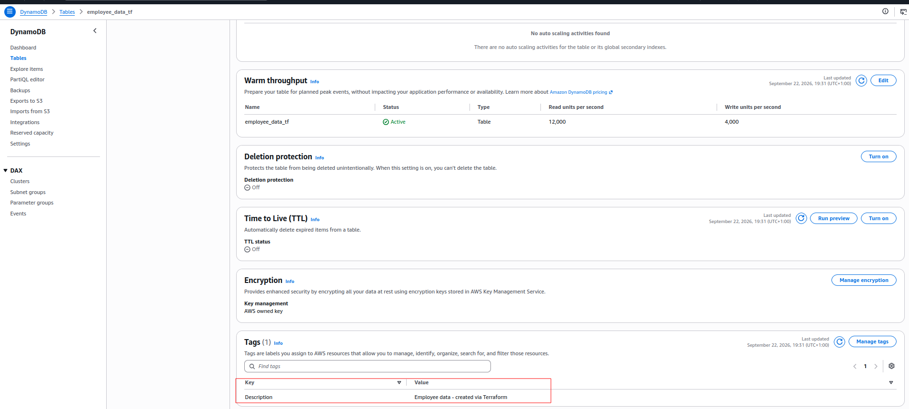
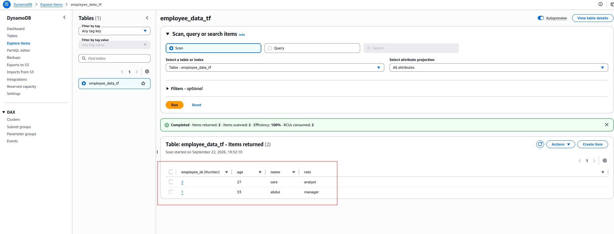

# Hands-On Lab: DynamoDB with Terraform

> Companion hands-on lab for [Module 6.9: DynamoDB with Terraform](../README.md). Code lives in [`dynamodb-code/`](dynamodb-code) — `cd` into that folder and use standard `terraform init`/`plan`/`apply`.

---

## What I Built

- `aws_dynamodb_table` (`employee_data_tf`) — partition key `employee_id` (Number), `PAY_PER_REQUEST` billing (On-Demand). Named `employee_data_tf`, not `employee_data`, because that name's already taken in this account by the table I created by hand in [6.8](../../module-06.8-demo-dynamodb/README.md)'s console demo.
- `aws_dynamodb_table_item` × 2 — `abdul` (manager, 33) and `sara` (analyst, 27). Different names from 6.8's `lucy`/`lee`, kept distinct on purpose even though they'd live in separate tables anyway.
- `outputs.tf` — the table's name, ARN, and billing mode.

No hardcoded `access_key`/`secret_key` in `provider.tf` — credentials come from `aws configure`, per the [Best Practices](../../module-06.4-aws-iam-with-terraform/README.md#best-practices-for-managing-credentials) section back in 6.4.

Files: `provider.tf`, `dynamodb_table.tf`, `dynamodb_table_item.tf`, `outputs.tf`.

---

## Walking Through It

Applied one resource-group at a time — moved every file except `provider.tf` out of the folder temporarily, then brought them back one by one.

The two resource files side by side — `dynamodb_table.tf` on the left, `dynamodb_table_item.tf` on the right:



### 1. The table

`dynamodb_table.tf` back in the folder, `terraform plan` showed just `aws_dynamodb_table.employee_data` — `1 to add`:

```
Terraform will perform the following actions:

  # aws_dynamodb_table.employee_data will be created
  + resource "aws_dynamodb_table" "employee_data" {
      + arn              = (known after apply)
      + billing_mode     = "PAY_PER_REQUEST"
      + hash_key         = "employee_id"
      + name             = "employee_data_tf"
      + tags             = {
          + "Description" = "Employee data - created via Terraform"
        }

      + attribute {
          + name = "employee_id"
          + type = "N"
        }
    }

Plan: 1 to add, 0 to change, 0 to destroy.
```

```bash
terraform apply
```

```
aws_dynamodb_table.employee_data: Creating...
aws_dynamodb_table.employee_data: Still creating... [00m10s elapsed]
aws_dynamodb_table.employee_data: Creation complete after 20s [id=employee_data_tf]

Apply complete! Resources: 1 added, 0 changed, 0 destroyed.
```

Confirmed in the console — `employee_data_tf` listed, **Active**, `employee_id (N)` as the partition key, On-demand read/write capacity mode:



Scrolling the table's own details page turned up something neither the module note nor the console demo mentioned: a **Warm throughput** panel, defaulted to `12,000` read units/second and `4,000` write units/second — and the `Description` tag from `dynamodb_table.tf`, confirmed applied:



> 💡 **Warm throughput** is a newer DynamoDB feature — every table and index, Provisioned or On-Demand, now has one, and `12,000`/`4,000` is specifically [AWS's own documented default for a brand-new table](https://docs.aws.amazon.com/amazondynamodb/latest/developerguide/warm-throughput-scenarios.html). It's the traffic level the table can absorb instantly, without throttling, based on what it's actually scaled to handle — DynamoDB raises this automatically as sustained traffic grows, but (per the same docs) it never lowers on its own, even after traffic drops back down. None of the Terraform code above set this explicitly — it's a table-level default, not something `aws_dynamodb_table` configured.

### 2. The two items

`dynamodb_table_item.tf` back, `plan` showed `2 to add` — `abdul` and `sara`, each with their `item` JSON expanded to DynamoDB's typed attribute format:

```
  # aws_dynamodb_table_item.abdul will be created
  + resource "aws_dynamodb_table_item" "abdul" {
      + table_name = "employee_data_tf"
      + hash_key   = "employee_id"
      + item       = jsonencode(
            {
              + age         = { + N = "33" }
              + employee_id = { + N = "1" }
              + name        = { + S = "abdul" }
              + role        = { + S = "manager" }
            }
        )
    }

  # aws_dynamodb_table_item.sara will be created
  + resource "aws_dynamodb_table_item" "sara" {
      + table_name = "employee_data_tf"
      + hash_key   = "employee_id"
      + item       = jsonencode(
            {
              + age         = { + N = "27" }
              + employee_id = { + N = "2" }
              + name        = { + S = "sara" }
              + role        = { + S = "analyst" }
            }
        )
    }

Plan: 2 to add, 0 to change, 0 to destroy.
```

```bash
terraform apply
```

```
aws_dynamodb_table_item.abdul: Creating...
aws_dynamodb_table_item.sara: Creating...
aws_dynamodb_table_item.abdul: Creation complete after 1s [id=employee_data_tf|employee_id|1]
aws_dynamodb_table_item.sara: Creation complete after 1s [id=employee_data_tf|employee_id|2]

Apply complete! Resources: 2 added, 0 changed, 0 destroyed.
```

Confirmed in the console too — **Explore items → employee_data_tf**, a scan returns both:



And independently with the AWS CLI, outside both Terraform and the console entirely:

```bash
aws dynamodb scan --table-name employee_data_tf --region us-east-1
```

```json
{
  "Items": [
    { "role": {"S": "analyst"}, "name": {"S": "sara"},  "employee_id": {"N": "2"}, "age": {"N": "27"} },
    { "role": {"S": "manager"}, "name": {"S": "abdul"}, "employee_id": {"N": "1"}, "age": {"N": "33"} }
  ],
  "Count": 2,
  "ScannedCount": 2
}
```

> 💡 Efficiency: 100% here, unlike [6.8](../../module-06.8-demo-dynamodb/README.md#filtering-items)'s 50% — no filter this time, so every item scanned was also returned. Same "Items scanned" vs. "Items returned" mechanism, just nothing gets dropped when there's nothing to filter out.

### 3. Outputs

`outputs.tf` back last. `terraform apply` here added nothing — `0 added, 0 changed, 0 destroyed` — it only recorded the output values:

```
Changes to Outputs:
  + billing_mode = "PAY_PER_REQUEST"
  + table_arn    = "arn:aws:dynamodb:us-east-1:002823000983:table/employee_data_tf"
  + table_name   = "employee_data_tf"

Apply complete! Resources: 0 added, 0 changed, 0 destroyed.
```

### Clean up

```bash
terraform destroy
```

---

## Troubleshooting

| Issue | Fix |
|---|---|
| `ResourceInUseException: Table already exists` | The table name collided with one that already exists in this account+region — either the console-created `employee_data` from [6.8](../../module-06.8-demo-dynamodb/README.md), or a leftover from a previous apply. Rename `name` in `dynamodb_table.tf` |
| `ValidationException` on an item | Almost always the item JSON's type wrapper — every value needs `{"S": ...}` or `{"N": ...}`, not a plain string/number |
| `error validating provider credentials` | Run `aws configure` first — see [6.3](../../module-06.3-programmatic-access/README.md#configuring-the-aws-cli) |

---

## Summary

- **Table:** `aws_dynamodb_table`, `PAY_PER_REQUEST` billing, one `attribute` block for the partition key.
- **Items:** `aws_dynamodb_table_item` × 2, each item's JSON in DynamoDB's own typed attribute format.
- **Verification:** confirmed three ways — `terraform output`, the console's own **Explore items** scan, and an independent `aws dynamodb scan` via the CLI.
- **Warm throughput:** a table-level default (`12,000` RCU / `4,000` WCU for a new table) that exists independently of `billing_mode` — not something either the console wizard or the Terraform code set explicitly.

**Next up:** Module 6 wraps here — IAM, S3, and DynamoDB, each covered as theory, a console demo, and a Terraform resource.
