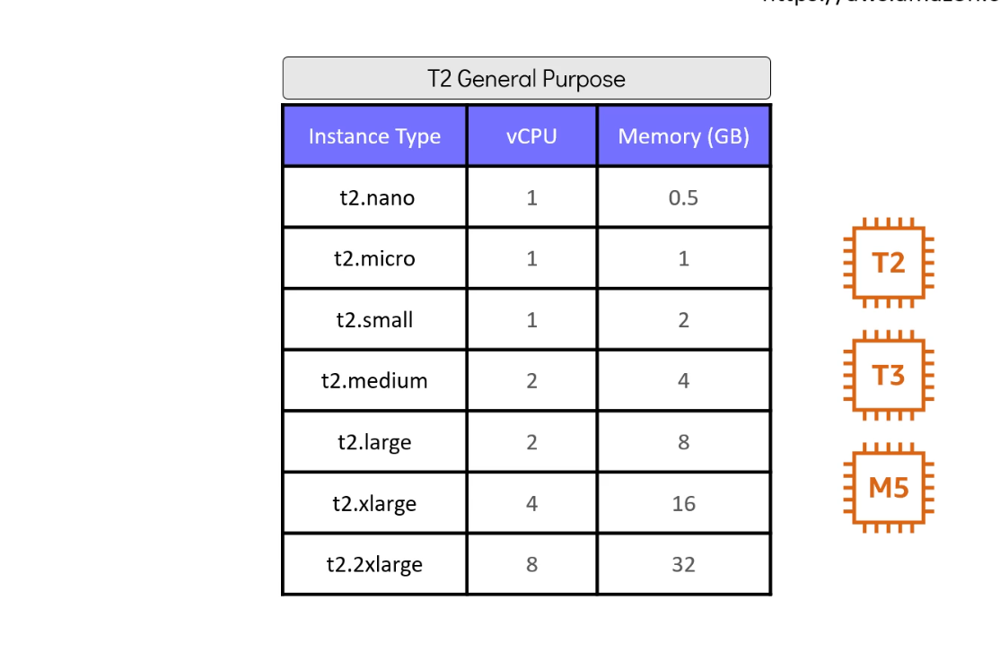
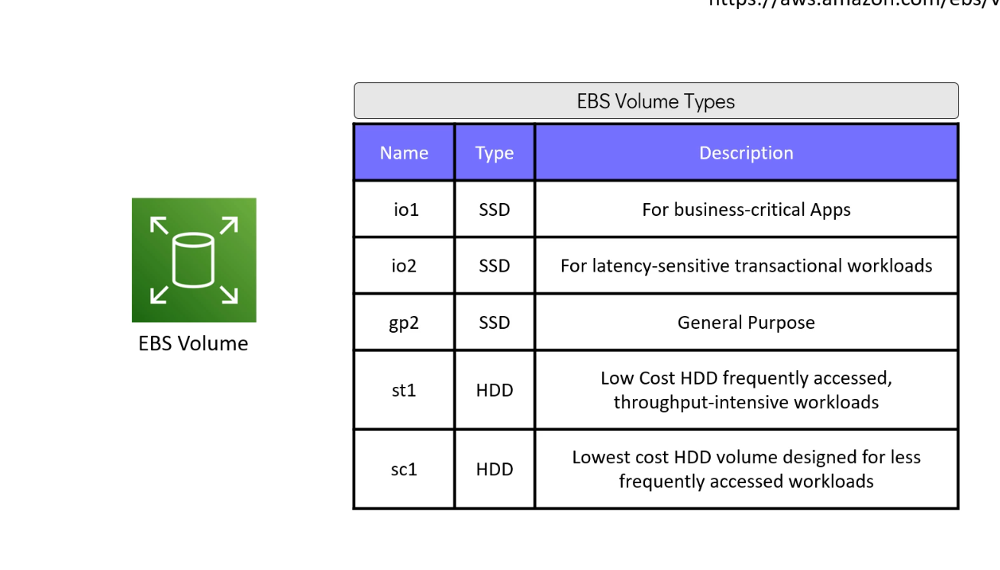
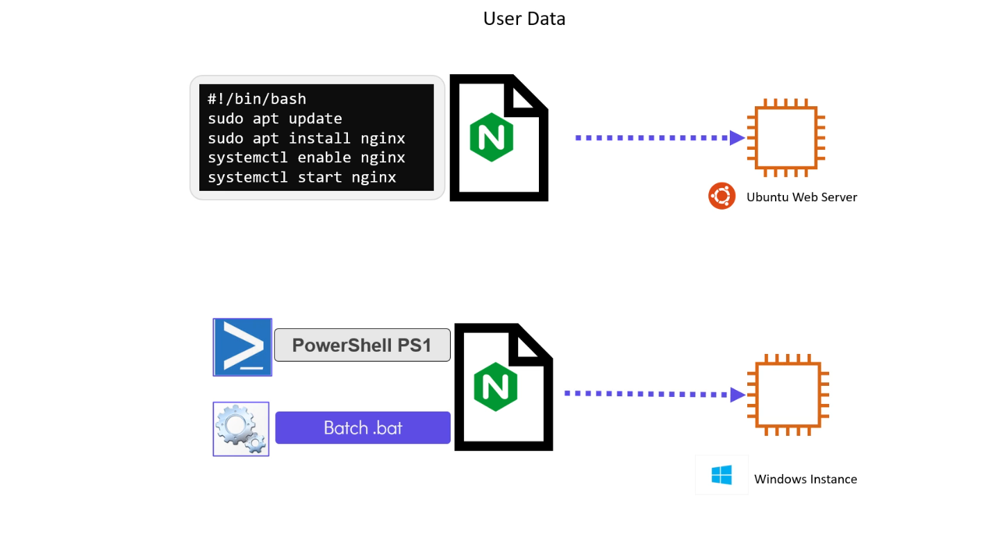

# 📘 Module 8.1: Introduction to AWS EC2 (Optional)

> Module 8 is about Terraform provisioners — but provisioners run *inside* an instance once it exists, so the module opens with the instance itself. This lesson is marked optional in the course; skip it if EC2 basics are already familiar.

---

## Introduction

**EC2 (Elastic Compute Cloud)** is AWS's virtual-machine service — scalable compute, deployable in minutes. Like any computer, physical or virtual, an EC2 instance runs an OS (a Linux distro, or Windows) and can host whatever runs on top of one: a database, a web server, an application server.

---

## AMIs: What an Instance Boots From

An **AMI (Amazon Machine Image)** is a pre-configured template — the OS plus whatever software configuration AWS (or whoever built it) baked in. Amazon Linux 2, Ubuntu 20.04, RHEL 8, Windows 2019 are all AMIs. Every AMI has an ID, and that ID is specific to the AWS region — the same Ubuntu AMI has a different ID in `us-east-1` than in `eu-west-1`.

---

## Instance Types: CPU, Memory, Networking

An instance type is a specific combination of vCPU, memory, and network performance, grouped into families for different workload shapes: general purpose for a balanced mix, compute-optimized for CPU-heavy batch/data-modeling work, memory-optimized for large in-memory datasets.

General purpose splits further into T2, T3, M5, and others, each in a range of sizes:



> ⚠️ **T2 is still sold, but it's not the current recommendation.** T3 runs on the AWS Nitro hypervisor, delivers up to ~30% better price-performance than T2 at the same size, and costs roughly 10% less per size — there's no cost or performance reason left to reach for T2 on a new deployment. **T4g** (Graviton/ARM-based) goes further still, up to ~40% better price-performance than T3. `t2.micro` shows up constantly in Terraform tutorials (including this repo's own labs) mostly because it's the classic Free Tier example — `t3.micro` is the more current equivalent where Free Tier eligibility allows it.

---

## EBS: Persistent Storage

**EBS (Elastic Block Store)** is EC2's persistent disk storage — chosen and sized at launch, with more volumes attachable later.



> ⚠️ **This table is missing a volume type.** It lists five (`io1`, `io2`, `gp2`, `st1`, `sc1`) — but `gp3` exists too, and [is now the default general-purpose SSD type AWS recommends](https://aws.amazon.com/ebs/volume-types/) if none is specified explicitly. `gp3` decouples IOPS and throughput from volume size (unlike `gp2`, where both scale with size), and it's typically cheaper than `gp2` at the same performance level. Six volume types today, not five: `gp2`, `gp3`, `io1`, `io2` (SSD), plus `st1`, `sc1` (HDD) — AWS generally steers new provisioned-IOPS volumes toward `io2` over `io1` (better durability at a comparable price), though both remain available.

---

## User Data: Bootstrapping at Launch

**User data** is a script EC2 runs automatically on first boot — the mechanism for "install and start this software the moment the instance exists," instead of SSHing in afterward to do it by hand. For Linux, that's typically a bash script:

```bash
#!/bin/bash
sudo apt update
sudo apt install nginx -y
sudo systemctl enable nginx
sudo systemctl start nginx
```

Windows instances take the same idea via PowerShell or a `.bat` script instead.



---

## Accessing an Instance

- **Linux** — SSH, using a key pair generated (or imported) at launch.
- **Windows** — RDP (Remote Desktop), using a username and a password AWS decrypts with that same key pair.

---

## Summary

- ✅ An AMI is the OS + software template an instance boots from; its ID is region-specific
- ✅ Instance types combine vCPU/memory/network performance into families (general purpose, compute-optimized, memory-optimized)
- ⚠️ T2 still works but isn't the current recommendation — T3 (and T4g beyond that) beats it on both price and performance
- ✅ EBS is the attachable, persistent disk layer — chosen and sized at launch
- ⚠️ EBS has six volume types today, not five — `gp3` is missing from the course's own diagram, and it's the current default recommendation
- ✅ User data scripts run automatically on first boot — the way to bootstrap software without a manual SSH session afterward
- ✅ Linux → SSH with a key pair; Windows → RDP with a password decrypted by that key pair

---

## Key Takeaway

**An EC2 instance is AMI (what it boots) + instance type (what it runs on) + EBS (what it stores on) + user data (what it does on first boot) — four independent choices that together define the instance.**

- ✅ Reach for T3/T4g over T2, and `gp3` over `gp2`, on anything new — both are strict upgrades at this point
- ⚠️ User data only runs once, on first boot — it's a bootstrap mechanism, not a way to push ongoing configuration changes

---

## Practice & Next Steps

Look up the current-generation general purpose instance types (T3, T3a, T4g, M6i/M7i) in the [AWS instance types docs](https://aws.amazon.com/ec2/instance-types/) and compare vCPU/memory/price against the T2 sizes above. Then move to [8.2: Demo Deploying an EC2 Instance](../module-08.2-demo-deploying-an-ec2-instance/README.md), and from there to [8.3: AWS EC2 with Terraform](../module-08.3-aws-ec2-with-terraform/README.md) — where this module's actual subject, provisioners, needs a running instance to provision.
