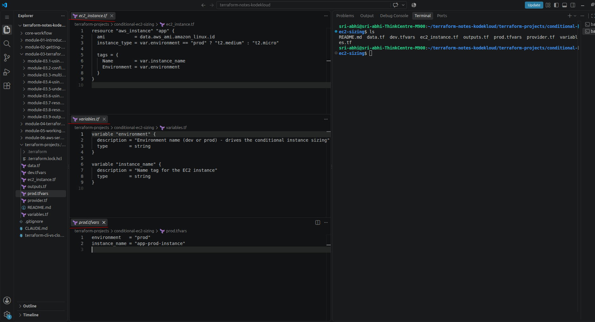
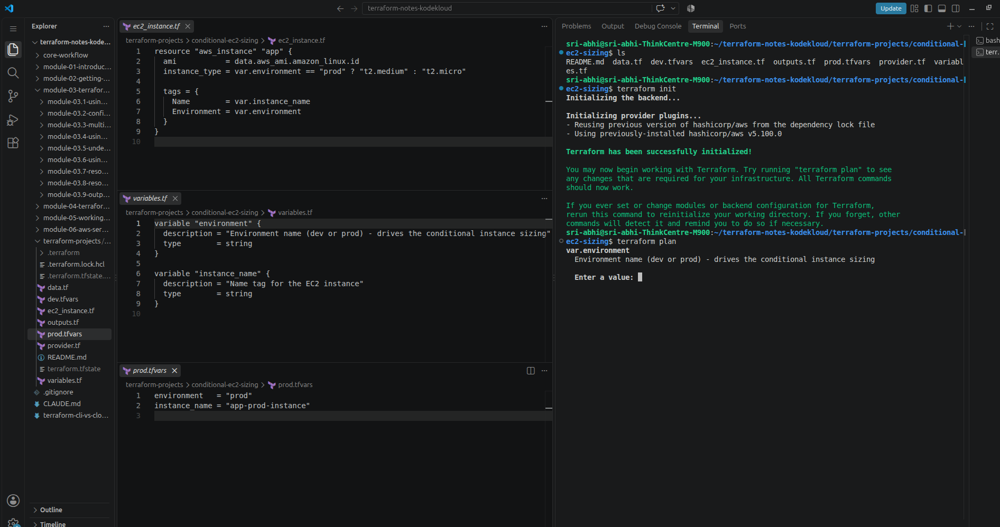
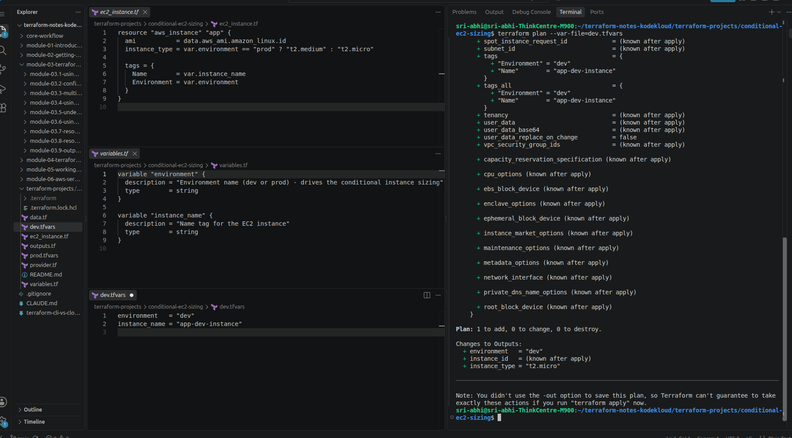
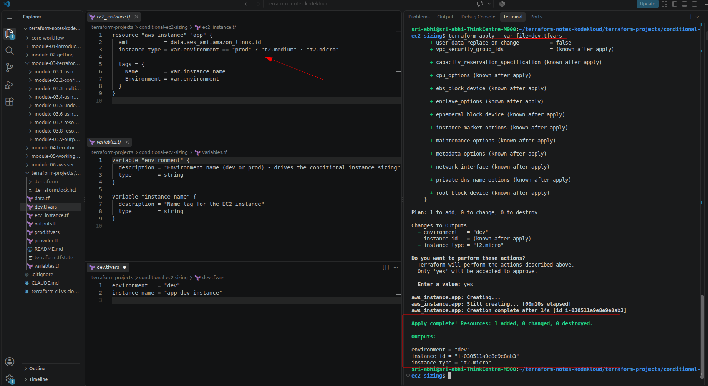
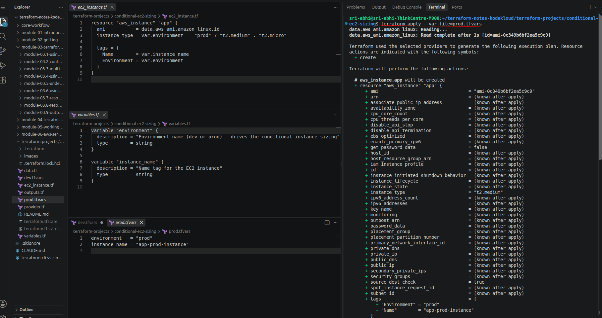
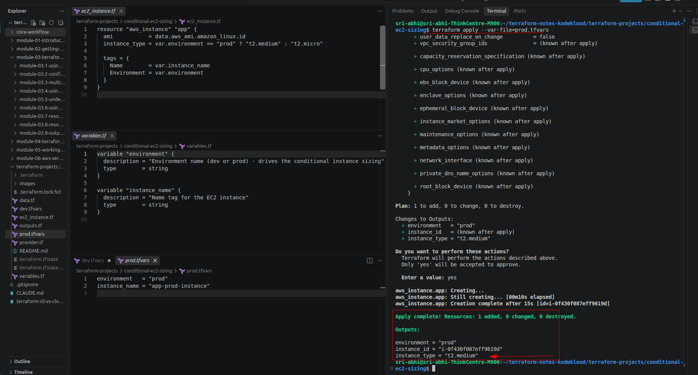
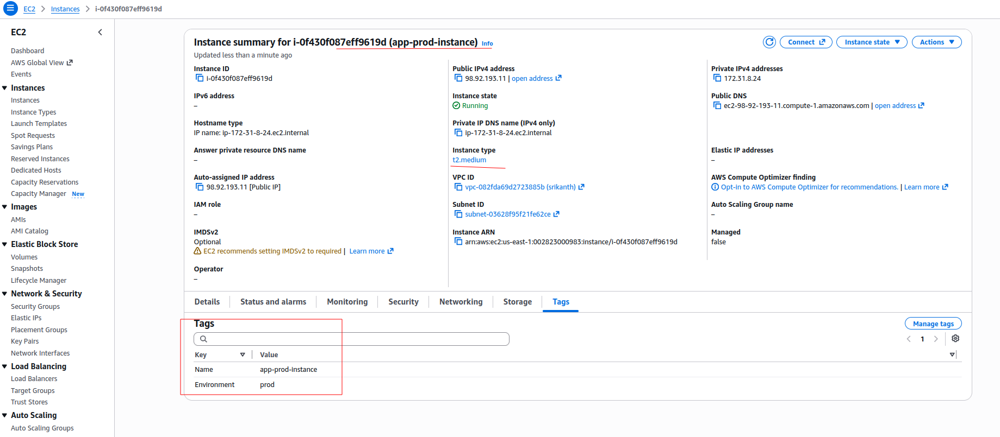

# Conditional EC2 Sizing

> One resource block, sized differently per environment: `t2.micro` for dev, `t2.medium` for prod — driven entirely by Terraform's conditional (ternary) expression.

---

## The Problem: One EC2 Resource, Different Sizes Per Environment

Say I'm creating one EC2 instance with Terraform, and I want its size to depend on which environment it's going into — production should come up as `t2.medium`, dev should come up as `t2.micro`. How do I get one `aws_instance` block to do that, instead of maintaining two near-identical copies of the same resource?

That's what a **conditional expression** — Terraform's ternary operator — is for:

```hcl
condition ? true_val : false_val
```

Here, that's:

```hcl
instance_type = var.environment == "prod" ? "t2.medium" : "t2.micro"
```

Pass `environment = "prod"` and the instance comes up as `t2.medium`. Pass anything else (`"dev"`, `"staging"`, …) and it comes up as `t2.micro`. Same resource block, same `.tf` files — the only thing that changes between environments is which `.tfvars` file I point at.

---

## Project Structure

```
conditional-ec2-sizing/
├── provider.tf      # AWS provider + version constraints
├── data.tf          # aws_ami lookup - fresh AMI at apply time, no hardcoded ID
├── variables.tf     # environment, instance_name
├── ec2_instance.tf  # the aws_instance resource with the conditional
├── outputs.tf       # instance_id, instance_type, environment
├── dev.tfvars       # environment = "dev"
└── prod.tfvars      # environment = "prod"
```

The AMI is looked up through an `aws_ami` data source rather than a hardcoded AMI ID — hardcoded IDs are region-specific and go stale as AWS deprecates old AMIs, so the lookup keeps this runnable regardless of which region I point it at.

---

## Running It

```bash
cd conditional-ec2-sizing
terraform init
```



Running `terraform plan` with no `--var-file` prompts interactively for `environment`, since it has no default — a reminder that `--var-file` isn't optional here:

```bash
terraform plan   # prompts: "Enter a value:" for var.environment
```



**Dev:**
```bash
terraform plan --var-file=dev.tfvars    # instance_type = "t2.micro"
terraform apply --var-file=dev.tfvars
terraform output                        # confirm instance_type is t2.micro
```





**Prod — destroy dev first, then apply prod as its own fresh deployment:**
```bash
terraform destroy --var-file=dev.tfvars
terraform plan --var-file=prod.tfvars   # instance_type = "t2.medium"
terraform apply --var-file=prod.tfvars
terraform output                        # confirm instance_type is t2.medium
```







Destroying dev before applying prod means `aws_instance.app` doesn't exist in state when prod applies — so Terraform's plan shows a plain `+ create`, a brand new instance ID, and no ambiguity about which environment is actually running.

**Clean up:**
```bash
terraform destroy --var-file=prod.tfvars
```

**A gotcha worth knowing about:** if I skip the `terraform destroy --var-file=dev.tfvars` step and apply `prod.tfvars` straight after `dev.tfvars`, Terraform does *not* create a second instance. Since `instance_type` isn't a ForceNew attribute on `aws_instance`, it just resizes the existing one in place (`~ update in-place`, same instance ID, `t2.micro` → `t2.medium`) instead of creating anything new. Switching `--var-file` only changes *values* passed into the same state — it doesn't give each environment a separate instance unless that state is actually separate (its own `-state=` file, a Terraform workspace, or a separate backend).

---

## Troubleshooting

| Issue | Fix |
|---|---|
| `error validating provider credentials` | Run `aws configure` first — needs a working access key + secret |
| AMI-related errors | Confirm `provider.tf`'s `region` actually has Amazon Linux 2 available (most regions do) |
| Expected a new instance, got a resized one | Forgot to `terraform destroy --var-file=dev.tfvars` before applying prod — see the gotcha note above |
| Forgot to clean up | `terraform destroy --var-file=<env>.tfvars` — whichever `.tfvars` matches the values currently applied |

---

## Taking It Further

Past one or two attributes, stacking more ternaries on the resource gets repetitive. A **locals map keyed by environment** scales better:

```hcl
locals {
  instance_config = {
    dev  = { type = "t2.micro", count = 1, monitoring = false }
    prod = { type = "t2.medium", count = 3, monitoring = true }
  }
  config = local.instance_config[var.environment]
}

resource "aws_instance" "app" {
  count         = local.config.count
  instance_type = local.config.type
  monitoring    = local.config.monitoring
  # ...
}
```

One lookup (`local.instance_config[var.environment]`) instead of three separate conditionals — `type`, `count`, and `monitoring` all come from the same map, and adding a new environment or a new setting means editing the map, not the resource block.

---

## How a Real Team Shares This Code Across Environments

This project keeps everything in one folder: one set of `.tf` files, two `.tfvars` files, one person running commands by hand. In an actual team, dev and prod aren't run by one person from one folder like this — so where does "the same code" actually live, and how does each environment reach it?

**Option 1 — Terraform workspaces.** Everyone still works out of this exact folder, same `.tf` files. Workspaces just give each environment its own separate state, without duplicating any code:

```bash
terraform workspace new dev
terraform workspace new prod

terraform workspace select dev
terraform apply --var-file=dev.tfvars

terraform workspace select prod
terraform apply --var-file=prod.tfvars
```

This is the built-in fix for the gotcha above — each workspace gets its own state, so switching workspaces (not just `.tfvars`) is what actually gives dev and prod separate instances. `terraform.workspace` can also be read directly inside the code, as an alternative to `var.environment`.

**Option 2 — a reusable module, called from a separate root config per environment.** The resource logic (the `aws_instance` block, the conditional) moves into a **module** — a folder Terraform treats as reusable, parameterized code. Each environment then gets its own thin folder that calls that module with its own values and its own backend (its own state file, entirely separate from the other environment's):

```
repo/
├── modules/
│   └── ec2-instance/          # the actual resource logic lives here, once
├── environments/
│   ├── dev/                   # calls the module, own backend/state
│   └── prod/                  # calls the module, own backend/state
```

This is the pattern most real production setups reach for, because it separates state and access per environment as well as sharing code — a mistake applied in dev's folder can't touch prod's state, since they're not even pointed at the same backend. Modules are a big enough topic on their own that I'll go through them properly later rather than cram it in here — for now, the takeaway is just that the *code* lives in one module, and each environment is a separate caller of it with its own state.

---

## What This Confirms

Same `ec2_instance.tf`, same conditional, two separate deployments: `dev.tfvars` produced `t2.micro`, and after destroying that and applying `prod.tfvars` fresh, the new instance came up as `t2.medium` — a completely new instance ID, `+ create` in the plan, no leftover state from dev. The branching logic lives once, in the resource block; which branch actually runs depends only on which `.tfvars` file — and which state — I point at.
