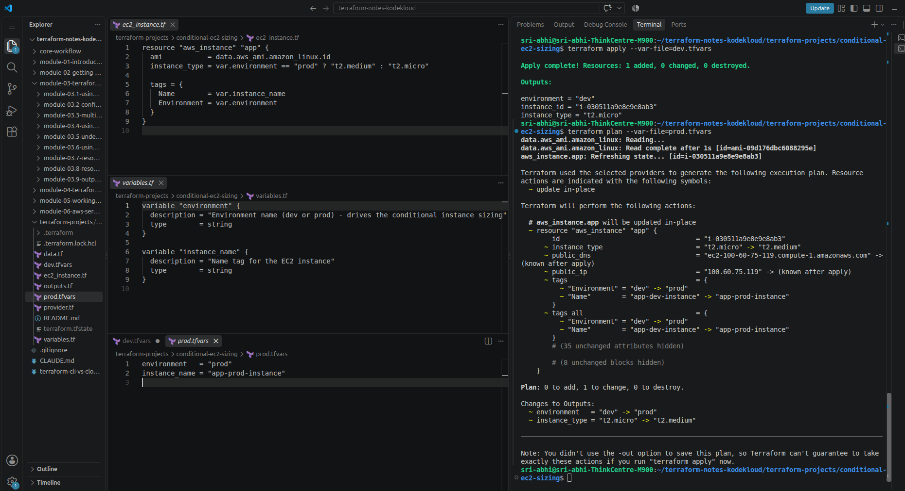
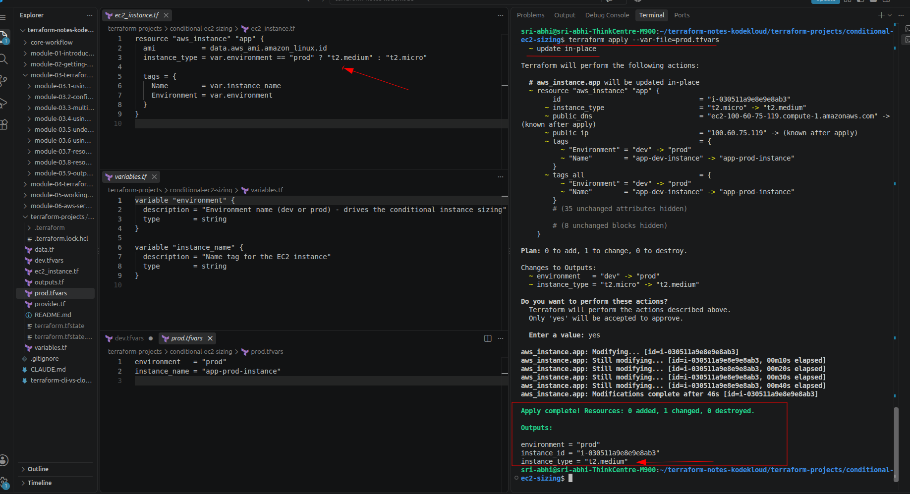
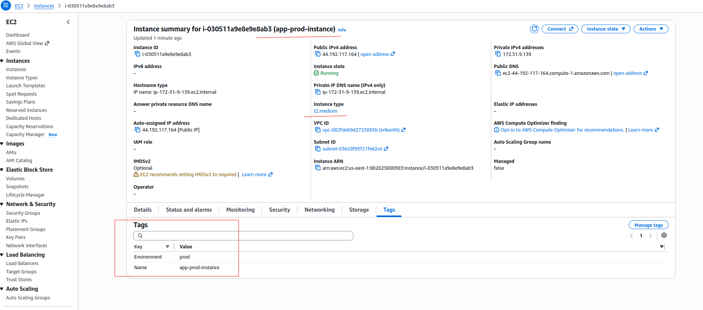

# Conditional EC2 Sizing

> One resource block, sized differently per environment: `t2.micro` for dev, `t2.medium` for prod — driven entirely by Terraform's conditional (ternary) expression.

---

## The Problem: One EC2 Resource, Different Sizes Per Environment

Say I'm creating one EC2 instance with Terraform, and I want its size to depend on which environment it's going into — production should come up as `t2.medium`, dev should come up as `t2.micro`. How do I get one `aws_instance` block to do that, instead of maintaining two near-identical copies of the same resource?

That's what a **conditional expression** — Terraform's ternary operator — is for:

```hcl
condition ? true_val : false_val
```

Here, that's:

```hcl
instance_type = var.environment == "prod" ? "t2.medium" : "t2.micro"
```

Pass `environment = "prod"` and the instance comes up as `t2.medium`. Pass anything else (`"dev"`, `"staging"`, …) and it comes up as `t2.micro`. Same resource block, same `.tf` files — the only thing that changes between environments is which `.tfvars` file I point at.

---

## Project Structure

```
conditional-ec2-sizing/
├── provider.tf      # AWS provider + version constraints
├── data.tf          # aws_ami lookup - fresh AMI at apply time, no hardcoded ID
├── variables.tf     # environment, instance_name
├── ec2_instance.tf  # the aws_instance resource with the conditional
├── outputs.tf       # instance_id, instance_type, environment
├── dev.tfvars       # environment = "dev"
└── prod.tfvars      # environment = "prod"
```

The AMI is looked up through an `aws_ami` data source rather than a hardcoded AMI ID — hardcoded IDs are region-specific and go stale as AWS deprecates old AMIs, so the lookup keeps this runnable regardless of which region I point it at.

---

## Running It

```bash
cd conditional-ec2-sizing
terraform init
```


Running `terraform plan` with no `--var-file` prompts interactively for `environment`, since it has no default — a reminder that `--var-file` isn't optional here:

```bash
terraform plan   # prompts: "Enter a value:" for var.environment
```


**Dev:**
```bash
terraform plan --var-file=dev.tfvars    # instance_type = "t2.micro"
terraform apply --var-file=dev.tfvars
terraform output                        # confirm instance_type is t2.micro
```


**Prod — applied directly on top of dev, without destroying it first:**
```bash
terraform plan --var-file=prod.tfvars   # instance_type = "t2.micro" -> "t2.medium"
terraform apply --var-file=prod.tfvars
terraform output                        # confirm instance_type is t2.medium
```







**Clean up:**
```bash
terraform destroy --var-file=prod.tfvars
```

---

## Troubleshooting

| Issue | Fix |
|---|---|
| `error validating provider credentials` | Run `aws configure` first — needs a working access key + secret |
| AMI-related errors | Confirm `provider.tf`'s `region` actually has Amazon Linux 2 available (most regions do) |
| Expected a new instance, got a resized one | Applying a different `--var-file` against the same state resizes the existing instance instead of creating a new one — see [What This Confirms](#what-this-confirms) below |
| Forgot to clean up | `terraform destroy --var-file=<env>.tfvars` — whichever `.tfvars` matches the values currently applied |

---

## Taking It Further

Past one or two attributes, stacking more ternaries on the resource gets repetitive. A **locals map keyed by environment** scales better:

```hcl
locals {
  instance_config = {
    dev  = { type = "t2.micro", count = 1, monitoring = false }
    prod = { type = "t2.medium", count = 3, monitoring = true }
  }
  config = local.instance_config[var.environment]
}

resource "aws_instance" "app" {
  count         = local.config.count
  instance_type = local.config.type
  monitoring    = local.config.monitoring
  # ...
}
```

One lookup (`local.instance_config[var.environment]`) instead of three separate conditionals — `type`, `count`, and `monitoring` all come from the same map, and adding a new environment or a new setting means editing the map, not the resource block.

---

## What This Confirms

Applying `dev.tfvars` then `prod.tfvars` back to back, without destroying in between, didn't create two instances — it changed the one instance that already existed. Same instance ID (`i-030511a9e8e9e8ab3`) before and after; `terraform plan` showed `~ update in-place`, not `+ create`, and `instance_type` moved from `t2.micro` to `t2.medium` on that same instance. The AWS console confirms it: one instance, `t2.medium`, tagged `Environment = prod`.

That's because `instance_type` on `aws_instance` isn't a ForceNew attribute — AWS can resize a stopped-or-running instance's type without replacing it, so Terraform just modifies it in place. Switching `--var-file` against the same state resizes the *same* resource; it doesn't stand up a separate one per environment. For genuinely separate dev and prod instances, each environment needs its own state — a different `-state=` file, a Terraform workspace, or a separate backend — not just a different `.tfvars` pointed at the same state.
