# 🧪 Hands-On Project: nginx Web App with Reusable Terraform Modules (Dev, Staging & Production)

> I build one real project from scratch: an nginx web server on EC2, with its own VPC, security group, and IAM role, and state stored in an S3 backend. Every piece is a small module. One central module, `nginx-web-app`, joins the four pieces together, and each environment (dev, staging, production) makes just **one** call to it with its own values.

---

## What I Build

```
terraform-modules-multi-env/
├── bootstrap/                  # Step 1: creates the S3 bucket for remote state (run once)
│   └── main.tf
├── modules/                    # All the real code — written ONCE
│   ├── vpc/                    # VPC, public subnet, internet gateway, route table
│   ├── security-group/         # firewall: HTTP 80 from anywhere, SSH 22 from my IP
│   ├── iam/                    # EC2 role + SSM policy + instance profile
│   ├── ec2/                    # nginx server (AMI found with a data block)
│   └── nginx-web-app/          # central module — calls the four above and joins them
├── environments/               # Each environment makes ONE call to nginx-web-app
│   ├── dev/
│   ├── staging/
│   └── production/
├── .gitignore
└── README.md
```

Every module folder has the same three files: `main.tf` (resources), `variables.tf` (inputs), `outputs.tf` (values it gives back).
Every environment folder has four: `main.tf`, `variables.tf`, `terraform.tfvars`, `outputs.tf`.

### How the pieces connect

```
environments/dev/terraform.tfvars
  → environments/dev/main.tf        module "nginx_web_app"
    → modules/nginx-web-app/main.tf
         vpc ──────────vpc_id──────────────► security_group
         vpc ──────────public_subnet_id────► ec2
         security_group ──security_group_id► ec2
         iam ──────────instance_profile_name► ec2
```

- The **environments** only know about `nginx-web-app`. They don't know there are four modules inside.
- **`nginx-web-app`** is the only place that knows how the pieces fit: it takes one module's output and passes it into the next module's input.
- The **four small modules** don't know about each other at all. They just take inputs and give outputs.

### What changes per environment

|  | dev | staging | production |
|--|-----|---------|------------|
| VPC CIDR | `10.0.0.0/16` | `10.1.0.0/16` | `10.2.0.0/16` |
| Public subnet CIDR | `10.0.1.0/24` | `10.1.1.0/24` | `10.2.1.0/24` |
| Instance type | `t3.micro` | `t3.small` | `t3.small` |
| State file in S3 | `dev/terraform.tfstate` | `staging/terraform.tfstate` | `production/terraform.tfstate` |

Only `terraform.tfvars` and the backend `key` are different — the module code is the same for all three.

**Region:** `eu-west-1` (Ireland). **Cost:** small if I destroy at the end. No NAT Gateway on purpose (it's the most expensive part of a typical VPC) — the server sits in a public subnet.

---

## Progress

- [x] `bootstrap/` — S3 state bucket (applied)
- [x] `modules/vpc`
- [x] `modules/security-group`
- [x] `modules/iam`
- [x] `modules/ec2`
- [x] `modules/nginx-web-app`
- [x] `environments/dev` — applied, nginx page works in the browser
- [x] Break & Fix — 5 module errors (+1 bonus) made and fixed in dev
- [x] `environments/staging` — applied, plus 4 copy-an-environment errors (wrong key, tfvars, state lock)
- [ ] `environments/production`

---

## Step 0 — Prerequisites

```bash
terraform -version            # 1.11 or newer (needed for S3 native locking)
aws sts get-caller-identity   # confirms my AWS credentials work
curl https://checkip.amazonaws.com   # my public IPv4 — goes into ssh_cidr as x.x.x.x/32
```

`.gitignore` keeps state and downloaded providers out of git:

```
.terraform/
*.tfstate
*.tfstate.*
crash.log
```

> 💡 I commit `.terraform.lock.hcl` only in the folders I actually run (`bootstrap/` and the environments). The module folders don't need one — if I run `terraform init` inside a module just to validate it, I delete `.terraform/` and `.terraform.lock.hcl` afterwards.

---

## Step 1 — Bootstrap: the S3 Backend Bucket

**Why a separate folder?** The bucket must exist *before* any environment can store its state in it — Terraform can't keep its state in a bucket it hasn't created yet. So `bootstrap/` uses local state and runs once.

What [`bootstrap/main.tf`](bootstrap/main.tf) creates:

| Resource | Why |
|----------|-----|
| `aws_s3_bucket` `abhigna-tfstate-2026` | holds the state of every environment |
| `lifecycle { prevent_destroy = true }` | Terraform refuses to delete it by accident |
| `aws_s3_bucket_versioning` | keeps old state versions, so a bad apply can be recovered |
| `aws_s3_bucket_public_access_block` | state can contain secrets — never public |

```bash
cd bootstrap
terraform init
terraform plan
terraform apply
```

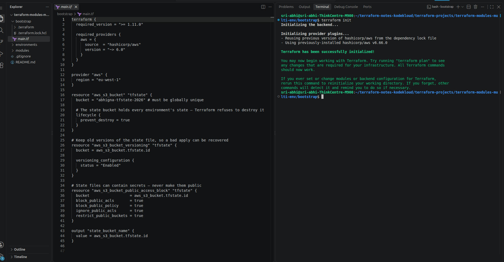

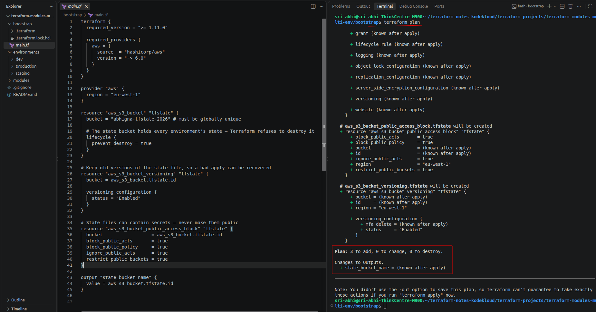

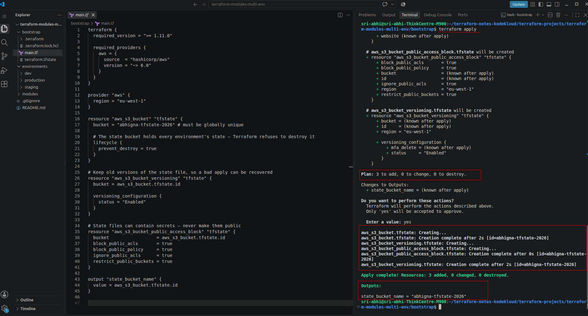

✅ **Checkpoint:** `Apply complete! Resources: 3 added` and the output `state_bucket_name = "abhigna-tfstate-2026"`. `aws s3 ls | grep abhigna-tfstate-2026` shows my bucket.

> ⚠️ `bootstrap/terraform.tfstate` stays on my laptop and git ignores it. It's the only record of the bucket, so I keep it safe.

---

## Step 2 — The Four Small Modules

### `modules/vpc` — the network

| Resource | Name in code | What it does |
|----------|--------------|--------------|
| `data.aws_availability_zones` | `available` | finds the AZs in my region; the subnet uses the first one |
| `aws_vpc` | `nginx_vpc` | my own private network |
| `aws_subnet` | `public_subnet` | where EC2 runs; `map_public_ip_on_launch = true` gives it a public IP |
| `aws_internet_gateway` | `nginx_igw` | the door between the VPC and the internet |
| `aws_route_table` | `public_rt` | sends `0.0.0.0/0` through the gateway |
| `aws_route_table_association` | `public_rt_assoc` | attaches the route table to the subnet — **this** is what makes it "public" |

**Inputs:** `environment`, `vpc_cidr`, `public_subnet_cidr` → **Outputs:** `vpc_id`, `public_subnet_id`

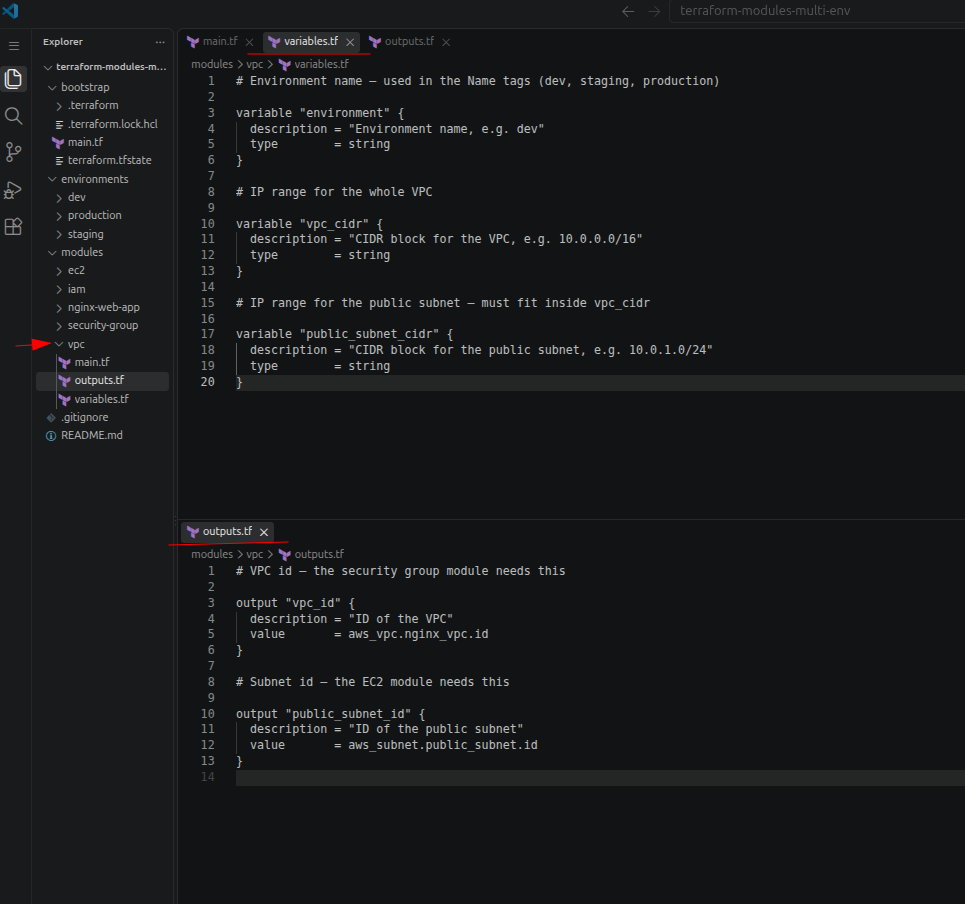

To check a module on its own, I run `terraform init -backend=false` and `terraform validate` inside its folder. My first try was `validate` without `init`, which fails with `Missing required provider` — `init` has to download the AWS provider first:

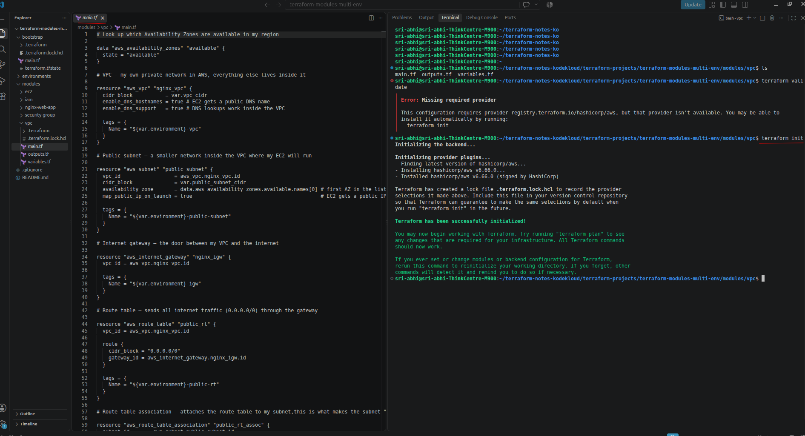

> ⚠️ A module folder is only for `init` + `validate` — never `plan` or `apply`. When I ran `terraform plan` inside `modules/vpc`, Terraform asked me to type `var.environment` by hand, because nobody passes values into a module run on its own. The environments pass the values, so `plan` belongs there. Afterwards I delete `.terraform/` and `.terraform.lock.hcl` from the module folder.

### `modules/security-group` — the firewall

| Resource | Name in code | What it does |
|----------|--------------|--------------|
| `aws_security_group` | `nginx_sg` | the firewall itself, inside my VPC |
| `aws_vpc_security_group_ingress_rule` | `http` | port 80 from anywhere, so anyone can open the page |
| `aws_vpc_security_group_ingress_rule` | `ssh` | port 22 only from `ssh_cidr` (my IP) |
| `aws_vpc_security_group_egress_rule` | `all_outbound` | all outbound traffic, so EC2 can download nginx |

**Inputs:** `environment`, `vpc_id`, `ssh_cidr` → **Output:** `security_group_id`

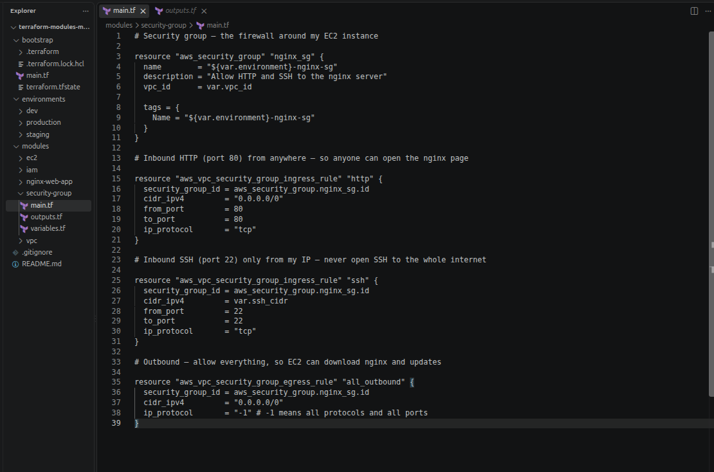

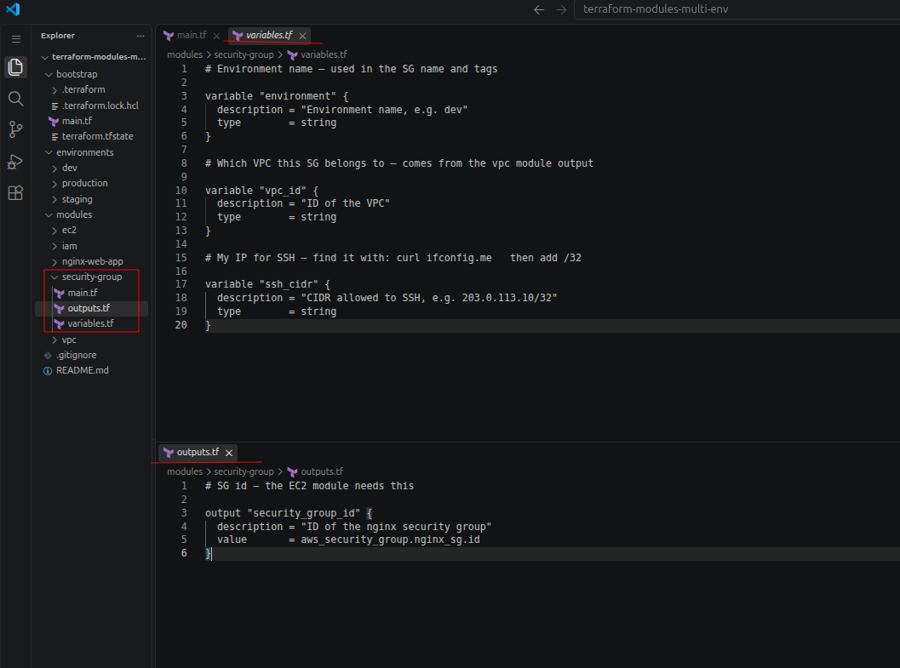

> 💡 `ssh_cidr` is **my Ubuntu machine's public IPv4**, not the EC2's IP — AWS gives EC2 its own IP. I get mine with `curl https://checkip.amazonaws.com` (plain `curl ifconfig.me` gave me an IPv6 address, which doesn't fit a `cidr_ipv4` rule) and add `/32` = exactly one address. It's only for SSH: Terraform talks to AWS with my access keys, and the nginx page on port 80 is open to everyone.

> 💡 Each rule is its own resource instead of `ingress {}` / `egress {}` blocks inside the security group — that's what the AWS provider docs recommend now. And when Terraform creates a security group, it removes AWS's default "allow all outbound" rule, so I write the egress rule myself. Without it, EC2 can't install nginx.

### `modules/iam` — permissions for the server

| Resource | Name in code | What it does |
|----------|--------------|--------------|
| `aws_iam_role` | `nginx_ec2_role` | an identity only the EC2 service can use (trust policy) |
| `aws_iam_role_policy_attachment` | `ssm` | adds AWS's `AmazonSSMManagedInstanceCore` policy, so I can log in with Session Manager — no SSH key needed |
| `aws_iam_instance_profile` | `nginx_profile` | the "holder" that attaches the role to an EC2 instance |

**Input:** `environment` → **Output:** `instance_profile_name`

> 💡 IAM names are global in the AWS account (not per region), so the environment name goes in front: `dev-nginx-ec2-role`, `production-nginx-ec2-role`.

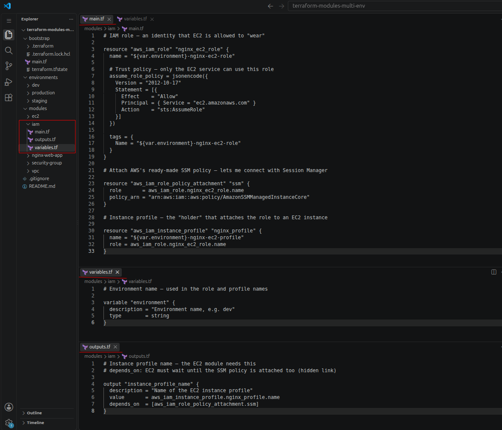

### `modules/ec2` — the nginx server

| Resource | Name in code | What it does |
|----------|--------------|--------------|
| `data.aws_ami` | `amazon_linux` | finds the newest Amazon Linux 2023 AMI — no hard-coded AMI ID |
| `aws_instance` | `nginx_server` | the server; `user_data` installs nginx on first boot and writes `Hello from <env> nginx` |

Extra settings on the instance:
- `metadata_options { http_tokens = "required" }` — only IMDSv2, the safer metadata service.
- `user_data_replace_on_change = true` — if I change the script, Terraform replaces the instance so the new script actually runs.
- `key_name` is optional (`default = null`) — without a key pair I use Session Manager instead of SSH.

**Inputs:** `environment`, `instance_type`, `subnet_id`, `security_group_id`, `instance_profile_name`, `key_name` → **Outputs:** `public_ip`, `instance_id`

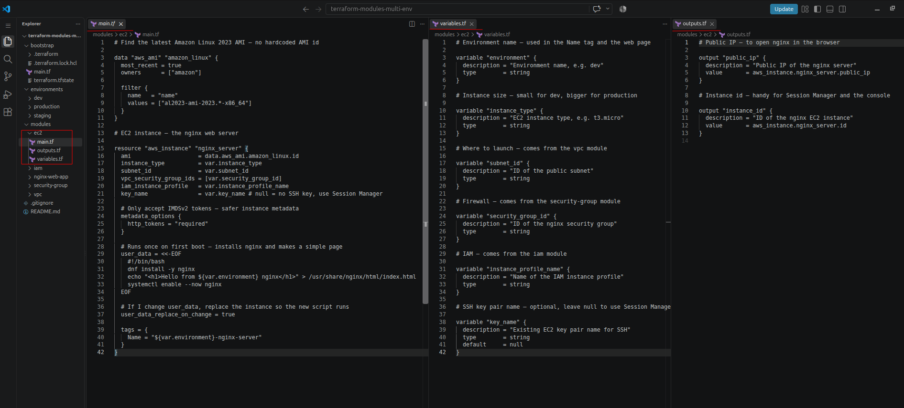

---

## Step 3 — The Central Module: `modules/nginx-web-app`

This module has no resources of its own. It only calls the four modules and wires them together:

```hcl
module "ec2" {
  source = "../ec2"

  environment           = var.environment
  instance_type         = var.instance_type
  subnet_id             = module.vpc.public_subnet_id                 # from vpc
  security_group_id     = module.security_group.security_group_id     # from security-group
  instance_profile_name = module.iam.instance_profile_name            # from iam
  key_name              = var.key_name
}
```

**Inputs:** `environment`, `vpc_cidr`, `public_subnet_cidr`, `ssh_cidr`, `instance_type`, `key_name` → **Outputs:** `public_ip`, `instance_id`, `nginx_url`, `vpc_id` (added in Break & Fix 4)

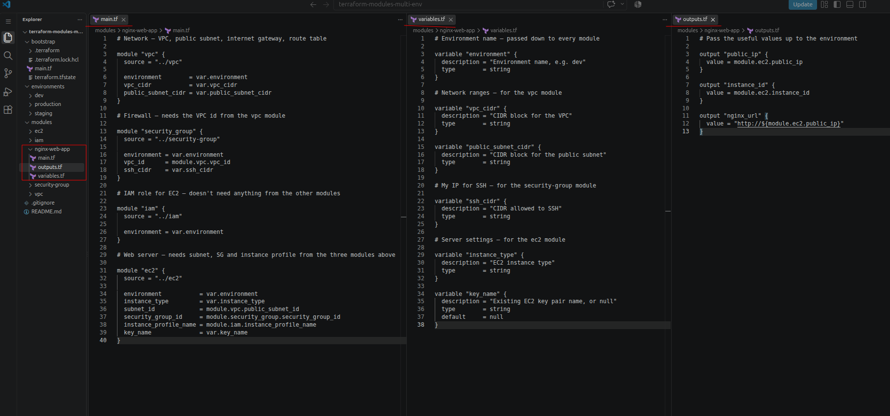

> 💡 **Paths:** inside `nginx-web-app` the sources are `../vpc`, `../ec2`… (one level up). From an environment it's `../../modules/nginx-web-app` (two levels up).

---

## How Terraform Knows the Order (no `depends_on` everywhere)

When one resource uses another's value — like `vpc_id = aws_vpc.nginx_vpc.id` — Terraform builds the one it depends on first. The same works between modules: `module.vpc.vpc_id` passed into the security group means the VPC is built first. So I don't add `depends_on` "to be safe" — it only slows plans down and can cause needless changes.

I use `depends_on` only for a **hidden link** that no reference shows. In this project there is exactly one, in [`modules/iam/outputs.tf`](modules/iam/outputs.tf):

```hcl
output "instance_profile_name" {
  value      = aws_iam_instance_profile.nginx_profile.name
  depends_on = [aws_iam_role_policy_attachment.ssm]
}
```

The instance profile never references the SSM policy attachment, so without this, EC2 could start before the policy is attached. With `depends_on` on the output, anything that uses it (the EC2 module) also waits for the policy.

---

## Step 4 — Dev Environment

### `environments/dev/main.tf`

```hcl
# Terraform settings — version, provider and where to keep state

terraform {
  required_version = ">= 1.11.0"

  required_providers {
    aws = {
      source  = "hashicorp/aws"
      version = "~> 6.0"
    }
  }

  # State goes to the bootstrap bucket — only the key changes per environment
  backend "s3" {
    bucket       = "abhigna-tfstate-2026"
    key          = "dev/terraform.tfstate"
    region       = "eu-west-1"
    use_lockfile = true
  }
}

# AWS provider — default_tags are added to every resource

provider "aws" {
  region = var.region

  default_tags {
    tags = {
      Project     = "nginx-web-app"
      Environment = var.environment
      ManagedBy   = "terraform"
    }
  }
}

# The whole app — one call, the values come from terraform.tfvars

module "nginx_web_app" {
  source = "../../modules/nginx-web-app"

  environment        = var.environment
  vpc_cidr           = var.vpc_cidr
  public_subnet_cidr = var.public_subnet_cidr
  ssh_cidr           = var.ssh_cidr
  instance_type      = var.instance_type
  key_name           = var.key_name
}
```

> ⚠️ The backend block can't use `var.` — the bucket, key and region are typed in directly. Each environment has its own `key`, so they never share a state file. If two used the same key, one would overwrite the other's state.

### `environments/dev/variables.tf`

Declares the same inputs: `region`, `environment`, `vpc_cidr`, `public_subnet_cidr`, `ssh_cidr`, `instance_type`, and `key_name` (with `default = null`).

### `environments/dev/terraform.tfvars`

```hcl
region             = "eu-west-1"
environment        = "dev"
vpc_cidr           = "10.0.0.0/16"
public_subnet_cidr = "10.0.1.0/24"
ssh_cidr           = "x.x.x.x/32" # my IP from: curl ifconfig.me
instance_type      = "t3.micro"
```

### `environments/dev/outputs.tf`

Passes up `public_ip`, `instance_id` and `nginx_url` from `module.nginx_web_app`.

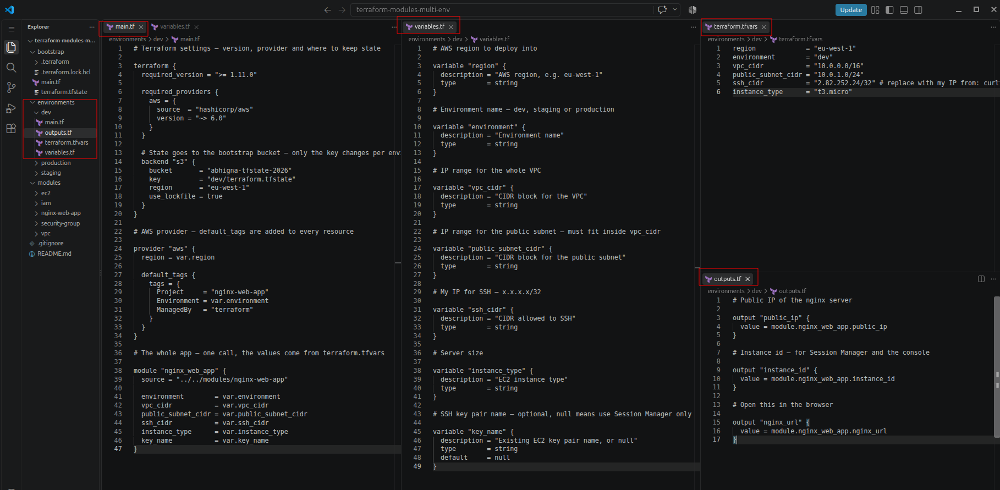

### Run it

```bash
cd environments/dev
cp ../../bootstrap/.terraform.lock.hcl .   # so init reuses the cached provider instead of downloading it again
terraform init
terraform fmt -recursive ../..             # tidy every .tf file in the project
terraform validate
terraform plan
terraform apply
```

**init → fmt → validate:** `init` connects dev to the S3 backend and finds all five modules; the provider comes from the shared cache in seconds.

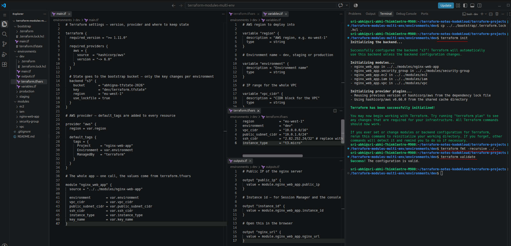

**plan:** every address starts with `module.nginx_web_app.module.<name>` — the resources live two modules deep.

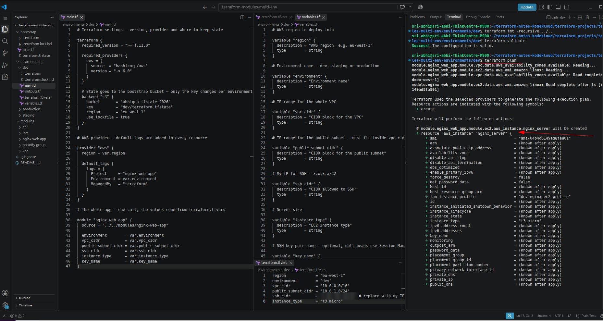

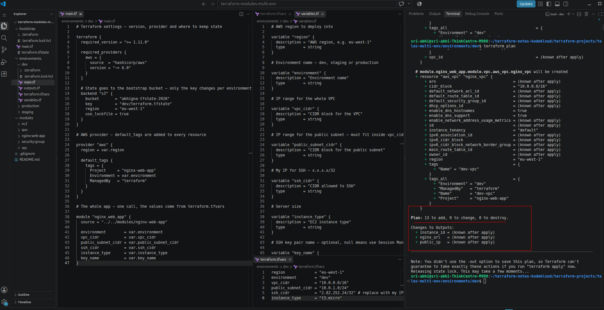

**apply:** Terraform builds in dependency order — VPC first, then the internet gateway, subnet and security group, the IAM role and profile, and the EC2 instance last.

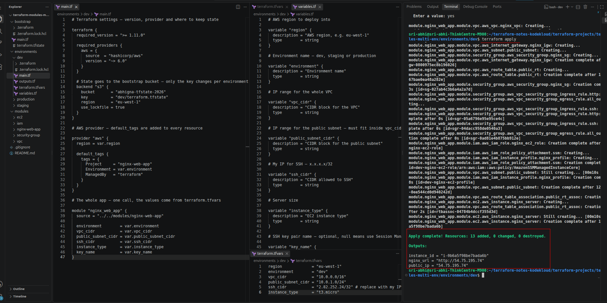

✅ **Checkpoints (my real results):**

- `Plan: 13 to add` — 5 VPC + 4 security group (1 SG + 3 rules) + 3 IAM + 1 EC2. `terraform state list` shows 15 lines: the 13 resources plus the 2 data sources (AZs and AMI).
- `Apply complete! Resources: 13 added, 0 changed, 0 destroyed.`
- About 2 minutes later, the `nginx_url` output opens **Hello from dev nginx** (`curl $(terraform output -raw nginx_url)` shows the same):

  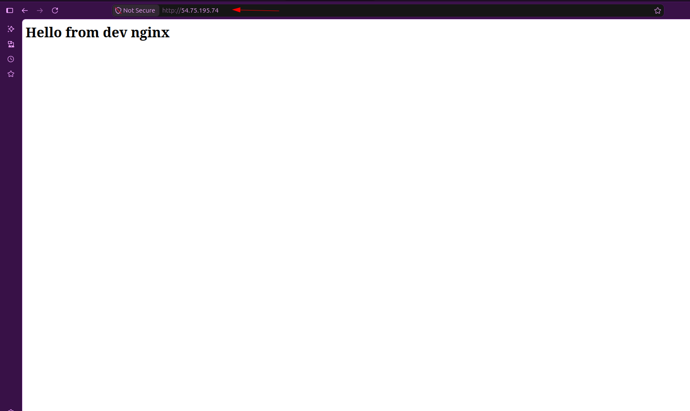

- In the EC2 console, `dev-nginx-server` is running as `t3.micro` with 3/3 status checks passed:

  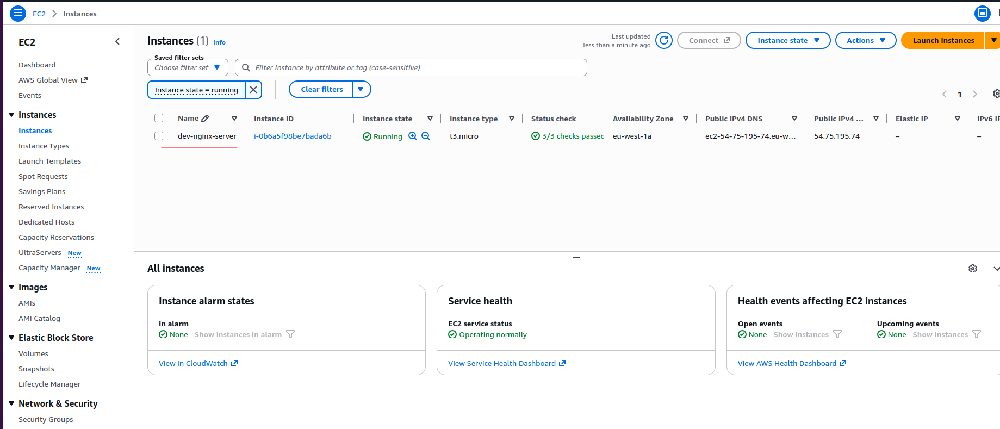

- The instance summary proves every module did its job: VPC `dev-vpc` and subnet `dev-public-subnet` (vpc module), IAM role `dev-nginx-ec2-role` (iam module), IMDSv2 `Required` (ec2 module), and the `default_tags` from the provider — `Environment`, `ManagedBy`, `Project` — next to the `Name` tag:

  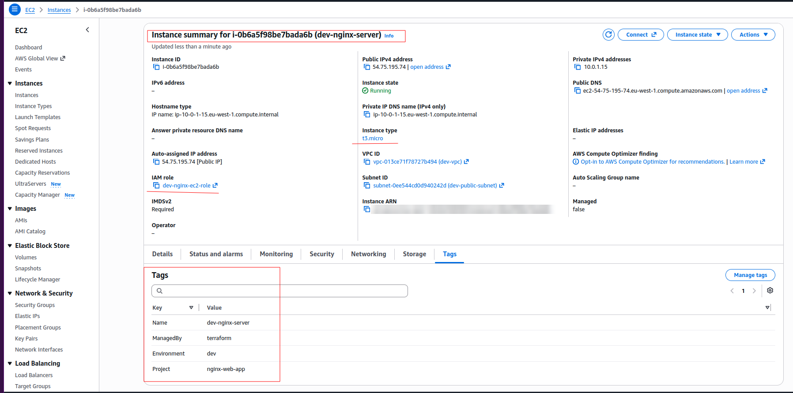

- State is in S3, not on my laptop — there's no `terraform.tfstate` in the dev folder. The bucket has a `dev/` folder holding `terraform.tfstate`:

  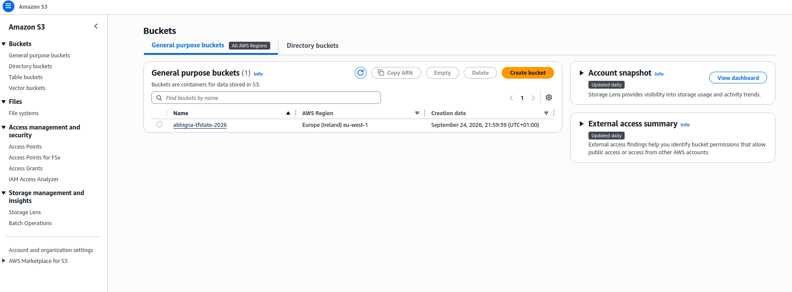

  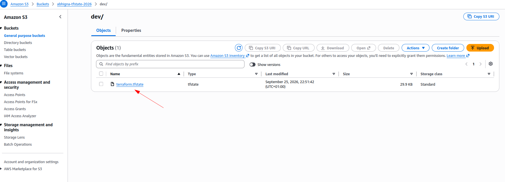

- The state file is private: on its Permissions tab, **Everyone (public access)** and **Authenticated users** have no access — that's the public access block from bootstrap working:

  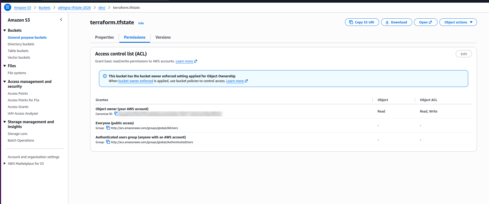

- Session Manager works: EC2 console → my instance → **Connect** → **Session Manager** (give it 2–3 minutes after boot).

---

## Step 5 — Break & Fix: Module Errors in Dev

Once dev worked, I broke the code on purpose to see the errors people really hit when working with modules — then fixed each one. All of these are caught by `terraform validate`, run from `environments/dev`: validate checks the whole chain `dev → nginx-web-app → vpc/sg/iam/ec2`, so it finds mistakes inside the modules too, and the `on <file> line <N>` part points straight at the module file.

> 💡 **How I read any Terraform error:** the first line is the error *type* (`Missing required argument`, `Unsupported argument`…), `on <file> line <N>` says *where*, and the last sentence usually says the *fix*.

### 1. Forgot to pass a variable into a module — `Missing required argument`

**Break:** in `modules/nginx-web-app/main.tf`, I deleted `ssh_cidr = var.ssh_cidr` from `module "security_group"`.

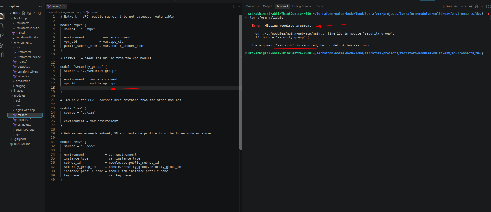

**Why:** `variable "ssh_cidr"` in the security-group module has no `default`, so whoever calls the module **must** pass it.
**Fix:** put the line back (or, when it makes sense, give the variable a `default`).

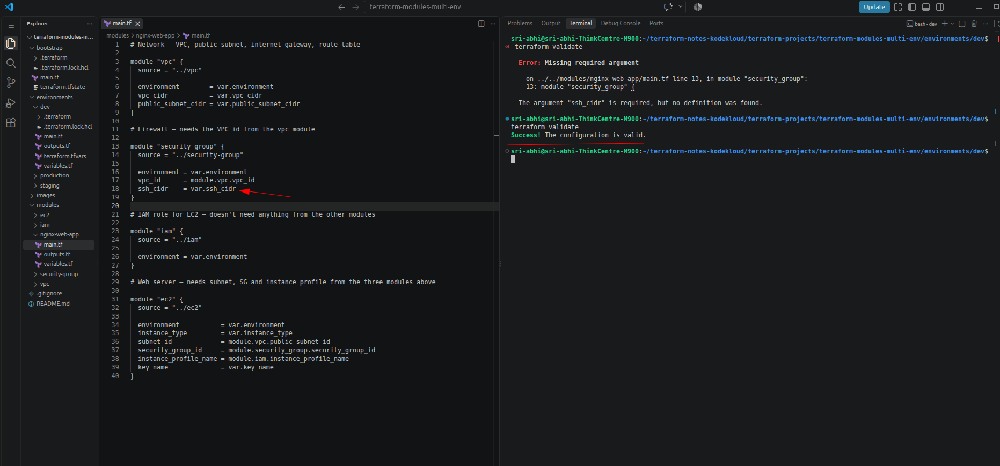

### 2. Typo in an argument name — `Unsupported argument`

**Break:** `vpc_cidr` → `vpc_cidrr` inside `module "vpc"`.

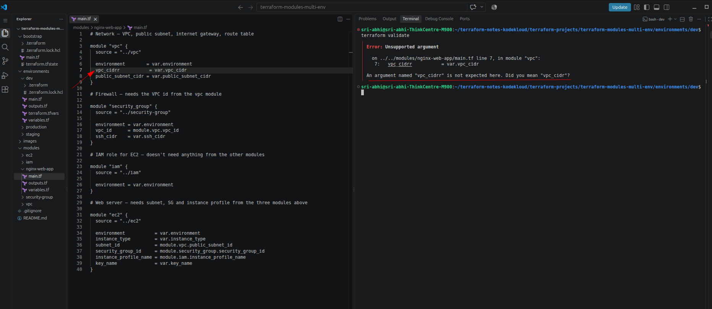

**Why:** the name on the left of `=` must match a `variable` block in the module being called. Terraform even suggests the right one: *Did you mean "vpc_cidr"?* Only this one error shows — Terraform stops at the wrong name before it checks for the missing one.
**Fix:** correct the spelling.

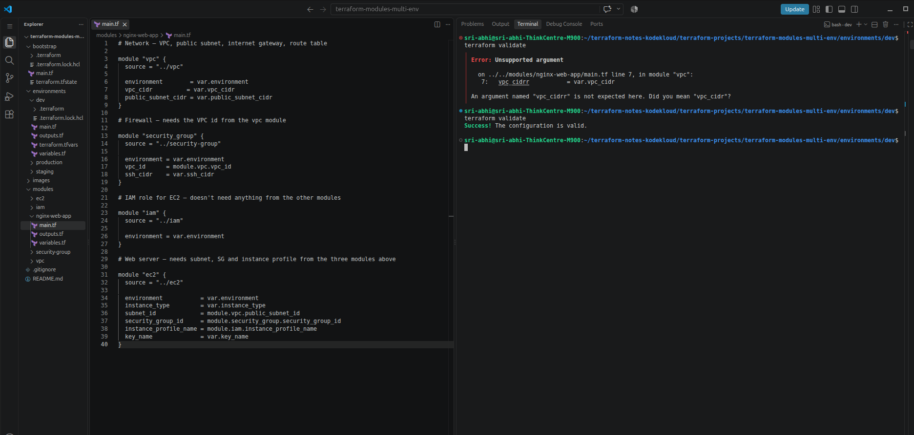

### 3. Asking a module for an output it doesn't have — `Unsupported attribute`

**Break:** in `module "ec2"`, `module.vpc.public_subnet_id` → `module.vpc.subnet_id`.

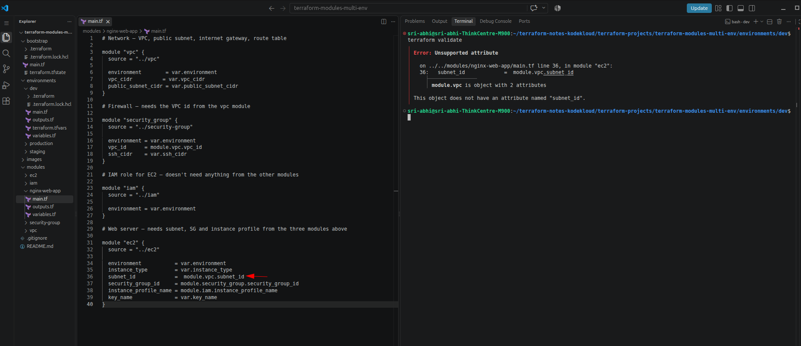

**Why:** a module is a closed box. From outside I can only read what its `outputs.tf` lists — the vpc module has exactly **2** outputs (`vpc_id`, `public_subnet_id`), which is what `module.vpc is object with 2 attributes` means.
**Fix:** use the real output name.

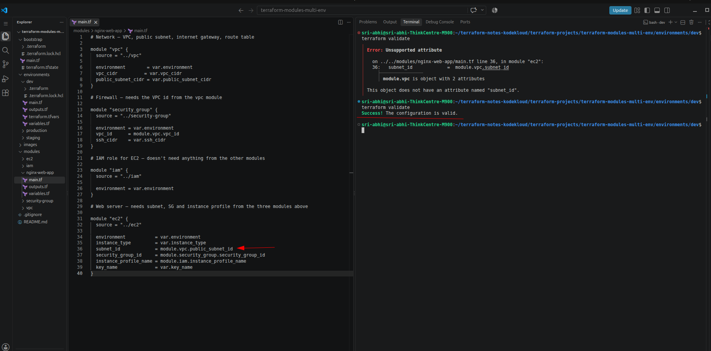

### Bonus: a missing `=` — `Invalid block definition`

I also tried deleting the `=` in `environment = var.environment` inside `module "ec2"`:

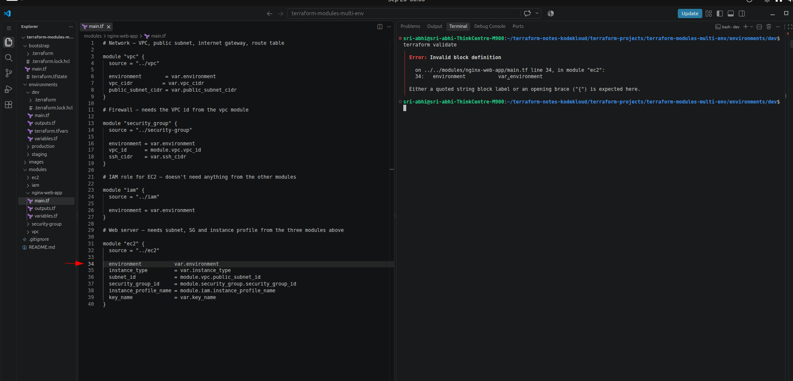

**Why:** without `=`, Terraform reads `environment var.environment` as the start of a new *block* (like `resource "..." {`), not an argument. A syntax error like this shows up before any module checks.
**Fix:** put the `=` back.

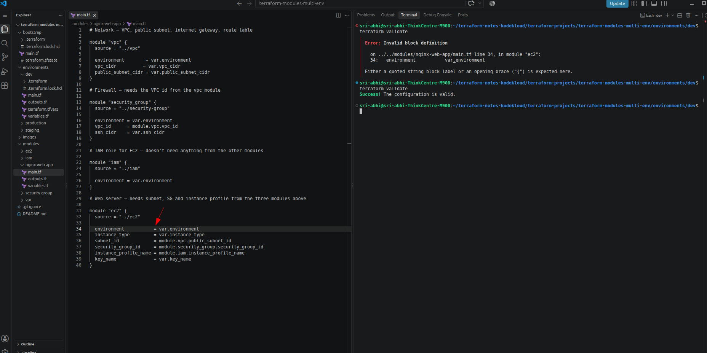

### 4. Reaching into a nested module ⭐ — outputs go up one level at a time

This is the most common module mistake. I wanted the VPC ID as an output of dev, so I added to `environments/dev/outputs.tf`:

```hcl
output "vpc_id" {
  value = module.nginx_web_app.vpc_id
}
```

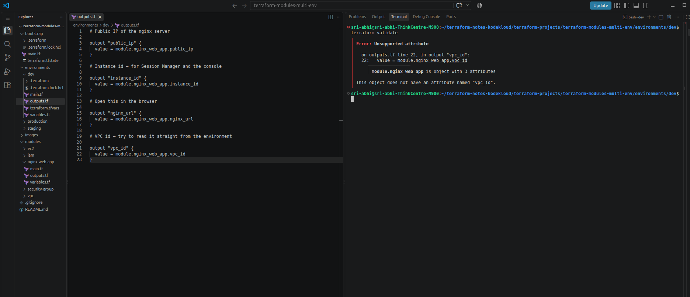

**Why:** the vpc module *does* output `vpc_id` — but only to `nginx-web-app`, the box directly around it. Dev can only see what `nginx-web-app` shows in **its own** `outputs.tf`, and that had just 3 outputs: `public_ip`, `instance_id`, `nginx_url`:

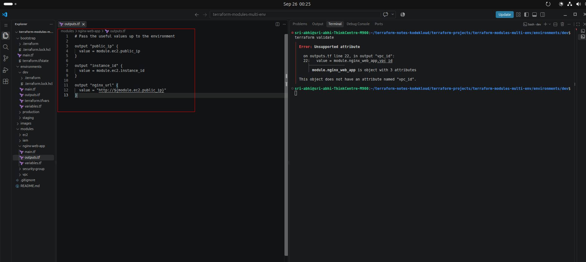

```
vpc/outputs.tf            output "vpc_id" = aws_vpc.nginx_vpc.id          ✅ already there
        ↓
nginx-web-app/outputs.tf  output "vpc_id" = module.vpc.vpc_id             ← was missing
        ↓
dev/outputs.tf            output "vpc_id" = module.nginx_web_app.vpc_id
```

**Fix:** pass it up one more level — add `output "vpc_id" { value = module.vpc.vpc_id }` to `modules/nginx-web-app/outputs.tf`. I kept this output for real; it's useful.

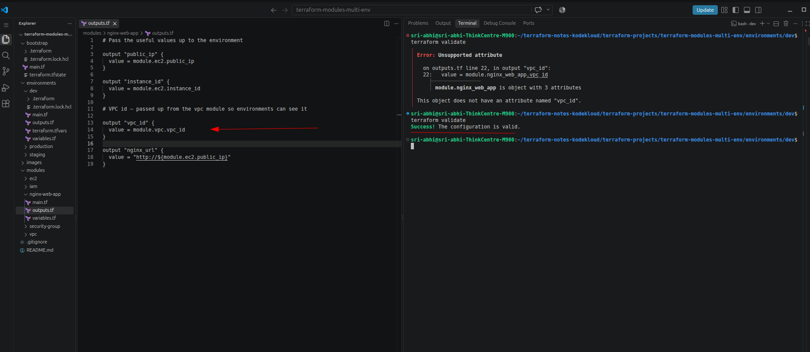

> **Rule:** a value can only go up one box at a time. If an environment needs something from deep inside, every module in between must output it. And adding an output never touches AWS — `plan` shows it under *Changes to Outputs* with no resource changes.

### 5. Changed a module's `source` without `init` — `Module source has changed`

**Break:** in `environments/dev/main.tf`, `../../modules/nginx-web-app` → `../../modules/nginx-webapp`.

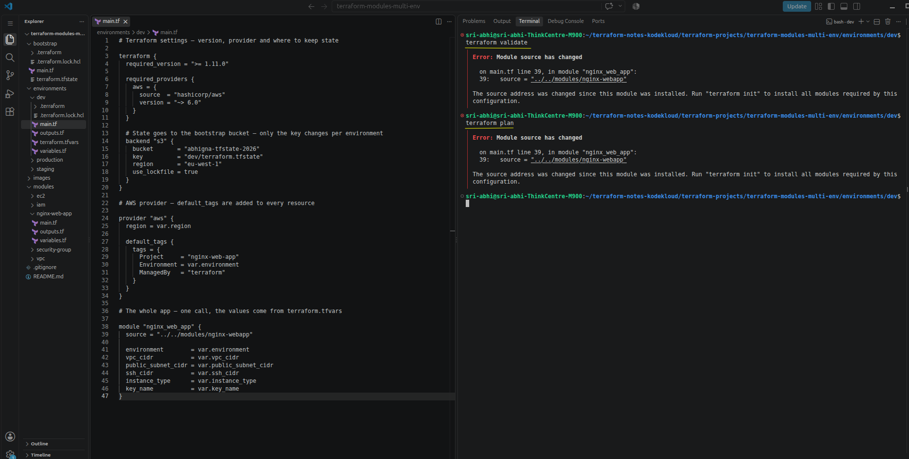

**Why:** `terraform init` records where every module lives (in `.terraform/modules/modules.json`). When the code says a different path than that record, Terraform refuses to guess. (If I ran `init` with the typo, it would fail too — that folder doesn't exist.)
**Fix:** put the right path back, run `terraform init`, then `validate`.

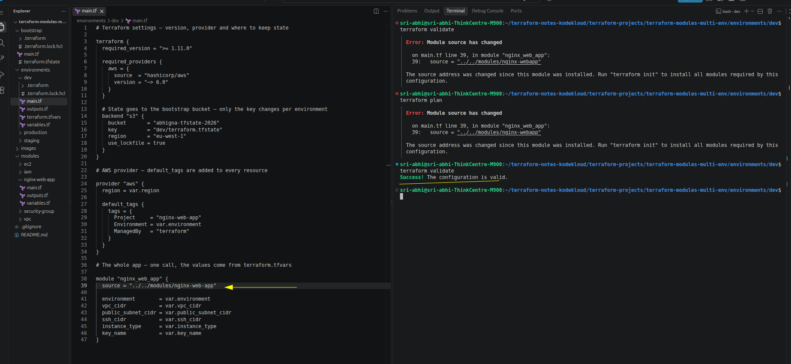

> **When do I need `terraform init` again?** After changing a module `source` or adding a new `module` block, changing the provider or its version, or changing the `backend` block. Normal edits inside a module (resources, variables, outputs) don't need it.

---

## Step 6 — Staging: Copying Dev (and the Mistakes That Come With It)

No module code is written again — staging is dev's four files with a different backend key and different values. But copying an environment is exactly where real mistakes happen, so I made them on purpose, one by one.

```bash
cd environments
cp dev/main.tf dev/variables.tf dev/outputs.tf dev/terraform.tfvars dev/.terraform.lock.hcl staging/
cd staging
```

I don't copy `dev/.terraform/` — every environment folder runs its own `init`.

### Error A — a new folder needs `init` first

Right after copying, `terraform plan`:

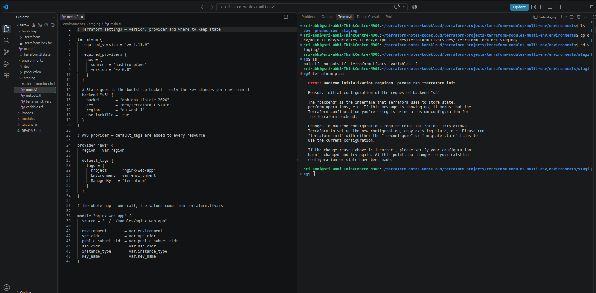

**Why:** there's no `.terraform/` yet, so Terraform doesn't know where the state is or where the modules are. **Fix:** `terraform init`.

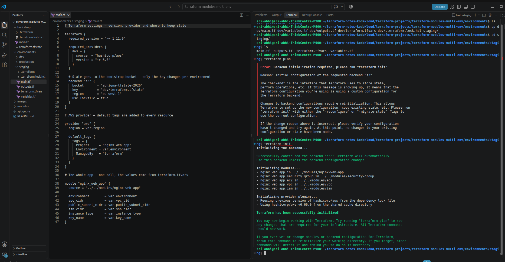

### Error B — forgot to change the backend key 🚨 (the dangerous one)

`init` worked — but `main.tf` still said `key = "dev/terraform.tfstate"`. Then `terraform plan` **from the staging folder**:

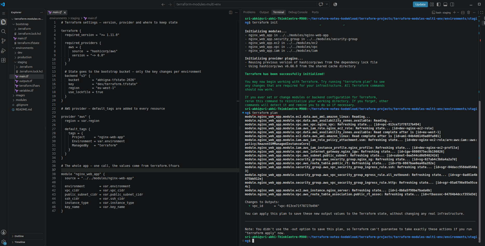

No red error at all — and that's why it's dangerous. Every `Refreshing state... [id=...]` line is a **dev** resource: `dev-nginx-ec2-role`, dev's VPC `vpc-013ce71f78727b494`, dev's instance `i-0b6a5f98be7bada6b`. The staging folder had opened **dev's state file** and was now in control of my dev servers. Changing `environment = "staging"` and applying would have renamed or replaced dev.

**How I'd catch it in real life:**
- A **brand-new** environment's first plan must be `13 to add`. `No changes` or any `Refreshing state` line in a new folder means it found someone else's state.
- Read the IDs and names in the plan — here they all said `dev`.
- Right after `init` in a new folder: `terraform state list` must be **empty**, and `grep key main.tf` must match the folder name.
- In teams: plans are reviewed in pull requests (Atlantis, GitHub Actions, HCP Terraform), and each environment usually lives in its **own AWS account**, so staging's credentials can't even see dev.

**Fix:** change the key to `staging/terraform.tfstate`. Terraform then notices the backend changed and stops — first on `plan`, then on a plain `init`:

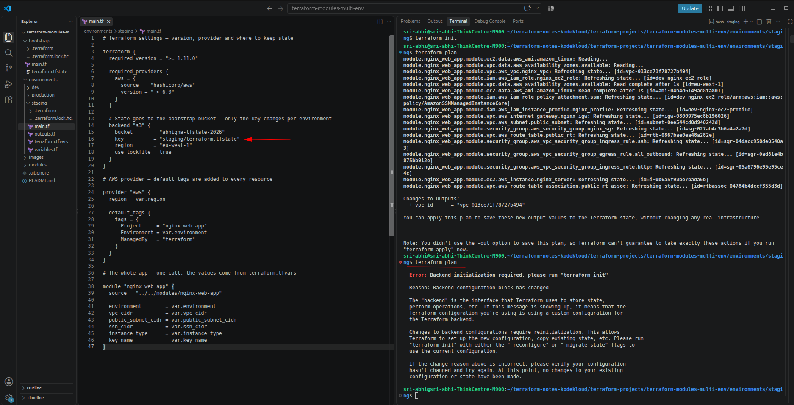

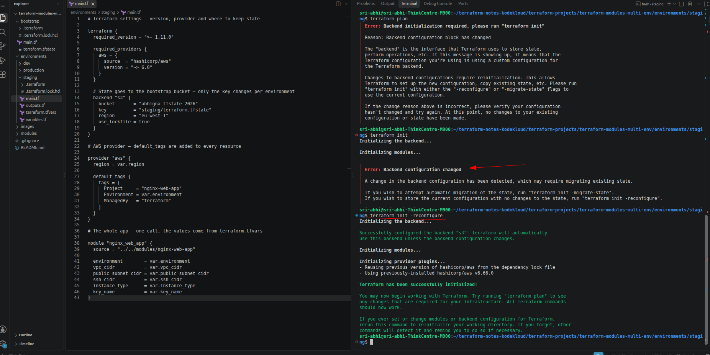

| Flag | What it does | Here? |
|---|---|---|
| `-reconfigure` | point at the new key, copy nothing | ✅ yes |
| `-migrate-state` | **copy** the old state (dev's!) into the new key | ❌ no — staging would own a copy of dev's state |

`-migrate-state` is for *moving* an environment's state to a new place, not for creating a new environment. After `-reconfigure`, `terraform state list` printed nothing — staging finally had its own empty state.

### Error C — copied tfvars pass the plan but are still wrong

With the right key, `plan` said `13 to add` — but `terraform.tfvars` still had dev's values, so everything was named `dev-...` with `Environment = "dev"` and dev's `10.0.0.0/16`:

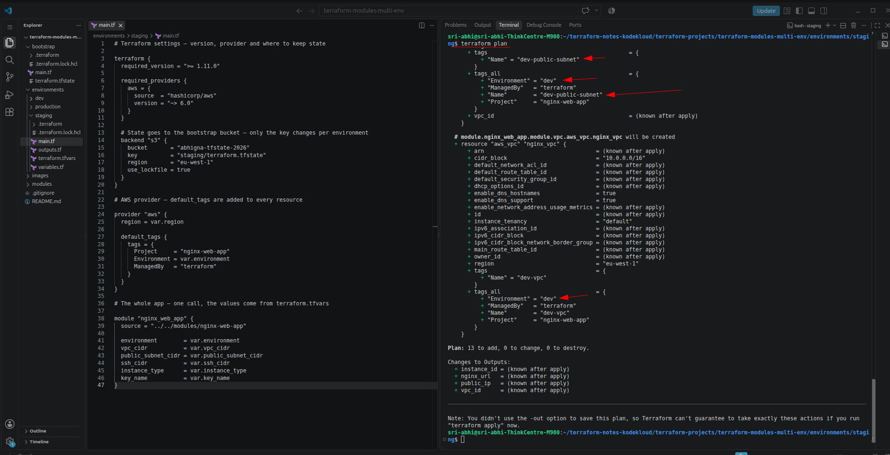

Applying this would have failed halfway with `EntityAlreadyExists: Role with name dev-nginx-ec2-role already exists` — IAM names are **global in the account** (the VPC and security group wouldn't clash, so they'd already be created with dev's names — a half-built mess).

I first fixed only `environment`, and the plan still showed `cidr_block = "10.0.0.0/16"`. That one wouldn't even fail — AWS allows two VPCs with the same range — but overlapping ranges can **never** be connected later (VPC peering, VPN, Transit Gateway), and changing a VPC's CIDR means rebuilding the whole network. So each environment gets its own range from day one.

**Fix:** the real staging values — and I made staging a bit bigger:

```hcl
region             = "eu-west-1"
environment        = "staging"
vpc_cidr           = "10.1.0.0/16"
public_subnet_cidr = "10.1.1.0/24"
ssh_cidr           = "x.x.x.x/32" # my IP
instance_type      = "t3.small"   # not free tier — destroy when done
```

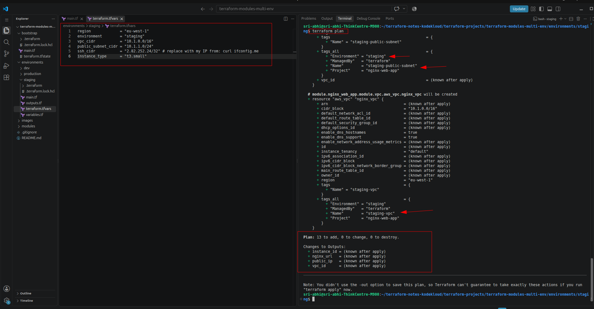

> 💡 When copying an environment, read the **values** in the plan — CIDRs, names, tags — not just the count at the bottom.

### Error D — two applies at once: `Error acquiring the state lock`

I ran `terraform apply` while another apply on staging was already running. The second one stopped before touching anything:

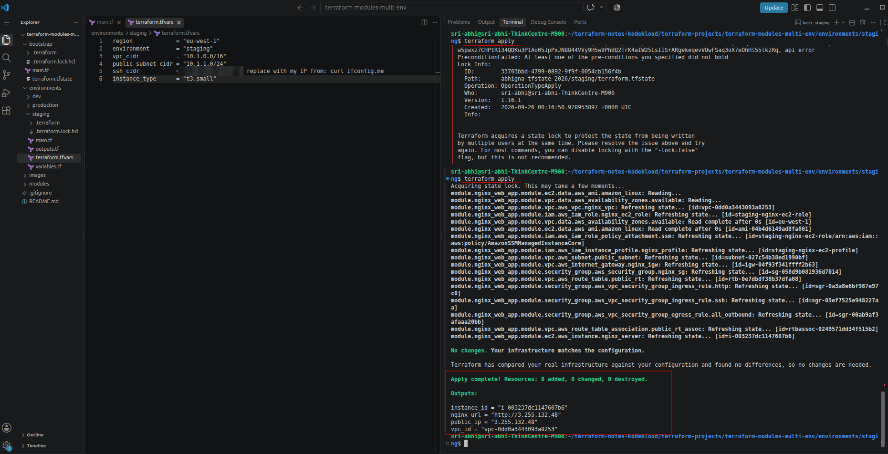

**Why:** `use_lockfile = true` in the backend. While an apply runs, Terraform keeps a lock file (`terraform.tfstate.tflock`) next to the state in S3; S3 refuses a second one (`412 PreconditionFailed`). Without the lock, both applies could have built two VPCs and two servers and corrupted the state.

**Fix:** just wait and run it again — the second try said *Acquiring state lock… No changes… Apply complete! Resources: 0 added*, because the first apply had already built everything. `terraform force-unlock <ID>` is only for a lock left behind by a **crashed** run — never while another run is still going.

### ✅ Staging checkpoints (my real results)

- `Apply complete! Resources: 13 added` — outputs `nginx_url = "http://3.255.132.48"`, `vpc_id = "vpc-0dd0a3443093a8253"`.
- `curl http://3.255.132.48` → `<h1>Hello from staging nginx</h1>`, and the dev page **still** says `Hello from dev nginx` — staging never touched dev.
- `aws s3 ls s3://abhigna-tfstate-2026/ --recursive` → two separate files: `dev/terraform.tfstate` and `staging/terraform.tfstate`.
- Two servers in two VPCs: `dev-nginx-server` (`t3.micro`, `10.0.0.0/16`) and `staging-nginx-server` (`t3.small`, `10.1.0.0/16`).

---

## Step 7 — Production

Same as staging, with no new module code: copy the files, set `key = "production/terraform.tfstate"`, run `terraform init` (then check `terraform state list` is empty), and use production's values — `10.2.0.0/16` / `10.2.1.0/24` and `t3.small` (see the table at the top).

---

## Step 8 — Clean Up (Order Matters)

Environments first, the backend bucket last (the environments need it to read their state).

```bash
cd environments/production && terraform destroy
cd ../staging && terraform destroy
cd ../dev && terraform destroy
```

The state bucket is protected by `prevent_destroy`, so `terraform destroy` in `bootstrap/` fails on purpose. In a real project I keep this bucket — it costs almost nothing. To remove it anyway:

1. In `bootstrap/main.tf`, delete the `lifecycle { prevent_destroy = true }` block and add `force_destroy = true` to the bucket (it's versioned, so it still holds old state versions that S3 won't delete by itself).
2. Apply that change first, then destroy:

```bash
cd ../../../bootstrap
terraform apply     # only updates force_destroy, nothing is deleted
terraform destroy
```

---

## Stretch Goals

**A. Versioned modules on GitHub.** Move `modules/` into its own repo, tag it `v1.0.0`, and point each environment at a tag:

```hcl
source = "git::https://github.com/Abhignadumpala/terraform-modules.git//nginx-web-app?ref=v1.0.0"
```

Right now every environment uses the local `../../modules` path, so a module change reaches production on its next apply. With tags, production can stay on `v1.0.0` while dev tests `v1.1.0`.

**B. More than one server.** Add `count` to the EC2 module and a second public subnet in another AZ, so staging and production can run 2–3 servers.

---

## Troubleshooting

| Error | Cause | Fix |
|-------|-------|-----|
| `Missing required provider` on `validate` | Skipped `terraform init` | `terraform init` (in a module folder: `terraform init -backend=false`) |
| `terraform init` very slow / stuck on `Installing hashicorp/aws` | The AWS provider is a ~180 MB download, and Terraform only reuses the `plugin_cache_dir` copy when the folder already has a `.terraform.lock.hcl` | Copy `bootstrap/.terraform.lock.hcl` into the folder first, then `terraform init` says `Using ... from the shared cache directory` |
| `Reference to undeclared input variable` | `var.x` used in `main.tf` but not in `variables.tf` | Add the `variable "x"` block |
| `Reference to undeclared resource` | Renamed a resource but not every reference | Match `TYPE.NAME.ATTRIBUTE` everywhere |
| `Module not installed` / `Module source has changed` | Added a module call or changed its `source` | `terraform init` |
| `Missing required argument` | A module variable with no default wasn't passed | Pass it in the `module` block (or give the variable a default) |
| `Unsupported argument` … `Did you mean …?` | Typo in an argument name inside a `module` block | Use the exact name from the module's `variables.tf` |
| `Unsupported attribute` … `object with N attributes` | Reading an output the module doesn't have — often a nested module's output | Add the output to that module's `outputs.tf`, one level at a time |
| `Invalid block definition` | Missing `=` between an argument and its value | Put the `=` back |
| `Backend initialization required` | New environment folder, or backend block changed | `terraform init` (after a change: `-reconfigure`) |
| New environment's plan shows `Refreshing state` / `No changes` | Backend `key` still points at another environment's state | ⛔ Don't apply — fix the key, `terraform init -reconfigure`, check `terraform state list` is empty |
| `EntityAlreadyExists` (IAM role) | Copied tfvars still use another environment's `environment` name | Change `environment` in tfvars — IAM names are global in the account |
| `Backend configuration changed` | Edited the backend block | `terraform init -reconfigure` for a new env (`-migrate-state` only to *move* existing state) |
| S3 bucket does not exist | Bootstrap not applied, or name typo | Run Step 1; match names exactly |
| `Variables may not be used here` | Used `var.` inside backend | Type the values directly |
| `Instance cannot be destroyed` | `prevent_destroy` on the state bucket | Expected — see Step 8 to remove it on purpose |
| `Error acquiring the state lock` (`412 PreconditionFailed`) | Another apply is running, or one crashed | Wait and retry; only if a run crashed: `terraform force-unlock <ID>` |
| Page doesn't load / `curl` times out | nginx still installing, or missing egress rule | Wait 2 min; check the security group rules |
| `Unsupported argument "use_lockfile"` | Terraform older than 1.11 | Upgrade Terraform |

---

## Self-Check Questions

1. Why does the backend bucket live in a separate `bootstrap/` folder?
2. Why can't the backend block use `var.environment` for the key?
3. Why do the environments call only `nginx-web-app` instead of the four modules?
4. How does Terraform know to build the VPC before the security group?
5. Where is the one `depends_on` in this project, and why is it needed there?
6. What makes a subnet "public"?
7. Why is the AMI a data block instead of a variable?
8. What is different between the dev and staging folders?
9. Why can't an environment read `module.nginx_web_app.vpc_id` until `nginx-web-app` outputs it?
10. A brand-new environment's first plan says `No changes`. What went wrong, and how do I fix it without touching the other environment?
11. When do I use `terraform init -reconfigure` vs `-migrate-state`?
12. Why does a second `terraform apply` fail with a state lock error, and when is `force-unlock` safe?

---

## Interview Version

> "I built an nginx web app on AWS with Terraform, split into four small reusable modules — VPC, security group, IAM, and EC2 — plus one central module that wires them together by passing outputs into inputs, like the VPC ID into the security group. Each environment — dev, staging, production — is a tiny root module that makes one call to that central module with its own tfvars. State is stored remotely in S3 with native locking and a separate key per environment, so the environments are fully isolated, and the state bucket is created once in a bootstrap folder with versioning and `prevent_destroy`. Terraform works out the build order from references; I only use `depends_on` for the one hidden link, where the EC2 instance has to wait for the IAM policy attachment. The server gets an SSM role, so I connect with Session Manager instead of opening SSH to the world, and the AMI comes from a data source, so there are no hard-coded IDs. I also broke it on purpose to learn the real failure modes — like reading a nested module's output that was never passed up, or copying dev to staging but leaving the backend key on dev, where the new folder silently takes control of dev's state. I catch that by checking that a new environment's first plan is all adds and its `state list` is empty, and fix it with `terraform init -reconfigure`."

---

## Official Docs

- [Terraform block & `required_providers`](https://developer.hashicorp.com/terraform/language/block/terraform)
- [S3 backend (incl. `use_lockfile`)](https://developer.hashicorp.com/terraform/language/backend/s3)
- [Modules](https://developer.hashicorp.com/terraform/language/modules) and [module sources](https://developer.hashicorp.com/terraform/language/modules/sources)
- [Data sources](https://developer.hashicorp.com/terraform/language/data-sources)
- [`depends_on`](https://developer.hashicorp.com/terraform/language/meta-arguments/depends_on)
- [Provider plugin cache](https://developer.hashicorp.com/terraform/cli/config/config-file#provider-plugin-cache)
- AWS provider: [`aws_vpc`](https://registry.terraform.io/providers/hashicorp/aws/latest/docs/resources/vpc), [`aws_security_group`](https://registry.terraform.io/providers/hashicorp/aws/latest/docs/resources/security_group), [`aws_vpc_security_group_ingress_rule`](https://registry.terraform.io/providers/hashicorp/aws/latest/docs/resources/vpc_security_group_ingress_rule), [`aws_instance`](https://registry.terraform.io/providers/hashicorp/aws/latest/docs/resources/instance), [`aws_iam_role`](https://registry.terraform.io/providers/hashicorp/aws/latest/docs/resources/iam_role), [`aws_iam_instance_profile`](https://registry.terraform.io/providers/hashicorp/aws/latest/docs/resources/iam_instance_profile), [`aws_ami` data source](https://registry.terraform.io/providers/hashicorp/aws/latest/docs/data-sources/ami)
